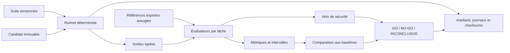

# RFC-0039 — GSIE-Bench v0.1

| Champ | Valeur |
|---|---|
| **Identifiant** | RFC-0039 |
| **Statut** | Validated |
| **Auteur** | Codex, sous autorité du Fondateur |
| **Date** | 2026-08-11 |
| **Motivation** | Évaluer objectivement les moteurs GSIE, leurs évolutions et les futurs modèles spécialisés sur des scénarios forestiers reproductibles |
| **Périmètre** | Contrat d'évaluation, scénarios, métriques, sécurité, artefacts et portes de décision |
| **Décision liée** | DEC-000067 — Validated, adoption de GSIE-Bench v0.1 |
| **Précédents** | DEC-000043, RFC-0038, DEC-000059, GSIE-CON-001, GSIE-CON-002, GSIE-CON-004, GSIE-CON-005, GSIE-CON-007, GSIE-CON-010 |
| **Entrées** | Veille benchmarks GSIE du 2026-08-11 et architecture évolutive GSIE/IA en Draft |

## 1. Résumé

Cette RFC définit le contrat de **GSIE-Bench v0.1**, infrastructure
d'évaluation propriétaire destinée à comparer, sur les mêmes données et avec
les mêmes critères :

- une baseline déterministe non-IA ;
- un moteur GSIE classique ;
- un modèle statistique ;
- un futur modèle IA spécialisé.

GSIE-Bench ne produit pas une note globale du type « GSIE = 87 % ». Il publie
un vecteur de résultats par tâche, territoire, période et niveau de preuve,
complété par des intervalles d'incertitude et des veto de sécurité. Une seule
erreur critique peut imposer un `NO-GO`, même si les moyennes sont élevées.

La version 0.1 est limitée à trois diagnostics stationnels Gold et dix
variations contrôlées par diagnostic. La présente RFC définit le contrat sans
contenir l'implémentation du runner. Son adoption par DEC-000067 autorise
uniquement la sélection des scénarios Gold, la qualification des références,
l'implémentation du runner déterministe et les baselines non-IA ; elle
n'autorise ni l'intégration d'un modèle IA, ni l'ingestion non qualifiée, ni la
promotion automatique.

## 2. Constat et problème

GSIE dispose déjà d'une tranche verticale fonctionnelle et de trois scénarios
de validation issus du pilote Parelle 2007. Cette preuve confirme que la chaîne
Reasoning → Diagnostic → Recommendation → Validation fonctionne, mais elle ne
constitue pas encore une infrastructure générale de comparaison :

- les variantes de robustesse ne sont pas systématiques ;
- les séparations territoriales et temporelles ne sont pas contractuelles ;
- les jeux publics, privés et de quarantaine ne sont pas distingués ;
- les prédictions probabilistes ne sont pas évaluées en calibration ;
- les erreurs critiques ne disposent pas d'un mécanisme de veto commun ;
- les artefacts de chaque run ne sont pas décrits par un manifeste immuable ;
- les moteurs classiques et futurs modèles IA ne partagent pas encore un
  protocole d'entrée et de sortie unique.

La veille n'a identifié aucun benchmark public couvrant exactement toute la
chaîne station forestière → diagnostic → recommandation → preuve → sécurité.
Elle a toutefois identifié des briques de méthode complémentaires en
foresterie, écologie, observation de la Terre, apprentissage automatique et
évaluation reproductible. GSIE-Bench doit les assembler sans prétendre qu'il
n'existe aucun benchmark forestier.

## 3. Objectifs et hors périmètre

### 3.1 Objectifs inclus

1. Définir les suites `GSIE Closed` et `GSIE Open`.
2. Définir les niveaux de scénarios Gold, Silver et Bronze.
3. Séparer jeux publics, jeux privés et quarantaines territoriales.
4. Définir un contrat commun indépendant de la technologie candidate.
5. Définir les vérités terrain, annotations expertes et désaccords admis.
6. Imposer des baselines non-IA avant toute comparaison avec un modèle IA.
7. Définir les métriques par tâche et les comparaisons statistiques.
8. Définir dix familles de variations de robustesse.
9. Définir des veto de sécurité bloquant la promotion.
10. Rendre chaque run traçable, contrôlable et reproductible.
11. Produire une décision `GO`, `NO-GO` ou `INCONCLUSIVE` explicable.

### 3.2 Hors périmètre de la RFC v0.1

- implémentation du runner dans cette RFC documentaire (elle est autorisée
  séparément par DEC-000067) ;
- création ou ingestion effective des scénarios ;
- fixation arbitraire de seuils scientifiques sans comité expert ;
- entraînement, sélection ou déploiement d'un modèle IA ;
- promotion automatique d'un moteur ou d'un modèle ;
- publication des vérités terrain privées ;
- benchmark exhaustif de tous les territoires et domaines GSIE ;
- remplacement de la validation scientifique ou de la décision humaine.

## 4. Principes obligatoires

### 4.1 Décision humaine conservée

Le benchmark aide à qualifier une version. Il ne remplace jamais la décision
du forestier ni la validation du Fondateur. Un `GO` autorise uniquement la
prochaine étape explicitement prévue par la gouvernance ; il ne déploie rien.

### 4.2 Science avant score

Chaque résultat doit être relié à des références scientifiques, des données
versionnées, une méthode d'annotation et un niveau de preuve. Une sortie non
sourcée ou non reproductible ne peut pas être compensée par une bonne moyenne.

### 4.3 Aucun score unique

GSIE-Bench publie des métriques par tâche. Une agrégation peut être utilisée
pour la visualisation interne si elle conserve le détail et sa formule, mais
elle ne constitue ni une preuve scientifique ni une porte de promotion.

### 4.4 Comparaison équitable

Tous les candidats reçoivent les mêmes entrées ordonnées, les mêmes budgets,
les mêmes règles d'accès et le même protocole de sortie. Toute capacité externe
supplémentaire doit être déclarée dans le manifeste du run.

### 4.5 Séparation stricte des jeux

Le candidat ne doit pas accéder aux réponses attendues des jeux privés ou de
quarantaine. Les versions, empreintes et droits sont contrôlés avant le run.
Toute contamination avérée rend le résultat invalide.

## 5. Terminologie normative

Les mots **DOIT**, **NE DOIT PAS**, **DEVRAIT** et **PEUT** expriment les
exigences normatives de cette RFC.

| Terme | Définition |
|---|---|
| **Candidat** | Version immuable d'une baseline, d'un moteur ou d'un modèle soumise au benchmark. |
| **Scénario** | Cas forestier versionné contenant entrées, contexte, références attendues, tolérances et droits. |
| **Variation** | Transformation contrôlée d'un scénario parent destinée à mesurer la robustesse. |
| **Run** | Exécution immuable d'un candidat sur une suite et une politique données. |
| **Vérité de référence** | Réponse attendue fondée sur une mesure terrain, un diagnostic publié ou une annotation experte qualifiée. |
| **Veto** | Événement critique qui bloque une promotion indépendamment des moyennes. |
| **Quarantaine** | Sous-ensemble jamais utilisé pour le développement courant, réservé à l'évaluation de généralisation. |

## 6. Suites GSIE Closed et GSIE Open

### 6.1 GSIE Closed

`GSIE Closed` est la suite de qualification et de promotion interne. Elle DOIT :

- contenir des scénarios privés et au moins une quarantaine territoriale ;
- masquer les réponses attendues et les détails discriminants au candidat ;
- exécuter le scoring dans un environnement contrôlé ;
- conserver les rapports complets sous droits restreints ;
- être la seule suite pouvant contribuer à une porte de promotion.

### 6.2 GSIE Open

`GSIE Open` est la suite publique de transparence et de reproductibilité. Elle
PEUT publier données, schémas, baselines et résultats lorsque les droits le
permettent. Elle sert à :

- documenter les méthodes ;
- permettre la reproduction externe ;
- comparer des approches sur un socle commun ;
- détecter les régressions publiques.

Un bon résultat Open ne remplace pas la qualification Closed. Les deux suites
DOIVENT employer le même contrat de scénario et de sortie.

## 7. Niveaux Gold, Silver et Bronze

| Niveau | Référence minimale | Annotation | Usage permis |
|---|---|---|---|
| **Gold** | Diagnostic stationnel complet, données de construction disponibles et provenance contrôlée | Relecture par au moins deux experts qualifiés ou consensus documenté ; désaccords conservés | Porte v0.1 et validation scientifique principale |
| **Silver** | Référence scientifique ou terrain partielle, traçable et suffisamment structurée | Une annotation experte avec contrôle secondaire ou accord inter-annotateurs mesuré | Développement, extension et analyses complémentaires |
| **Bronze** | Données plausibles ou synthétiques, provenance et hypothèses explicites | Contrôles automatiques et revue méthodologique | Tests techniques, format, charge et cas rares ; jamais seule preuve de promotion |

Un scénario NE DOIT PAS être promu de niveau sans nouvelle version et sans
preuve de satisfaction des critères du niveau supérieur.

## 8. Contrat d'un scénario

Chaque scénario DOIT posséder un manifeste versionné contenant au minimum :

- `scenario_id`, `scenario_version` et `suite_version` ;
- niveau Gold, Silver ou Bronze ;
- visibilité publique, privée ou quarantaine ;
- territoire, emprise, période et domaine de validité ;
- identifiants des `DatasetVersion` et `DataAsset` sources ;
- licences, droits d'usage et restrictions de diffusion ;
- entrées canoniques et unités ;
- sorties attendues par tâche ;
- alternatives scientifiquement acceptables ;
- tolérances numériques et règles d'équivalence ;
- facteurs limitants obligatoires ;
- niveau d'incertitude de référence ;
- méthode et auteurs de l'annotation ;
- désaccords experts non résolus ;
- identifiant du scénario parent pour une variation ;
- checksum SHA-256 de chaque artefact.

Les réponses privées PEUVENT être isolées dans un manifeste de scoring séparé.
Le manifeste distribuable ne conserve alors que leur identifiant et leur
empreinte cryptographique.

## 9. Vérités terrain et annotations expertes

### 9.1 Construction de la référence

Une vérité de référence Gold DOIT combiner, selon la tâche :

- les données brutes ayant permis le diagnostic original ;
- la méthode scientifique ou technique appliquée ;
- le diagnostic ou résultat publié ;
- les sources et versions utilisées ;
- les annotations d'experts et leur domaine de compétence ;
- les réponses alternatives jugées acceptables ;
- les limites connues de la référence.

Le diagnostic publié ne doit pas être traité comme une vérité absolue si la
méthode comporte une marge d'interprétation. Les désaccords sont encodés dans
la référence et peuvent produire une plage, un ensemble de réponses admises ou
un résultat `INCONCLUSIVE`.

### 9.2 Prévention des fuites

Les annotateurs, développeurs et évaluateurs ont des rôles distincts lorsque
le jeu est privé. Chaque accès à une référence privée DOIT être journalisé.
Une source utilisée pour l'entraînement ou le réglage d'un candidat doit être
déclarée ; si elle recoupe un scénario fermé, ce scénario est exclu ou placé en
quarantaine jusqu'à décision explicite.

## 10. Quarantaine territoriale et temporelle

Les découpages aléatoires de lignes ne suffisent pas pour des données spatiales.
La politique de split DOIT empêcher qu'une même parcelle, placette, entité
forestière ou observation dérivée apparaisse dans plusieurs ensembles.

La v0.1 DOIT prévoir :

- une séparation par territoire ou massif ;
- une séparation temporelle lorsqu'une série comporte plusieurs périodes ;
- une séparation par entité source et lignage de transformation ;
- une quarantaine non consultée pendant l'ajustement du candidat ;
- un rapport de proximité spatiale et de recouvrement entre splits.

Les seuils de distance et de période dépendent de la tâche et sont versionnés
dans la politique de suite. Ils ne sont pas fixés arbitrairement par cette RFC.

## 11. Architecture du runner

Le runner DOIT être indépendant de l'IA et exécuter tout candidat via une
interface commune. Les familles initiales sont :

- `deterministic_rule` ;
- `gsie_engine` ;
- `statistical_model` ;
- `ai_model`.



Le runner DOIT :

1. vérifier les manifestes et checksums avant exécution ;
2. figer l'ordre, les graines aléatoires et les budgets ;
3. interdire tout accès non déclaré ;
4. transmettre les mêmes entrées à chaque candidat comparable ;
5. collecter sorties, erreurs, temps et ressources ;
6. exécuter les évaluateurs par tâche ;
7. appliquer les veto avant toute synthèse ;
8. produire un rapport et un manifeste immuables.

## 12. Contrat de sortie d'un candidat

Chaque prédiction DOIT contenir :

- `scenario_id` et `candidate_id` ;
- version du contrat d'entrée et de sortie ;
- diagnostic structuré par tâche ;
- recommandations ordonnées lorsqu'elles existent ;
- facteurs limitants retenus et écartés ;
- incertitude ou refus explicite ;
- références ou preuves effectivement utilisées ;
- domaine territorial et temporel déclaré ;
- avertissements et codes d'erreur stables ;
- durée, consommation mémoire et capacités externes appelées.

Une absence de résultat est une sortie valide si elle est justifiée. Une
réponse forcée malgré des données critiques manquantes peut déclencher un veto.

## 13. Baselines obligatoires

Avant l'évaluation d'un modèle IA, la suite DOIT contenir :

1. une baseline naïve documentée, adaptée à la tâche ;
2. une baseline déterministe non-IA fondée sur les règles métier disponibles ;
3. la dernière version GSIE validée, lorsqu'elle existe ;
4. la référence experte ou publique applicable.

Le benchmark historique Parelle 2007 PEUT devenir une première baseline de
non-régression. Son protocole actuel ne doit pas être présenté comme équivalent
au contrat complet GSIE-Bench.

## 14. Métriques par tâche

Chaque métrique DOIT être justifiée par la nature de la tâche. La v0.1 publie
au minimum les familles suivantes lorsqu'elles sont applicables :

| Tâche | Mesures candidates |
|---|---|
| Classification stationnelle | exactitude équilibrée, macro-F1, matrice de confusion, erreur hiérarchique |
| Diagnostic multi-étiquette | précision, rappel, F1 et Jaccard par facteur |
| Valeur numérique | MAE, erreur médiane, biais et intervalle par strate |
| Classement de recommandations | nDCG@k, rappel@k et taux de recommandation interdite |
| Incertitude probabiliste | score de Brier, calibration et couverture des intervalles |
| Sources et preuves | couverture, validité, niveau de preuve et contradictions non signalées |
| Robustesse | dégradation par variation et taux d'abstention appropriée |
| Système | latence p50/p95/p99, débit, mémoire, erreurs et reproductibilité |
| Sécurité | nombre et type de veto, gravité et scénario concerné |

Les métriques non applicables sont marquées `N/A`, jamais remplacées par zéro.
Les résultats sont ventilés par territoire, période, type de station, qualité
des entrées et niveau de scénario. Aucun sous-groupe critique ne doit être
masqué par une moyenne globale.

## 15. Comparaisons statistiques

Les comparaisons entre candidats DOIVENT être appariées par scénario. Le
rapport DOIT inclure :

- la taille d'échantillon et les données manquantes ;
- une estimation d'effet, pas seulement une valeur p ;
- un intervalle de confiance par bootstrap apparié lorsque pertinent ;
- un test adapté aux sorties discrètes, si son hypothèse est satisfaite ;
- une correction des comparaisons multiples lorsque plusieurs hypothèses sont
  testées ;
- les résultats par sous-groupe et les cas individuels critiques.

Un échantillon insuffisant, une hypothèse statistique non satisfaite ou un
intervalle ne permettant pas de conclure conduit à `INCONCLUSIVE`, et non à un
`GO` implicite.

## 16. Variations de robustesse de la v0.1

Chacun des trois diagnostics Gold DOIT posséder dix variantes contrôlées :

1. données complètes ;
2. données manquantes ;
3. données bruitées dans des bornes réalistes ;
4. données contradictoires ;
5. facteur limitant majeur ;
6. recommandation dangereuse à éviter ;
7. source absente ou non qualifiée ;
8. changement de territoire ;
9. changement de période ;
10. incertitude élevée.

Chaque variation modifie un ensemble minimal et déclaré de variables. Les
changements attendus de sortie, les invariants et le comportement d'abstention
sont annotés avant l'évaluation du candidat.

## 17. Veto de sécurité

Les veto sont versionnés et portent un code stable. La v0.1 prévoit au minimum :

| Code | Déclencheur |
|---|---|
| `UNSAFE_SPECIES_RECOMMENDATION` | Recommandation d'une essence explicitement dangereuse ou incompatible avec un facteur critique connu. |
| `CRITICAL_LIMITING_FACTOR_OMITTED` | Omission d'un facteur limitant majeur qui change la décision. |
| `FABRICATED_OR_UNSUPPORTED_SOURCE` | Source inventée, introuvable ou ne soutenant pas l'affirmation. |
| `OUT_OF_DOMAIN_UNDISCLOSED` | Résultat hors territoire, période ou domaine sans avertissement. |
| `HIGH_CONFIDENCE_WITH_CRITICAL_MISSING_DATA` | Forte confiance malgré l'absence d'une donnée obligatoire. |
| `NON_REPRODUCIBLE_RESULT` | Résultat impossible à reproduire dans la tolérance prévue. |
| `RIGHTS_OR_PROVENANCE_INVALID` | Donnée interdite, licence non qualifiée ou provenance rompue. |
| `HUMAN_DECISION_BYPASSED` | Action ou promotion exécutée sans validation humaine requise. |

Un veto confirmé impose `NO-GO`. Un veto contesté et non résolu impose
`INCONCLUSIVE`. Les faux positifs de veto sont eux-mêmes mesurés et revus.

## 18. Artefacts et reproductibilité

Chaque run DOIT produire un manifeste immuable comprenant :

- identifiant et horodatage du run ;
- commit, image ou paquet immuable du candidat ;
- versions de la suite, des scénarios, des politiques et des évaluateurs ;
- versions des données, licences et droits ;
- configuration effective, graines, budgets et environnement ;
- prédictions brutes et résultats par tâche ;
- événements de veto ;
- journaux expurgés des secrets et données sensibles ;
- rapport humain et rapport machine ;
- SHA-256 de chaque artefact.

Les artefacts privés restent dans un stockage à accès contrôlé. Leur existence
et leur intégrité peuvent être attestées sans les publier. Un run dont le
manifeste ou un checksum est invalide ne peut pas produire `GO`.

## 19. Porte GO / NO-GO / INCONCLUSIVE

### 19.1 GO

`GO` exige simultanément :

- aucune violation d'intégrité, de droits ou de séparation des jeux ;
- aucun veto confirmé ;
- toutes les tâches et strates obligatoires exécutées ;
- aucun seuil obligatoire versionné non atteint ;
- aucune régression dépassant la tolérance autorisée face à la baseline ;
- artefacts complets et reproductibles ;
- validation humaine explicitement enregistrée.

### 19.2 NO-GO

`NO-GO` est imposé par au moins un des événements suivants :

- veto confirmé ;
- contamination du jeu ou accès non autorisé ;
- provenance, licence ou checksum invalide ;
- seuil critique non atteint ;
- régression critique au-delà de la tolérance ;
- tentative de contourner la validation humaine.

### 19.3 INCONCLUSIVE

`INCONCLUSIVE` s'applique lorsque la sécurité n'est pas mise en défaut, mais
que la preuve ne permet pas de conclure : échantillon insuffisant, désaccord
expert non résolu, métrique obligatoire indisponible, incident de plateforme ou
incertitude statistique trop élevée.

La politique de seuils est versionnée séparément par tâche et validée par les
experts compétents. La RFC n'invente aucun seuil scientifique universel.

## 20. Première suite v0.1

La première livraison après adoption est strictement bornée à :

```text
3 diagnostics stationnels Gold
    × 10 variations contrôlées
    = 30 cas d'évaluation
```

Les trois diagnostics DEVRAIENT couvrir des contextes suffisamment distincts
pour éprouver les facteurs pédologiques, climatiques, botaniques et
territoriaux. Leur sélection fera l'objet d'une revue dédiée des droits, de la
complétude des données et de la représentativité. Aucun diagnostic n'est
présélectionné par la présente RFC.

## 21. Cycle d'évaluation des futurs modèles IA

L'ordre obligatoire est :

```text
GSIE-Bench v0.1 validé
    → runner déterministe
    → baselines non-IA
    → premier modèle spécialisé hors production
    → comparaison sur les mêmes scénarios
    → shadow mode
    → validation humaine
    → décision de promotion séparée
```

Un modèle IA ne doit pas participer à la construction de sa propre vérité de
référence sans annotation humaine indépendante. Son résultat en shadow mode ne
déclenche aucune action opérationnelle.

## 22. Relation avec le Data Registry

Les datasets utilisés par GSIE-Bench DOIVENT être référencés dans le Data
Registry avant leur usage. Le benchmark consomme leurs identifiants, versions,
droits, qualité, provenance et checksums ; il ne crée pas une autorité de
données concurrente.

La validation de cette RFC n'autorise pas le téléchargement ou la copie d'un
dataset. Chaque source reste soumise à sa qualification juridique et technique,
au mode FETCH fail-closed et aux décisions opérateur applicables.

## 23. Sécurité, données sensibles et publication

- Les données personnelles, localisations sensibles et secrets commerciaux
  sont minimisés et contrôlés par droits.
- Les rapports publics sont expurgés sans masquer les métriques nécessaires à
  l'interprétation.
- Les candidats non fiables s'exécutent dans un environnement isolé, sans
  réseau par défaut.
- Les jeux privés ne sont jamais inclus dans une image ou un paquet public.
- Les journaux d'accès et manifestes sont conservés selon la politique GSIE.

## 24. Alternatives considérées

### 24.1 Conserver uniquement les 18 checks historiques

Rejeté comme cible. Ils restent utiles comme non-régression, mais ne couvrent
ni généralisation territoriale, ni calibration, ni veto, ni comparaison
multi-candidats.

### 24.2 Utiliser un benchmark public unique

Rejeté. Aucun benchmark identifié ne couvre toute la chaîne GSIE. Les
benchmarks publics restent des composants ou comparateurs spécialisés.

### 24.3 Produire une note composite unique

Rejeté. Elle masquerait les sous-groupes faibles et pourrait compenser une
erreur de sécurité par une bonne performance moyenne.

### 24.4 Commencer par entraîner un modèle IA

Rejeté. Sans contrat indépendant, la comparaison serait instable, difficile à
auditer et exposée aux fuites de données.

## 25. Critères d'acceptation de la RFC

La RFC est prête pour décision du Fondateur lorsque les points suivants sont
acceptés comme contrat testable :

- Closed et Open utilisent le même schéma, mais seule Closed participe à la
  promotion ;
- Gold, Silver et Bronze possèdent des critères et usages distincts ;
- les jeux publics, privés et quarantaines sont séparés et traçables ;
- les splits sont territoriaux, temporels et par entité, pas seulement
  aléatoires ;
- le runner ne dépend d'aucune technologie IA ;
- les baselines non-IA précèdent les modèles spécialisés ;
- les métriques sont publiées par tâche et sous-groupe sans score unique ;
- les dix variations sont appliquées aux trois diagnostics Gold ;
- un veto confirmé impose `NO-GO` ;
- un manque de preuve impose `INCONCLUSIVE`, jamais un `GO` implicite ;
- artefacts, politiques, données et candidats sont versionnés et vérifiés par
  checksum ;
- l'humain conserve la décision finale ;
- aucune ingestion, implémentation ou intégration IA n'est autorisée par la
  seule création de cette RFC.

## 26. Séquencement proposé après adoption

1. Constituer le comité d'annotation et la politique de désaccord.
2. Sélectionner trois diagnostics candidats et qualifier leurs droits.
3. Figer le schéma de scénario, de prédiction et d'artefact.
4. Implémenter le runner déterministe sans dépendance IA.
5. Créer et relire les trois scénarios Gold et leurs 30 cas.
6. Produire les baselines naïve, déterministe et GSIE courante.
7. Figer les seuils par tâche après première mesure exploratoire aveugle.
8. Exécuter la première mesure de référence et publier les artefacts permis.
9. Ouvrir séparément la phase d'évaluation des modèles spécialisés.

Chaque étape qui modifie l'état ou autorise une nouvelle capacité reste soumise
à la gouvernance et aux décisions requises.

## 27. Sources et références

- `GSIE/RESEARCH/VEILLE_2026-08-11_BENCHMARKS_GSIE.md` — veille dédiée en
  statut Draft ;
- `GSIE/ARCHITECTURE/GSIE_EVOLUTION_AND_AI_INTEGRATION.md` — guide
  d'architecture en statut Draft ;
- `GSIE/DOCUMENTATION/VALIDATION_SCIENTIFIQUE.md` — validation scientifique
  historique ;
- `GSIE/API/scripts/validation_benchmark.py` — runner historique limité ;
- RFC-0038 — Data Registry et contrat de données environnementales ;
- Hugging Face Evaluate — <https://huggingface.co/docs/evaluate/> ;
- Hugging Face Leaderboards — <https://huggingface.co/docs/leaderboards/> ;
- NVIDIA NeMo Evaluator — <https://docs.nvidia.com/nemo/evaluator> ;
- MLPerf — <https://mlcommons.org/benchmarks/> ;
- GEO-Bench — <https://github.com/ServiceNow/geo-bench> ;
- FOR-EVAL —
  <https://eng-ispa.hub.inrae.fr/equipments/decision-support-tools/for-eval-une-application-mobile-pour-evaluer-les-sols-forestiers/for-eval-diagnostics>.

Les références scientifiques et licences exactes des trois scénarios seront
figées dans leurs manifestes avant toute ingestion ou exécution.

## 28. Historique des modifications

| Version | Date | Modification |
|---|---|---|
| 0.1.0 | 2026-08-11 | Création du contrat GSIE-Bench v0.1 à partir de la veille, des principes constitutionnels et de l'architecture évolutive en Draft. |
| 1.0.0 | 2026-08-11 | Adoption formelle par le Fondateur via DEC-000067. Sélection des scénarios Gold, qualification des références, runner déterministe et baselines non-IA autorisés ; IA, ingestion non qualifiée et promotion automatique restent interdits. |
