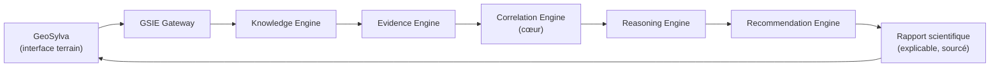
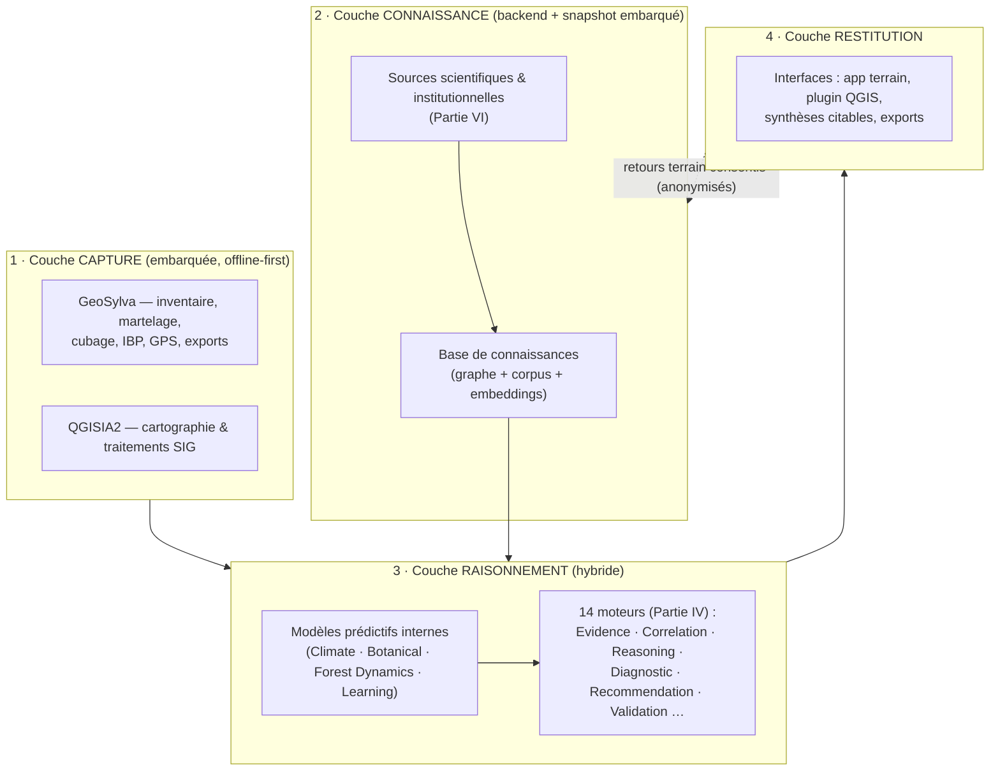
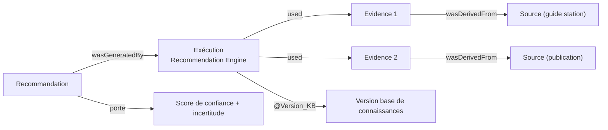
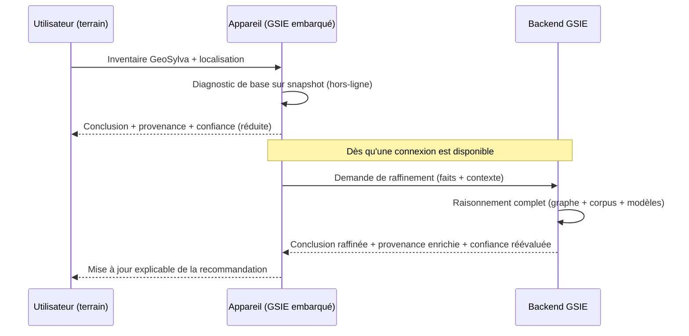
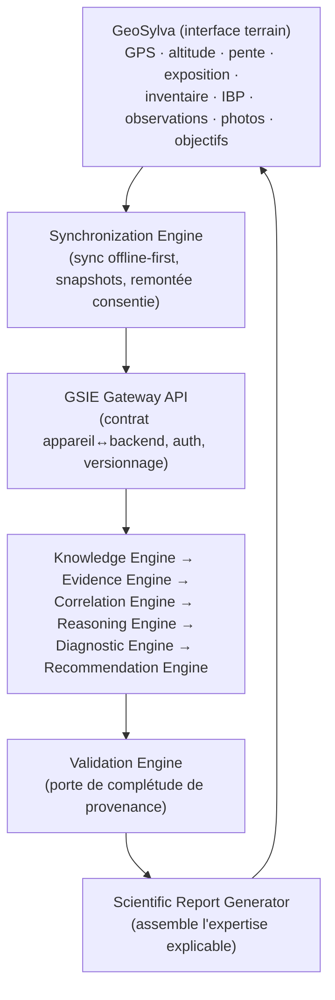

<!--
================================================================================
 GSIE — GeoSylva Intelligence Engine
 MASTER IMPLEMENTATION GUIDE
================================================================================
 Document maître · Référence d'ingénierie et scientifique
 Statut : Validated
 Statut de version : v0.6.1 (fondation + Parties I, II, III, IV, VI, VII rédigées + dimensions organisationnelles)
--------------------------------------------------------------------------------
 Ce fichier est le document de référence unique du projet GSIE.
 Il est conçu pour être versionné dans Git (docs-as-code) et repris par
 tout développeur ou tout LLM sans perte de la vision du projet.
================================================================================
-->

# GSIE — GeoSylva Intelligence Engine
## Master Implementation Guide

> **GSIE n'a pas pour ambition de devenir une application forestière.**
> GSIE a pour ambition de devenir **l'infrastructure de connaissance forestière la plus complète, explicable et scientifiquement traçable d'Europe.**

| Champ | Valeur |
|---|---|
| Titre | GSIE Master Implementation Guide |
| Sigle | GSIE — *GeoSylva Intelligence Engine* |
| Version du document | **v0.6.1** |
| Statut | Préambule, gouvernance et Parties I, II, III, IV, VI & VII rédigées ; dimensions organisationnelles (18_FINANCING, 23_QUALITY_MANAGEMENT) ; Parties V, VIII → XI spécifiées et planifiées |
| Date | 2 juillet 2026 |
| Auteur principal | Camille Perraudeau |
| Écosystème de rattachement | GeoSylva (application terrain, v2.4.0) · QGISIA2 (plugin QGIS) |
| Licence proposée du document | Creative Commons BY-SA 4.0 (à confirmer, cf. §0.6) |
| Format source | Markdown (UTF-8), export `.docx`/`.pdf` dérivable |
| Périmètre géographique de référence | France métropolitaine, extensible à l'échelle européenne (cf. Vision 2040) |

> **Avertissement de lecture.** Ce document est un *living document*. Sa fondation (v0.1.0) a fixé le cadre normatif, la gouvernance, les standards de rédaction et le sommaire détaillé et spécifié des onze parties, puis rédigé intégralement les Parties I (Vision) et II (Objectifs). Les versions suivantes ont rédigé la Partie III (Architecture) puis les Parties VI (Sources — catalogue exhaustif) et VII (IA — table tâche→modèle). Les parties restantes y sont **spécifiées** (objet, sous-sections, budget, dépendances) et seront **rédigées lors de sessions ultérieures**, une partie lourde à la fois, à pleine profondeur. Cette progression par lots revus est un choix d'ingénierie assumé (cf. §0.2) : elle est la seule compatible avec l'exigence « ne jamais écrire de remplissage » posée par la directive fondatrice.

---

# 0.0 GSIE en une page

*Cette page est conçue pour qu'un lecteur — humain ou agent — comprenne l'essentiel du projet en une seule lecture.*

## Ce qu'est GSIE

GSIE n'est pas une application. C'est une **plateforme scientifique** et une **infrastructure de connaissance**. Plus précisément, GSIE est, simultanément :

- une **plateforme scientifique** — des méthodes, des sources et des raisonnements vérifiables ;
- un **système expert** — il diagnostique et il recommande ;
- une **infrastructure documentaire** — il ingère, structure et trace un corpus scientifique ;
- un **graphe de connaissances** (*Knowledge Graph*) — le savoir forestier relié et interrogeable ;
- une **IA explicable** — aucune conclusion sans sa preuve ;
- une **plateforme SIG** — la connaissance ancrée dans l'espace, à la parcelle exacte ;
- un **moteur de raisonnement** — la chaîne qui transforme données et savoir en expertise.

**GeoSylva n'est qu'une application utilisant GSIE.** Cette phrase est fondamentale. GSIE est l'infrastructure ; GeoSylva-Mobile (interface de terrain) et GSIE-Desktop (poste d'analyse) sont des **applications** bâties dessus — les premières d'une famille appelée à s'étendre.

## Les deux signatures du projet

1. **SAM — *Scientific Augmentation Mode*** (§III.2.1). L'intelligence de GSIE **s'augmente** avec les ressources disponibles — jamais l'utilisateur n'est bloqué. Trois niveaux : *Local Intelligence* (hors-ligne), *Scientific Augmentation* (en ligne, centaines de sources), *Collective Intelligence* (apprentissage encadré).
2. **Offline-First.** *Sans connexion, GeoSylva fonctionne. Avec connexion, GeoSylva devient un terminal scientifique connecté à GSIE : la puissance augmente, jamais les fonctionnalités ne diminuent.*

## Les moteurs, d'un coup d'œil



Ce schéma est la **chaîne canonique d'expertise** (détail : Partie IV, et Flux C en §III.11). Le *Correlation Engine* en est le cœur : c'est lui qui remplace le système de corrélation actuel de GeoSylva. Les quatorze **macro-moteurs** (Partie IV) orchestrent, au sein du Correlation Engine, **plusieurs centaines de corrélateurs** spécialisés (sol × essence × climat × aléa…).

## Les ordres de grandeur cibles

Ces chiffres expriment l'**ambition** du projet, non un engagement daté ; ils évolueront. Le tableau est trié par ordre de grandeur croissant.

| Cible finale | Ordre de grandeur |
|---|---|
| Corrélateurs (modules du Correlation Engine) | plusieurs **centaines** |
| Couches SIG | plusieurs **centaines** |
| Essences, habitats, stations et taxons | plusieurs **milliers** |
| Publications scientifiques indexées | plusieurs **dizaines de milliers** |
| Nœuds du Knowledge Graph | **> 50 millions** |
| Relations du Knowledge Graph | **> 500 millions** |

## La portée de ce document

Ce n'est pas un simple manuel. C'est la documentation destinée à **piloter, potentiellement** : plusieurs **millions de lignes de code**, des **dizaines d'agents IA**, **plusieurs applications**, et **plusieurs années de développement**. Il DOIT donc rester le **contexte racine** du projet (§0.1) : tout contributeur, humain ou agent, s'y réancre avant d'intervenir.

GSIE est conçu comme une **infrastructure d'envergure nationale** — pas seulement un projet de code, mais une **institution** avec une gouvernance, un financement, un cadre légal, un système de management de la qualité et un écosystème de partenaires institutionnels. Les dimensions organisationnelles sont documentées dans les dossiers dédiés :
- **18_FINANCING** — modèle économique (dual licence AGPL/commerciale), sources de financement (France 2030, ANR, Horizon Europe), budget par phase (7 phases, projection 7 ans), gouvernance financière
- **19_LEGAL** — cadre légal, licences, conformité RGPD, audit des dépendances *(à développer)*
- **20_PARTNERSHIPS** — partenariats institutionnels (ONF, CNPF, INRAE, IGN, Météo-France, BRGM) *(à développer)*
- **23_QUALITY_MANAGEMENT** — système de management de la qualité (QMS) : politique qualité, manuel qualité, KPIs, audits internes, revues de direction, contrôle documentaire

---

## Sommaire

- **0.0 GSIE en une page**
- **0. Préambule et gouvernance documentaire**
  - 0.1 Objet, portée et audience du document
  - 0.2 Note de cadrage : pourquoi un document modulaire et versionné
  - 0.3 Comment lire ce document
  - 0.4 Positionnement de GSIE dans l'écosystème existant
  - 0.5 Terminologie normative (mots-clés d'exigence)
  - 0.6 Gouvernance du document (versionnement, processus RFC, revues, licence)
  - 0.7 Standards de rédaction
  - 0.8 Sommaire général détaillé et spécifié (Parties I → XI) et budgets
- **Partie I — Vision** *(rédigée)*
- **Partie II — Objectifs** *(rédigée)*
- **Partie III — Architecture** *(rédigée)*
- **Partie IV — Les moteurs** *(rédigée — 14 moteurs + 3 composants d'infrastructure)*
- **Partie VI — Les sources** *(rédigée — catalogue exhaustif par domaine)*
- **Partie VII — Intelligence artificielle** *(rédigée — table tâche → modèle)*
- **Parties V, VIII → XI** *(spécifiées ; rédaction planifiée — cf. §0.8 et Feuille de route)*
- **Dimensions organisationnelles** *(rédigées — cf. dossiers 18, 19, 20, 23)*
  - 18_FINANCING : modèle économique, sources de financement, budget par phase, gouvernance financière
  - 19_LEGAL : cadre légal, licences, conformité *(à développer)*
  - 20_PARTNERSHIPS : partenariats institutionnels *(à développer)*
  - 23_QUALITY_MANAGEMENT : système de management de la qualité (QMS), politique, manuel, KPIs
- **Feuille de route de rédaction du document**
- **Journal des versions (changelog)**
- **Références préliminaires**

---

# 0. Préambule et gouvernance documentaire

## 0.1 Objet, portée et audience du document

Le présent document constitue le **manuel officiel de conception et d'implémentation** de GSIE (*GeoSylva Intelligence Engine*). Son objet n'est pas de documenter une fonctionnalité, ni même un logiciel : il est de fixer, pour la décennie à venir, **pourquoi GSIE existe, ce qu'il doit devenir, comment il doit être construit, dans quel ordre, avec quels outils et à quel niveau d'exigence.**

La portée du document est délibérément large : elle couvre la vision produit, les objectifs mesurables, l'architecture logicielle et scientifique, les moteurs de raisonnement, la constitution de la base de connaissances, l'inventaire des sources, la stratégie d'intelligence artificielle, l'outillage, la feuille de route, l'assurance qualité et les annexes normatives. Cette amplitude est nécessaire parce que GSIE n'est pas un composant isolé mais un **système expert** : sa valeur naît de l'intégration cohérente de plusieurs disciplines (foresterie, pédologie, climatologie, botanique, science des données, ingénierie logicielle, systèmes d'information géographique).

L'audience visée est triple, et le document DOIT rester lisible par chacune de ces populations :

1. **Développeurs et architectes logiciels** — qui doivent pouvoir implémenter un moteur ou un module sans reconstruire le contexte.
2. **Scientifiques et forestiers** — qui doivent pouvoir vérifier la rigueur des méthodes, la traçabilité des sources et la validité des raisonnements.
3. **Agents d'intelligence artificielle** — qui, lors des sessions de développement assisté (« vibe coding »), doivent pouvoir se réancrer instantanément dans la vision, les contraintes et les conventions du projet.

Ce dernier point n'est pas anecdotique : GeoSylva, projet fondateur, s'appuie déjà sur des artefacts de contexte destinés aux agents (`AI_CONTEXT.md`, `AGENTS.md`, `VIBE_CODING.md`, un *vault* Obsidian, des *skills* d'agent). Le présent document en est la généralisation à l'échelle de l'écosystème : il est **le contexte racine** que tout agent DOIT charger avant d'intervenir sur GSIE.

## 0.2 Note de cadrage : pourquoi un document modulaire et versionné

La directive fondatrice fixe une cible ambitieuse (150 à 250 pages) tout en posant une contrainte absolue : *« ne jamais sacrifier la qualité pour réduire le nombre de pages ; ne jamais écrire de remplissage ; chaque paragraphe doit apporter une information utile. »* Ces deux exigences sont conciliables uniquement si le document est **construit comme un logiciel** : par incréments spécifiés, revus, versionnés.

Trois raisons d'ingénierie justifient ce choix, et non un choix de commodité :

- **Densité contre volume.** Un document de référence de qualité RFC/ISO se mesure à sa densité informationnelle, non à sa pagination. Produire onze parties « d'un trait » conduit mécaniquement à survoler chacune. La production par lots permet, pour chaque partie, la phase que la directive elle-même impose : *réfléchir, comparer, rechercher, argumenter, justifier.*
- **Fraîcheur factuelle.** Les Parties V (Base de connaissances), VI (Sources) et VII (Intelligence artificielle) dépendent de faits **datés et volatils** : licences de jeux de données, disponibilité et versions d'API publiques, capacités et tarifs des modèles de langage. Ces parties DOIVENT être rédigées après une phase de recherche et de vérification dédiée, et NE DOIVENT PAS être figées prématurément sur la base de connaissances anciennes.
- **Traçabilité et révision.** Un document versionné en SemVer, revu partie par partie (revue d'architecture, revue scientifique, revue documentaire — cf. §0.6 et Partie X), offre la même garantie de qualité qu'une base de code : chaque affirmation est attribuable, contestable, corrigible, sans réécriture globale.

En conséquence, la version courante livre une **fondation complète et autoportante** (cadre + Parties I, II, III, VI, VII) plus une **spécification exhaustive** des parties restantes, de sorte que le document soit immédiatement exploitable et que sa complétion soit un travail planifié et non une promesse vague.

## 0.3 Comment lire ce document

Le lecteur pressé lira la Partie I (Vision) et la Partie II (Objectifs) : elles suffisent à comprendre l'intention et les critères de succès du projet. Le lecteur technique poursuivra par la Partie III (Architecture) puis la Partie IV (Moteurs). Le lecteur scientifique se concentrera sur les Parties IV, V et VI. L'agent IA chargera l'intégralité du document comme contexte racine, en portant une attention particulière au §0.5 (terminologie normative) et au §0.7 (standards de rédaction), qui conditionnent l'interprétation de toutes les prescriptions.

Chaque partie suit une structure homogène : un exposé du problème, une comparaison argumentée des solutions envisageables, un choix justifié, et les conséquences de ce choix. Lorsqu'une décision structurante est prise, elle est consignée sous forme d'**ADR** (*Architecture Decision Record*, cf. Partie X) afin que la raison du choix survive au choix lui-même.

## 0.4 Positionnement de GSIE dans l'écosystème existant

GSIE ne naît pas sur une page blanche. Il s'inscrit dans un écosystème dont le socle, **GeoSylva**, est un logiciel réel, mature et vérifiable (dépôt public, version 2.4.0, ~99,5 % de Kotlin, plus de 420 tests unitaires, licence double AGPL-3.0 / commerciale). Comprendre la répartition des rôles est le préalable à toute décision d'architecture.

| Brique | Rôle dans l'écosystème | Question à laquelle elle répond |
|---|---|---|
| **GeoSylva** | Capture terrain, mesure, inventaire, martelage, exports SIG — 100 % hors-ligne | « Qu'y a-t-il, précisément, sur cette parcelle ? » |
| **QGISIA2** | Cartographie et traitements SIG assistés (plugin QGIS) | « Comment visualiser, croiser et traiter la donnée spatiale ? » |
| **GSIE** | **Raisonnement explicable, connaissance structurée, diagnostic et recommandation sourcés** | « Que faut-il faire, **pourquoi**, sur quelles **preuves**, et avec quelle **incertitude** ? » |

GeoSylva est un **instrument** : il produit une donnée dendrométrique et géographique fiable (7 méthodes de cubage, IBP CNPF officiel, GPS moyenné à rejet d'outliers MAD, conversion Lambert 93 avec transformation Helmert WGS84→ETRS89, garde-fous de cohérence). Mais un instrument, aussi précis soit-il, ne délivre pas d'interprétation : il indique *ce qui est*, non *ce qu'il convient de faire*. Le passage de la mesure au diagnostic stationnel, puis du diagnostic à une recommandation sylvicole **justifiée, sourcée et défendable devant un pair, un CRPF ou l'administration**, constitue précisément le vide que GSIE existe pour combler.

GSIE se définit donc comme la **couche de raisonnement** de l'écosystème. Il consomme les données produites par GeoSylva et QGISIA2, mobilise des **modèles prédictifs — désormais internes à GSIE** (moteurs Climate, Botanical, Forest Dynamics et Learning, Partie IV) — comme l'une de ses sources d'évidence parmi d'autres, et restitue des conclusions dont **chaque élément est traçable** jusqu'à une source vérifiable. Cette relation est développée en Partie III (Architecture) et conditionne l'ensemble des choix techniques.

**Précision de vocabulaire.** GSIE est une **plateforme scientifique et une infrastructure de connaissance** — le **cerveau** de l'écosystème (cf. §0.0). **GeoSylva n'est qu'une application qui utilise GSIE**, non l'inverse : GeoSylva Mobile en est l'interface de terrain ; GSIE-Desktop est un poste d'analyse. Cette séparation *infrastructure ↔ applications* est un **principe fondamental d'architecture** : elle permet à l'infrastructure de croître (nouvelles sources, nouveaux moteurs, nouveaux modèles) sans perturber les applications, et aux applications de rester simples, robustes et hors-ligne. Le cerveau GSIE existe en **trois incarnations de puissance croissante** : *embarqué* (mobile), *poste de travail PC* (nœud puissant, au maximum des capacités matérielles) et *cloud* (intelligence collective). Ces incarnations et la manière dont les capacités s'augmentent avec les ressources disponibles sont formalisées en Partie III sous le concept de **SAM — *Scientific Augmentation Mode*** (§III.2.1) et de **topologie à trois niveaux** (§III.3.3).

**GSIE comme plateforme, et sa stratégie à deux moteurs.** GSIE est une **plateforme d'application** dont le cœur est une **base de connaissances** et un **moteur d'analyse et de corrélation** : il croise les données prises sur le terrain via GeoSylva avec des **données environnementales externes géolocalisées à la parcelle exacte** (composition et type de sol, précipitations, climat, exposition, altitude, aléas…), qu'elles soient **pré-téléchargées** sur l'appareil ou **récupérées en ligne** (§III.5.4). Cette plateforme se matérialise en **deux moteurs-produits complémentaires** que le projet construit : **GSIE-Mobile**, qui **remplace le système de corrélation actuel** de l'application GeoSylva existante par un moteur bien plus abouti — offline-first et augmentable en ligne ; et **GSIE-Desktop**, application PC nouvelle et nettement plus puissante, dédiée à l'analyse approfondie au bureau à partir des données remontées du terrain. Le **cloud** n'est pas un troisième moteur à construire mais un **service d'augmentation partagé** que les deux moteurs appellent lorsque le réseau est disponible (§III.3.4). Le **Correlation Engine** (Partie IV) est le cœur battant de la plateforme et l'objet premier de la refonte.

## 0.5 Terminologie normative (mots-clés d'exigence)

Ce document emploie des mots-clés d'exigence dont le sens est strict, par transposition française de la RFC 2119 / RFC 8174. Lorsqu'ils apparaissent en majuscules, ils DOIVENT être interprétés comme suit :

| Mot-clé | Signification |
|---|---|
| **PEUT** | Élément véritablement facultatif ; une implémentation conforme peut l'omettre. |
| **DEVRAIT** / **NE DEVRAIT PAS** | Recommandation forte ; toute dérogation DOIT être justifiée et documentée (ADR). |
| **DOIT** / **NE DOIT PAS** | Exigence absolue de conformité ; sa violation rend l'implémentation non conforme. |

Les autres termes techniques et scientifiques sont définis au fil du texte et consolidés dans le glossaire (Partie XI).

## 0.6 Gouvernance du document (versionnement, processus RFC, revues, licence)

**Versionnement.** Le document suit le versionnement sémantique (SemVer) appliqué à la documentation : `MAJEUR.MINEUR.CORRECTIF`. Un incrément **MAJEUR** marque une refonte de la vision ou de l'architecture ; un incrément **MINEUR** ajoute une partie rédigée ou une section substantielle ; un incrément **CORRECTIF** corrige, précise ou source sans changer le fond. La version courante est **v0.6.1** : la série `0.x` signifie que la fondation est posée mais que le corpus n'est pas complet ; la **v1.0.0** sera prononcée lorsque les onze parties seront rédigées et auront passé leurs revues.

**Processus RFC interne.** Toute évolution structurante (nouveau moteur, changement de source de vérité, choix d'un modèle d'IA pour une tâche critique) DOIT faire l'objet d'une *Request For Comments* interne : un court document proposant le changement, ses alternatives, ses conséquences et son plan de migration. Une RFC acceptée se matérialise par un ou plusieurs ADR (Partie X) et, le cas échéant, par une révision de ce guide.

**Revues.** Aucune partie n'est réputée « rédigée » (et donc éligible à faire passer le document en `MINEUR`) tant qu'elle n'a pas franchi trois portes : une **revue d'architecture** (cohérence technique et faisabilité), une **revue scientifique** (validité des méthodes, traçabilité des sources, honnêteté de l'incertitude) et une **revue documentaire** (clarté, absence de remplissage, conformité aux standards du §0.7). Ces portes sont détaillées en Partie X.

**Licence du document.** Le document étant destiné à circuler auprès de partenaires, chercheurs et contributeurs, une licence **Creative Commons BY-SA 4.0** est proposée : elle autorise le partage et l'adaptation tout en imposant l'attribution et le partage à l'identique. Ce choix DEVRAIT être confirmé au regard de la stratégie de propriété intellectuelle de l'écosystème, qui repose déjà sur une double licence AGPL-3.0 / commerciale pour le code (cf. Partie II, objectifs open source, et Partie X). La documentation et le code PEUVENT relever de licences distinctes ; ce point sera tranché par ADR.

## 0.7 Standards de rédaction

Les prescriptions suivantes s'appliquent à toutes les parties, présentes et futures, du document. Elles DOIVENT être respectées par tout contributeur, humain ou agent.

- **Argumentation obligatoire.** Toute affirmation importante DOIT être justifiée. Lorsqu'une décision existe entre plusieurs options, le document DOIT comparer, argumenter, choisir et justifier le choix — jamais asséner.
- **Traçabilité.** Tout fait daté, chiffre, licence ou capacité technique DOIT être attribuable à une source vérifiable ou explicitement marqué comme « à consolider » lorsque la vérification n'a pas encore été faite. Le document NE DOIT PAS présenter comme établie une donnée non vérifiée.
- **Honnêteté de l'incertitude.** Le document DEVRAIT distinguer ce qui est démontré, ce qui est probable et ce qui est conjectural. Cette exigence est structurante : elle est le principe même que GSIE applique à ses propres sorties (cf. Partie IV, *Validation Engine*).
- **Neutralité et objectivité.** Le ton DOIT rester professionnel, scientifique et objectif. Les considérations commerciales n'invalident pas les considérations techniques et réciproquement ; chacune est traitée à sa place.
- **Tableaux ordonnés.** Les tableaux comparatifs à valeur quantitative DEVRAIENT être triés par ordre croissant de la grandeur pertinente, afin d'en faciliter la lecture.
- **Terminologie stable.** Un concept DOIT porter le même nom dans tout le document ; les synonymes sont proscrits au profit de la cohérence. Le glossaire (Partie XI) fait foi.
- **Pas de remplissage.** Un paragraphe qui n'apporte pas d'information utile DOIT être supprimé plutôt que conservé pour « faire du volume ».

## 0.8 Sommaire général détaillé et spécifié (Parties I → XI) et budgets

Le tableau ci-dessous constitue la **spécification du document lui-même** : il énumère les onze parties, leur objet, leur budget indicatif et leur statut. C'est l'artefact qui permet à tout contributeur de reprendre la rédaction sans perdre la structure ni la vision. Les budgets sont exprimés en pages équivalentes (format A4, densité RFC) ; ils sont indicatifs et subordonnés à l'exigence de qualité. Le tableau est trié par budget croissant.

| Partie | Titre | Objet synthétique | Budget (p.) | Statut |
|---|---|---|---|---|
| XI | Annexes | Glossaire, standards, normes, RFC, diagrammes, bibliographie | 8–14 | Spécifiée |
| X | Qualité | Tests, CI/CD, Git, releases, RFC, revues (code, archi, science, doc) | 10–16 | Spécifiée |
| II | Objectifs | Objectifs mesurables : science, technique, économie, UX, IA, open source, pro, recherche, pédagogie, long terme | 12–18 | **Rédigée** |
| IX | Roadmap | Ordre, dépendances, lots, sprints, MVP, v1/v2/v3 | 12–18 | Spécifiée |
| VI | Sources | Inventaire exhaustif des sources exploitables et fiches d'évaluation | 14–22 | **Rédigée** |
| I | Vision | Raison d'être, problèmes actuels, limites des outils, vision, mission, utilisateurs, bénéfices, visions 2035/2040 | 15–20 | **Rédigée** |
| VII | Intelligence artificielle | Choix du meilleur modèle par tâche, comparaisons argumentées, local/cloud, explicabilité | 16–24 | **Rédigée** |
| VIII | Outils | Cartographie critique de l'outillage (scraping, OCR/parsing, bases vectorielles, SIG, graphes, orchestration IA) | 16–24 | Spécifiée |
| V | Base de connaissances | Chaîne d'ingestion : OCR, parsing, extraction, nettoyage, validation, versionnement, graphe de connaissances, *embeddings*, métadonnées, traçabilité | 18–26 | Spécifiée |
| III | Architecture | Architecture globale, logicielle, documentaire, scientifique, données, réseau, Android, backend, API, IA, SIG, bases, diagrammes, flux | 20–30 | **Rédigée** |
| IV | Les moteurs | Quatorze moteurs, chacun : mission, responsabilités, entrées, sorties, API, algorithmes, tests, performance, évolutions | 28–40 | **Rédigée** |

**Spécification résumée des parties non encore rédigées** (le détail sous-sectionnel figure dans la Feuille de route, plus bas) :

- **Partie IV — Les moteurs.** DOIT spécifier les quatorze moteurs (Knowledge, Evidence, Correlation, Reasoning, Diagnostic, Recommendation, Validation, GIS, Climate, Pedology, Botanical, Forest Dynamics, Learning, Simulation) selon le canevas commun. Dépend de : Partie III.
- **Partie V — Base de connaissances.** DOIT décrire la chaîne complète d'ingestion documentaire jusqu'au graphe de connaissances et aux *embeddings*, avec versionnement et traçabilité. Dépend de : Parties III & IV ; exige une phase de recherche outillage (recoupe Partie VIII).
- **Partie VIII — Outils.** DOIT cartographier l'outillage par famille avec avantages, inconvénients et cas d'usage. Recoupe Parties V et VII.
- **Partie IX — Roadmap.** DOIT ordonnancer le développement (priorités, dépendances, lots, sprints, MVP, v1/v2/v3). Dépend de l'ensemble des parties techniques.
- **Partie X — Qualité.** DOIT définir la stratégie de tests, la CI/CD, la stratégie Git, les releases et les quatre revues. Transversale.
- **Partie XI — Annexes.** Glossaire, standards, normes, bibliographie, diagrammes consolidés. Transversale.

---

# Partie I — Vision

## I.1 Pourquoi GSIE existe

La forêt française et européenne traverse une transition d'une brutalité inédite à l'échelle des temps sylvicoles. Les peuplements installés au XXᵉ siècle l'ont été pour un climat qui n'existe déjà plus, et pour un climat futur dont les trajectoires demeurent incertaines. Le décalage entre la longévité d'un peuplement (plusieurs décennies à plus d'un siècle) et la vitesse du changement climatique (perceptible à l'échelle d'une décennie) crée une **crise d'adaptation** : des choix faits aujourd'hui engagent des générations, sur la base d'une connaissance dispersée, hétérogène et difficile à mobiliser au bon endroit et au bon moment.

Cette crise se manifeste concrètement, sur le terrain, par des phénomènes que tout gestionnaire observe : dépérissements liés au stress hydrique, crises sanitaires (scolytes sur épicéa, affaiblissement du sapin, du hêtre et par endroits du Douglas et des chênes), sensibilité accrue aux tempêtes, et extension géographique du risque incendie vers des massifs historiquement épargnés — ce qui déplace vers le nord des enjeux de défense de la forêt contre les incendies (DFCI) autrefois cantonnés au sud. Chacun de ces phénomènes appelle une **décision** : quelle essence introduire ou favoriser, à quelle densité, sur quelle station, avec quelle sylviculture, sous quelle contrainte réglementaire et pour quel objectif (production, biodiversité, protection, carbone).

Or cette décision se prend aujourd'hui dans un paysage informationnel **fragmenté**. La connaissance nécessaire existe — elle est même abondante — mais elle est éclatée entre des producteurs qui ne parlent pas le même langage : l'IGN pour l'inventaire et la donnée topographique, le BRGM pour les sols et la géologie, Météo-France et Copernicus pour le climat observé et projeté, l'INPN et les catalogues de ZNIEFF et de sites Natura 2000 pour la biodiversité, le CNPF et l'ONF pour la doctrine sylvicole et les guides de stations, l'INRAE et le FCBA pour la recherche appliquée, l'EFI et la FAO pour les cadres européens et internationaux, le GIEC pour les scénarios climatiques. Cette connaissance vit dans des formats peu interopérables : PDF, guides régionaux papier, thèses, cartes, jeux de données aux projections et licences variées. Elle est rarement géolocalisée à la finesse de la parcelle, et **presque jamais explicable de bout en bout** : il est difficile, à partir d'une recommandation, de remonter à la preuve qui la fonde.

GSIE existe pour résoudre ce problème précis : **transformer une connaissance fragmentée et une donnée de terrain fiable en un diagnostic et une recommandation qui soient, à la fois, pertinents localement et intégralement traçables jusqu'à leurs preuves.**

## I.2 Les problèmes actuels

Trois problèmes structurants motivent le projet.

**Premier problème — la donnée de terrain est désormais fiable, mais orpheline d'interprétation.** Grâce à des outils comme GeoSylva, un gestionnaire peut aujourd'hui produire, hors ligne et avec une rigueur métrologique, un inventaire complet : effectifs par essence et par classe de diamètre, surface terrière, volumes par sept méthodes de cubage, hauteurs mesurées au clinomètre, positions GPS moyennées, indice de biodiversité potentielle. Cette donnée est excellente. Mais elle reste **descriptive** : elle dit ce qui est présent, sans dire ce que cela signifie pour l'avenir du peuplement, ni ce qu'il conviendrait d'entreprendre. Le gestionnaire dispose d'un état des lieux ; il lui manque un raisonnement.

**Deuxième problème — la connaissance scientifique est inaccessible au moment de la décision.** Le savoir pertinent existe, mais il faut le chercher, le comprendre, le croiser et l'adapter à la station — un travail d'expert, long, non reproductible d'un praticien à l'autre, et impraticable à l'échelle des millions de parcelles concernées. Le résultat est une **inégalité d'accès à l'expertise** : la qualité d'une décision dépend trop de la disponibilité et de l'expérience de la personne qui la prend, et pas assez d'un socle de connaissance partagé et vérifiable.

**Troisième problème — les aides à la décision existantes ne sont pas défendables.** Les assistants génériques fondés sur les grands modèles de langage produisent des réponses fluides mais **non tracées** : ils peuvent halluciner, mélangent les contextes réglementaires, et ne fournissent pas la chaîne de preuve qui permettrait à un expert de vérifier, ou à l'administration d'accepter, la recommandation. Une aide à la décision forestière qui ne peut pas justifier ses conclusions n'a pas sa place dans un acte de gestion engageant, encore moins dans un document soumis à agrément.

## I.3 Les limites des outils forestiers actuels

Il est essentiel de situer GSIE par rapport à l'existant, non pour le disqualifier mais pour identifier avec précision le vide qu'il comble. Le tableau suivant, trié de l'outil le plus étroit au plus large, résume la nature et la limite de chaque catégorie d'outils.

| Catégorie d'outils | Ce qu'ils font bien | Limite structurelle au regard de la décision |
|---|---|---|
| Guides de stations (papier/PDF) | Codifient un savoir local de qualité | Statiques, régionaux, non géolocalisés, non interrogeables, difficilement actualisables |
| Applications d'inventaire/martelage | Capturent une donnée fiable sur le terrain | S'arrêtent à la mesure ; n'interprètent pas et ne recommandent pas |
| SIG (bureau et mobile) | Visualisent et croisent la donnée spatiale | Restituent des couches ; ne produisent pas de raisonnement ni de diagnostic |
| Modèles de recherche (INRAE, etc.) | Modélisent finement des processus | Souvent en silos, peu déployés sur le terrain, difficiles à mobiliser au cas par cas |
| Assistants IA généralistes | Répondent en langage naturel, rapidement | Non sourcés, sujets à l'hallucination, non défendables, ignorants du contexte réglementaire local |

La lecture de ce tableau met en évidence une lacune commune : **aucun de ces outils ne relie la mesure de terrain, la connaissance scientifique et la contrainte réglementaire dans un raisonnement explicable.** Les guides savent, mais ne calculent pas ; les applications mesurent, mais ne raisonnent pas ; les SIG montrent, mais ne concluent pas ; les modèles prédisent, mais ne se déploient pas ; les assistants parlent, mais ne prouvent pas. GSIE est conçu pour occuper exactement cet interstice.

## I.4 La vision

**GSIE est un système expert forestier explicable.** L'adjectif *explicable* n'est pas un ornement : il est le cœur de la proposition de valeur et le critère par lequel le projet devra être jugé. Là où un système opaque produit une réponse, GSIE produit une **conclusion accompagnée de sa justification** : les faits mobilisés (issus du terrain, des sources scientifiques, des données spatiales), les règles ou modèles appliqués, le chemin de raisonnement suivi, les sources précises invoquées, et l'incertitude résiduelle honnêtement quantifiée.

Concrètement, la vision est celle d'un système qui, recevant l'inventaire d'une parcelle (via GeoSylva), sa localisation et son contexte spatial (via QGISIA2 et les sources géographiques), établit un **diagnostic stationnel** — quel type de station, quelles contraintes pédoclimatiques, quels aléas — puis en déduit des **recommandations sylvicoles** — quelles essences envisager ou éviter, quels itinéraires techniques, quels points de vigilance réglementaire — **chacune étant sourcée et assortie de son degré de confiance.** Le gestionnaire, l'expert ou l'étudiant peut alors non seulement lire la recommandation, mais la **vérifier**, la **contester** et l'**assumer** devant un tiers.

Cette vision repose sur un principe non négociable : **la traçabilité prime sur la fluidité.** GSIE préférera dire « je ne sais pas, faute de source suffisante » plutôt que produire une réponse plausible mais infondée. Cette discipline distingue un système expert d'un simple générateur de texte, et conditionne la confiance des professionnels.

La signature de cette vision est un principe que GSIE nomme **SAM — *Scientific Augmentation Mode***. L'utilisateur n'est **jamais bloqué** par l'absence de connexion : un premier niveau d'intelligence fonctionne intégralement hors-ligne (*Local Intelligence*). Mais dès que des ressources deviennent disponibles, les capacités **s'augmentent** — le système croise les données de terrain avec des centaines de sources, des modèles climatiques et des publications récentes (*Scientific Augmentation*), et, à terme, apprend de manière contrôlée d'observations agrégées et anonymisées (*Collective Intelligence*). L'ambition finale n'est pas de rendre un simple calcul, mais de produire, à partir d'une simple visite de terrain, une **expertise forestière complète, reproductible, tracée et explicable**, qui ressemble davantage au travail conjoint de plusieurs spécialistes qu'à une sortie logicielle. SAM est formalisé en §III.2.1.

## I.5 La mission

La mission de GSIE se formule ainsi : **rendre la meilleure connaissance forestière disponible, explicable et actionnable au moment et au lieu de la décision, pour tout acteur de la forêt, du propriétaire à l'expert.**

Cette mission implique quatre engagements permanents. GSIE DOIT être **rigoureux** : ses conclusions reposent sur des méthodes et des sources vérifiables. Il DOIT être **explicable** : aucune conclusion sans sa preuve. Il DOIT être **accessible** : utilisable sur le terrain, y compris en conditions dégradées de connectivité, cohérent avec la philosophie 100 % hors-ligne héritée de GeoSylva pour ce qui relève de l'usage embarqué. Il DOIT être **loyal** : la souveraineté et la confidentialité des données du gestionnaire priment, dans la continuité des choix de GeoSylva (données locales, chiffrement au repos, absence de traçage publicitaire).

## I.6 Les utilisateurs

GSIE s'adresse à un spectre d'utilisateurs dont les besoins, bien que distincts, convergent vers l'exigence d'explicabilité. Le tableau suivant est trié du besoin le plus ponctuel au besoin le plus intensif.

| Utilisateur | Besoin principal vis-à-vis de GSIE |
|---|---|
| Propriétaire forestier gestionnaire | Comprendre sa parcelle et les options qui s'offrent à lui, en confiance |
| Étudiant (BTSA, ingénieur) | Apprendre le raisonnement forestier avec des cas tracés et pédagogiques |
| Technicien / gestionnaire de terrain | Obtenir un diagnostic et des pistes d'action fiables, sur le terrain |
| Collectivité et acteur DFCI | Croiser risque, réglementation et cartographie pour la prévention |
| Coopérative forestière | Homogénéiser et fiabiliser les décisions à l'échelle d'un portefeuille de parcelles |
| Expert forestier / bureau d'études | Produire des diagnostics défendables et gagner du temps sur la recherche documentaire |
| Institution (ONF, CNPF/CRPF) | Diffuser une doctrine cohérente et vérifiable, appuyée sur des sources |
| Chercheur (INRAE, AgroParisTech, EFI) | Disposer d'un cadre traçable pour confronter modèles et données de terrain |

L'existence même de GeoSylva atteste que cette audience est atteignable : le projet fondateur revendique déjà une conception « par des forestiers, pour des forestiers » et un intérêt institutionnel naissant (école forestière, anciens collègues ONF). GSIE prolonge cette relation en apportant la couche que ces mêmes utilisateurs réclament naturellement une fois la donnée en main : le sens.

## I.7 Les bénéfices

Les bénéfices attendus se répartissent selon les catégories d'acteurs, mais partagent une racine commune : **réduire le coût et l'inégalité d'accès à un raisonnement forestier de qualité, sans sacrifier la rigueur.**

Pour le praticien, le bénéfice est un **gain de temps et de confiance** : la recherche documentaire, longue et non reproductible, est remplacée par un diagnostic sourcé qu'il peut vérifier. Pour l'institution, c'est l'**homogénéité et la défendabilité** : une doctrine appliquée de façon cohérente et traçable. Pour l'étudiant et le formateur, c'est un **outil pédagogique** qui rend visible le raisonnement, et non seulement son résultat. Pour le chercheur, c'est un **cadre de confrontation** entre modèles et terrain, où l'incertitude est explicite. Pour la filière et la société, enfin, le bénéfice est de meilleure qualité des décisions d'adaptation, à un moment où ces décisions engagent l'avenir des forêts.

Il importe de nommer aussi ce que GSIE **n'est pas** : il n'est pas un décideur automatique, ni un substitut à l'expertise humaine ou à l'acte de gestion. Il est un **amplificateur d'expertise** : il met la connaissance à portée, il montre son raisonnement, il quantifie son incertitude, et il laisse la décision à l'humain responsable.

## I.8 Vision 2035

À l'horizon 2035, GSIE DEVRAIT avoir dépassé le diagnostic à la parcelle pour constituer un **jumeau numérique forestier** à l'échelle du massif. Les données de terrain, désormais massives et régulières grâce à l'écosystème, seraient enrichies par la télédétection : imagerie satellitaire (programme Copernicus / satellites Sentinel), et données LiDAR haute densité issues des campagnes nationales, permettant une caractérisation fine et actualisée de la structure des peuplements. GSIE croiserait ces couches avec ses moteurs de connaissance pour suivre l'évolution des peuplements, détecter précocement les signaux de dépérissement, et évaluer l'effet des itinéraires sylvicoles sur la trajectoire d'adaptation. Le raisonnement resterait explicable : chaque alerte, chaque tendance, remonterait à ses observations et à ses modèles.

Cette vision est cohérente avec l'ambition déjà exprimée dans l'écosystème (extension vers le suivi environnemental par satellite et drone) et avec les capacités de GeoSylva en matière d'intégration de couches spatiales et de conversion géodésique. Elle exige, en contrepartie, une maturité des Parties V (base de connaissances) et VII (IA) qui n'est pas encore atteinte, ce qui en fait un objectif de moyen terme et non une promesse immédiate.

## I.9 Vision 2040

À l'horizon 2040, GSIE DEVRAIT servir de **système d'aide à la décision d'adaptation à l'échelle régionale et interrégionale**, capable d'éclairer non seulement le gestionnaire isolé mais aussi les politiques publiques forestières : où concentrer les efforts d'adaptation, quelles essences et quels itinéraires privilégier selon les scénarios climatiques, comment arbitrer entre production, biodiversité, protection et stockage de carbone. À cette échelle, l'**interopérabilité** devient centrale : GSIE DEVRAIT dialoguer avec les cadres européens (EFI, programmes Copernicus) et respecter les standards d'échange de données spatiales (dont la directive INSPIRE), afin de contribuer à une connaissance forestière fédérée plutôt qu'à un nouveau silo.

Cette vision de long terme n'a de sens que si les principes fondateurs sont tenus dès le départ : explicabilité, traçabilité, souveraineté des données, honnêteté de l'incertitude. Un système d'aide à la décision publique qui ne pourrait pas justifier ses conclusions serait non seulement inutile mais dangereux. C'est pourquoi la Partie II fixe ces principes comme des objectifs mesurables, et non comme des intentions.

---

# Partie II — Objectifs

Cette partie traduit la vision en objectifs. Chaque catégorie énonce une intention, puis des objectifs formulés autant que possible de façon **mesurable ou vérifiable**, car un objectif non mesurable n'est pas un objectif mais un vœu. Les objectifs emploient la terminologie normative du §0.5.

## II.1 Objectifs scientifiques

L'ambition scientifique de GSIE est d'être **digne de confiance** au sens où l'entend la communauté scientifique : reproductible, traçable, honnête sur ses limites.

- GSIE **DOIT** garantir que toute conclusion (diagnostic ou recommandation) soit associée à la liste des faits et des sources qui la fondent — traçabilité de bout en bout, sans exception.
- GSIE **DOIT** quantifier et exposer l'incertitude de ses conclusions ; il **NE DOIT PAS** présenter une conclusion faiblement étayée avec la même assurance qu'une conclusion solidement établie.
- GSIE **DEVRAIT** être reproductible : à faits et sources identiques, il produit un raisonnement identique et auditable.
- GSIE **DEVRAIT** distinguer explicitement le fait établi, l'inférence probable et la conjecture, dans ses sorties comme dans sa documentation.
- GSIE **DEVRAIT** permettre la citation académique de ses sources, afin de s'intégrer dans un travail de recherche ou un document soumis à revue.

## II.2 Objectifs techniques

L'ambition technique est la **pérennité** : un système conçu pour dix ans doit résister à l'obsolescence de ses composants et à la variabilité des conditions d'usage.

- GSIE **DOIT** préserver la souveraineté et la confidentialité des données de l'utilisateur, dans la continuité des choix de GeoSylva (données locales par défaut, chiffrement au repos, absence de traçage).
- La partie embarquée de GSIE **DOIT** fonctionner en conditions de connectivité dégradée ou nulle pour les usages de terrain, cohéremment avec la philosophie *offline-first* de l'écosystème.
- GSIE **DOIT** adopter des standards ouverts d'interopérabilité spatiale (formats et services géographiques reconnus, projections gérées comme dans GeoSylva : WGS84, Lambert 93, ETRS89) et **DEVRAIT** viser la conformité aux cadres d'échange européens (INSPIRE) à mesure de sa montée en échelle.
- GSIE **DEVRAIT** être modulaire : chaque moteur (Partie IV) est remplaçable sans réécriture du système, ce qui suppose des contrats d'API stables (Partie III).
- GSIE **NE DOIT PAS** créer de dépendance irréversible à un fournisseur unique de modèle d'IA ou de service ; les choix de la Partie VII **DOIVENT** rester révisables par ADR.

## II.3 Objectifs économiques

L'ambition économique est la **viabilité** d'un modèle qui finance le développement sans trahir les principes d'ouverture et de confiance.

- Le modèle économique **DEVRAIT** prolonger la logique de **double licence** déjà retenue pour GeoSylva (open source AGPL-3.0 pour l'adoption et la confiance ; licence commerciale pour les intégrations propriétaires et hébergées), en la déclinant pour la couche de raisonnement et de connaissance.
- L'offre **DEVRAIT** être structurée en niveaux (usage individuel, usage professionnel, usage institutionnel) permettant une adoption progressive sans barrière à l'entrée.
- Le modèle **DOIT** être compatible avec le cadre d'exercice de l'éditeur (structure d'auto-entreprise en cours de constitution), notamment quant aux seuils et obligations applicables ; ce point relève d'une vérification juridique et comptable dédiée et **NE DOIT PAS** être tranché sur la base d'hypothèses.
- La valeur commerciale **NE DOIT PAS** être obtenue au détriment de la confiance : pas de publicité, pas de revente de données, dans la continuité explicite de GeoSylva.

> *Note.* Les questions fiscales et sociales propres à la structure de l'éditeur (régime, seuils, options) sortent du périmètre technique de ce document et relèvent d'un conseil qualifié ; elles sont mentionnées ici uniquement comme contrainte à respecter, non comme recommandation.

## II.4 Objectifs UX

L'ambition d'expérience utilisateur est la **clarté sous contrainte** : rendre un raisonnement complexe lisible et actionnable, y compris sur le terrain.

- L'interface **DOIT** exposer, à côté de chaque conclusion, un accès immédiat à sa justification et à ses sources — l'explicabilité **DOIT** être une propriété de l'expérience, pas seulement du moteur.
- L'expérience de terrain **DOIT** être utilisable en conditions réelles (gants, luminosité, faible réseau), en héritant des acquis ergonomiques de GeoSylva (saisie rapide, retours temps réel, robustesse hors-ligne).
- GSIE **DEVRAIT** adapter son niveau de restitution à l'utilisateur : synthétique pour le praticien pressé, détaillé et pédagogique pour l'étudiant, exhaustif et citable pour l'expert.
- L'interface **NE DOIT PAS** masquer l'incertitude derrière une présentation faussement catégorique.

## II.5 Objectifs IA

L'ambition en matière d'intelligence artificielle est l'**explicabilité** et la **maîtrise** : l'IA est un moyen au service d'un système expert, non une fin opaque.

- Les composants d'IA générative **DOIVENT** être employés selon un schéma de génération augmentée par la récupération (*RAG*) strictement sourcé : une réponse **NE DOIT PAS** être produite sans rattachement à des sources de la base de connaissances (Partie V).
- Le choix d'un modèle pour une tâche **DOIT** résulter d'une comparaison argumentée (Partie VII) et **DEVRAIT** privilégier, à performance comparable, la solution la plus souveraine, la plus explicable et la moins dépendante d'un fournisseur unique.
- GSIE **DEVRAIT** distinguer les tâches réalisables par des modèles locaux (souveraineté, hors-ligne, coût) de celles justifiant un modèle distant plus capable, et documenter ce partage.
- Les composants d'apprentissage (*Learning Engine*, Partie IV) **NE DOIVENT PAS** dégrader la traçabilité : un modèle appris **DOIT** rester interrogeable quant aux données et aux hypothèses qui l'ont formé.

## II.6 Objectifs open source

L'ambition d'ouverture est la **confiance par la vérifiabilité**, dans la continuité de la posture de GeoSylva (code auditable, licence AGPL-3.0).

- Le cœur explicable de GSIE **DEVRAIT** être ouvert et auditable, car un système expert qui revendique l'explicabilité ne peut pas être une boîte noire y compris dans son implémentation.
- Les jeux de connaissances dérivés de sources ouvertes **DOIVENT** en respecter scrupuleusement les licences (Partie VI) et en préserver la traçabilité et l'attribution.
- La stratégie de licence **DOIT** être explicite et cohérente entre code, données et documentation, chaque divergence étant tranchée par ADR (cf. §0.6).
- L'ouverture **NE DOIT PAS** compromettre la souveraineté des données des utilisateurs : ouverture du code et du savoir, confidentialité des données privées, sont deux exigences distinctes et simultanées.

## II.7 Objectifs professionnels

L'ambition professionnelle est la **défendabilité** : rendre les sorties de GSIE utilisables dans des actes de gestion engageants.

- Toute recommandation à visée opérationnelle **DOIT** être défendable devant un pair, un CRPF ou l'administration, c'est-à-dire sourcée et justifiée.
- GSIE **DEVRAIT** expliciter le contexte réglementaire pertinent d'une recommandation, et **NE DOIT PAS** présenter comme neutre une préconisation qui dépend d'un cadre réglementaire local.
- GSIE **DEVRAIT** produire des livrables exploitables dans la pratique (synthèses citables, exports compatibles avec les formats déjà pris en charge par l'écosystème : SIG, PDF, tableurs).
- GSIE **NE DOIT PAS** se substituer à la responsabilité du professionnel : il éclaire, il ne décide pas.

## II.8 Objectifs recherche

L'ambition de recherche est la **fertilisation croisée** entre le terrain et la science.

- GSIE **DEVRAIT** offrir aux chercheurs un cadre traçable pour confronter modèles et observations de terrain, en exposant clairement données, hypothèses et incertitudes.
- GSIE **DEVRAIT** faciliter des collaborations avec les acteurs de la recherche appliquée (INRAE, établissements d'enseignement supérieur, EFI), le projet fondateur ayant déjà recensé un large éventail d'opportunités de recherche.
- Les résultats obtenus via GSIE **DEVRAIENT** être publiables : la reproductibilité (II.1) et la citabilité des sources (II.7) sont les conditions de cette publiabilité.

## II.9 Objectifs pédagogiques

L'ambition pédagogique est de **rendre visible le raisonnement**, pas seulement son résultat.

- GSIE **DEVRAIT** proposer un mode d'explication détaillée adapté à l'apprentissage (BTSA, formations d'ingénieurs et de techniciens), montrant les étapes du diagnostic et les sources mobilisées.
- GSIE **DEVRAIT** s'appuyer sur des cas réels et tracés, à la manière des supports de révision et des cas de terrain déjà produits dans l'écosystème, pour ancrer l'apprentissage dans la pratique.
- L'usage pédagogique **NE DOIT PAS** induire de dépendance : l'objectif est de former le jugement du praticien, non de le remplacer.

## II.10 Objectifs long terme

L'ambition de long terme est la **pérennité de la vision** malgré la rotation des technologies et des contributeurs.

- La vision (Partie I) et les principes (explicabilité, traçabilité, souveraineté, honnêteté de l'incertitude) **NE DOIVENT PAS** être compromis par une décision technique de court terme ; en cas de conflit, le principe l'emporte, et l'écart est documenté.
- L'architecture **DOIT** être conçue pour absorber le changement (nouveaux modèles d'IA, nouvelles sources, nouveaux capteurs) sans refonte, ce qui suppose la modularité (II.2) et des contrats stables (Partie III).
- Le présent document **DOIT** demeurer le contexte racine du projet et **DOIT** être maintenu à jour par le processus de gouvernance (§0.6), afin que tout nouveau contributeur — humain ou agent — puisse rejoindre GSIE sans perdre la vision.

---

# Partie III — Architecture

La présente partie fixe l'architecture de GSIE. Elle est écrite selon la discipline du §0.7 : chaque décision structurante est exposée avec ses alternatives, comparée, tranchée et justifiée, puis consignée en fin de partie sous forme d'ADR (§III.12). Deux décisions de cadrage sont posées en amont, conformément aux orientations retenues : le **déploiement est hybride** (une couche embarquée sur l'appareil et une couche de services sur backend/cloud, §III.3), et le **modèle de données est le centre de gravité** de la conception (§III.4). Le reste de l'architecture — réseau, Android, backend, API, IA, SIG — découle de ces deux décisions.

## III.1 Principes directeurs

Sept principes gouvernent toute l'architecture. Ils dérivent directement des objectifs de la Partie II et servent de critères d'arbitrage lorsqu'une décision oppose plusieurs qualités souhaitables.

1. **Explicabilité par construction.** La traçabilité n'est pas une fonctionnalité ajoutée après coup : elle est une propriété du schéma de données lui-même (§III.4.7). Toute conclusion produite par GSIE DOIT pouvoir être reliée, dans les données, aux faits et aux sources qui la fondent.
2. **Souveraineté de la donnée d'usage.** La donnée de terrain appartient à l'utilisateur ; elle reste locale et chiffrée par défaut, dans la continuité de GeoSylva. L'architecture DOIT rendre cette souveraineté structurelle, et non discrétionnaire (§III.5).
3. **Offline-first pour l'usage embarqué.** Les fonctions de terrain DOIVENT rester utilisables sans réseau. Le réseau améliore l'expérience ; il n'en est jamais la condition (§III.3, §III.5).
4. **Séparation des deux natures de donnée.** La donnée d'*usage* (observations de terrain, souveraine, mutable, privée) et la donnée de *connaissance* (savoir scientifique, partagée, versionnée, publique) obéissent à des régimes différents et NE DOIVENT PAS être confondues (§III.5). Cette distinction est la clé de voûte du modèle hybride.
5. **Persistance polyglotte assumée.** Chaque nature de donnée est confiée au type de base qui la sert le mieux (relationnel, spatial, graphe, vectoriel), au prix d'une complexité d'intégration explicitement gérée (§III.4).
6. **Modularité par contrats.** Chaque moteur (Partie IV) et chaque service exposent un contrat stable ; l'implémentation est remplaçable sans réécriture du système (§III.6). Aucune dépendance irréversible à un fournisseur (II.2).
7. **Reproductibilité.** Toute conclusion DOIT être rejouable : elle enregistre la version de la base de connaissances et des modèles utilisés (§III.5.3). À intrants et versions identiques, le raisonnement est identique (II.1).

## III.2 Vue d'ensemble : une architecture en quatre couches

GSIE s'organise en quatre couches, du terrain vers la décision. Cette structure est le squelette conceptuel du système ; toutes les briques (GeoSylva, QGISIA2, moteurs) et tous les stores de données s'y rattachent.



**Couche 1 — Capture.** Entièrement embarquée et hors-ligne, elle est déjà largement réalisée par GeoSylva (donnée dendrométrique et géographique fiable) et QGISIA2 (donnée spatiale). GSIE n'y touche pas ; il la consomme.

**Couche 2 — Connaissance.** Elle transforme les sources (Partie VI) en un savoir structuré et interrogeable : graphe de connaissances, corpus documentaire, index vectoriel (Partie V). Elle vit sur le backend, mais une **projection versionnée et signée** en est distribuée sur l'appareil pour l'usage hors-ligne (§III.5).

**Couche 3 — Raisonnement.** C'est le cœur propre de GSIE : les quatorze moteurs (Partie IV) qui, à partir des faits de terrain et de la connaissance, produisent diagnostics et recommandations tracés. Les **modèles prédictifs internes** (moteurs Climate, Botanical, Forest Dynamics et Learning) y interviennent comme **une source d'évidence parmi d'autres**, jamais comme oracle final. Cette couche est hybride : une version réduite raisonne sur l'appareil ; la version complète raisonne sur le backend (§III.3).

**Couche 4 — Restitution.** Elle expose les conclusions *avec* leur justification, en adaptant le niveau au destinataire (praticien, étudiant, expert), et produit des livrables citables et des exports compatibles avec l'écosystème.

La flèche de retour, en pointillés, matérialise le flux montant **consenti et anonymisé** (observations de terrain qui, avec l'accord explicite de l'utilisateur, enrichissent l'apprentissage) : elle est encadrée par le §III.5 et NE DOIT JAMAIS compromettre la souveraineté du principe 2.

### III.2.1 Le modèle SAM (*Scientific Augmentation Mode*)

Le modèle en quatre couches (§III.2) décrit **de quoi** GSIE est fait. SAM décrit **comment ses capacités s'augmentent** selon les ressources disponibles. C'est le concept-signature du projet, à la fois visible pour l'utilisateur et structurant pour l'architecture. Son postulat fondateur : **l'utilisateur n'est jamais bloqué par l'absence de connexion.** Le hors-ligne n'est pas un mode dégradé de secours, c'est le **premier niveau d'intelligence, pleinement fonctionnel et sans limitation de durée** ; la connexion ne fait qu'*ajouter* de la puissance.

SAM définit trois niveaux, présentés du plus autonome au plus collectif.

| Niveau | Nom | Déclencheur | Ce qu'il apporte |
|---|---|---|---|
| 1 | *Local Intelligence* | Toujours actif (hors-ligne inclus) | Capture terrain, diagnostic stationnel simplifié, indicateurs dendrométriques, cartographie et référentiels embarqués, première liste d'essences compatibles — sur le savoir embarqué (snapshot), sans dépendance à un serveur |
| 2 | *Scientific Augmentation* | Ressources d'augmentation disponibles | Croisement des données terrain avec des centaines de sources, modèles climatiques, publications récentes et moteurs de corrélation → un **raisonnement scientifique complet**, non une simple réponse |
| 3 | *Collective Intelligence* | Long terme, encadré | Apprentissage **contrôlé** à partir d'observations agrégées, anonymisées et validées, pour améliorer progressivement les modèles (Learning Engine, Partie IV) |

Trois propriétés font de SAM un concept d'architecture et pas seulement un argument produit.

**Additivité et transparence.** Les niveaux sont **cumulatifs** : le Niveau 2 *raffine* une conclusion du Niveau 1, il ne la remplace pas en silence. Lorsqu'une augmentation modifie une conclusion, la **confiance et la provenance sont mises à jour explicitement** (contrat {conclusion, provenance, incertitude}, ADR-III-04) ; l'utilisateur voit *que* la conclusion a été enrichie et *par quoi*. Une augmentation NE DOIT JAMAIS dégrader la traçabilité.

**Orthogonalité au lieu de calcul.** SAM décrit un *niveau de capacité* ; il ne dit pas *où* ce niveau s'exécute. Le lieu d'exécution relève de la **topologie à trois niveaux** (§III.3.3). Cette distinction produit une observation forte : un **poste PC puissant peut atteindre le Niveau 2 même hors-ligne** (grande base de connaissances locale et modèles exécutés localement), là où le mobile n'atteint le Niveau 2 qu'en ligne. Le Niveau 3, intrinsèquement collectif, relève du cloud.

**Correspondance avec les couches.** Le Niveau 1 mobilise la Capture, un *snapshot* de la Connaissance et un Raisonnement réduit ; le Niveau 2 ajoute la Connaissance complète, le Raisonnement complet et les sources d'augmentation ; le Niveau 3 ajoute le flux montant consenti et le Learning Engine. SAM est donc la **lecture dynamique** des quatre couches statiques.

## III.3 Le déploiement hybride embarqué + backend

### III.3.1 Le problème et les options

GSIE doit satisfaire deux exigences en tension. D'une part l'usage de terrain impose le hors-ligne (principe 3) et la souveraineté (principe 2), ce qui pousse vers l'embarqué. D'autre part le raisonnement expert mobilise un graphe de connaissances volumineux, un corpus documentaire indexé et, potentiellement, des modèles trop lourds pour un appareil mobile, ce qui pousse vers le serveur. Trois options se présentent.

| Option | Description | Force | Faiblesse rédhibitoire |
|---|---|---|---|
| Tout embarqué | Toute la connaissance et tout le raisonnement sur l'appareil | Souveraineté et hors-ligne maximaux | Connaissance volumineuse et modèles lourds impraticables sur mobile ; mise à jour du savoir difficile |
| Tout backend | Connaissance et raisonnement côté serveur ; l'appareil n'est qu'un client | Puissance et fraîcheur du savoir maximales | Rompt l'exigence hors-ligne et fragilise la souveraineté ; inutilisable en forêt sans réseau |
| **Hybride** | Raisonnement réduit + snapshot de connaissance sur l'appareil ; raisonnement complet + savoir de référence sur le backend | Concilie hors-ligne, souveraineté et puissance | Complexité de synchronisation et de cohérence à maîtriser |

### III.3.2 Décision et répartition des responsabilités

**Décision (ADR-III-01).** GSIE adopte le déploiement **hybride**. Aucune des options pures ne satisfait simultanément les principes 2, 3 et l'ambition experte ; l'hybride le fait, au prix d'une complexité de synchronisation qui est maîtrisable et explicitement traitée au §III.5. La faiblesse de l'hybride est un problème d'ingénierie que l'on sait résoudre ; les faiblesses des options pures sont des reniements de principes fondateurs, que l'on ne peut pas résoudre.

La frontière embarqué / backend est fixée par une règle simple : **l'appareil détient tout ce qui est nécessaire pour produire un diagnostic utile hors-ligne ; le backend détient tout ce qui exige puissance, fraîcheur ou vue d'ensemble.** Le tableau suivant, trié de l'embarqué vers le serveur, opérationnalise cette règle.

| Responsabilité | Embarqué (appareil) | Backend (serveur/cloud) |
|---|---|---|
| Capture terrain (GeoSylva/QGISIA2) | **Oui** (source de vérité de la donnée d'usage) | Réplication chiffrée optionnelle |
| Diagnostic stationnel de base | **Oui** (sur snapshot de connaissance) | Oui (version complète) |
| RAG sur corpus | Sous-corpus quantifié, hors-ligne | Corpus complet + embeddings |
| Graphe de connaissances | Sous-graphe matérialisé (règles, enveloppes) | Graphe complet (Neo4j) |
| Modèles d'IA lourds | Non (modèles locaux légers/ONNX uniquement) | **Oui** (Partie VII) |
| Corrélation inter-parcelles / vue massif | Non | **Oui** |
| Apprentissage (Learning Engine) | Non (inférence locale possible) | **Oui** |
| Mise à jour du savoir | Réception de snapshots signés | **Oui** (production des snapshots versionnés) |

Le mode hors-ligne produit donc un diagnostic **complet mais potentiellement de confiance réduite** (corpus et graphe partiels) ; la connexion ultérieure permet un **raffinement** par le backend, la confiance et les sources étant réévaluées. Cette dégradation gracieuse est cohérente avec l'objectif UX de ne jamais masquer l'incertitude (II.4).

### III.3.3 Topologie à trois niveaux de client (mobile · poste PC · cloud)

Le déploiement hybride ne comporte pas deux mais **trois niveaux de calcul**, de puissance croissante. Cette précision, apportée en v0.3.0, découle du fait que GSIE se décline en trois incarnations (§0.4) et que SAM est orthogonal au lieu d'exécution (§III.2.1). Le tableau suivant est trié du niveau le moins puissant au plus puissant.

| Niveau de client | Puissance de calcul | SAM hors-ligne | SAM en ligne | Rôle |
|---|---|---|---|---|
| **Mobile** (GeoSylva Mobile) | Contrainte (appareil de terrain) | Niveau 1 | Niveau 2 (via backend) | Interface de terrain, capture, diagnostic autonome, snapshot |
| **Poste PC** (GeoSylva/GSIE Desktop) | Élevée (station de travail) | **Niveau 2** (base locale étendue + modèles locaux) | Niveau 2 renforcé | Nœud puissant : expertise approfondie, génération de rapports, usage expert/bureau d'études ; peut s'auto-héberger |
| **Cloud** (GSIE central) | Maximale, élastique | — (par nature en ligne) | Niveaux 2 et **3** | Cerveau collectif : graphe complet, centaines de sources, savoir toujours frais, apprentissage collectif |

Le **poste PC** est le nœud le plus original de la topologie. Doté d'une puissance de station de travail (à titre d'ordre de grandeur, une configuration de classe processeur multi-cœurs haut de gamme et GPU récent), il peut héberger une **base de connaissances locale bien plus vaste** que le mobile et **exécuter des modèles localement**. Il atteint donc le Niveau 2 de SAM **de façon autonome**, y compris hors-ligne — capacité impossible sur mobile. C'est le nœud naturel pour l'**expertise approfondie** et la production de **rapports scientifiques complets** (§III.11, Scientific Report Generator), et il sert particulièrement les experts, bureaux d'études et coopératives.

Ce niveau intermédiaire renforce trois principes fondateurs. Il sert la **souveraineté** (principe 2) : une structure peut **auto-héberger** son cerveau GSIE sur un poste ou un serveur local, sans jamais dépendre du cloud public — le poste PC peut même jouer le rôle de petit serveur GSIE pour une équipe. Il sert la **non-dépendance** (principe 6) : l'existence d'une incarnation complète exécutable localement garantit qu'aucun fournisseur de cloud n'est indispensable. Il ne change **rien** au modèle des deux sources de vérité (§III.5, ADR-III-03) : quel que soit son niveau de puissance, un client reste **souverain sur sa donnée d'usage** et **récepteur en lecture d'une connaissance versionnée** — le poste PC reçoit simplement un *snapshot* plus complet que le mobile.

### III.3.4 Deux moteurs-produits complémentaires et un service d'augmentation

La topologie à trois niveaux (§III.3.3) décrit *où le calcul a lieu*. La **stratégie produit** distingue, elle, ce que le projet **construit et livre** : **deux moteurs-produits**, et non trois. Cette distinction évite une erreur d'échelle — traiter le cloud comme un « troisième moteur » à bâtir en priorité — alors que l'effort de construction porte sur les deux moteurs clients, le cloud étant un **service d'augmentation** mutualisé qu'ils appellent. Le tableau est trié par puissance croissante.

| Moteur-produit | Support | Nature du chantier | Rôle |
|---|---|---|---|
| **GSIE-Mobile** | Application GeoSylva **existante** (évolution) | **Remplacement** du système de corrélation actuel | Moteur de terrain : puissant, offline-first, augmenté en ligne |
| **GSIE-Desktop** | **Nouvelle** application PC (création) | *Greenfield* | Moteur d'analyse approfondie au bureau, forte puissance |

Le **service d'augmentation** (cloud) n'est pas un produit distribué à l'utilisateur final : c'est une **API de services** (§III.6, GSIE Gateway) donnant accès aux centaines de sources, aux modèles lourds et, à terme, à l'intelligence collective (SAM Niveau 3). Les deux moteurs-produits en sont les **clients**.

Trois conséquences structurantes en découlent.

- **Continuité du chantier mobile.** GSIE-Mobile n'est **pas** une réécriture de GeoSylva : c'est le **remplacement d'un composant** — le système de corrélation — par le nouveau moteur. L'interface, la capture, la persistance Room/SQLCipher, la cartographie et les exports demeurent ; seul le cerveau change. Le risque du chantier en est fortement réduit (à ordonnancer en Partie IX).
- **Un même contrat, deux implémentations.** GSIE-Mobile et GSIE-Desktop partagent le **contrat de moteur** (§III.6) et le **modèle de données** (§III.4) ; ils diffèrent par la taille de la base locale, la puissance des modèles et la profondeur d'analyse, non par leurs interfaces. Un diagnostic produit sur mobile est ainsi **raffinable** sur PC sans rupture, exactement comme le mobile est raffiné par le cloud (dégradation gracieuse, §III.3.2).
- **Le Correlation Engine est le cœur.** Le moteur d'analyse et de corrélation est la pièce centrale des deux produits et l'objet premier de la refonte. Sa spécification ouvre la Partie IV.

## III.4 Modèle de données (priorité)

Le modèle de données est le socle sur lequel repose l'explicabilité. C'est ici que l'exigence « toute conclusion reliée à ses preuves » cesse d'être un vœu pour devenir une structure. Cette section est la plus détaillée de la partie, conformément à la priorité retenue.

### III.4.1 Pourquoi une persistance polyglotte

GSIE manipule quatre natures de données radicalement différentes : des **entités structurées** (une tige, une parcelle, un diagnostic), des **géométries** (le contour d'une parcelle, un polygone de station, une couche raster de sol), des **relations sémantiques** (une essence *tolère* telle station, *est sensible à* tel aléa, *est recommandée par* telle source), et des **contenus textuels à rechercher par le sens** (un paragraphe de guide de station, un extrait de thèse). Chacune de ces natures a une base de prédilection. La question d'architecture est : faut-il forcer les quatre dans un seul type de base, ou assumer quatre stores spécialisés ?

| Option de persistance | Force | Faiblesse |
|---|---|---|
| Tout relationnel | Maturité, transactions, cohérence forte | Le graphe de connaissances y devient un enfer de jointures ; la recherche sémantique et le spatial sont des extensions peu naturelles |
| Tout document (NoSQL) | Souplesse de schéma | Perd les garanties transactionnelles et la puissance des relations ; mal adapté au raisonnement en graphe |
| **Polyglotte (relationnel + spatial + graphe + vectoriel)** | Chaque nature servie par l'outil optimal ; performances et expressivité maximales | Complexité d'intégration : cohérence, jointures inter-stores, exploitation |

**Décision (ADR-III-02).** GSIE adopte une **persistance polyglotte**. Le raisonnement forestier est intrinsèquement relationnel *au sens du graphe* (essences ↔ stations ↔ climats ↔ aléas ↔ sources) ; l'imposer à un modèle purement tabulaire trahirait la nature du problème et rendrait le raisonnement coûteux et illisible. La complexité d'intégration est réelle mais circonscrite : elle se règle par un **référentiel d'identité commun** et un **modèle de provenance transversal** (§III.4.6 et §III.4.7), qui sont eux-mêmes des livrables d'architecture. Les quatre piliers sont décrits ci-dessous ; les choix de produits précis (Neo4j, PostGIS, moteur vectoriel) sont des **candidats** dont la licence et la maturité seront confirmées en Partie VIII, selon la règle de traçabilité du §0.7.

### III.4.2 Pilier relationnel — entités structurées

Le pilier relationnel porte les entités du domaine et les résultats du raisonnement. Il est **présent des deux côtés** de la frontière hybride : embarqué via **Room/SQLite** (technologie déjà en production dans GeoSylva — 28 tables, base v32, migrations maîtrisées, chiffrement SQLCipher), et côté serveur via **PostgreSQL**. Le modèle logique est partagé ; l'implémentation diffère par la cible.

Les entités se répartissent en trois familles. La famille **Usage** (donnée de terrain, souveraine) réutilise et prolonge le modèle GeoSylva : `Parcelle`, `Placette`, `Tige`, `Essence`, `Inventaire`, `MesureHauteur`, `PointGPS`, `EvaluationIBP`. La famille **Connaissance** (savoir, versionnée) : `Station`, `UniteePedologique`, `EnveloppeClimatique`, `ItineraireSylvicole`, `Alea`, `Source`, `Version_KB`. La famille **Raisonnement** (traces, produites par GSIE) : `Diagnostic`, `Recommandation`, `Evidence`, `Inference`, `ScoreConfiance`. Cette dernière famille est le réceptacle de l'explicabilité : elle enregistre non seulement *quoi* mais *pourquoi*.

Le relationnel est choisi pour ces familles parce qu'elles exigent des **transactions** et une **cohérence forte** (un diagnostic est écrit avec toutes ses evidences, ou pas du tout) et parce que leur schéma est stable et bien typé. Room garantit déjà cette rigueur sur l'appareil ; PostgreSQL l'étend au serveur avec, en bonus, l'extension spatiale (§III.4.3) et vectorielle (§III.4.5) dans le **même moteur**, ce qui réduit la surface d'intégration côté backend.

### III.4.3 Pilier spatial — géométries et référentiels géodésiques

Le pilier spatial porte tout ce qui a une géométrie : contours de parcelles et de placettes, polygones de stations, emprises d'aléas, couches raster (sol, climat, risque). Côté serveur, le candidat est **PostGIS** (extension spatiale de PostgreSQL) : il évite un store distinct pour le spatial en l'intégrant au relationnel, tout en offrant l'indexation spatiale, les opérations topologiques et la conformité aux standards OGC. Côté embarqué, le candidat est **SpatiaLite / GeoPackage**, format OGC hors-ligne, cohérent avec l'usage que GeoSylva fait déjà des shapefiles, du GeoJSON et des tuiles hors-ligne.

Le point critique est la **gestion des systèmes de référence de coordonnées (SRC)**. GSIE hérite ici d'un acquis précieux de GeoSylva : la conversion **Lambert 93 (EPSG:2154)** ↔ **WGS84 (EPSG:4326)** via la transformation Helmert WGS84→ETRS89, déjà implémentée et testée. Le modèle spatial DOIT :

- stocker les géométries dans un SRC de référence unique et documenté (Lambert 93 pour la métropole), toute reprojection étant explicite et traçable ;
- respecter les standards OGC (WKT/WKB, GeoPackage, et côté services les interfaces WMS/WMTS/WFS pour dialoguer avec les sources — IGN/Géoplateforme, notamment) ;
- viser à terme la conformité INSPIRE pour l'échange (II.2, Vision 2040).

Le choix d'intégrer le spatial *dans* PostgreSQL (via PostGIS) plutôt que dans un store séparé est justifié par la réduction de la complexité polyglotte : une jointure entre une `Parcelle` (relationnel) et son emprise (spatial) reste une jointure intra-moteur, transactionnelle, sans pont applicatif.

### III.4.4 Pilier graphe — le substrat du raisonnement

Le graphe de connaissances est le **cœur du raisonnement explicable**. C'est lui qui rend naturelles les questions que le forestier se pose réellement : *quelles essences tolèrent cette station sous ce climat projeté, sans être sensibles aux aléas présents, et sur quelles sources cette tolérance est-elle établie ?* Une telle question est une **traversée de graphe** ; l'exprimer en SQL relèverait de jointures multiples imbriquées, lentes et illisibles. Le candidat serveur est **Neo4j** (base de graphes mature, langage de requête Cypher expressif) ; sa licence (Community vs Enterprise) sera confirmée en Partie VIII, et une alternative *open source* pérenne sera évaluée pour éviter toute dépendance irréversible (principe 6).

Le modèle de graphe (à raffiner en Parties IV et V) articule des **nœuds** — `Essence`, `Station`, `UnitePedologique`, `EnveloppeClimatique`, `Aléa`, `ItineraireSylvicole`, `Source`, `Concept` — et des **relations typées et qualifiées** — `TOLERE`, `EST_SENSIBLE_A`, `POUSSE_SUR`, `RECOMMANDE_POUR`, `CONTREDIT`, `EST_ATTESTE_PAR`. Chaque relation porte des **propriétés** essentielles à l'explicabilité : la source qui l'établit, le degré de confiance, la validité géographique et temporelle, la version de la base de connaissances qui l'a introduite. La relation `EST_ATTESTE_PAR` reliant tout fait de connaissance à une ou plusieurs `Source` est **obligatoire** : le graphe NE DOIT PAS contenir d'assertion orpheline de source.

Côté embarqué, on ne distribue pas Neo4j : on **matérialise un sous-graphe** pertinent pour la zone et les essences de l'utilisateur, sous une forme légère (tables de règles et d'enveloppes dans SQLite, ou format graphe embarqué), suffisante au diagnostic hors-ligne. Cette matérialisation est un artefact du snapshot versionné (§III.5).

### III.4.5 Pilier vectoriel — recherche par le sens et RAG sourcé

Le pilier vectoriel permet de retrouver, dans le corpus documentaire (guides de stations, thèses, publications — Partie V/VI), les passages **sémantiquement** pertinents pour une situation donnée, même sans correspondance de mots-clés. Il est le support technique du RAG strictement sourcé imposé par l'objectif II.5 : le *Reasoning Engine* ne « sait » rien par lui-même ; il récupère des passages attestés, puis raisonne dessus en citant ses sources.

Côté serveur, deux candidats se distinguent : un store vectoriel dédié (**Qdrant**, notamment) ou l'extension **pgvector** de PostgreSQL. Le second a l'avantage décisif de rester dans le moteur relationnel/spatial déjà retenu, réduisant encore la surface polyglotte : un passage indexé (vecteur) est joignable à sa `Source` (relationnel) sans pont externe. Le premier offre des performances de recherche vectorielle supérieures à grande échelle. L'arbitrage dépend du volume du corpus et sera tranché en Partie VIII ; **par défaut**, on privilégie `pgvector` tant que le volume ne l'interdit pas, par cohérence d'intégration. Côté embarqué, on distribue un **index quantifié réduit** au sous-corpus pertinent, et les *embeddings* sont calculés hors-ligne par un petit modèle local (par exemple exporté en ONNX, adapté à l'inférence embarquée côté Android).

Chaque vecteur DOIT porter, en métadonnée, l'identifiant de sa `Source`, sa localisation dans le document (page, section), et la version de la base de connaissances. Sans quoi le RAG produirait des passages non traçables — exactement ce que GSIE existe pour proscrire.

### III.4.6 Le liant : référentiel d'identité et clés de jointure

La persistance polyglotte n'est viable que si les quatre stores parlent d'**identités communes**. GSIE définit donc un **référentiel d'identité** : chaque entité de connaissance (une `Essence`, une `Station`, une `Source`) possède un **identifiant unique et stable** (UUID) qui est le même dans le relationnel, le spatial, le graphe et le vectoriel. Une `Essence` est un nœud dans le graphe, une ligne dans PostgreSQL, et l'objet d'un ensemble de vecteurs — tous portant le même UUID. Ce référentiel est le **contrat de cohérence** de la persistance polyglotte ; il est publié comme un artefact versionné et fait autorité.

Cette approche transforme le problème redouté de la persistance polyglotte (« comment joindre quatre bases ? ») en une discipline simple : on ne joint pas des bases, on **résout des identités**. Une conclusion référence des UUID ; chaque store sait résoudre un UUID vers sa représentation. Le référentiel s'appuie, quand ils existent, sur des **identifiants externes normalisés** (par exemple les codes d'essences, les référentiels taxonomiques et pédologiques des sources institutionnelles), afin de rester interopérable (Partie VI).

### III.4.7 Modèle de provenance et de traçabilité (transversal)

C'est la section qui matérialise le principe 1. GSIE adopte un **modèle de provenance** inspiré des standards du domaine (la recommandation W3C PROV en fournit le vocabulaire : *Entity*, *Activity*, *Agent*, et les relations `wasGeneratedBy`, `used`, `wasDerivedFrom`, `wasAttributedTo`). Appliqué à GSIE :

- une **Entité** est un fait, une evidence, un diagnostic ou une recommandation ;
- une **Activité** est une exécution d'un moteur (une inférence, une corrélation, une validation) ;
- un **Agent** est un moteur, un modèle d'IA, une source, ou l'utilisateur.

Ainsi, une `Recommandation` `wasGeneratedBy` une exécution du *Recommendation Engine*, qui `used` un ensemble d'`Evidence`, chacune `wasDerivedFrom` une `Source` et `wasAttributedTo` un moteur, à une `Version_KB` donnée. Ce graphe de provenance est **enregistré, pas reconstruit** : il est produit au moment du raisonnement et stocké avec la conclusion. C'est lui qui permet, depuis n'importe quelle sortie de GSIE, de « remonter la preuve » — la promesse centrale de la Partie I. Le *Validation Engine* (Partie IV) s'appuie sur ce modèle pour refuser toute conclusion dont la chaîne de provenance serait incomplète.



## III.5 Source de vérité et synchronisation offline-first

C'est ici que la complexité de l'hybride (§III.3) se résout, grâce à la séparation des deux natures de données (principe 4).

### III.5.1 Deux sources de vérité disjointes

**Décision (ADR-III-03).** GSIE reconnaît **deux sources de vérité distinctes et non concurrentes** :

- pour la **donnée d'usage** (observations de terrain), la **source de vérité est l'appareil**. Elle est souveraine, privée, chiffrée au repos (héritage SQLCipher de GeoSylva). Le backend n'en détient, au mieux, qu'une réplication chiffrée que l'utilisateur a explicitement demandée (sauvegarde), et qu'il ne peut pas exploiter à d'autres fins.
- pour la **donnée de connaissance** (le savoir), la **source de vérité est le backend**. Elle est publique, versionnée, signée. L'appareil n'en détient qu'une **projection en lecture seule** (snapshot).

Cette disjonction élimine la classe de conflits la plus redoutée des systèmes hybrides : il n'existe **jamais** de donnée dont l'appareil et le serveur seraient tous deux propriétaires en écriture. L'appareil écrit l'usage ; le serveur écrit la connaissance ; aucun des deux n'écrit ce que l'autre possède.

### III.5.2 Flux de synchronisation

Le flux **descendant** (connaissance → appareil) distribue des **snapshots** de base de connaissances : un sous-graphe matérialisé, un sous-corpus vectoriel quantifié, et les référentiels d'identité, le tout **signé** (§III.7) et estampillé d'une `Version_KB`. L'appareil vérifie la signature, applique le snapshot, et devient capable de diagnostiquer hors-ligne sur ce savoir. Le flux **montant** (appareil → backend) est **strictement optionnel et consenti** : il ne transporte que ce que l'utilisateur autorise, anonymisé, et sert exclusivement à l'amélioration (Learning Engine). Le refus de ce flux NE DOIT PAS dégrader l'usage.

### III.5.3 Versionnement de la connaissance et reproductibilité

Toute conclusion enregistre la `Version_KB` et la version des modèles ayant servi à la produire (principe 7). Deux conséquences majeures : d'une part, un diagnostic ancien reste **interprétable** dans le savoir de son époque, ce qui est indispensable pour un acte de gestion daté ; d'autre part, deux exécutions à `Version_KB` et intrants identiques produisent le **même** raisonnement — la reproductibilité scientifique (II.1) devient une propriété mécanique, pas une aspiration. La base de connaissances est ainsi traitée comme un **jeu de données versionné** (approche « data-as-code »), ce qui rejoint les préoccupations de la Partie V.

### III.5.4 Acquisition des données environnementales géolocalisées

Le moteur de corrélation croise deux familles d'intrants : la **donnée de terrain** (GeoSylva) et la **donnée environnementale externe géolocalisée à la parcelle** — type et composition du sol, normales et cumuls de précipitations, températures, exposition, altitude et pente, aléas, enveloppes de station, etc. Cette seconde famille relève de la connaissance (source de vérité backend, §III.5.1) et suit donc le régime versionné et signé. Elle s'acquiert selon deux modes, qui correspondent aux niveaux de SAM.

- **Pré-téléchargé (hors-ligne, Niveau 1).** Avant la sortie de terrain, l'utilisateur télécharge un **paquet environnemental local** couvrant sa zone de travail : un sous-ensemble géolocalisé des couches et référentiels utiles, signé et estampillé d'une `Version_KB`. Ce mécanisme **généralise une approche déjà présente dans GeoSylva** — les tuiles cartographiques hors-ligne et le paquet de modèle numérique de terrain (`dem_pack` observé dans le dépôt) — en l'étendant aux données pédologiques, climatiques et d'aléas. Le paquet rend possible une corrélation **complète sans réseau**.
- **En ligne (Niveau 2).** Lorsque le réseau est disponible, GSIE **complète et rafraîchit** ces données auprès des services sources, pour la zone exacte de la parcelle, via des interfaces géographiques standard (§III.4.3). Il ajoute alors ce que le paquet local ne contenait pas — par exemple des projections climatiques ou des publications récentes.

Dans les deux cas, chaque donnée environnementale entre dans le raisonnement **avec sa provenance** (§III.4.7) : le paquet local n'est pas un raccourci qui perdrait la traçabilité, c'est une **projection hors-ligne, signée et datée** de la connaissance. La granularité géographique du paquet et sa stratégie de mise à jour seront précisées en Parties V et VI.

## III.6 Contrats d'API

L'architecture modulaire (principe 6) repose sur des contrats stables à trois niveaux. Le détail sera consolidé au fil des Parties IV et VII ; les principes sont fixés ici.

- **API inter-moteurs (interne).** Chaque moteur (Partie IV) expose un contrat typé indépendant de son implémentation : le *Reasoning Engine* ne connaît du *Evidence Engine* que son contrat, non sa mécanique. Cela permet de remplacer un moteur (par exemple, changer l'algorithme de corrélation) sans onde de choc.
- **API appareil ↔ backend.** Contrat versionné (versionnement explicite de l'API, compatibilité ascendante garantie sur une fenêtre définie) couvrant : téléchargement de snapshots signés, raffinement en ligne d'un diagnostic, remontée consentie. Le format d'échange DOIT être ouvert et documenté ; les géométries transitent en standards OGC (§III.4.3).
- **API publique / d'intégration.** À terme, une API permettant à des tiers (SIG, coopératives, recherche) de soumettre une situation et de recevoir une conclusion **avec sa provenance**. L'explicabilité DOIT être exposée par l'API, pas seulement par l'interface (II.4).

Aucune API NE DOIT retourner une conclusion dépourvue de sa provenance : le contrat de sortie standard de GSIE est le triplet **{conclusion, chaîne de provenance, incertitude}**.

## III.7 Architecture réseau et sécurité

GSIE hérite et prolonge la posture de sécurité de GeoSylva. Héritage : chiffrement des données locales au repos (SQLCipher, clés en Keystore Android), épinglage de certificats (*certificate pinning* SHA-256) sur les domaines de tuiles cartographiques, obfuscation en *release*, absence de traçage et de publicité, conformité RGPD documentée. Ajouts propres à GSIE :

- **Signature des snapshots de connaissance.** Tout snapshot descendant DOIT être signé cryptographiquement ; l'appareil DOIT vérifier la signature avant application. Cela empêche l'injection d'un faux savoir et garantit l'intégrité de la chaîne de provenance jusqu'au terrain.
- **Chiffrement en transit** de tous les échanges appareil ↔ backend, épinglage étendu aux domaines de services GSIE.
- **Minimisation et consentement** pour le flux montant : rien ne remonte sans consentement explicite ; ce qui remonte est anonymisé à la source. Le registre des traitements (héritage GeoSylva) DOIT être étendu à ces flux.
- **Souveraineté d'hébergement.** L'hébergement du backend DEVRAIT privilégier des solutions souveraines, cohérentes avec la nature institutionnelle d'une partie des utilisateurs (ONF, CNPF, collectivités) ; ce point sera précisé en Partie IX.

## III.8 Architecture Android embarquée

La couche embarquée prolonge la **Clean Architecture** déjà en place dans GeoSylva (séparation stricte `data` / `domain` / `presentation`, flux réactifs Kotlin `Flow` du DAO à l'UI Compose). GSIE y ajoute, dans la couche `domain`, un **sous-domaine de raisonnement embarqué** : les moteurs légers (diagnostic de base, RAG local, validation de provenance) opérant sur le snapshot. Ce sous-domaine DOIT respecter les mêmes règles que l'existant : testabilité (héritage des 420+ tests), absence de dépendance réseau pour le chemin hors-ligne, et frontière nette avec la donnée d'usage (le raisonnement lit l'usage et la connaissance, mais n'écrit que des traces). L'intégration se fait par contrat (§III.6), de sorte que la version embarquée d'un moteur et sa version backend soient interchangeables au niveau du contrat.

## III.9 Architecture backend

Le backend est organisé en **services modulaires** alignés sur les couches et les moteurs : un service de **connaissance** (production et versionnement des snapshots, accès au graphe et au corpus), un service de **récupération** (RAG, recherche vectorielle et spatiale), un service de **raisonnement** (orchestration des moteurs lourds), et un service d'**apprentissage** (Learning Engine, hors chemin critique). Les services de raisonnement DEVRAIENT être **sans état** (l'état vit dans les stores), afin d'être répliquables ; les services de connaissance sont **avec état** (les bases). La conteneurisation est recommandée pour la reproductibilité des déploiements. Le choix de la pile de services backend (par exemple un cadre de services Python léger) sera examiné en Parties VII et VIII ; le principe est qu'un moteur backend expose le **même contrat** que son équivalent embarqué (§III.6).

## III.10 Architecture de l'IA dans le système

L'IA n'est pas une couche : elle est un **ensemble d'agents** intervenant à des points précis, toujours sous la discipline de l'explicabilité. Trois emplois se distinguent, dont le détail (choix des modèles, local vs distant) relève de la Partie VII :

- **Récupération et compréhension** (embeddings, RAG) : au service du *Evidence Engine*, strictement sourcée.
- **Modèles prédictifs internes** (moteurs Climate, Botanical, Forest Dynamics, Learning — Partie IV : recommandation d'essences, projections pédoclimatiques) : **une source d'évidence parmi d'autres**, dont les sorties entrent dans le graphe de provenance comme toute autre evidence, avec leur incertitude propre. Un modèle prédictif n'a jamais le dernier mot ; le *Reasoning Engine* et le *Validation Engine* l'arbitrent.
- **Assistance à la rédaction et à l'explication** : formulation des restitutions, sans jamais introduire d'affirmation non tracée.

Le principe transversal est que **l'IA propose, la provenance dispose** : aucune sortie d'un modèle génératif n'entre dans une conclusion sans rattachement à des sources et sans passage par la validation.

## III.11 Flux de référence

Trois flux illustrent l'architecture de bout en bout.

**Flux A — Diagnostic d'une parcelle (hybride, dégradation gracieuse).**



**Flux B — Mise à jour de la connaissance.** Une nouvelle source (Partie VI) est ingérée (Partie V) → intégrée au graphe et au corpus vectoriel avec sa provenance → un nouveau `Version_KB` est produit → un snapshot signé est publié → les appareils le téléchargent et vérifient sa signature → les diagnostics ultérieurs s'appuient sur le savoir à jour, les diagnostics antérieurs restant interprétables dans leur version d'origine (§III.5.3).

**Flux C — La chaîne canonique d'expertise (pipeline SAM Niveau 2).** C'est le flux qui transforme une visite de terrain en expertise complète lorsque l'augmentation scientifique est disponible. Il fait intervenir, outre les moteurs de raisonnement (Partie IV), **trois composants d'infrastructure** propres à ce pipeline, spécifiés ici et détaillés en Partie IV.



- **Synchronization Engine.** Gère la synchronisation *offline-first* (§III.5) : téléchargement des *snapshots* signés, remontée strictement consentie et anonymisée, synchronisation différée. Il ne transmet, en montée, **que les données nécessaires** (position, altitude, pente, exposition, diagnostic stationnel, mesures dendrométriques, inventaires, IBP, photos, données climatiques locales, objectifs de gestion) et respecte la souveraineté (§III.7).
- **GSIE Gateway API.** Point d'entrée du contrat appareil ↔ backend (§III.6) : authentification, versionnage d'API, routage vers les services de connaissance, de récupération et de raisonnement. Aucune réponse ne franchit la *gateway* sans sa provenance (ADR-III-04).
- **Scientific Report Generator.** Composant de restitution qui assemble l'**expertise forestière complète** — l'objectif final de GSIE. Il ne se contente pas d'énoncer une recommandation : il produit un rapport reproductible et citable dont **chaque conclusion répond aux huit questions obligatoires** ci-dessous. Cette liste constitue le **schéma normatif de restitution** de GSIE, adossé au contrat {conclusion, provenance, incertitude}.

Toute expertise produite par le Scientific Report Generator **DOIT** répondre explicitement à :

1. **Pourquoi** cette recommandation ?
2. **Quels moteurs** sont intervenus ?
3. **Quelles données** ont été utilisées ?
4. **Quelles publications / sources** soutiennent la conclusion ?
5. Quel est le **niveau de confiance** ?
6. Quels sont les **facteurs limitants** ?
7. Quelles **hypothèses** ont été retenues ?
8. Quelles **alternatives** sont possibles ?

Le **Validation Engine** est intercalé **avant** la restitution : il agit comme **porte de complétude de provenance** (§III.4.7) et **NE DOIT PAS** laisser passer une conclusion dont la chaîne de preuve serait incomplète ou l'incertitude non renseignée. Le serveur GSIE ne « renvoie » donc jamais une simple réponse : il livre un raisonnement scientifique validé, ou il explicite pourquoi il ne peut pas conclure.

## III.12 Décisions d'architecture consignées (ADR)

| ADR | Décision | Justification synthétique |
|---|---|---|
| ADR-III-01 | Déploiement **hybride** embarqué + backend | Seule option conciliant hors-ligne, souveraineté et puissance experte ; sa complexité (synchronisation) est maîtrisable, contrairement aux reniements de principe des options pures |
| ADR-III-02 | Persistance **polyglotte** (relationnel + spatial + graphe + vectoriel) | Le raisonnement forestier est un problème de graphe ; forcer un store unique trahirait la nature du problème. Complexité réglée par référentiel d'identité + provenance |
| ADR-III-03 | **Deux sources de vérité disjointes** (usage=appareil, connaissance=backend) | Élimine par construction les conflits d'écriture de l'hybride ; rend la souveraineté structurelle |
| ADR-III-04 | Contrat de sortie standard = **{conclusion, provenance, incertitude}** | Matérialise l'explicabilité au niveau des API, pas seulement de l'UI |
| ADR-III-05 | Base de connaissances traitée comme **jeu de données versionné et signé** | Reproductibilité mécanique + intégrité de la chaîne de preuve jusqu'au terrain |
| ADR-III-06 | **SAM (*Scientific Augmentation Mode*)** comme modèle officiel de capacité (3 niveaux) | Garantit la continuité (jamais bloqué hors-ligne), l'additivité transparente des augmentations et l'orthogonalité capacité/lieu de calcul |
| ADR-III-07 | **Topologie à trois niveaux** de client (mobile · poste PC · cloud) | Le poste PC atteint le Niveau 2 hors-ligne et permet l'auto-hébergement souverain ; ne modifie pas le principe des deux sources de vérité |
| ADR-III-08 | **Pipeline canonique d'expertise** + **Scientific Report Generator** à 8 éléments d'explication obligatoires | Fait de l'objectif final (expertise complète explicable) un artefact normé, validé avant restitution par le Validation Engine |
| ADR-III-09 | **Stratégie à deux moteurs-produits** (GSIE-Mobile = évolution ; GSIE-Desktop = création) + cloud comme **service d'augmentation** partagé, non un 3ᵉ moteur | Aligne l'effort sur deux livrables clients partageant contrat et modèle de données ; le mobile est un remplacement de composant (risque maîtrisé), pas une réécriture |
| ADR-III-10 | **Acquisition environnementale par paquet local géolocalisé signé** (hors-ligne, généralise `dem_pack`) + complément en ligne | Rend la corrélation complète possible hors-ligne sans jamais sacrifier la provenance |

> *Réserves de vérification (Partie VIII).* Les produits cités comme **candidats** — Neo4j (graphe), PostGIS et `pgvector`/Qdrant (spatial et vectoriel), SpatiaLite/GeoPackage (spatial embarqué), ONNX (embeddings locaux) — sont retenus au niveau du *design*. Leur licence, leur maturité et leur pérennité DOIVENT être confirmées en Partie VIII avant tout engagement, conformément au §0.7. Le principe 6 (pas de dépendance irréversible) impose qu'une alternative crédible soit identifiée pour chacun.

---

# Partie IV — Les moteurs

> *« Le Correlation Engine est le cœur battant de la plateforme. Tout le reste existe pour le nourrir, l'encadrer ou restituer ses conclusions. »*

## IV.1 Objet et structure de cette partie

Cette partie spécifie les **quatorze moteurs** de GSIE et les **trois composants d'infrastructure** du pipeline canonique (§III.11). Chaque moteur est décrit selon un **canevas commun** qui fixe sa mission, ses responsabilités, ses entrées, ses sorties, son contrat d'API, ses algorithmes, ses tests, ses performances attendues et ses évolutions prévues.

L'ordre de présentation suit la **chaîne canonique d'expertise** (§III.11, Flux C) : on ouvre par le **Correlation Engine** — cœur de la refonte et objet premier — puis on suit la chaîne *Knowledge → Evidence → Correlation → Reasoning → Diagnostic → Recommendation → Validation*, avant les moteurs de domaine (GIS, Climate, Pedology, Botanical, Forest Dynamics) et les moteurs transverses (Learning, Simulation). Les trois composants d'infrastructure clôturent la partie.

### IV.1.1 Canevas commun de spécification

Chaque moteur est décrit selon les sections suivantes :

| Section | Contenu |
|---|---|
| **Mission** | Une phrase qui dit ce que le moteur fait et pourquoi il existe |
| **Responsabilités** | Liste des obligations du moteur (DOIT / NE DOIT PAS) |
| **Entrées** | Ce que le moteur consomme (autres moteurs, stores, utilisateur) |
| **Sorties** | Ce que le moteur produit (contrat de sortie) |
| **Contrat d'API** | Interface typée (Python/FastAPI côté backend, Kotlin côté embarqué) |
| **Algorithmes** | Méthodes formelles ou pseudocode des procédures principales |
| **Tests** | Critères de test et cas couverts |
| **Performance** | Cibles de latence et de throughput |
| **Évolutions** | Améliorations prévues (v1, v2, v3) |
| **Position dans la chaîne** | Où le moteur s'insère dans le pipeline canonique |

### IV.1.2 Le contrat de sortie standard (rappel)

Tout moteur produisant une conclusion DOIT respecter le contrat **{conclusion, provenance, incertitude}** (ADR-III-04). En Python, ce contrat se matérialise par une structure de données commune :

```python
@dataclass
class EngineOutput:
    """Contrat de sortie standard de tout moteur GSIE."""
    conclusion: str                    # La conclusion exprimée
    provenance: ProvenanceChain        # Chaîne de preuve (W3C PROV)
    confidence: ConfidenceScore        # Niveau de confiance + incertitude
    version_kb: str                    # Version de la base de connaissances
    engine_id: str                     # Identifiant du moteur producteur
    timestamp: datetime                # Horodatage de l'exécution
```

### IV.1.3 Stack technique backend

Conformément au choix utilisateur, le backend GSIE est en **Python** avec **FastAPI**. Les moteurs sont des services Python exposant des contrats d'API REST. La persistance polyglotte (§III.4) utilise :

- **PostgreSQL + PostGIS + pgvector** : relationnel, spatial, vectoriel (un même moteur)
- **Neo4j** : graphe de connaissances
- **Room/SQLCipher** : côté embarqué (Android, Kotlin)

Les moteurs Python communiquent avec les stores via des **repositories** (interfaces en domaine, implémentations en infrastructure — Clean Architecture).

---

## IV.2 Correlation Engine — le cœur de la plateforme

### Mission

**Croiser les données de terrain avec les données environnementales géolocalisées et les connaissances scientifiques pour produire des corrélations explicables entre station, essence, climat et aléas.**

Le Correlation Engine est l'objet premier de la refonte : il **remplace le système de corrélation actuel** de GeoSylva-Mobile par un moteur bien plus abouti. C'est lui qui orchestre **plusieurs centaines de corrélateurs** spécialisés (sol × essence × climat × aléa × exposition × altitude × RUM…).

### Responsabilités

- **DOIT** croiser au moins deux familles de données pour produire une corrélation (terrain × environnement, terrain × connaissance, environnement × connaissance).
- **DOIT** tracer chaque corrélation jusqu'à ses sources (provenance complète).
- **DOIT** quantifier un niveau de confiance pour chaque corrélation produite.
- **DOIT** supporter l'exécution hors-ligne (sur snapshot de connaissance) et en ligne (sur connaissance complète).
- **NE DOIT PAS** produire de corrélation sans source — une corrélation orpheline est un bug, pas une fonctionnalité.
- **NE DOIT PAS** se substituer au Reasoning Engine : il produit des corrélations (faits reliés), pas des hypothèses (inférences).

### Entrées

| Source | Type | Description |
|---|---|---|
| Données de terrain (GeoSylva) | `UsageData` | Inventaire, mesures dendrométriques, GPS, altitude, pente, exposition, IBP, photos, objectifs |
| Données environnementales (paquet local ou en ligne) | `EnvData` | Sol (DoneSol/BRGM), climat (Météo-France/DRIAS), topographie (IGN MNT), aléas, occupation du sol |
| Knowledge Graph (snapshot ou complet) | `KnowledgeGraph` | Essences, stations, relations typées (TOLERE, EST_SENSIBLE_A, POUSSE_SUR…), sources |
| Corpus vectoriel (RAG) | `VectorIndex` | Passages de guides de stations, publications, thèses — indexés sémantiquement |

### Sorties

```python
@dataclass
class Correlation:
    """Une corrélation produite par le Correlation Engine."""
    correlation_id: UUID
    input_facts: list[Fact]            # Faits de terrain et environnementaux mobilisés
    knowledge_refs: list[KnowledgeRef] # Relations du graphe mobilisées
    source_refs: list[SourceRef]       # Sources scientifiques invoquées
    correlation_type: str              # ex: "essence_station", "climat_aléa", "sol_rum"
    result: CorrelationResult          # Valeur + direction + magnitude
    confidence: ConfidenceScore        # Confiance + incertitude
    provenance: ProvenanceChain        # Chaîne de preuve complète
    version_kb: str
```

### Contrat d'API

```python
# Contrat d'interface (domaine — abstrait)
class CorrelationEnginePort(Protocol):
    async def correlate(
        self,
        usage_data: UsageData,
        env_data: EnvData,
        knowledge: KnowledgeGraph,
        corpus: VectorIndex | None = None,
        filters: CorrelationFilters | None = None,
    ) -> list[Correlation]:
        """
        Produit un ensemble de corrélations à partir des données de terrain,
        des données environnementales et de la base de connaissances.
        
        Retourne une liste de Correlation, chacune avec sa provenance.
        Aucune corrélation sans source (précondition vérifiée par le Validation Engine).
        """
        ...

    async def get_correlators(self) -> list[CorrelatorDescriptor]:
        """Retourne la liste des corrélateurs disponibles et leurs métadonnées."""
        ...
```

### Algorithmes

Le Correlation Engine n'est pas un algorithme unique : c'est un **orchestrateur de corrélateurs**. Chaque corrélateur est un module spécialisé qui examine une relation spécifique.

#### IV.2.1 Architecture des corrélateurs

```
CorrelationEngine
├── CorrelatorRegistry (découverte, activation, versionnage)
├── Correlator: EssenceStationCorrelator
│   ├── Entrée: essence (terrain) × station (env) × autécologie (graphe)
│   ├── Algorithme: matching autécologie × conditions stationnelles
│   └── Sortie: Correlation(adéquation_essence_station, confidence)
├── Correlator: ClimateRiskCorrelator
│   ├── Entrée: essence × climat projeté (DRIAS) × sensibilité (graphe)
│   ├── Algorithme: projection stress hydrique × tolérance essence
│   └── Sortie: Correlation(risque_climatique, confidence)
├── Correlator: SoilRUMCorrelator
│   ├── Entrée: sol (DoneSol/BRGM) × RUM × essence × profondeur racinaire
│   ├── Algorithme: calcul réserve utile × exigence essence
│   └── Sortie: Correlation(adequation_hydrique, confidence)
├── Correlator: AléaExposureCorrelator
│   ├── Entrée: aléas (vent, incendie, scolyte) × essence × peuplement
│   ├── Algorithme: évaluation sensibilité × intensité aléa
│   └── Sortie: Correlation(niveau_risque, confidence)
├── Correlator: BiodiversityCorrelator
│   ├── Entrée: IBP (terrain) × habitat (INPN) × essences présentes
│   ├── Algorithme: calcul cohérence habitat × peuplement
│   └── Sortie: Correlation(coherence_biodiversite, confidence)
├── ... (plusieurs centaines à terme)
```

#### IV.2.2 Algorithme de matching essence × station (pseudocode)

```
FUNCTION match_essence_station(essence, station_conditions, knowledge_graph):
    # 1. Récupérer l'autécologie de l'essence depuis le graphe
    autecology = knowledge_graph.query(
        MATCH (e:Essence {id: essence.id})-[r:AUTECOLOGY]->(c:Condition)
        RETURN c, r
    )
    
    # 2. Pour chaque condition autécologique, vérifier la station
    scores = []
    FOR EACH (condition, relation) IN autecology:
        station_value = station_conditions.get(condition.parameter)
        IF station_value IS None:
            scores.append(Score(parameter=condition.parameter, 
                              value=None, confidence=0, 
                              source=relation.source))
            CONTINUE
        
        # 3. Calculer l'adéquation (fonction de tolérance)
        adequacy = compute_adequacy(
            station_value, 
            condition.min, condition.optimum, condition.max,
            relation.tolerance_curve
        )
        
        # 4. Tracer la source
        scores.append(Score(
            parameter=condition.parameter,
            value=adequacy,
            confidence=relation.confidence,
            source=relation.source,
            provenance=build_provenance(essence, condition, relation)
        ))
    
    # 5. Agréger les scores en une corrélation globale
    global_score = weighted_aggregate(scores, weights=condition_weights)
    global_confidence = min_confidence(scores) * coverage_factor(scores)
    
    RETURN Correlation(
        type="essence_station",
        result=CorrelationResult(value=global_score, 
                                  direction=classify(global_score),
                                  magnitude=global_score),
        confidence=ConfidenceScore(score=global_confidence, 
                                    uncertainty=1 - global_confidence),
        provenance=merge_provenance(scores),
        source_refs=collect_sources(scores)
    )
```

#### IV.2.3 Orchestration des corrélateurs

```
FUNCTION correlate(usage_data, env_data, knowledge, corpus, filters):
    # 1. Construire le contexte stationnel
    station_context = build_station_context(usage_data, env_data)
    
    # 2. Sélectionner les corrélateurs pertinents
    active_correlators = registry.select(
        station_context=station_context,
        filters=filters,
        available_data=assess_available_data(usage_data, env_data, knowledge)
    )
    
    # 3. Exécuter les corrélateurs en parallèle
    correlations = parallel_execute(
        correlator.run(station_context, knowledge, corpus)
        FOR correlator IN active_correlators
    )
    
    # 4. Filtrer les corrélations sans source (précondition de validation)
    correlations = [c FOR c IN correlations IF c.source_refs IS NOT EMPTY]
    
    # 5. Dédupliquer et fusionner les corrélations redondantes
    correlations = merge_redundant(correlations)
    
    RETURN correlations
```

### Tests

| Test | Description |
|---|---|
| `should_produce_correlation_when_essence_and_station_match` | Une essence connue sur une station compatible produit une corrélation positive |
| `should_produce_no_correlation_when_data_missing` | Données environnementales absentes → pas de corrélation (pas d'invention) |
| `should_trace_source_for_every_correlation` | Chaque corrélation a au moins une source référencée |
| `should_quantify_confidence` | Le score de confiance est dans [0, 1] et reflète la qualité des sources |
| `should_work_offline_on_snapshot` | Le moteur fonctionne sur un snapshot de connaissance réduit |
| `should_execute_hundreds_of_correlators_within_timeout` | 200+ corrélateurs exécutés en < 5s sur backend, < 10s sur mobile |
| `should_handle_contradictory_sources` | Deux sources contradictoires → corrélation avec confiance réduite et sources citées |

### Performance

| Cible | Backend | Mobile (snapshot) | Poste PC |
|---|---|---|---|
| 50 corrélateurs | < 1s | < 3s | < 1s |
| 200 corrélateurs | < 3s | < 8s | < 3s |
| 500 corrélateurs | < 8s | N/A (snapshot limité) | < 6s |

### Évolutions

| Version | Évolution |
|---|---|
| v0.1 (MVP) | 5-10 corrélateurs de base (essence×station, climat, sol, aléa, biodiversité) |
| v0.5 | 30-50 corrélateurs, intégration DRIAS, RAG sur guides de stations |
| v1.0 | 100+ corrélateurs, corrélateurs inter-parcelles, vue massif |
| v2.0+ | 500+ corrélateurs, apprentissage des corrélations (Learning Engine) |

### Position dans la chaîne

```
Knowledge Engine → Evidence Engine → [Correlation Engine] → Reasoning Engine
```

Le Correlation Engine est alimenté par le Knowledge Engine (graphe) et l'Evidence Engine (preuves qualifiées), et alimente le Reasoning Engine (qui transforme les corrélations en hypothèses argumentées).

---

## IV.3 Knowledge Engine

### Mission

**Centraliser, structurer et versionner les connaissances forestières qualifiées, et les exposer aux autres moteurs via le Knowledge Graph.**

Le Knowledge Engine est le **gardien du graphe** : il gère l'ingestion, la structuration, le versionnement et la distribution des connaissances. Il ne raisonne pas — il organise.

### Responsabilités

- **DOIT** ingérer les connaissances depuis les sources (Partie VI) avec leur provenance complète.
- **DOIT** maintenir le Knowledge Graph (Neo4j côté backend, snapshot matérialisé côté embarqué).
- **DOIT** versionner chaque ajout de connaissance (`Version_KB`).
- **DOIT** garantir que toute assertion dans le graphe a au moins une source (`EST_ATTESTE_PAR`).
- **NE DOIT PAS** supprimer une connaissance — il l'archive et la versionne.
- **NE DOIT PAS** produire de diagnostic ni de recommandation.

### Entrées

| Source | Type | Description |
|---|---|---|
| Sources scientifiques (Partie VI) | `SourceDocument` | PDF, API, datasets — ingérés via la chaîne d'ingestion (Partie V) |
| Extraction d'entités/relations | `ExtractionResult` | Entités et relations extraites par les modèles IA (Partie VII) |
| Validation humaine | `ValidationRequest` | Validation d'une connaissance par un expert avant intégration |

### Sorties

```python
@dataclass
class KnowledgeSnapshot:
    """Snapshot versionné de la base de connaissances."""
    version_kb: str
    graph_data: GraphData           # Sous-graphe matérialisé (pour embarqué)
    vector_index: VectorIndex       # Index vectoriel (corpus)
    identity_refs: IdentityRegistry # Référentiel d'identité (UUID)
    signature: str                  # Signature cryptographique
    timestamp: datetime
```

### Contrat d'API

```python
class KnowledgeEnginePort(Protocol):
    async def query_graph(self, cypher: str, params: dict) -> list[dict]:
        """Interroge le Knowledge Graph (Cypher)."""
        ...
    
    async def add_knowledge(self, entity: Entity, relations: list[Relation], 
                            sources: list[Source]) -> KnowledgeEntry:
        """Ajoute une entité et ses relations au graphe, avec sources obligatoires."""
        ...
    
    async def get_snapshot(self, region: str | None = None, 
                           essences: list[str] | None = None) -> KnowledgeSnapshot:
        """Produit un snapshot signé pour distribution embarquée."""
        ...
    
    async def get_version(self) -> str:
        """Retourne la version courante de la base de connaissances."""
        ...
```

### Algorithmes

#### IV.3.1 Ingéstion d'une connaissance

```
FUNCTION add_knowledge(entity, relations, sources):
    # 1. Vérifier que chaque relation a au moins une source
    FOR EACH relation IN relations:
        ASSERT relation.sources IS NOT EMPTY  # précondition
    
    # 2. Attribuer un UUID stable (référentiel d'identité)
    entity.uuid = identity_registry.resolve_or_create(entity)
    
    # 3. Écrire dans le graphe (Neo4j)
    graph_node = neo4j.create_node(entity)
    FOR EACH relation IN relations:
        target = neo4j.find_or_create(relation.target)
        edge = neo4j.create_edge(graph_node, relation.type, target, 
                                  properties={source: relation.source,
                                             confidence: relation.confidence,
                                             version_kb: current_version})
    
    # 4. Indexer dans le vectoriel (si contenu textuel)
    IF entity.has_text_content:
        embedding = embed_model.encode(entity.text_content)
        pgvector.insert(embedding, metadata={source_id: entity.uuid, ...})
    
    # 5. Incrémenter la version
    version_kb = increment_minor_version(current_version)
    
    RETURN KnowledgeEntry(entity=entity, relations=relations, version=version_kb)
```

### Tests

| Test | Description |
|---|---|
| `should_reject_knowledge_without_source` | Une relation sans source est rejetée |
| `should_assign_stable_uuid` | Le même concept reçoit le même UUID à chaque ingestion |
| `should_increment_version_on_add` | L'ajout d'une connaissance incrémente `Version_KB` |
| `should_produce_valid_snapshot` | Le snapshot produit est signé et vérifiable |
| `should_preserve_historical_versions` | Une connaissance modifiée conserve son historique |

### Performance

| Opération | Backend | Notes |
|---|---|---|
| Requête Cypher simple | < 50 ms | Neo4j avec index |
| Ajout d'une entité + 10 relations | < 100 ms | Transaction Neo4j |
| Production d'un snapshot régional | < 30 s | Dépend de la taille du sous-graphe |

### Position dans la chaîne

```
[Knowledge Engine] → Evidence Engine → Correlation Engine
```

---

## IV.4 Evidence Engine

### Mission

**Évaluer et qualifier le niveau de preuve de chaque fait, source et relation avant leur entrée dans le raisonnement.**

L'Evidence Engine est le **filtre amont** de la chaîne : il attribue un niveau de preuve à chaque connaissance et bloque celles qui ne sont pas suffisamment étayées. C'est lui qui garantit que GSIE ne raisonne jamais sur du bruit.

### Responsabilités

- **DOIT** attribuer un niveau de preuve à chaque source (échelle à définir : établi / probable / conjectural).
- **DOIT** évaluer la cohérence d'une source avec les sources existantes (détection de contradictions).
- **DOIT** bloquer les faits dont le niveau de preuve est insuffisant pour le raisonnement.
- **DOIT** signaler les contradictions entre sources et les marquer pour résolution.
- **NE DOIT PAS** supprimer une source contradictoire — il la marque et la trace.

### Entrées

| Source | Type |
|---|---|
| Knowledge Engine | `KnowledgeEntry` (entités, relations, sources) |
| Sources externes (Partie VI) | `SourceDocument` |
| Corpus vectoriel | `VectorIndex` (passages pour RAG) |

### Sorties

```python
@dataclass
class Evidence:
    """Un fait qualifié par son niveau de preuve."""
    fact: Fact
    evidence_level: EvidenceLevel    # ESTABLISHED / PROBABLE / CONJECTURAL
    supporting_sources: list[SourceRef]
    contradicting_sources: list[SourceRef]
    confidence: ConfidenceScore
    provenance: ProvenanceChain
```

```python
class EvidenceLevel(Enum):
    ESTABLISHED = "established"    # Consensus scientifique, multiples sources
    PROBABLE = "probable"          # Sources solides mais non unanimes
    CONJECTURAL = "conjectural"    # Source unique ou faible
```

### Contrat d'API

```python
class EvidenceEnginePort(Protocol):
    async def evaluate(self, knowledge_entry: KnowledgeEntry) -> Evidence:
        """Évalue le niveau de preuve d'une entrée de connaissance."""
        ...
    
    async def check_contradictions(self, fact: Fact, 
                                    knowledge: KnowledgeGraph) -> list[Contradiction]:
        """Détecte les contradictions avec les connaissances existantes."""
        ...
    
    async def rag_retrieve(self, query: str, top_k: int = 10,
                           min_evidence: EvidenceLevel = EvidenceLevel.PROBABLE
                           ) -> list[RAGPassage]:
        """Récupère des passages du corpus avec niveau de preuve suffisant."""
        ...
```

### Algorithmes

#### IV.4.1 Évaluation du niveau de preuve

```
FUNCTION evaluate_evidence(knowledge_entry):
    sources = knowledge_entry.sources
    
    # 1. Compter et qualifier les sources
    source_count = len(sources)
    source_types = classify_sources(sources)  # peer_reviewed, institutional, guide, thesis...
    
    # 2. Calculer le score de preuve
    IF source_count >= 3 AND "peer_reviewed" IN source_types:
        level = ESTABLISHED
        confidence = 0.9
    ELIF source_count >= 2 AND "institutional" IN source_types:
        level = PROBABLE
        confidence = 0.7
    ELIF source_count >= 1:
        level = CONJECTURAL
        confidence = 0.4
    ELSE:
        REJECT  # pas de source = pas d'evidence
    
    # 3. Vérifier les contradictions
    contradictions = check_contradictions(knowledge_entry.fact, knowledge_graph)
    IF contradictions:
        confidence *= 0.7  # pénalité
        IF level == ESTABLISHED: level = PROBABLE
    
    RETURN Evidence(fact=knowledge_entry.fact, evidence_level=level,
                    supporting_sources=sources, contradicting_sources=contradictions,
                    confidence=confidence, provenance=build_provenance(...))
```

### Tests

| Test | Description |
|---|---|
| `should_assign_established_with_3_peer_reviewed_sources` | 3 sources peer-reviewed → ESTABLISHED |
| `should_assign_conjectural_with_single_source` | 1 source unique → CONJECTURAL |
| `should_reject_fact_without_source` | Aucune source → rejet |
| `should_downgrade_on_contradiction` | Contradiction détectée → niveau abaissé |
| `should_rag_retrieve_only_above_threshold` | RAG filtre par niveau de preuve minimum |

### Position dans la chaîne

```
Knowledge Engine → [Evidence Engine] → Correlation Engine
```

---

## IV.5 Reasoning Engine

### Mission

**Transformer les corrélations et les evidences en hypothèses argumentées, en appliquant des règles d'inférence explicites et auditées.**

Le Reasoning Engine est le **logicien** de GSIE : il ne produit pas de nouvelles données, il déduit des conclusions à partir de ce que les autres moteurs ont établi, en montrant chaque étape de son raisonnement.

### Responsabilités

- **DOIT** appliquer des règles d'inférence explicites et documentées (pas d'inférence opaque).
- **DOIT** produire une chaîne de raisonnement lisible (étape par étape).
- **DOIT** gérer les contradictions en les explicitant, pas en les masquant.
- **DOIT** calculer un niveau de confiance agrégé pour chaque hypothèse.
- **NE DOIT PAS** inventer de règle — appliquer uniquement les règles scientifiquement validées du Knowledge Graph.
- **NE DOIT PAS** produire de diagnostic ni de recommandation directe.

### Entrées

| Source | Type |
|---|---|
| Correlation Engine | `list[Correlation]` |
| Evidence Engine | `list[Evidence]` |
| Knowledge Graph | Règles d'inférence |

### Sorties

```python
@dataclass
class Hypothesis:
    """Une hypothèse argumentée produite par le Reasoning Engine."""
    hypothesis_id: UUID
    statement: str                   # L'hypothèse énoncée
    reasoning_chain: list[ReasoningStep]  # Étapes du raisonnement
    supporting_evidence: list[Evidence]
    supporting_correlations: list[Correlation]
    confidence: ConfidenceScore
    provenance: ProvenanceChain
    contradictions: list[Contradiction] | None
```

### Contrat d'API

```python
class ReasoningEnginePort(Protocol):
    async def reason(self, correlations: list[Correlation],
                     evidence: list[Evidence],
                     knowledge: KnowledgeGraph) -> list[Hypothesis]:
        """
        Produit des hypothèses argumentées à partir des corrélations
        et des evidences, en appliquant les règles d'inférence du graphe.
        """
        ...
    
    async def get_reasoning_chain(self, hypothesis_id: UUID) -> list[ReasoningStep]:
        """Retourne la chaîne de raisonnement complète d'une hypothèse."""
        ...
```

### Algorithmes

#### IV.5.1 Inférence par chaîne avant (forward chaining)

```
FUNCTION reason(correlations, evidence, knowledge):
    # 1. Construire le working memory (faits initiaux)
    working_memory = WorkingMemory()
    working_memory.add_all(correlations)
    working_memory.add_all(evidence)
    
    # 2. Récupérer les règles d'inférence applicables
    rules = knowledge.query_rules(
        applicable_to=working_memory.fact_types
    )
    
    # 3. Forward chaining : appliquer les règles jusqu'à fixpoint
    hypotheses = []
    changed = True
    WHILE changed:
        changed = False
        FOR EACH rule IN rules:
            IF rule.matches(working_memory):
                new_facts = rule.apply(working_memory)
                FOR EACH fact IN new_facts:
                    IF fact NOT IN working_memory:
                        working_memory.add(fact)
                        changed = True
                        IF fact.is_hypothesis:
                            hypotheses.append(build_hypothesis(fact, rule, working_memory))
    
    # 4. Calculer la confiance agrégée
    FOR EACH hypothesis IN hypotheses:
        hypothesis.confidence = aggregate_confidence(
            hypothesis.supporting_evidence,
            hypothesis.supporting_correlations
        )
    
    RETURN hypotheses
```

### Tests

| Test | Description |
|---|---|
| `should_produce_hypothesis_from_valid_correlations` | Corrélations valides → hypothèse produite |
| `should_show_reasoning_chain` | La chaîne de raisonnement est complète et lisible |
| `should_handle_contradictions_explicitly` | Contradictions marquées, pas masquées |
| `should_not_invent_rules` | Seules les règles du graphe sont appliquées |
| `should_aggregate_confidence_correctly` | La confiance reflète la qualité des evidences |

### Position dans la chaîne

```
Correlation Engine → [Reasoning Engine] → Diagnostic Engine
```

---

## IV.6 Diagnostic Engine

### Mission

**Établir un diagnostic stationnel complet à partir des hypothèses argumentées et des données de terrain.**

Le Diagnostic Engine produit une **analyse**, pas une décision (cf. README existant). Il décrit l'état de la station, ses contraintes, ses atouts et ses risques — il ne prescrit pas l'action.

### Responsabilités

- **DOIT** synthétiser les hypothèses en un diagnostic cohérent.
- **DOIT** identifier les contraintes (pédoclimatiques, sanitaires, réglementaires).
- **DOIT** identifier les atouts et opportunités.
- **DOIT** documenter la confiance globale du diagnostic.
- **NE DOIT PAS** produire de recommandation d'action (rôle du Recommendation Engine).
- **NE DOIT PAS** se substituer au forestier (CON-001).

### Entrées

| Source | Type |
|---|---|
| Reasoning Engine | `list[Hypothesis]` |
| Données de terrain | `UsageData` |
| Données environnementales | `EnvData` |

### Sorties

```python
@dataclass
class Diagnostic:
    """Diagnostic stationnel complet."""
    diagnostic_id: UUID
    station_type: str                # Type de station identifié
    constraints: list[Constraint]    # Contraintes pédoclimatiques, sanitaires, réglementaires
    opportunities: list[Opportunity] # Atouts et potentiels
    risks: list[Risk]               # Risques identifiés (climatique, sanitaire, aléa)
    confidence: ConfidenceScore
    provenance: ProvenanceChain
    version_kb: str
```

### Contrat d'API

```python
class DiagnosticEnginePort(Protocol):
    async def diagnose(self, hypotheses: list[Hypothesis],
                       usage_data: UsageData,
                       env_data: EnvData) -> Diagnostic:
        """Produit un diagnostic stationnel complet."""
        ...
```

### Position dans la chaîne

```
Reasoning Engine → [Diagnostic Engine] → Recommendation Engine
```

---

## IV.7 Recommendation Engine

### Mission

**Produire des recommandations sylvicoles argumentées et contournables à partir du diagnostic.**

### Responsabilités

- **DOIT** proposer plusieurs options lorsque pertinent (pas une seule réponse).
- **DOIT** justifier chaque recommandation par le diagnostic et les connaissances.
- **DOIT** indiquer le niveau de confiance et les incertitudes.
- **DOIT** documenter les alternatives possibles.
- **NE DOIT PAS** être exécutoire — toute recommandation est contournable (CON-001).
- **NE DOIT PAS** masquer l'incertitude.

### Entrées

| Source | Type |
|---|---|
| Diagnostic Engine | `Diagnostic` |
| Knowledge Graph | Itinéraires sylvicoles, guides de stations |
| Simulation Engine (optionnel) | `SimulationResult` (si scénarios simulés) |

### Sorties

```python
@dataclass
class Recommendation:
    """Recommandation sylvicole argumentée et contournable."""
    recommendation_id: UUID
    action: str                      # L'action recommandée
    justification: str               # Pourquoi cette action
    alternatives: list[Alternative]  # Options alternatives
    confidence: ConfidenceScore
    provenance: ProvenanceChain
    regulatory_context: list[RegulatoryItem]  # Contraintes réglementaires pertinentes
```

### Contrat d'API

```python
class RecommendationEnginePort(Protocol):
    async def recommend(self, diagnostic: Diagnostic,
                        knowledge: KnowledgeGraph,
                        simulation: SimulationResult | None = None
                        ) -> list[Recommendation]:
        """Produit des recommandations argumentées et contournables."""
        ...
```

### Position dans la chaîne

```
Diagnostic Engine → [Recommendation Engine] → Validation Engine
```

---

## IV.8 Validation Engine

### Mission

**Contrôler la cohérence scientifique et la complétude de provenance de toute sortie avant présentation à l'utilisateur.**

Le Validation Engine est le **dernier rempart** : aucune conclusion n'atteint l'utilisateur sans avoir passé ses contrôles.

### Responsabilités

- **DOIT** vérifier que chaque conclusion a une chaîne de provenance complète.
- **DOIT** vérifier que l'incertitude est renseignée.
- **DOIT** vérifier la conformité à la Constitution (explicabilité, traçabilité).
- **DOIT** bloquer les sorties non conformes et journaliser la cause.
- **NE DOIT PAS** produire de contenu — valide et filtre uniquement.
- **NE DOIT PAS** laisser passer une conclusion sans source.

### Entrées

| Source | Type |
|---|---|
| Recommendation Engine | `list[Recommendation]` |
| Diagnostic Engine | `Diagnostic` |

### Sorties

```python
@dataclass
class ValidationResult:
    """Résultat de la validation d'une sortie."""
    is_valid: bool
    errors: list[ValidationError]    # Causes de rejet si invalid
    warnings: list[ValidationWarning]  # Avertissements non bloquants
    validated_output: ValidatedOutput | None  # Sortie validée si valid
```

### Contrat d'API

```python
class ValidationEnginePort(Protocol):
    async def validate(self, diagnostic: Diagnostic,
                       recommendations: list[Recommendation]) -> ValidationResult:
        """
        Valide un diagnostic et ses recommandations avant restitution.
        Bloque si la chaîne de provenance est incomplète ou l'incertitude non renseignée.
        """
        ...
```

### Algorithmes

#### IV.8.1 Validation de provenance

```
FUNCTION validate_provenance(diagnostic, recommendations):
    errors = []
    
    # 1. Vérifier le diagnostic
    IF diagnostic.provenance IS None:
        errors.append("Diagnostic sans chaîne de provenance")
    IF diagnostic.confidence IS None:
        errors.append("Diagnostic sans score de confiance")
    
    # 2. Vérifier chaque recommandation
    FOR EACH rec IN recommendations:
        IF rec.provenance IS None:
            errors.append(f"Recommandation {rec.id} sans provenance")
        IF rec.confidence IS None:
            errors.append(f"Recommandation {rec.id} sans confiance")
        IF rec.justification IS EMPTY:
            errors.append(f"Recommandation {rec.id} sans justification")
        IF rec.alternatives IS EMPTY AND rec.action != "unique_option":
            warnings.append(f"Recommandation {rec.id} sans alternatives")
    
    # 3. Vérifier la traçabilité des sources
    FOR EACH rec IN recommendations:
        FOR EACH source IN rec.provenance.sources:
            IF source.is_orphan:
                errors.append(f"Source orpheline dans {rec.id}")
    
    IF errors:
        RETURN ValidationResult(is_valid=False, errors=errors, validated_output=None)
    ELSE:
        RETURN ValidationResult(is_valid=True, errors=[], validated_output=package(diagnostic, recommendations))
```

### Position dans la chaîne

```
Recommendation Engine → [Validation Engine] → Scientific Report Generator → Utilisateur
```

---

## IV.9 GIS Engine

### Mission

**Fournir les données et opérations géospatiales à tous les autres moteurs : géolocalisation, requêtes spatiales, gestion des projections, couches raster et vectorielles.**

### Responsabilités

- **DOIT** gérer les conversions de projection (Lambert 93 ↔ WGS84, Helmert WGS84→ETRS89).
- **DOIT** fournir les couches spatiales (MNT, occupation du sol, limites, aléas) au Correlation Engine.
- **DOIT** supporter les opérations spatiales (intersection, buffer, zonal statistics).
- **DOIT** respecter les standards OGC (WMS/WFS/WMTS, GeoPackage, WKT/WKB).
- **NE DOIT PAS** produire de raisonnement — il fournit des données spatiales.

### Entrées

| Source | Type |
|---|---|
| Sources géographiques (Partie VI) | WMS/WFS, rasters, shapefiles, GeoPackage |
| Position GPS (GeoSylva) | `GPSPoint` (WGS84) |
| Paquet environnemental local | Couches pré-téléchargées |

### Sorties

```python
@dataclass
class SpatialContext:
    """Contexte spatial d'une parcelle."""
    centroid: Point                  # Centre de la parcelle (Lambert 93)
    elevation: float                 # Altitude (MNT)
    slope: float                     # Pente (degrés)
    aspect: str                      # Exposition (N, NE, E, SE, S, SO, O, NO)
    layers: dict[str, SpatialLayer]  # Couches disponibles pour cette zone
```

### Contrat d'API

```python
class GISEnginePort(Protocol):
    async def get_spatial_context(self, gps_point: GPSPoint) -> SpatialContext:
        """Retourne le contexte spatial d'un point (altitude, pente, exposition, couches)."""
        ...
    
    async def query_layer(self, layer_id: str, bbox: BoundingBox) -> SpatialLayer:
        """Récupère une couche spatiale pour une zone donnée."""
        ...
    
    async def zonal_statistics(self, raster: RasterLayer, 
                               geometry: Geometry) -> dict[str, float]:
        """Calcule des statistiques zonales (moyenne, min, max) sur un raster."""
        ...
    
    async def convert_projection(self, point: Point, 
                                  from_crs: str, to_crs: str) -> Point:
        """Convertit un point entre systèmes de coordonnées."""
        ...
```

### Position dans la chaîne

Le GIS Engine est un **moteur de service** : il alimente le Correlation Engine et les moteurs de domaine (Climate, Pedology) en données spatiales. Il n'est pas dans la chaîne de raisonnement principale, il la **soutient**.

---

## IV.10 Climate Engine

### Mission

**Fournir les données climatiques observées et projetées, et calculer les indicateurs bioclimatiques pertinents pour le diagnostic stationnel.**

### Responsabilités

- **DOIT** fournir les normales climatiques (températures, précipitations) pour une localisation donnée.
- **DOIT** fournir les projections climatiques (DRIAS/GIEC) pour les scénarios SSP.
- **DOIT** calculer les indicateurs bioclimatiques (somme de températures, déficit hydrique, indice de De Martonne, etc.).
- **DOIT** tracer la version du scénario climatique utilisé (provenance).
- **NE DOIT PAS** faire de recommandation d'essence — il fournit des données, le Correlation Engine les croise.

### Entrées

| Source | Type |
|---|---|
| Météo-France (normales, DRIAS) | `ClimateData` (NetCDF, CSV) |
| ERA5 (réanalyses) | `ClimateData` |
| GIS Engine | `SpatialContext` (pour la localisation) |

### Sorties

```python
@dataclass
class ClimateProfile:
    """Profil climatique d'une station."""
    observed: ClimateNormal          # Normales 1991-2020 (ou période de référence)
    projected: list[ClimateProjection]  # Projections par scénario SSP
    bioclimatic_indices: dict[str, float]  # Indices calculés
    water_balance: WaterBalance      # Bilan hydrique
    provenance: ProvenanceChain      # Version DRIAS/GIEC tracée
```

### Contrat d'API

```python
class ClimateEnginePort(Protocol):
    async def get_climate_profile(self, location: Point,
                                  scenarios: list[str] = ["SSP2-4.5", "SSP5-8.5"],
                                  periods: list[str] = ["2021-2050", "2041-2070"]
                                  ) -> ClimateProfile:
        """Retourne le profil climatique observé et projeté d'une localisation."""
        ...
    
    async def compute_bioclimatic_indices(self, climate_data: ClimateData) -> dict[str, float]:
        """Calcule les indices bioclimatiques (somme températures, De Martonne, etc.)."""
        ...
```

### Position dans la chaîne

Moteur de service alimentant le Correlation Engine (croisement climat × essence × station).

---

## IV.11 Pedology Engine

### Mission

**Caractériser le sol d'une station à partir des données pédologiques, géologiques et topographiques, et calculer la réserve utile maximale (RUM).**

### Responsabilités

- **DOIT** identifier le type de sol à partir des données BRGM/DoneSol/RMQS.
- **DOIT** estimer la profondeur de sol et la texture.
- **DOIT** calculer la réserve utile maximale (RUM) — paramètre critique du diagnostic.
- **DOIT** inférer les caractéristiques pédologiques à la parcelle (combinaison sol + géologie + MNT).
- **NE DOIT PAS** inventer des données de sol — si la couverture est insuffisante, le signaler.

### Entrées

| Source | Type |
|---|---|
| BRGM (géologie) | `GeologyData` |
| DoneSol / RMQS | `SoilData` |
| GIS Engine | `SpatialContext` (MNT, pente) |
| Cartes pédologiques régionales | `SoilMap` |

### Sorties

```python
@dataclass
class SoilProfile:
    """Profil pédologique d'une station."""
    soil_type: str                   # Type de sol (classification)
    depth: float                     # Profondeur estimée (cm)
    texture: str                     # Classe de texture
    rum: float                       # Réserve utile maximale (mm)
    ph: float | None                 # pH si disponible
    drainage: str                    # Classe de drainage
    bedrock: str                     # Roche mère (BRGM)
    confidence: ConfidenceScore      # Confiance (dépend de la couverture)
    provenance: ProvenanceChain
```

### Contrat d'API

```python
class PedologyEnginePort(Protocol):
    async def get_soil_profile(self, location: Point) -> SoilProfile:
        """Retourne le profil pédologique estimé d'une localisation."""
        ...
    
    async def compute_rum(self, soil_data: SoilData, depth: float) -> float:
        """Calcule la réserve utile maximale."""
        ...
```

### Algorithmes

#### IV.11.1 Inférence pédologique à la parcelle

```
FUNCTION infer_soil(location):
    # 1. Récupérer la géologie (BRGM — couverture quasi totale)
    geology = brgm.query(location)
    
    # 2. Récupérer le sol (DoneSol/RMQS — couverture inégale)
    soil_data = donesol.query(location)
    
    # 3. Si sol direct disponible, l'utiliser
    IF soil_data.has_direct_measurement:
        RETURN build_profile_from_direct(soil_data, geology)
    
    # 4. Sinon, inférer par combinaison géologie + MNT + proximité
    # Trouver les mesures RMQS les plus proches
    nearby = rmqs.query_nearest(location, radius_km=16)
    mnt = gis.get_elevation(location)
    slope = gis.get_slope(location)
    
    # Modèle d'inférence (à développer — XGBoost ou règles expertes)
    inferred = pedology_model.predict(
        geology=geology, elevation=mnt, slope=slope, 
        nearby_samples=nearby
    )
    
    RETURN SoilProfile(
        soil_type=inferred.type, depth=inferred.depth,
        rum=compute_rum(inferred), confidence=ConfidenceScore(score=0.6),
        provenance=build_provenance(geology, nearby, model_version)
    )
```

### Position dans la chaîne

Moteur de service alimentant le Correlation Engine (croisement sol × essence × RUM).

---

## IV.12 Botanical Engine

### Mission

**Fournir les données d'autécologie des essences, les relations essence × station, et l'analyse de la flore observée sur le terrain.**

### Responsabilités

- **DOIT** fournir l'autécologie de chaque essence (exigences, tolérances, sensibilités).
- **DOIT** analyser la flore observée (GeoSylva) pour caractériser la station.
- **DOIT** gérer le référentiel taxonomique (TAXREF).
- **DOIT** évaluer la cohérence entre flore observée et type de station.
- **NE DOIT PAS** recommander d'essence — il fournit les données, le Correlation Engine les croise.

### Entrées

| Source | Type |
|---|---|
| Flore Forestière Française (FFF) | `AutecologyData` |
| Catalogues de stations | `StationCatalog` |
| TAXREF (référentiel taxonomique) | `TaxonRef` |
| Flore observée (GeoSylva) | `ObservationData` |
| Knowledge Graph | Relations essence × station |

### Sorties

```python
@dataclass
class BotanicalProfile:
    """Profil botanique d'une station."""
    observed_flora: list[ObservedSpecies]   # Espèces observées sur le terrain
    station_indicator: str | None           # Type de station indicé par la flore
    autecology: dict[str, AutecologyRange]  # Autécologie des essences présentes
    coherence_score: float                  # Cohérence flore × station
    provenance: ProvenanceChain
```

### Contrat d'API

```python
class BotanicalEnginePort(Protocol):
    async def get_autecology(self, species_id: str) -> AutecologyData:
        """Retourne l'autécologie d'une essence."""
        ...
    
    async def analyze_flora(self, observations: list[Observation]) -> BotanicalProfile:
        """Analyse la flore observée pour caractériser la station."""
        ...
    
    async def get_species_list(self, region: str | None = None) -> list[SpeciesDescriptor]:
        """Retourne la liste des essences connues (filtrable par région)."""
        ...
```

### Position dans la chaîne

Moteur de service alimentant le Correlation Engine (croisement essence × station × autécologie).

---

## IV.13 Forest Dynamics Engine

### Mission

**Modéliser la croissance et la dynamique des peuplements pour projeter l'évolution d'une parcelle dans le temps.**

### Responsabilités

- **DOIT** estimer la croissance actuelle d'un peuplement à partir des données d'inventaire.
- **DOIT** projeter l'évolution du peuplement à court et moyen terme (10, 20, 30 ans).
- **DOIT** évaluer l'effet des itinéraires sylvicoles sur la trajectoire du peuplement.
- **DOIT** tracer les modèles de croissance utilisés (provenance).
- **NE DOIT PAS** décider de l'itinéraire — il projette, le Recommendation Engine recommande.

### Entrées

| Source | Type |
|---|---|
| Inventaire (GeoSylva) | `InventoryData` (effectifs, diamètres, hauteurs, surface terrière) |
| IGN IFN | `GrowthModel` (courbes de croissance par essence et région) |
| Climate Engine | `ClimateProfile` (pour ajuster la croissance au climat) |
| Knowledge Graph | Itinéraires sylvicoles, modèles de croissance |

### Sorties

```python
@dataclass
class GrowthProjection:
    """Projection de croissance d'un peuplement."""
    current_state: StandState        # État actuel (surface terrière, volume, densité)
    projections: list[StandState]    # Projections à 10, 20, 30 ans
    growth_rate: float               # Accroissement annuel estimé
    model_used: str                  # Modèle de croissance (nom + version)
    confidence: ConfidenceScore
    provenance: ProvenanceChain
```

### Contrat d'API

```python
class ForestDynamicsEnginePort(Protocol):
    async def project_growth(self, inventory: InventoryData,
                             climate: ClimateProfile,
                             years: list[int] = [10, 20, 30],
                             scenario: str | None = None
                             ) -> GrowthProjection:
        """Projette la croissance d'un peuplement."""
        ...
    
    async def evaluate_silviculture(self, inventory: InventoryData,
                                    treatment: SilviculturalTreatment
                                    ) -> TreatmentEffect:
        """Évalue l'effet d'un itinéraire sylvicole sur la trajectoire."""
        ...
```

### Position dans la chaîne

Moteur de service alimentant le Correlation Engine et le Simulation Engine.

---

## IV.14 Learning Engine

### Mission

**Améliorer progressivement les modèles de GSIE à partir d'observations agrégées, anonymisées et validées (SAM Niveau 3).**

### Responsabilités

- **DOIT** fonctionner uniquement sur des données **consenties, anonymisées et agrégées**.
- **DOIT** valider tout apprentissage avant déploiement (pas de régression silencieuse).
- **DOIT** préserver la traçabilité : un modèle appris DOIT rester interrogeable quant aux données qui l'ont formé.
- **NE DOIT PAS** compromettre la souveraineté des données (principe 2).
- **NE DOIT PAS** fonctionner hors du cloud (SAM Niveau 3 = collectif).

### Entrées

| Source | Type |
|---|---|
| Observations agrégées (flux montant consenti) | `AggregatedObservation` |
| Diagnostics validés (historique) | `ValidatedDiagnostic` |
| Modèles existants | `ModelArtifact` |

### Sorties

```python
@dataclass
class ModelUpdate:
    """Mise à jour d'un modèle par apprentissage."""
    model_id: str
    new_version: str
    training_data_hash: str          # Hash des données d'entraînement (traçabilité)
    performance_delta: float         # Amélioration de performance
    validation_results: ValidationResult
    ready_for_deployment: bool
```

### Contrat d'API

```python
class LearningEnginePort(Protocol):
    async def train(self, observations: list[AggregatedObservation],
                    model_id: str) -> ModelUpdate:
        """Entraîne un modèle sur des observations agrégées."""
        ...
    
    async def validate_update(self, update: ModelUpdate) -> bool:
        """Valide une mise à jour de modèle avant déploiement."""
        ...
```

### Position dans la chaîne

Moteur transverse — hors chaîne principale, alimente les modèles prédictifs en arrière-plan (SAM Niveau 3, cloud uniquement).

---

## IV.15 Simulation Engine

### Mission

**Simuler des scénarios sylvicoles pour évaluer les conséquences de différentes options de gestion.**

### Responsabilités

- **DOIT** simuler l'effet d'un itinéraire sylvicole sur la trajectoire du peuplement.
- **DOIT** comparer plusieurs scénarios (intervention A vs B vs absence d'action).
- **DOIT** intégrer les projections climatiques dans les simulations.
- **DOIT** tracer les modèles et hypothèses utilisés.
- **NE DOIT PAS** choisir le scénario — il simule, le forestier décide.

### Entrées

| Source | Type |
|---|---|
| Forest Dynamics Engine | `GrowthProjection` |
| Climate Engine | `ClimateProfile` |
| Itinéraires sylvicoles | `list[SilviculturalTreatment]` |

### Sorties

```python
@dataclass
class SimulationResult:
    """Résultat d'une simulation de scénario sylvicole."""
    scenario_id: UUID
    treatment: SilviculturalTreatment
    projected_states: list[StandState]  # État projeté à chaque pas de temps
    outcomes: dict[str, float]          # Indicateurs (volume, biodiversité, carbone, risque)
    comparison: ScenarioComparison | None  # Comparaison avec autres scénarios
    confidence: ConfidenceScore
    provenance: ProvenanceChain
```

### Contrat d'API

```python
class SimulationEnginePort(Protocol):
    async def simulate(self, inventory: InventoryData,
                       climate: ClimateProfile,
                       treatments: list[SilviculturalTreatment],
                       years: int = 30) -> list[SimulationResult]:
        """Simule plusieurs scénarios sylvicoles et les compare."""
        ...
```

### Position dans la chaîne

Moteur transverse — alimente le Recommendation Engine en scénarios comparés.

---

## IV.16 Composants d'infrastructure du pipeline canonique

Les trois composants ci-dessous ne sont pas des moteurs de raisonnement : ce sont les **composants d'infrastructure** du Flux C (§III.11) qui assurent le transport, l'entrée et la restitution.

### IV.16.1 Synchronization Engine

#### Mission

**Gérer la synchronisation offline-first entre l'appareil et le backend : distribution des snapshots de connaissance, remontée consentie et anonymisée.**

#### Responsabilités

- **DOIT** télécharger et vérifier les snapshots signés de la base de connaissances.
- **DOIT** gérer la synchronisation différée (lorsque le réseau redevient disponible).
- **DOIT** anonymiser et minimiser les données remontées (flux montant strictement consenti).
- **NE DOIT PAS** remonter de données sans consentement explicite de l'utilisateur.
- **NE DOIT PAS** compromettre la souveraineté de la donnée d'usage (principe 2).

#### Contrat d'API

```python
class SynchronizationEnginePort(Protocol):
    async def download_snapshot(self, region: str, 
                                 version: str | None = None) -> KnowledgeSnapshot:
        """Télécharge un snapshot signé de la base de connaissances."""
        ...
    
    async def verify_snapshot(self, snapshot: KnowledgeSnapshot) -> bool:
        """Vérifie la signature cryptographique d'un snapshot."""
        ...
    
    async def upload_consent(self, data: ConsentedData, 
                             user_consent: ConsentRecord) -> bool:
        """Remonte des données consenties et anonymisées (SAM Niveau 3)."""
        ...
    
    async def get_sync_status(self) -> SyncStatus:
        """Retourne l'état de synchronisation (version KB locale, en attente, etc.)."""
        ...
```

#### Données transmises en montée (flux montant consenti)

| Donnée | Transmise | Anonymisée |
|---|---|---|
| Position GPS | Oui (si consentement) | Oui (précision réduite à la commune) |
| Altitude, pente, exposition | Oui | Non (pas d'identification) |
| Diagnostic stationnel | Oui | Oui (sans identifiant parcelle) |
| Mesures dendrométriques agrégées | Oui | Oui (moyennes par essence, pas de tiges individuelles) |
| Inventaires complets | Non | — |
| IBP | Oui | Non (pas d'identification) |
| Photos | Non | — |
| Objectifs de gestion | Non | — |
| Données personnelles | **Jamais** | — |

### IV.16.2 GSIE Gateway API

#### Mission

**Point d'entrée unique du contrat appareil ↔ backend : authentification, versionnage d'API, routage vers les services.**

#### Responsabilités

- **DOIT** authentifier les requêtes (token, clé API).
- **DOIT** versionner l'API (compatibilité ascendante garantie sur une fenêtre définie).
- **DOIT** router les requêtes vers les services appropriés (connaissance, récupération, raisonnement).
- **DOIT** exiger la provenance dans toute réponse (ADR-III-04).
- **NE DOIT PAS** laisser passer une réponse sans chaîne de provenance.

#### Architecture

```python
# FastAPI — GSIE Gateway
@app.middleware("http")
async def provenance_enforcer(request: Request, call_next):
    """Aucune réponse ne franchit la gateway sans provenance."""
    response = await call_next(request)
    # Vérification post-traitement : toute réponse de moteur
    # DOIT contenir le champ provenance
    if is_engine_response(response):
        assert response.provenance is not None, "Réponse sans provenance bloquée"
    return response

@app.get("/api/v1/diagnostic")
async def request_diagnostic(req: DiagnosticRequest, 
                             auth: AuthDep) -> DiagnosticResponse:
    """Point d'entrée : diagnostic d'une parcelle."""
    # 1. Authentifier
    user = auth.verify(req.token)
    # 2. Router vers le pipeline de raisonnement
    result = await reasoning_pipeline.run(req.usage_data, req.env_data)
    # 3. Retourner avec provenance (vérifiée par le middleware)
    return DiagnosticResponse(
        diagnostic=result.diagnostic,
        recommendations=result.recommendations,
        provenance=result.provenance,
        confidence=result.confidence,
        version_kb=result.version_kb
    )
```

#### Endpoints principaux

| Endpoint | Méthode | Description |
|---|---|---|
| `/api/v1/diagnostic` | POST | Demande un diagnostic complet (pipeline canonique) |
| `/api/v1/snapshot` | GET | Télécharge un snapshot de connaissance |
| `/api/v1/correlate` | POST | Demande une corrélation directe (sans pipeline complet) |
| `/api/v1/query` | POST | Interroge le Knowledge Graph (Cypher) |
| `/api/v1/rag` | POST | Recherche RAG dans le corpus |
| `/api/v1/sync/status` | GET | État de synchronisation |
| `/api/v1/upload` | POST | Remontée consentie (SAM Niveau 3) |
| `/api/v1/version` | GET | Version de l'API et de la base de connaissances |

### IV.16.3 Scientific Report Generator

#### Mission

**Assembler l'expertise forestière complète en un rapport reproductible et citable, répondant aux 8 questions obligatoires (ADR-III-08).**

#### Responsabilités

- **DOIT** produire un rapport qui répond aux 8 questions obligatoires (§III.11).
- **DOIT** inclure la chaîne de provenance complète.
- **DOIT** adapter le niveau de restitution au profil utilisateur (praticien, étudiant, expert).
- **DOIT** produire des exports exploitables (PDF, SIG, tableur).
- **NE DOIT PAS** introduire d'affirmation non tracée.
- **NE DOIT PAS** omettre l'incertitude.

#### Les 8 questions obligatoires (rappel)

1. **Pourquoi** cette recommandation ?
2. **Quels moteurs** sont intervenus ?
3. **Quelles données** ont été utilisées ?
4. **Quelles publications / sources** soutiennent la conclusion ?
5. Quel est le **niveau de confiance** ?
6. Quels sont les **facteurs limitants** ?
7. Quelles **hypothèses** ont été retenues ?
8. Quelles **alternatives** sont possibles ?

#### Contrat d'API

```python
class ScientificReportGeneratorPort(Protocol):
    async def generate_report(self, diagnostic: Diagnostic,
                              recommendations: list[Recommendation],
                              validation: ValidationResult,
                              user_profile: UserProfile = UserProfile.PRACTITIONER
                              ) -> ScientificReport:
        """
        Génère un rapport scientifique complet répondant aux 8 questions obligatoires.
        Adapte le niveau de détail au profil utilisateur.
        """
        ...
    
    async def export_report(self, report: ScientificReport,
                            format: ExportFormat) -> bytes:
        """Exporte le rapport (PDF, SIG, tableur, JSON)."""
        ...
```

#### Structure du rapport

```python
@dataclass
class ScientificReport:
    """Rapport scientifique produit par le Scientific Report Generator."""
    report_id: UUID
    date: datetime
    location: Point
    diagnostic: Diagnostic
    recommendations: list[Recommendation]
    
    # Les 8 réponses obligatoires
    why: str                          # 1. Pourquoi
    engines_involved: list[str]       # 2. Quels moteurs
    data_used: list[DataRef]          # 3. Quelles données
    sources_cited: list[SourceRef]    # 4. Quelles sources
    confidence_level: ConfidenceScore # 5. Niveau de confiance
    limiting_factors: list[str]       # 6. Facteurs limitants
    hypotheses: list[str]             # 7. Hypothèses retenues
    alternatives: list[Alternative]   # 8. Alternatives
    
    provenance: ProvenanceChain       # Chaîne de preuve complète
    version_kb: str
    user_profile: UserProfile
```

---

## IV.17 Vue d'ensemble : les 14 moteurs et 3 composants

| # | Composant | Type | Position | Statut MVP |
|---|---|---|---|---|
| 1 | Knowledge Engine | Cœur | Amont (gestion du graphe) | P1 |
| 2 | Evidence Engine | Cœur | Filtre amont | P1 |
| 3 | **Correlation Engine** | **Cœur** | **Centre du pipeline** | **P1** |
| 4 | Reasoning Engine | Cœur | Chaîne de raisonnement | P1 |
| 5 | Diagnostic Engine | Cœur | Chaîne de raisonnement | P1 |
| 6 | Recommendation Engine | Cœur | Chaîne de raisonnement | P1 |
| 7 | Validation Engine | Cœur | Porte finale | P1 |
| 8 | GIS Engine | Domaine | Service spatial | P1 |
| 9 | Climate Engine | Domaine | Service climatique | P1 |
| 10 | Pedology Engine | Domaine | Service pédologique | P1 |
| 11 | Botanical Engine | Domaine | Service botanique | P1 |
| 12 | Forest Dynamics Engine | Domaine | Service croissance | P2 |
| 13 | Learning Engine | Transverse | Apprentissage (cloud) | P3 |
| 14 | Simulation Engine | Transverse | Simulation de scénarios | P2 |
| 15 | Synchronization Engine | Infrastructure | Sync offline-first | P1 |
| 16 | GSIE Gateway API | Infrastructure | Point d'entrée backend | P1 |
| 17 | Scientific Report Generator | Infrastructure | Restitution | P1 |

---

## IV.18 Décisions moteurs consignées (ADR)

| ADR | Décision | Justification synthétique |
|---|---|---|
| ADR-IV-01 | **Correlation Engine = orchestrateur de corrélateurs** (pas un algorithme unique) | La diversité des corrélations forestières (essence×station, climat×aléa, sol×RUM…) exige des modules spécialisés ; un algorithme unique serait rigide et non extensible |
| ADR-IV-02 | **Contrat de sortie standard `EngineOutput`** partagé par tous les moteurs | Uniformité de l'explicabilité : tout moteur produit {conclusion, provenance, incertitude} dans le même format |
| ADR-IV-03 | **Evidence Engine comme filtre amont obligatoire** | Aucun fait non qualifié ne doit entrer dans le raisonnement ; le niveau de preuve est une précondition, pas une postévaluation |
| ADR-IV-04 | **Reasoning Engine en forward chaining** sur règles du graphe | Transparence : chaque étape d'inférence est explicite et auditable ; pas d'inférence opaque |
| ADR-IV-05 | **Validation Engine comme porte finale obligatoire** | Dernier rempart : aucune sortie non conforme n'atteint l'utilisateur ; la validation est structurelle, pas optionnelle |
| ADR-IV-06 | **Modèles prédictifs internes** (non-LLM) pour les moteurs scientifiques | Climate, Botanical, Forest Dynamics produisent des valeurs numériques traçables, pas du texte généré ; distinction fondamentale entre IA générative et IA prédictive |
| ADR-IV-07 | **Learning Engine limité au cloud** (SAM Niveau 3) | L'apprentissage est intrinsèquement collectif ; il ne peut pas fonctionner localement et ne doit jamais compromettre la souveraineté |
| ADR-IV-08 | **Backend en Python/FastAPI** | Écosystème data science riche (pandas, scikit-learn, Neo4j driver), aligné avec les modèles prédictifs et le RAG ; standard pour l'IA |
| ADR-IV-09 | **Clean Architecture** : moteurs = domaine, stores = infrastructure | Les moteurs définissent des interfaces (ports) ; les implémentations (PostgreSQL, Neo4j, pgvector) sont remplaçables sans modifier le domaine |
| ADR-IV-10 | **Corrélateurs enregistrés et versionnés** dans un `CorrelatorRegistry` | Découverte, activation/désactivation, versionnage individuel ; un corrélateur peut être ajouté sans modifier le moteur |

> *« La connaissance est le véritable produit. Le code n'est qu'un moyen. »*
> *GSIE n'invente rien : il structure, croise et trace ce qui existe déjà.*

---

# Partie VI — Les sources

## VI.1 Objet et méthode de cette partie

Cette partie inventorie les **sources de données** que GSIE devra connaître, ingérer et mobiliser pour produire ses diagnostics et recommandations. Elle constitue le **catalogue de référence** du projet : toute source intégrée au Knowledge Graph DOIT figurer ici, avec sa fiche d'évaluation.

La présente version est **exhaustive dans l'énumération** mais **indicative dans l'évaluation** : les licences, disponibilités d'API, fréquences de mise à jour et conditions d'utilisation sont des faits datés et volatils qui DOIVENT être vérifiés au moment de l'intégration effective (cf. §0.2). Chaque fiche est marquée d'un statut de vérification. Cette partie est un **living document** : la liste s'enrichira au fil du projet.

### Structure d'une fiche de source

Chaque source est décrite selon le canevas suivant :

| Champ | Description |
|---|---|
| **Nom** | Nom officiel de la source |
| **Producteur** | Organisme ou institution producteur |
| **Domaine** | Géographie · Climat · Sol · Biodiversité · Publications · Flore · Sylviculture · Réglementation |
| **Type** | API · WMS/WFS/WMTS · Téléchargement · PDF · RDF · CSV · Raster |
| **Couverture** | Géographique (France, Europe, Monde) et temporelle |
| **Licence** | Licence de réutilisation (à vérifier) |
| **Accès** | URL, conditions d'inscription, clé API |
| **Fréquence de mise à jour** | Temps réel · Quotidien · Mensuel · Annuel · Statique |
| **Valeur scientifique pour GSIE** | Critique · Élevée · Modérée · Complémentaire |
| **Priorité d'intégration** | P1 (MVP) · P2 (v1) · P3 (v2+) |
| **Statut de vérification** | Vérifié · À consolider |

### Conventions de priorité

- **P1 (MVP)** — sources sans lesquelles le Correlation Engine ne peut pas produire un diagnostic utile : sol, climat, topographie, essences, guides de stations.
- **P2 (v1)** — sources qui enrichissent significativement le raisonnement : biodiversité, réglementation, publications scientifiques.
- **P3 (v2+)** — sources qui étendent la couverture et la profondeur : télédétection, données européennes, corpus historiques.

---

## VI.2 Géographie et topographie

La couche géographique est le **socle spatial** de GSIE : tout est ancré à la parcelle. Ces sources fournissent le MNT, les limites administratives, le cadastre, l'occupation du sol et les référentiels géodésiques.

| # | Source | Producteur | Type | Couverture | Licence | Fréquence | Valeur | Priorité | Statut |
|---|---|---|---|---|---|---|---|---|---|
| 1 | **Géoplateforme / IGN** | IGN | API REST + WMS/WFS/WMTS | France | Ouverte (LO) | Continue | Critique | P1 | À consolider |
| 2 | **BD Ortho** | IGN | WMTS / téléchargement | France | Ouverte (LO) | Annuelle | Élevée | P1 | À consolider |
| 3 | **RGE Alti® (MNT)** | IGN | Raster / téléchargement | France 1 m / 5 m | Ouverte (LO) | Annuelle | Critique | P1 | À consolider |
| 4 | **BD Topo®** | IGN | WFS / téléchargement | France | Ouverte (LO) | Semestrielle | Élevée | P1 | À consolider |
| 5 | **Cadastre** | DGFiP / Etalab | API + téléchargement | France | Ouverte (LO) | Mensuelle | Modérée | P2 | À consolider |
| 6 | **OpenStreetMap** | Communauté OSM | API + téléchargement (PBF) | Monde | ODbL | Continue | Complémentaire | P2 | Vérifié |
| 7 | **CORINE Land Cover** | EEA / IGN | Raster / téléchargement | Europe | Ouverte (EEA) | Triennale | Modérée | P2 | À consolider |
| 8 | **OSO (Occupation Sol)** | CESBIO / THEIA | Raster | France | Ouverte | Annuelle | Élevée | P2 | À consolider |
| 9 | **LiDAR HD (RGE LiDAR®)** | IGN | LAZ / téléchargement | France (rollout 2024-2026) | Ouverte (LO) | Ponctuelle | Critique | P2 | À consolider |
| 10 | **Admin Express** | IGN | Shapefile / téléchargement | France | Ouverte (LO) | Annuelle | Modérée | P2 | À consolider |
| 11 | **Géoportail de l'Urbanisme** | IGN / MCTRCT | API + WMS | France | Ouverte | Continue | Modérée | P3 | À consolider |
| 12 | **Sentinel-2 (imagerie)** | Copernicus / ESA | API (Copernicus Data Space) | Monde 10 m | Ouverte (Copernicus) | 5 jours | Élevée | P3 | À consolider |

> **Note IGN / Géoplateforme.** La Géoplateforme (2023) unifie l'accès aux données IGN sous une licence ouverte (LO). Les clés d'API sont gratuites. Les WMS/WFS/WMTS permettent une intégration directe. GeoSylva utilise déjà ces services pour les tuiles cartographiques hors-ligne. Le `dem_pack` de GeoSylva est un cas particulier de pré-téléchargement du MNT — GSIE généralise cette approche (§III.5.4).

---

## VI.3 Climat et bioclimat

La couche climatique est **structurante pour l'adaptation** : c'est elle qui permet de projeter l'adéquation essence × station × climat futur. GSIE distingue le climat **observé** (reconstitué et mesuré) du climat **projeté** (scénarios GIEC).

### VI.3.1 Climat observé et normales

| # | Source | Producteur | Type | Couverture | Licence | Fréquence | Valeur | Priorité | Statut |
|---|---|---|---|---|---|---|---|---|---|
| 13 | **Météo-France (données publiques)** | Météo-France | API + téléchargement (CSV) | France | Ouverte (LO) | Quotidienne | Critique | P1 | À consolider |
| 14 | **Météo-France (Climatologie)** | Météo-France | Téléchargement | France | Ouverte (LO) | Mensuelle | Critique | P1 | À consolider |
| 15 | **Normales climatiques 1991-2020** | Météo-France | Téléchargement (CSV) | France (grille 1 km) | Ouverte (LO) | Décennale | Critique | P1 | À consolider |
| 16 | **AROME / ARPEGE (réanalyses)** | Météo-France | GRIB / téléchargement | France | Ouverte (LO) | Continue | Élevée | P2 | À consolider |
| 17 | **ERA5 (réanalyse)** | ECMWF / Copernicus CDS | API (CDS) | Monde 0.25° | Copernicus (ouverte) | Mensuelle | Élevée | P2 | À consolider |
| 18 | **SAFRAN (réanalyse)** | Météo-France | Téléchargement | France (maille 8 km) | Ouverte (LO) | Continue | Élevée | P2 | À consolider |
| 19 | **Infoclimat (réseau associatif)** | Infoclimat | API + téléchargement | France | Mixte | Continue | Complémentaire | P3 | À consolider |

### VI.3.2 Climat projeté et scénarios

| # | Source | Producteur | Type | Couverture | Licence | Fréquence | Valeur | Priorité | Statut |
|---|---|---|---|---|---|---|---|---|---|
| 20 | **DRIAS (scénarios GIEC)** | Météo-France | API + téléchargement (NetCDF) | France (maille 8-12 km) | Ouverte (LO) | Ponctuelle | Critique | P1 | À consolider |
| 21 | **CMIP6 (scénarios GIEC)** | GIEC / ESGF | Téléchargement (NetCDF) | Monde | Ouverte | Ponctuelle | Élevée | P2 | À consolider |
| 22 | **CORDEX (régionalisation)** | ESGF / Copernicus | Téléchargement (NetCDF) | Europe | Ouverte | Ponctuelle | Élevée | P2 | À consolider |
| 23 | **Climatologie de l'IPCC** | GIEC / IPCC | Téléchargement | Monde | Ouverte | Ponctuelle | Modérée | P3 | À consolider |

> **Note DRIAS.** DRIAS (Données et Résultats pour l'Adaptation au changement climatique) fournit les projections régionalisées pour la France à partir des scénarios GIEC (RCP / SSP). C'est la source de référence pour le *Climate Engine* (Partie IV) et pour l'évaluation de l'adéquation future des essences. Les données sont en NetCDF (grille), à désagréger ou interpoler à la parcelle.

---

## VI.4 Sol et pédologie

La couche pédologique est **déterminante pour le diagnostic stationnel** : type de sol, profondeur, réserve utile, texture, pH, drainage. C'est la source la plus difficile à obtenir à fine échelle, car les cartes pédologiques françaises sont inégalement couvertes.

| # | Source | Producteur | Type | Couverture | Licence | Fréquence | Valeur | Priorité | Statut |
|---|---|---|---|---|---|---|---|---|---|
| 24 | **BRGM (cartes géologiques)** | BRGM | WMS / WFS / téléchargement | France 1/50 000 | Ouverte (LO) | Ponctuelle | Critique | P1 | À consolider |
| 25 | **InfoGéol** | BRGM / BSS | API | France | Ouverte (LO) | Continue | Élevée | P1 | À consolider |
| 26 | **DoneSol (base de données sols)** | INRAE / GIS Sol | Téléchargement | France | Ouverte (LO) | Ponctuelle | Critique | P1 | À consolider |
| 27 | **RMQS (Réseau de Mesure de la Qualité des Sols)** | INRAE / GIS Sol | Téléchargement (CSV) | France (sites systématiques) | Ouverte (LO) | Décennale | Élevée | P2 | À consolider |
| 28 | **Carte des sols (RPGS)** | INRAE / régions | PDF / shapefile | France (inégale) | Variable | Ponctuelle | Élevée | P2 | À consolider |
| 29 | **Base de données BDETM** | BRGM | API | France | Ouverte (LO) | Continue | Modérée | P3 | À consolider |
| 30 | **SoilGrids (ISRIC)** | ISRIC | Raster / téléchargement | Monde 250 m | CC BY 4.0 | Ponctuelle | Complémentaire | P3 | À consolider |
| 31 | **LUCAS Soil** | EEA / Commission | Téléchargement | Europe | Ouverte (EEA) | Ponctuelle | Modérée | P3 | À consolider |

> **Note DoneSol / RMQS.** DoneSol est la base de référence des sols français (INRAE, GIS Sol). Le RMQS fournit des mesures in situ sur un maillage systématique (un site tous les 16 km en métropole). Ces sources alimentent le calcul de la **réserve utile maximale (RUM)**, paramètre critique du diagnostic stationnel. La couverture fine (à la parcelle) reste un défi : GSIE devra combiner ces données avec la topographie (MNT) et la géologie (BRGM) pour inférer les caractéristiques pédologiques locales.

---

## VI.5 Biodiversité et habitats

La couche biodiversité alimente le *Botanical Engine* et les diagnostics d'habitat : espèces protégées, ZNIEFF, Natura 2000, IBP. Elle est essentielle pour les recommandations intégrant des enjeux de conservation.

| # | Source | Producteur | Type | Couverture | Licence | Fréquence | Valeur | Priorité | Statut |
|---|---|---|---|---|---|---|---|---|---|
| 32 | **INPN (Inventaire National du Patrimoine Naturel)** | MNHN / OFB | API + téléchargement | France | Ouverte (LO) | Continue | Critique | P1 | À consolider |
| 33 | **GBIF (Global Biodiversity Information Facility)** | GBIF | API + téléchargement (DWcA) | Monde | CC BY 4.0 | Continue | Élevée | P2 | Vérifié |
| 34 | **ZNIEFF (Zones Naturelles d'Intérêt)** | MNHN / INPN | Shapefile / WFS | France | Ouverte (LO) | Annuelle | Élevée | P1 | À consolider |
| 35 | **Natura 2000** | INPN / DREAL | Shapefile / WFS | France + Europe | Ouverte (LO) | Annuelle | Élevée | P1 | À consolider |
| 36 | **TAXREF (référentiel taxonomique)** | MNHN / INPN | Téléchargement (CSV) | France | Ouverte (LO) | Annuelle | Critique | P1 | À consolider |
| 37 | **Habitats forestiers (CORINE Biotopes)** | EEA / MNHN | Téléchargement | Europe | Ouverte | Ponctuelle | Élevée | P2 | À consolider |
| 38 | **EUNIS (habitats européens)** | EEA | API + téléchargement | Europe | Ouverte (EEA) | Continue | Élevée | P2 | À consolider |
| 39 | **Carte des habitats forestiers (1/25 000)** | IGN / INPN | Raster / téléchargement | France | Ouverte (LO) | Ponctuelle | Critique | P2 | À consolider |
| 40 | **iNaturalist (observations citoyennes)** | iNaturalist | API | Monde | CC BY 4.0 | Continue | Complémentaire | P3 | Vérifié |
| 41 | **PlantNet (identification botanique)** | CIRAD / INRA | API | Monde | Mixte | Continue | Complémentaire | P3 | À consolider |

---

## VI.6 Flore, essences et autécologie

La couche flore est le **cœur du raisonnement sylvicole** : quelles essences, sur quelles stations, avec quelles exigences, quelles sensibilités. Elle alimente directement le *Botanical Engine* et le *Correlation Engine*.

| # | Source | Producteur | Type | Couverture | Licence | Fréquence | Valeur | Priorité | Statut |
|---|---|---|---|---|---|---|---|---|---|
| 42 | **Flore Forestière Française (FFF)** | IDF / CNPF | Livre + PDF | France | Copyright (à négocier) | Statique | Critique | P1 | À consolider |
| 43 | **Catalogues de stations forestières** | CNPF / CRPF / ONF | PDF | France (régional) | Variable | Ponctuelle | Critique | P1 | À consolider |
| 44 | **Guides de sylviculture (CNPF)** | CNPF / IDF | PDF | France | Copyright (à négocier) | Ponctuelle | Critique | P1 | À consolider |
| 45 | **Guides ONF (sylviculture)** | ONF | PDF | France | Ouverte (LO) | Ponctuelle | Critique | P1 | À consolider |
| 46 | **Référentiel des essences forestières** | IGN / CNPF | Téléchargement | France | Ouverte (LO) | Annuelle | Critique | P1 | À consolider |
| 47 | **Autécologie des essences (INRAE)** | INRAE | PDF / données | France | Variable | Ponctuelle | Critique | P1 | À consolider |
| 48 | **CFF (Catalogue de la Flore Française)** | MNHN / FCBN | Téléchargement | France | Ouverte (LO) | Annuelle | Élevée | P2 | À consolider |
| 49 | **Tela Botanica (réseau botanique)** | Tela Botanica | API + base | France | Mixte | Continue | Modérée | P3 | À consolider |
| 50 | **Pl@ntUse (base autécologique)** | CIRAD / INRA | Web / base | Tropicales + tempérées | Mixte | Continue | Modérée | P3 | À consolider |
| 51 | **EUFORGEN (ressources génétiques)** | EUFORGEN / EFI | Téléchargement | Europe | Ouverte | Ponctuelle | Élevée | P2 | À consolider |
| 52 | **EUROFOR (essences européennes)** | EFI | Téléchargement | Europe | Ouverte | Ponctuelle | Modérée | P3 | À consolider |

> **Note Flore Forestière Française.** La FFF (Institut pour le Développement Forestier, CNPF) est l'ouvrage de référence pour l'autécologie des essences forestières françaises. Son statut juridique (copyright, pas en accès ouvert) impose une **négociation de droits** pour l'intégration au Knowledge Graph. Cette négociation est un préalable P1. En attendant, les guides CNPF/ONF en accès ouvert fournissent une couverture partielle.

---

## VI.7 Sylviculture, doctrine et guides techniques

La couche sylvicole fournit les **itinéraires techniques** et la **doctrine** : comment gérer chaque type de peuplement, à quelle intensité, avec quels objectifs. Elle alimente le *Recommendation Engine*.

| # | Source | Producteur | Type | Couverture | Licence | Fréquence | Valeur | Priorité | Statut |
|---|---|---|---|---|---|---|---|---|---|
| 53 | **Guides de sylviculture CNPF/IDF** | CNPF / IDF | PDF | France | Copyright | Ponctuelle | Critique | P1 | À consolider |
| 54 | **Guides ONF (sylviculture par type)** | ONF | PDF | France | Ouverte (LO) | Ponctuelle | Critique | P1 | À consolider |
| 55 | **Schémas régionaux de gestion sylvicole (SRGS)** | CRPF | PDF | France (régional) | Ouverte | Décennale | Critique | P1 | À consolider |
| 56 | **Recommandations tempêtes / risques** | ONF / FCBA | PDF | France | Ouverte | Ponctuelle | Élevée | P2 | À consolider |
| 57 | **Guides DFCI (défense forêt contre incendie)** | ONF / DREAL | PDF / shapefile | France (sud + extension nord) | Ouverte | Ponctuelle | Élevée | P2 | À consolider |
| 58 | **Itinéraires sylvicoles INRAE** | INRAE | PDF / données | France | Variable | Ponctuelle | Élevée | P2 | À consolider |
| 59 | **EFI (European Forest Institute)** | EFI | Web / PDF | Europe | Ouverte | Continue | Modérée | P3 | À consolider |
| 60 | **FAO (ressources forestières)** | FAO | API + PDF | Monde | Ouverte (CC BY) | Continue | Modérée | P3 | À consolider |
| 61 | **Forest Europe (rapports)** | Forest Europe | PDF | Europe | Ouverte | Ponctuelle | Complémentaire | P3 | À consolider |
| 62 | **PEFC / FSC (certification)** | PEFC France / FSC | Web | France + Monde | Ouverte | Annuelle | Modérée | P3 | À consolider |

---

## VI.8 Publications scientifiques et bibliographie

La couche publications est le **carburant du Knowledge Graph** et du RAG sourcé. GSIE indexe des dizaines de milliers de publications (objectif §0.0) pour alimenter le *Evidence Engine* et le *Reasoning Engine*. Chaque publication est un nœud `Source` dans le graphe, relié aux faits qu'elle établit.

### VI.8.1 Bases bibliographiques générales

| # | Source | Producteur | Type | Couverture | Licence | Fréquence | Valeur | Priorité | Statut |
|---|---|---|---|---|---|---|---|---|---|
| 63 | **OpenAlex** | OpenAlex | API REST | Monde (250M+ works) | CC0 | Continue | Critique | P1 | Vérifié |
| 64 | **Crossref** | Crossref | API REST | Monde (150M+ DOIs) | CC0 | Continue | Critique | P1 | Vérifié |
| 65 | **Semantic Scholar** | Allen Institute | API REST | Monde (200M+ papers) | Mixte (rate-limited) | Continue | Élevée | P1 | Vérifié |
| 66 | **CORE** | Open University | API | Monde (OA papers) | CC BY 4.0 | Continue | Élevée | P2 | À consolider |
| 67 | **Unpaywall** | OurResearch | API REST | Monde | Ouverte | Continue | Élevée | P2 | Vérifié |
| 68 | **DOAJ (Directory of Open Access Journals)** | DOAJ | API + téléchargement | Monde | CC BY-SA 4.0 | Continue | Modérée | P2 | À consolider |

### VI.8.2 Bases francophones et archives ouvertes

| # | Source | Producteur | Type | Couverture | Licence | Fréquence | Valeur | Priorité | Statut |
|---|---|---|---|---|---|---|---|---|---|
| 69 | **HAL (archive ouverte française)** | CCSD / CNRS | API (OAI-PMH + REST) | France + international | Ouverte | Continue | Critique | P1 | À consolider |
| 70 | **Persée** | Université de Lyon | API + téléchargement | France (sciences humaines) | Ouverte (variable) | Continue | Élevée | P2 | À consolider |
| 71 | **Gallica (BnF)** | Bibliothèque nationale de France | API + IIIF | France (patrimoine) | Ouverte (domaine public) | Continue | Modérée | P3 | À consolider |
| 72 | **Google Books** | Google | API | Monde | Mixte (rate-limited) | Continue | Complémentaire | P3 | À consolider |
| 73 | **CAIRN.info** | CAIRN | Web (paywall) | France (SHS) | Copyright | Continue | Modérée | P3 | À consolider |
| 74 | **Horizon (EU publications)** | Commission européenne | API | Europe | Ouverte | Continue | Modérée | P3 | À consolider |

### VI.8.3 Bases spécialisées forestières

| # | Source | Producteur | Type | Couverture | Licence | Fréquence | Valeur | Priorité | Statut |
|---|---|---|---|---|---|---|---|---|---|
| 75 | **TreeSearch (USFS)** | USDA Forest Service | API + téléchargement | Monde (foresterie) | Ouverte | Continue | Élevée | P2 | À consolider |
| 76 | **CAB Direct** | CABI | Web (paywall) | Monde (agri/forêt) | Copyright | Continue | Élevée | P3 | À consolider |
| 77 | **Web of Science** | Clarivate | API (paywall) | Monde | Commercial | Continue | Élevée | P3 | À consolider |
| 78 | **Scopus** | Elsevier | API (paywall) | Monde | Commercial | Continue | Élevée | P3 | À consolider |
| 79 | **Google Scholar** | Google | Web (scraping) | Monde | Mixte (pas d'API officielle) | Continue | Modérée | P3 | À consolider |
| 80 | **ResearchGate** | ResearchGate | Web | Monde | Mixte | Continue | Complémentaire | P3 | À consolider |

> **Note OpenAlex.** OpenAlex est le successeur ouvert de Microsoft Academic Graph (MAG). Avec plus de 250 millions de works, c'est la base bibliographique la plus complète en accès libre (CC0). Son API REST permet des requêtes par mot-clé, auteur, institution, concept. C'est la source P1 pour l'indexation des publications forestières dans GSIE. Crossref fournit les métadonnées DOI, et Unpaywall indique les versions en accès ouvert.

---

## VI.9 Réglementation et zonage

La couche réglementaire est essentielle pour la **défendabilité** des recommandations (II.7) : une recommandation qui ignore une contrainte réglementaire (zone protégée, réglementation de clairsemage, interdiction d'essence) n'est pas défendable.

| # | Source | Producteur | Type | Couverture | Licence | Fréquence | Valeur | Priorité | Statut |
|---|---|---|---|---|---|---|---|---|---|
| 81 | **Géoportail de l'Urbanisme (PLU/PLUi)** | IGN / MCTRCT | API + WMS | France | Ouverte | Continue | Élevée | P2 | À consolider |
| 82 | **Cartes des risques (PPR)** | BRGM / DREAL | WMS / shapefile | France | Ouverte (LO) | Annuelle | Élevée | P2 | À consolider |
| 83 | **Servitudes d'utilité publique (SUP)** | IGN | WFS / téléchargement | France | Ouverte (LO) | Continue | Élevée | P2 | À consolider |
| 84 | **Légifrance (codes forestier, env.)** | DINUM | API (Piste) | France | Ouverte (LO) | Continue | Critique | P2 | À consolider |
| 85 | **Forêts de protection** | ONF / DREAL | Shapefile | France | Ouverte (LO) | Annuelle | Élevée | P2 | À consolider |
| 86 | **Trame verte et bleue (TVB)** | DREAL | Shapefile | France | Ouverte | Annuelle | Modérée | P3 | À consolider |
| 87 | **Documents d'aménagement (ONF)** | ONF | PDF | France (forêts publiques) | Ouverte | Décennale | Élevée | P3 | À consolider |
| 88 | **SRB (Schéma Régional Biomasse)** | Régions | PDF | France (régional) | Ouverte | Ponctuelle | Modérée | P3 | À consolider |

---

## VI.10 Inventaire forestier et données de peuplement

La couche inventaire fournit les **données de référence sur les forêts françaises** : surfaces, volumes, essences, accroissements. Elle alimente le *Forest Dynamics Engine* et sert de contexte au diagnostic.

| # | Source | Producteur | Type | Couverture | Licence | Fréquence | Valeur | Priorité | Statut |
|---|---|---|---|---|---|---|---|---|---|
| 89 | **IGN — Inventaire Forestier National (IFN)** | IGN | Téléchargement + API | France | Ouverte (LO) | Annuelle | Critique | P1 | À consolider |
| 90 | **IGN — BD Forêt®** | IGN | Shapefile / WFS | France | Ouverte (LO) | Annuelle | Critique | P1 | À consolider |
| 91 | **IGN — Carte des types de peuplements** | IGN | Raster / téléchargement | France | Ouverte (LO) | Annuelle | Élevée | P2 | À consolider |
| 92 | **DERF (Données d'Exploitation Règlementaire)** | IGN | Téléchargement | France | Ouverte (LO) | Annuelle | Modérée | P3 | À consolider |
| 93 | **Eurostat (statistiques forestières)** | Eurostat | API + téléchargement | Europe | Ouverte | Annuelle | Modérée | P3 | À consolider |
| 94 | **State of Europe's Forests** | Forest Europe | PDF / données | Europe | Ouverte | Ponctuelle | Modérée | P3 | À consolider |

---

## VI.11 Télédétection et données satellite

La couche télédétection est la **brique de la Vision 2035** (jumeau numérique forestier). Elle n'est pas prioritaire au MVP mais est listée pour planification.

| # | Source | Producteur | Type | Couverture | Licence | Fréquence | Valeur | Priorité | Statut |
|---|---|---|---|---|---|---|---|---|---|
| 95 | **Sentinel-2 (imagerie optique)** | Copernicus / ESA | API (Copernicus Data Space) | Monde 10 m | Copernicus (ouverte) | 5 jours | Élevée | P3 | À consolider |
| 96 | **Sentinel-1 (radar)** | Copernicus / ESA | API | Monde 10-20 m | Copernicus (ouverte) | 6 jours | Modérée | P3 | À consolider |
| 97 | **Landsat 8/9 (imagerie)** | USGS / NASA | API (EarthExplorer) | Monde 30 m | Ouverte | 16 jours | Modérée | P3 | À consolider |
| 98 | **MODIS (indices végétation)** | NASA | API + téléchargement | Monde 250 m-1 km | Ouverte | Quotidienne | Modérée | P3 | À consolider |
| 99 | **LiDAR HD (RGE LiDAR®)** | IGN | LAZ / téléchargement | France (rollout) | Ouverte (LO) | Ponctuelle | Critique | P3 | À consolider |
| 100 | **Global Forest Watch** | WRI / Google | API + téléchargement | Monde | Ouverte | Continue | Modérée | P3 | À consolider |
| 101 | **Copernicus Land Monitoring Service** | EEA | Téléchargement | Europe | Ouverte | Variable | Modérée | P3 | À consolider |

---

## VI.12 Synthèse et stratégie d'intégration

### VI.12.1 Vue d'ensemble

| Domaine | Sources listées | P1 (MVP) | P2 (v1) | P3 (v2+) |
|---|---|---|---|---|
| Géographie / Topographie | 12 | 4 | 6 | 2 |
| Climat / Bioclimat | 11 | 4 | 4 | 3 |
| Sol / Pédologie | 8 | 4 | 2 | 2 |
| Biodiversité / Habitats | 10 | 5 | 3 | 2 |
| Flore / Essences / Autécologie | 11 | 7 | 2 | 2 |
| Sylviculture / Doctrine | 10 | 4 | 3 | 3 |
| Publications scientifiques | 18 | 5 | 6 | 7 |
| Réglementation / Zonage | 8 | 0 | 5 | 3 |
| Inventaire forestier | 6 | 2 | 1 | 3 |
| Télédétection | 7 | 0 | 0 | 7 |
| **Total** | **101** | **35** | **32** | **34** |

### VI.12.2 Ordre d'intégration recommandé

L'ordre suit la logique du Correlation Engine : on intègre d'abord ce qui permet de **caractériser la station** (sol, climat, topographie), puis ce qui permet de **raisonner sur les essences** (flore, autécologie, guides), puis ce qui permet de **produire des recommandations** (sylviculture, réglementation), et enfin ce qui **enrichit et projette** (publications, télédétection, données européennes).

1. **Lot 1 — Station (P1 critique).** Géoplateforme/IGN (MNT, BD Topo), Météo-France (normales), BRGM (géologie), DoneSol (sols), IGN (BD Forêt, IFN), INPN (ZNIEFF, Natura 2000), TAXREF, catalogues de stations, guides CNPF/ONF, FFF (sous réserve de droits), OpenAlex + Crossref + HAL (publications).
2. **Lot 2 — Raisonnement (P2).** DRIAS (projections climatiques), RMQS, CORINE Land Cover, OSO, EUNIS, EUFORGEN, Légifrance, Géoportail Urbanisme, PPR, Semantic Scholar, Unpaywall, DOAJ, CORE.
3. **Lot 3 — Extension (P3).** Sentinel-2, LiDAR HD, GBIF, iNaturalist, FAO, EFI, Forest Europe, Gallica, Google Books, Global Forest Watch, Copernicus Land.

### VI.12.3 Défis et risques identifiés

| Défi | Sources concernées | Stratégie |
|---|---|---|
| **Droits sur la FFF et guides CNPF** | FFF, guides CNPF/IDF | Négociation de droits avec le CNPF pour intégration au Knowledge Graph. En attendant, prioriser les guides ONF en accès ouvert. |
| **Couverture pédologique fine** | DoneSol, RMQS, cartes régionales | Combiner sol + géologie + MNT pour inférer les caractéristiques à la parcelle. Développer un modèle d'inférence pédologique (Partie IV, Pedology Engine). |
| **Volume des publications** | OpenAlex (250M+), Crossref, HAL | Filtrage par mots-clés forestiers + langues + période. Indexation incrémentale. Objectif : dizaines de milliers de publications forestières pertinentes, pas l'intégralité d'OpenAlex. |
| **Hétérogénéité des licences** | Mixte (LO, CC, copyright, commercial) | Chaque source DOIT avoir sa fiche de licence vérifiée avant intégration (§19_LEGAL). Le Knowledge Graph trace la licence de chaque nœud `Source`. |
| **Disponibilité des API** | Variables (rate limits, clés, inscription) | Chaque intégration DOIT documenter ses conditions d'accès. Prévoir un système de cache et de retry. |
| **Fraîcheur des données climatiques** | DRIAS (ponctuel), ERA5 (mensuel) | Le Climate Engine DOIT gérer les versions de scénarios GIEC et les marquer dans la provenance. |

### VI.12.4 Principe d'extensibilité

Cette liste de 101 sources n'est **pas exhaustive ni fermée**. Elle est conçue pour s'enrichir au fil du projet. Toute nouvelle source DOIT :

1. Être évaluée selon le canevas de fiche (§VI.1).
2. Se voir attribuer une priorité (P1/P2/P3).
3. Avoir sa licence vérifiée et tracée (`19_LEGAL`).
4. Être intégrée au Knowledge Graph avec sa provenance complète.
5. Être ajoutée à cette partie (Partie VI) lors d'une mise à jour versionnée.

> *La connaissance est le véritable produit. Chaque source intégrée est un nœud de plus dans le graphe, une preuve de plus dans la chaîne, une confiance de plus dans la recommandation.*

---

# Partie VII — Intelligence artificielle

> *« L'IA propose, la provenance dispose. »*
> *Aucune sortie d'un modèle génératif n'entre dans une conclusion sans rattachement à des sources et sans passage par la validation.*

## VII.1 Objet et méthode de cette partie

Cette partie détermine, **tâche par tâche**, quel modèle d'IA est le plus adapté pour chaque fonction du projet GSIE. Elle répond à l'objectif II.5 : le choix d'un modèle DOIT résulter d'une comparaison argumentée et DEVRAIT privilégier, à performance comparable, la solution la plus souveraine, la plus explicable et la moins dépendante d'un fournisseur unique.

Cette partie est un **living document**. Les capacités, disponibilités et tarifs des modèles évoluent rapidement. Chaque évaluation est datée et marquée d'un statut de vérification. Les choix sont **révisables par ADR** (principe 6, II.2).

### Structure d'une évaluation

Chaque tâche est évaluée selon le canevas suivant :

| Champ | Description |
|---|---|
| **Tâche** | Description de la fonction remplie par l'IA |
| **Modèle principal** | Modèle recommandé en première intention |
| **Alternatives** | Modèles de substitution ou de secours |
| **Local / Distant** | Exécution locale (souveraineté, hors-ligne) ou distante (puissance) |
| **Justification** | Raison du choix (performance, coût, souveraineté, explicabilité) |
| **Risque de dépendance** | Niveau de dépendance fournisseur (Faible / Moyen / Élevé) |
| **Statut** | Vérifié (date) · À consolider |

### Critères de classement

Les critères sont pondérés dans l'ordre suivant :

1. **Explicabilité** — le modèle DOIT pouvoir produire des sorties traçables ou être utilisé dans un cadre RAG sourcé.
2. **Souveraineté** — préférence pour les modèles exécutables localement ou hébergés sur infrastructure souveraine.
3. **Performance** — qualité du résultat pour la tâche spécifique.
4. **Coût** — coût d'inférence (API) ou de déploiement (local).
5. **Disponibilité** — stabilité de l'API, pérennité du modèle, existence d'une alternative.

---

## VII.2 Table maîtresse : tâche → modèle

Le tableau ci-dessous est la **référence opérationnelle** de cette partie. Il est trié par ordre de criticité pour le projet (du cœur du système vers la périphérie).

| # | Tâche | Modèle principal | Alternatives | Local/Distant | Justification | Risque dép. | Statut |
|---|---|---|---|---|---|---|---|
| 1 | **Recherche scientifique approfondie** | Claude Opus (Anthropic) | GPT Deep Research (OpenAI) · Gemini Deep Research (Google) | Distant | Meilleure profondeur de raisonnement et synthèse de corpus volumineux ; capacité à croiser des sources complexes | Moyen | À consolider (07/2026) |
| 2 | **Développement Kotlin (Android)** | Claude Sonnet (Anthropic) | GLM-4.6 (Zhipu) · GPT-4.1 (OpenAI) · Gemini Pro (Google) | Distant | Excellente maîtrise de Kotlin/Compose ; aligné avec l'écosystème GeoSylva (99,5 % Kotlin) | Moyen | À consolider (07/2026) |
| 3 | **Développement Python (backend)** | Claude Sonnet (Anthropic) | GLM-4.6 (Zhipu) · GPT-4.1 (OpenAI) | Distant | Polyvalence, qualité du code, compréhension des architectures de services | Moyen | À consolider (07/2026) |
| 4 | **Développement TypeScript (SDK/Web)** | Claude Sonnet (Anthropic) | GLM-4.6 (Zhipu) · GPT-4.1 (OpenAI) | Distant | Typage strict, qualité du code, alignement avec les SDK multi-langages | Moyen | À consolider (07/2026) |
| 5 | **Architecture et conception** | Claude Opus (Anthropic) | GPT-4.1 (OpenAI) · Gemini Pro (Google) | Distant | Capacité de raisonnement abstrait, conception de systèmes complexes, ADR | Moyen | À consolider (07/2026) |
| 6 | **Refactoring et revue de code** | Claude Sonnet (Anthropic) | GLM-4.6 (Zhipu) · GPT-4.1 (OpenAI) | Distant | Compréhension du contexte, respect des conventions, détection de régressions | Moyen | À consolider (07/2026) |
| 7 | **OCR (extraction de texte depuis PDF/images)** | Mistral OCR (Mistral AI) | PaddleOCR · Tesseract · DocTR | Distant ou Local | Spécialisé OCR, excellent sur documents scientifiques français (guides de stations, thèses) | Faible (Mistral FR) | À consolider (07/2026) |
| 8 | **Parsing PDF (structure et extraction)** | Docling (IBM, open source) | GROBID · PyMuPDF · unstructured | Local | Open source, extraction de structure (sections, tableaux, références), pas de dépendance fournisseur | Faible | À consolider (07/2026) |
| 9 | **Scraping de sources web** | Firecrawl (Mendable) | Crawl4AI · Playwright · Scrapy | Distant ou Local | Gestion du JS rendering, extraction structurée, respect du robots.txt | Moyen | À consolider (07/2026) |
| 10 | **Embeddings (indexation vectorielle FR)** | BGE-M3 (BAAI, open source) | E5-Mistral · sentence-transformers (FR) | Local | Multilingue, open source, exécutable localement (ONNX), qualité FR | Faible | À consolider (07/2026) |
| 11 | **Embeddings (production backend)** | BGE-M3 ou E5-Mistral | OpenAI text-embedding-3 · Cohere embed-v3 | Local | Souveraineté : modèles open source exécutables sur infrastructure propre | Faible | À consolider (07/2026) |
| 12 | **RAG (génération augmentée sourcée)** | Claude Sonnet (Anthropic) | Mistral Large (Mistral AI) · GLM-4.6 (Zhipu) | Distant | Qualité de synthèse sourcée, respect des consignes de citation, moindre hallucination | Moyen | À consolider (07/2026) |
| 13 | **Analyse de dépôts Git** | Claude Sonnet (Anthropic) | GPT-4.1 (OpenAI) · GLM-4.6 (Zhipu) | Distant | Compréhension de l'historique, des conventions, des dépendances | Moyen | À consolider (07/2026) |
| 14 | **Graphe de connaissances (extraction d'entités/relations)** | Claude Opus (Anthropic) | GLM-4.6 (Zhipu) · Mistral Large | Distant | Extraction de relations complexes à partir de textes scientifiques ; structuration pour Neo4j | Moyen | À consolider (07/2026) |
| 15 | **SIG et traitement géospatial** | Claude Sonnet (Anthropic) | GPT-4.1 (OpenAI) | Distant | Compréhension de PostGIS, GeoPackage, projections ; génération de requêtes spatiales | Moyen | À consolider (07/2026) |
| 16 | **Tests (génération et maintenance)** | Claude Sonnet (Anthropic) | GLM-4.6 (Zhipu) · GPT-4.1 (OpenAI) | Distant | Génération de tests unitaires, d'intégration et de non-régression ; alignement avec les 420+ tests GeoSylva | Moyen | À consolider (07/2026) |
| 17 | **Relecture et correction documentaire** | Claude Opus (Anthropic) | GPT-4.1 (OpenAI) · Gemini Pro (Google) | Distant | Qualité de la langue française, rigueur scientifique, détection de remplissage | Moyen | À consolider (07/2026) |
| 18 | **Modèles prédictifs (Climate Engine)** | Modèles scientifiques internes (Partie IV) | XGBoost · Random Forest · réseaux de neurones | Local | Pas un LLM : modèles numériques de projection climatique, entraînés sur DRIAS/ERA5 | Faible | À consolider (07/2026) |
| 19 | **Modèles prédictifs (Botanical Engine)** | Modèles scientifiques internes (Partie IV) | XGBoost · GBM | Local | Modèles d'adéquation essence × station, entraînés sur DoneSol + guides de stations | Faible | À consolider (07/2026) |
| 20 | **Modèles prédictifs (Forest Dynamics)** | Modèles scientifiques internes (Partie IV) | Process-based models (4C, CASTANEA) | Local | Modèles de croissance et de dynamique de peuplement | Faible | À consolider (07/2026) |
| 21 | **Apprentissage (Learning Engine)** | Modèles internes (Partie IV) | Scikit-learn · PyTorch | Local | Apprentissage encadré sur observations agrégées et anonymisées (SAM Niveau 3) | Faible | À consolider (07/2026) |
| 22 | **Assistance à la rédaction (rapports scientifiques)** | Claude Sonnet (Anthropic) | Mistral Large (Mistral AI) · GLM-4.6 (Zhipu) | Distant | Formulation des restitutions, sans jamais introduire d'affirmation non tracée (§III.10) | Moyen | À consolider (07/2026) |
| 23 | **Inférence embarquée (mobile, hors-ligne)** | Modèles ONNX légers (BGE-M3 quantifié) | Llama.cpp + GGUF · TensorFlow Lite | Local | Hors-ligne, souveraineté, faible empreinte mémoire ; embeddings locaux pour RAG embarqué | Faible | À consolider (07/2026) |
| 24 | **Inférence embarquée (poste PC, hors-ligne)** | Modèles locaux (Llama 3.1 8B / GLM-4 9B via Llama.cpp) | Mistral 7B · Gemma 2 9B | Local | Poste PC puissant : modèles 7-9B exécutables localement pour RAG et raisonnement hors-ligne (SAM Niveau 2 sur PC) | Faible | À consolider (07/2026) |
| 25 | **Traduction (FR ↔ EN, multilingue)** | Claude Sonnet (Anthropic) | DeepL · Mistral Large | Distant | Qualité de traduction scientifique FR↔EN pour publications et documentation | Faible | À consolider (07/2026) |

---

## VII.3 Principes d'emploi des modèles

### VII.3.1 Le principe de non-substitution

**L'IA propose, la provenance dispose.** Aucun modèle génératif, aussi performant soit-il, n'a le dernier mot dans une conclusion GSIE. Les LLM interviennent comme **outils d'extraction, de synthèse et de formulation**, jamais comme source de vérité. Toute affirmation produite par un LLM DOIT être rattachée à une source de la base de connaissances (Partie V) et validée par le *Validation Engine* (Partie IV).

### VII.3.2 Le partage local / distant

GSIE distingue trois régimes d'exécution des modèles d'IA, alignés sur la topologie (§III.3.3) et le SAM (§III.2.1) :

| Régime | Lieu | Modèles | SAM | Souveraineté |
|---|---|---|---|---|
| **Embarqué mobile** | Appareil | ONNX légers (embeddings), pas de LLM génératif | Niveau 1 | Maximale |
| **Embarqué PC** | Poste de travail | Llama.cpp + modèles 7-9B, BGE-M3, modèles prédictifs | Niveau 2 hors-ligne | Maximale |
| **Backend / Cloud** | Serveur | Claude Opus/Sonnet (API), Mistral, GLM, modèles lourds | Niveaux 2 et 3 | Variable (API) |

Le **poste PC** joue ici un rôle clé : il permet d'exécuter des modèles open source de taille moyenne (7-9B) localement, sans dépendance à un fournisseur d'API. C'est le garant de la **non-dépendance** (principe 6) : si un fournisseur d'API disparaît ou change ses conditions, le poste PC conserve une capacité de raisonnement complète.

### VII.3.3 La discipline du RAG sourcé

Le RAG (*Retrieval-Augmented Generation*) est le **cadre obligatoire** pour toute génération de texte impliquée dans une conclusion GSIE (II.5). Le processus est :

1. **Récupération** — le *Evidence Engine* interroge le pilier vectoriel (§III.4.5) pour trouver les passages pertinents dans le corpus.
2. **Filtrage** — seuls les passages **avec provenance complète** (source, page, version KB) sont retenus.
3. **Génération** — le LLM synthétise les passages en une conclusion **en citant chaque source**.
4. **Validation** — le *Validation Engine* vérifie que chaque affirmation de la conclusion est rattachée à au moins une source. Toute affirmation orpheline est **rejetée**.

Le LLM ne « sait » rien par lui-même : il reformule ce que le corpus contient, en citant ses sources. C'est cette discipline qui distingue GSIE d'un assistant IA généraliste.

### VII.3.4 La stratégie de non-dépendance fournisseur

Le projet identifie **trois fournisseurs principaux** pour les LLM distants : Anthropic (Claude), OpenAI (GPT), et Mistral AI (Mistral, souverain français). La stratégie est :

- **Anthropic (Claude)** — modèle principal pour le raisonnement, le développement et la recherche. Risque de dépendance : moyen.
- **Mistral AI** — alternative souveraine française, notamment pour l'OCR (Mistral OCR) et le RAG. Risque de dépendance : faible (souveraineté européenne).
- **GLM (Zhipu)** — alternative pour le développement et le raisonnement, diversification géographique. Risque de dépendance : faible.
- **Modèles open source locaux** — BGE-M3 (embeddings), Llama 3.1 / GLM-4 / Mistral 7B (LLM locaux sur PC). Risque de dépendance : **nul**.

**Règle (ADR-VII-01).** Aucune tâche critique ne DOIT dépendre d'un seul fournisseur. Chaque tâche DOIT avoir au moins une alternative identifiée (cf. table §VII.2). Le *Validation Engine* et le *Evidence Engine* DOIVENT pouvoir fonctionner avec des modèles locaux uniquement (poste PC), garantissant la continuité du service en l'absence d'API distante.

---

## VII.4 Détail des familles de tâches

### VII.4.1 OCR et parsing documentaire

L'ingestion du corpus scientifique (Partie V) exige d'extraire le texte et la structure de documents hétérogènes : PDF de guides de stations, thèses, publications, livres scannés.

| Sous-tâche | Modèle principal | Alternatives | Notes |
|---|---|---|---|
| OCR (texte depuis image/PDF scanné) | Mistral OCR | PaddleOCR · Tesseract | Mistral OCR : excellent sur FR scientifique. PaddleOCR : alternative open source locale. |
| Parsing PDF (structure) | Docling (IBM) | GROBID · PyMuPDF | Docling : open source, extrait sections/tableaux/références. GROBID : spécialisé publications scientifiques. |
| Extraction de tableaux | Docling + Camelot | Tabula · pdfplumber | Les tableaux de guides de stations (exigences d'essences, classes de fertilité) sont critiques. |
| Extraction de références bibliographiques | GROBID | Docling · Crossref API | GROBID : spécialisé extraction de références (TEI). Crossref : résolution des DOI. |

### VII.4.2 Scraping et acquisition web

L'acquisition de sources en ligne (Partie VI) exige du scraping de sites institutionnels et scientifiques.

| Sous-tâche | Modèle principal | Alternatives | Notes |
|---|---|---|---|
| Scraping généraliste | Firecrawl (Mendable) | Crawl4AI · Playwright | Firecrawl : gestion du JS rendering, extraction structurée. Crawl4AI : alternative open source. |
| Scraping API-first | Playwright + requests | Scrapy · httpx | Pour les sites avec API documentée (IGN, Météo-France, OpenAlex). |
| Respect du robots.txt | Intégré (Firecrawl) | robots.txt parser | GSIE DOIT respecter les conditions d'utilisation de chaque source (§VI.1, `19_LEGAL`). |

### VII.4.3 Embeddings et recherche vectorielle

Les embeddings transforment le texte en vecteurs pour la recherche sémantique (RAG).

| Sous-tâche | Modèle principal | Alternatives | Notes |
|---|---|---|---|
| Embeddings FR (production) | BGE-M3 (BAAI) | E5-Mistral · multilingual-e5-large | BGE-M3 : multilingue, open source, 1024 dim. Exécutable localement (ONNX). |
| Embeddings FR (embarqué mobile) | BGE-M3 quantisé (ONNX) | sentence-transformers (MiniLM) | Quantisation INT8 pour réduire l'empreinte mémoire. |
| Embeddings FR (poste PC) | BGE-M3 (full) | E5-Mistral | Pleine précision sur GPU/CPU puissant. |
| Recherche vectorielle (backend) | pgvector (PostgreSQL) | Qdrant · Milvus | pgvector : intégration PostgreSQL (§III.4.5). Qdrant : si volume > seuil. |

### VII.4.4 Modèles prédictifs scientifiques

Les moteurs Climate, Botanical, Forest Dynamics et Learning (Partie IV) utilisent des modèles **numériques**, pas des LLM. Ces modèles sont **internes à GSIE** (v0.4.1, §0.4) et exécutés localement.

| Moteur | Type de modèle | Données d'entraînement | Exécution |
|---|---|---|---|
| Climate Engine | Régression / interpolation (XGBoost, Gaussian Process) | DRIAS, ERA5, Météo-France | Local (backend + PC) |
| Botanical Engine | Classification / régression (XGBoost, GBM) | DoneSol, RMQS, guides de stations, FFF | Local (backend + PC) |
| Forest Dynamics Engine | Process-based models (4C, CASTANEA) ou empiriques (growth curves) | IGN IFN, INRAE | Local (backend + PC) |
| Learning Engine | Apprentissage encadré (online learning, federated) | Observations agrégées anonymisées (SAM Niveau 3) | Cloud uniquement |

> **Note.** Ces modèles ne sont pas des LLM : ils produisent des **valeurs numériques** (température projetée, probabilité d'adéquation, accroissement prédit) qui entrent dans le graphe de provenance comme toute autre evidence, avec leur incertitude propre. Le *Reasoning Engine* les arbitre avec les autres sources d'évidence.

### VII.4.5 Assistance au développement

Le développement de GSIE lui-même est assisté par IA (vibe coding). Les choix de cette section concernent les **agents de développement**, pas le système en production.

| Sous-tâche | Modèle principal | Alternatives | Notes |
|---|---|---|---|
| Développement Kotlin/Compose | Claude Sonnet | GLM-4.6 · GPT-4.1 | Aligné avec GeoSylva (99,5 % Kotlin). Claude : meilleure maîtrise Compose. |
| Développement Python (backend) | Claude Sonnet | GLM-4.6 · GPT-4.1 | FastAPI, services modulaires. |
| Développement TypeScript (SDK) | Claude Sonnet | GLM-4.6 · GPT-4.1 | SDK Kotlin/Python/TS (Partie IV, §14_SDK). |
| Architecture et ADR | Claude Opus | GPT-4.1 · Gemini Pro | Raisonnement abstrait, conception de systèmes. |
| Revue de code | Claude Sonnet | GLM-4.6 | Détection de régressions, respect des conventions. |
| Tests | Claude Sonnet | GLM-4.6 | Génération de tests unitaires et d'intégration. |
| Documentation | Claude Opus | GPT-4.1 · Gemini Pro | Rédaction de guides, d'ADR, de ce document. |

---

## VII.5 Décisions IA consignées (ADR)

| ADR | Décision | Justification synthétique |
|---|---|---|
| ADR-VII-01 | **Non-dépendance fournisseur** : chaque tâche critique DOIT avoir une alternative | Principe 6 (II.2) : aucune dépendance irréversible. Le poste PC garantit la continuité via des modèles locaux open source. |
| ADR-VII-02 | **RAG sourcé obligatoire** pour toute génération de texte dans une conclusion | II.5 : aucune réponse sans rattachement à des sources. Le LLM reformule, il n'invente pas. |
| ADR-VII-03 | **Embeddings open source** (BGE-M3) par défaut, exécutables localement | Souveraineté et hors-ligne : les embeddings sont l'infrastructure du RAG. Un modèle propriétaire créerait une dépendance critique. |
| ADR-VII-04 | **Modèles prédictifs internes** (non-LLM) pour les moteurs scientifiques | Les moteurs Climate/Botanical/Forest Dynamics produisent des valeurs numériques traçables, pas du texte généré. Distinction fondamentale entre IA générative et IA prédictive. |
| ADR-VII-05 | **Mistral AI comme alternative souveraine française** | Diversification du risque fournisseur + ancrage européen (RGPD, souveraineté). Mistral OCR en priorité. |

> *Réserves de vérification.* Les capacités et tarifs des modèles cités sont valables au 07/2026 et DOIVENT être revus à chaque intégration effective. La table §VII.2 est un **living document** : toute évolution significative du marché des modèles DOIT être consignée par ADR et mise à jour dans cette partie.

---

# Feuille de route de rédaction du document

Cette feuille de route ordonne la **rédaction des parties restantes**. Elle est distincte de la Partie IX (Roadmap), qui ordonnera le **développement du logiciel**. L'ordre proposé respecte les dépendances logiques : on ne peut spécifier les moteurs (IV) sans l'architecture (III), ni la base de connaissances (V) sans les moteurs, etc. Les parties exigeant une phase de recherche factuelle datée sont signalées.

| Session | Partie(s) à rédiger | Pré-requis | Recherche factuelle datée requise | Statut |
|---|---|---|---|---|
| 1 | III — Architecture | Parties I & II (faites) | Non (synthèse d'architecture) — **faite (v0.2.0)** | ✅ |
| 2 | IV — Les moteurs | Partie III (faite) | Partielle (algorithmes de référence) — **faite (v0.6.0)** | ✅ |
| 3 | VI — Les sources | Parties III & IV (faites) | **Oui** (licences, API, fréquences) — **faite (v0.5.0)** | ✅ |
| 4 | VII — Intelligence artificielle | Parties IV, V, VIII (en amorce) | **Oui** (capacités et disponibilités des modèles) — **faite (v0.5.0)** | ✅ |
| 5 | V — Base de connaissances | Parties IV & VI (faites) | **Oui** (outillage d'ingestion) | À rédiger |
| 6 | VIII — Outils | Parties V & VII (amont) | **Oui** (versions, maintenance) | À rédiger |
| 7 | IX — Roadmap | Toutes les parties techniques | Non | À rédiger |
| 8 | X — Qualité | Transversale | Non | À rédiger |
| 9 | XI — Annexes | Toutes | Non (consolidation) | À rédiger |

**Principe de rédaction par session.** Chaque session produit une partie à pleine profondeur, franchit ses revues (§0.6), puis incrémente la version du document (`MINEUR`). Pour les parties marquées « recherche factuelle datée requise », la rédaction **DOIT** être précédée d'une phase de vérification, et toute donnée non vérifiée **DOIT** être marquée « à consolider ». La **v1.0.0** sera prononcée à l'issue de la session 9, après revue documentaire d'ensemble.

**Prochaine étape recommandée.** Session 5 — Partie V (Base de connaissances). Les moteurs (IV) étant spécifiés avec leurs contrats d'API, on décrit la chaîne complète d'ingestion documentaire : OCR, parsing, extraction d'entités/relations, nettoyage, validation, versionnement, graphe de connaissances, embeddings, métadonnées, traçabilité. Cette partie exige une recherche outillage (recoupe Partie VIII) et dépend des Parties IV (moteurs) et VI (sources) — toutes deux désormais rédigées.

---

# Journal des versions (changelog)

| Version | Date | Contenu |
|---|---|---|
| v0.6.1 | 2 juillet 2026 | **Ajout des dimensions organisationnelles.** Référencement dans le MIG (§0.0 et sommaire) des dossiers organisationnels : 18_FINANCING (modèle économique, sources de financement, budget par phase, gouvernance financière), 23_QUALITY_MANAGEMENT (QMS : politique qualité, manuel qualité, KPIs, audits, revues). GSIE est désormais positionné comme une infrastructure d'envergure nationale, pas seulement un projet de code. |
| v0.6.0 | 2 juillet 2026 | **Rédaction intégrale de la Partie IV (Les moteurs).** Spécification des 14 moteurs selon le canevas commun (mission, responsabilités, entrées, sorties, contrat d'API Python/FastAPI, algorithmes/pseudocode, tests, performance, évolutions) : Correlation Engine (cœur — orchestrateur de corrélateurs, algorithme de matching essence×station, orchestration parallèle), Knowledge Engine (gestion du graphe, ingestion, snapshots), Evidence Engine (filtre amont, niveaux de preuve ESTABLISHED/PROBABLE/CONJECTURAL, RAG sourcé), Reasoning Engine (forward chaining sur règles du graphe), Diagnostic Engine, Recommendation Engine, Validation Engine (porte de complétude de provenance), GIS Engine, Climate Engine, Pedology Engine (inférence pédologique à la parcelle), Botanical Engine, Forest Dynamics Engine, Learning Engine (SAM Niveau 3, cloud), Simulation Engine. 3 composants d'infrastructure : Synchronization Engine (sync offline-first, flux montant consenti et anonymisé), GSIE Gateway API (FastAPI, endpoints, middleware de provenance), Scientific Report Generator (8 questions obligatoires, structure du rapport). Vue d'ensemble 17 composants. 10 ADR (IV-01 à IV-10). Stack backend : Python/FastAPI + PostgreSQL/PostGIS/pgvector + Neo4j. |
| v0.5.0 | 2 juillet 2026 | **Rédaction intégrale des Parties VI (Sources) et VII (Intelligence artificielle).** Partie VI : catalogue exhaustif de 101 sources organisées en 10 domaines (géographie, climat, sol, biodiversité, flore, sylviculture, publications, réglementation, inventaire, télédétection), chacune avec fiche d'évaluation (type, couverture, licence, fréquence, valeur, priorité P1/P2/P3, statut), stratégie d'intégration par lots, défis et risques identifiés, principe d'extensibilité. Partie VII : table maîtresse de 25 tâches → modèles (Claude Opus/Sonnet, Mistral OCR, Docling, Firecrawl, BGE-M3, modèles prédictifs internes), principes d'emploi (non-substitution, partage local/distant, RAG sourcé, non-dépendance fournisseur), détail par famille (OCR, scraping, embeddings, modèles prédictifs, assistance au développement), 5 ADR. |
| v0.4.1 | 2 juillet 2026 | **Retrait de SylvIA** (projet abandonné) de tout le document. Le rôle « modèles prédictifs » n'est pas supprimé mais **internalisé dans les moteurs propres de GSIE** (Climate, Botanical, Forest Dynamics, Learning — Partie IV), ce qui renforce la cohérence « GSIE = le moteur ». Écosystème réduit à GeoSylva + QGISIA2. Correction d'un tableau (§0.4). |
| v0.4.0 | 2 juillet 2026 | Clarification « plateforme + stratégie à 2 moteurs ». §0.4 : GSIE = plateforme (base + moteur d'analyse et de corrélation) croisant terrain et données environnementales géolocalisées ; **deux moteurs-produits** — GSIE-Mobile (remplacement du système de corrélation existant) et GSIE-Desktop (nouvelle app PC) — le cloud devenant un **service d'augmentation** partagé. Nouveau §III.3.4 (deux moteurs-produits + service). Nouveau §III.5.4 (acquisition environnementale géolocalisée : paquet local signé façon `dem_pack` + complément en ligne). Correlation Engine désigné cœur de la refonte. 2 ADR (09–10). |
| v0.3.0 | 2 juillet 2026 | Enrichissement de l'architecture d'après la directive SAM. Vocabulaire précisé (§0.4 : GSIE = cerveau/moteur de GeoSylva ; interface ↔ cerveau ; trois incarnations). Formalisation de **SAM — Scientific Augmentation Mode** (§III.2.1, 3 niveaux, jamais bloqué hors-ligne, additivité transparente, orthogonalité capacité/lieu). **Topologie à trois niveaux** mobile/PC/cloud (§III.3.3), le poste PC atteignant le Niveau 2 hors-ligne et permettant l'auto-hébergement. **Pipeline canonique d'expertise** (Flux C) avec Synchronization Engine, GSIE Gateway API et Scientific Report Generator (schéma de restitution à 8 éléments). SAM ajouté à la Vision (I.4). 3 nouveaux ADR (06–08). |
| v0.2.0 | 2 juillet 2026 | Rédaction intégrale de la Partie III (Architecture) : quatre couches (capture → connaissance → raisonnement → restitution), déploiement hybride embarqué + backend avec répartition des responsabilités, modèle de données polyglotte détaillé (relationnel/spatial/graphe/vectoriel) avec référentiel d'identité et modèle de provenance PROV, deux sources de vérité disjointes et synchronisation offline-first, contrats d'API, sécurité, architectures Android/backend/IA, flux de référence, 5 ADR. Diagrammes Mermaid. |
| v0.1.0 | 2 juillet 2026 | Fondation : préambule et gouvernance documentaire (§0), terminologie normative, standards de rédaction, sommaire détaillé et spécifié des onze parties avec budgets. Rédaction intégrale des Parties I (Vision) et II (Objectifs). Spécification et planification des Parties III → XI. Ancrage dans l'écosystème réel (GeoSylva v2.4.0, QGISIA2). |

---

# Références préliminaires

Cette section est un amorçage ; la bibliographie complète et sourcée sera consolidée en Partie XI et enrichie au fil des Parties V et VI (qui exigent une vérification datée des licences, API et fréquences de mise à jour).

- **Écosystème du projet** — GeoSylva, dépôt public (application Android d'inventaire forestier, martelage et dendrométrie ; v2.4.0 ; Kotlin/Jetpack Compose ; Clean Architecture ; Room + SQLCipher ; MapLibre ; 100 % hors-ligne ; double licence AGPL-3.0 / commerciale). Documents internes du dépôt utiles au cadrage : `MASTER_PLAN.md`, `AI_CONTEXT.md`, `AUDIT_FORESTIER_COMPLET.md`, `AUDIT_GLOBAL_GEOSYLVA.md`, `RESEARCH_OPPORTUNITIES.md`.
- **Cadres normatifs mobilisés pour la rédaction** — terminologie d'exigence par transposition de la RFC 2119 / RFC 8174 ; versionnement sémantique (SemVer) appliqué à la documentation ; pratique des ADR (*Architecture Decision Records*) ; recommandation W3C PROV (modèle de provenance).
- **Familles de sources scientifiques et institutionnelles évaluées en Partie VI** — IGN / Géoplateforme, BRGM, Météo-France, programme Copernicus, INPN, inventaires ZNIEFF, réseau Natura 2000, GIEC / DRIAS, FAO, EFI, INRAE, FCBA, ONF, CNPF, OpenAlex, Crossref, HAL, Persée, GBIF, ISRIC, EEA. *Toutes ces sources font l'objet d'une fiche d'évaluation en Partie VI (101 sources listées).*
- **Familles de modèles d'IA évaluées en Partie VII** — Anthropic Claude (Opus, Sonnet), Mistral AI (Mistral OCR, Mistral Large), GLM (Zhipu), OpenAI GPT, Google Gemini, BGE-M3 (BAAI), Docling (IBM), Firecrawl, GROBID, Llama 3.1, modèles prédictifs (XGBoost, process-based models). *Toutes ces évaluations sont datées et révisables par ADR.*

---

<!-- FIN DE LA v0.6.1 — La rédaction se poursuit en Partie V (Base de connaissances) et les dossiers organisationnels (19_LEGAL, 20_PARTNERSHIPS) lors des sessions suivantes. -->
