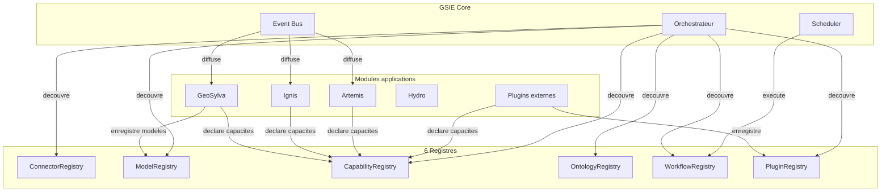
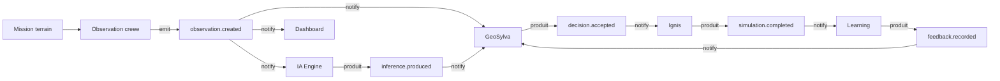
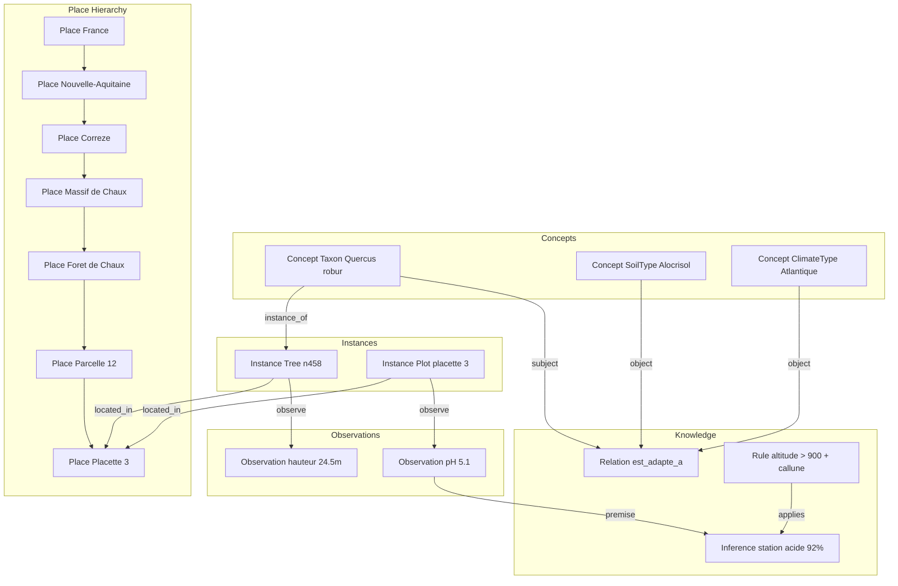
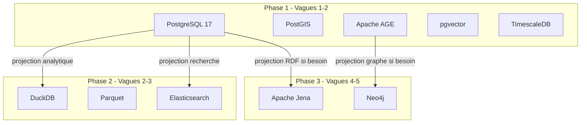
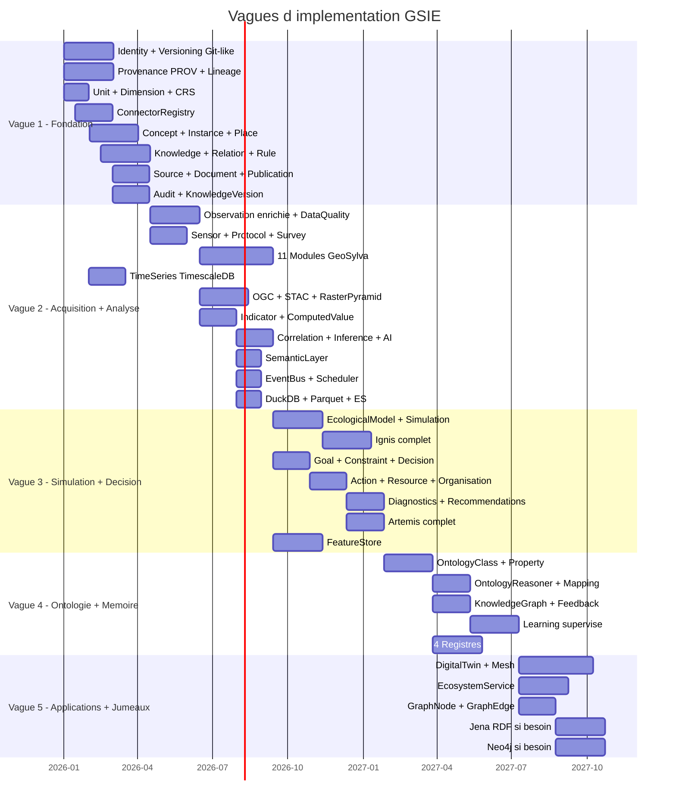

# Archive — ECOSYSTEM_METAMODEL.md — Métamodèle de l'Écosystème (livrable 213)

| Champ | Valeur |
|---|---|
| **Statut** | Proposition historique non adoptée |
| **Source originale** | `GSIE/ARCHITECTURE/ECOSYSTEM_METAMODEL.md` |
| **Date d'archivage** | 2026-07-15 |
| **Motif** | Brainstorming v5 supersédé par la convergence v6/v6.1 avant adoption |
| **Valeur normative** | Aucune |

> Le contenu ci-dessous est conservé intégralement pour retracer le
> cheminement intellectuel. Ses mentions « Validated », « acté » ou
> « décisions validées » décrivent une erreur de gouvernance historique
> et ne doivent pas être interprétées comme un état réel du projet.

---

# Métamodèle de l'Écosystème — LIVRABLE 213

| Champ | Valeur |
|---|---|
| **Identifiant** | GSIE-ARCH-213 |
| **Statut** | Draft |
| **Version** | 1.0.0 |
| **Date** | 2026-07-15 |
| **Auteur** | Camille Perraudeau (Fondateur) + Devin (Architecte) |
| **Décision de traçabilité** | DEC-000022 |
| **Documents liés** | SCIENTIFIC_DATA_MODEL.md (205), KNOWLEDGE_GRAPH_SPECIFICATION.md (304), ENCYCLOPEDIA_DATABASE_SCHEMA.md (309), FOREST_ONTOLOGY.md (303) |

---

## 1. Résumé

Ce document formalise le **métamodèle conceptuel de l'Encyclopédie de
l'Écosystème GSIE** — une plateforme de connaissances environnementales
à ~110 classes organisées en 8 couches + 6 registres transverses. Il
relate le cheminement complet de conception, de la version initiale (v1,
10 classes) à la version finale (v5, Environmental Knowledge Operating
System), et acte les 20+ décisions validées en session interactive par
le Fondateur. Ce métamodèle remplace à terme le livrable 205
(`SCIENTIFIC_DATA_MODEL.md`, Draft) et nécessite une RFC pour réviser le
livrable 304 (`KNOWLEDGE_GRAPH_SPECIFICATION.md`, Validated).

---

## 2. Contexte

### 2.1 Problème initial

Le dépôt contenait **deux métamodèles concurrents non réconciliés** :

- **Livrable 205** (`SCIENTIFIC_DATA_MODEL.md`, statut *Draft*) —
  métamodèle logique orienté entités-domaine (Station, Sol, Climat,
  Essence, Peuplement, GrowthModel, Observation, Evidence,
  KnowledgeItem, Diagnostic, Recommendation, SimulationScenario). Les
  valeurs scientifiques (pH, RUM, altitude) y sont des **attributs**
  d'entités, pas des observations distinctes.
- **Livrables 303/304/309** (`FOREST_ONTOLOGY.md`,
  `KNOWLEDGE_GRAPH_SPECIFICATION.md`, `ENCYCLOPEDIA_DATABASE_SCHEMA.md`,
  statuts *Validated*) — métamodèle encyclopédique orienté
  KnowledgeObject (6 types) + entités externes non versionnées, graphe
  Neo4j + PostgreSQL + Elasticsearch + Jena.

Le **code implémenté** (`knowledge_models.py` + migration `0001`) avait
pris une **troisième voie** non tracée par ADR : PostgreSQL + Apache
AGE comme vérité canonique, source en JSONB embarqué, UUID au lieu de
`GSIE-K-XXXXXXXXXX`.

### 2.2 Contradictions détectées

| # | Contradiction | 205 (Draft) | 304/309 (Validated) | Code |
|---|---|---|---|---|
| 1 | Entités versionnées ? | Oui (sources, evidence_level, version) | Non (référentielles) | Partiel |
| 2 | Graphe | — | Neo4j | Apache AGE |
| 3 | Source | SourceRef embarqué | Table sources + FK | JSONB |
| 4 | Identifiant | — | GSIE-K-XXXXXXXXXX | UUID v4 |
| 5 | Couches de stockage | — | 4 (Neo4j+PG+ES+Jena) | 1 (PG+AGE) |
| 6 | Nom table | connaissances_meta | connaissances_meta | knowledge_objects |

### 2.3 Invariants constitutionnels non négociables

Dérivés de la Constitution (CON-002, CON-004, CON-005, CON-010, S-1 à
S-7) :

| # | Invariant | Source |
|---|---|---|
| I1 | Aucune connaissance sans source identifiable | S-1, CON-002 |
| I2 | Toute connaissance porte son niveau de preuve (A-F) | S-2 |
| I3 | Les conflits sont conservés, jamais résolus arbitrairement | S-3 |
| I4 | Toute incertitude est explicite | S-5 |
| I5 | Toute connaissance est versionnée, historique immuable | CON-010, S-7 |
| I6 | Toute décision est explicable | CON-004 |
| I7 | L'IA assiste, ne décide jamais | CON-001 |
| I8 | Identité stable et citable | S-7, CON-010 |
| I9 | Tout objet versionné porte created_at, updated_at, created_by, validated_by, validation_level, review_status, deleted_at, version, checksum, uuid | CON-010, CON-005 |
| I10 | Toute Relation est traçable et sourcée | S-1, CON-005 |
| I11 | Concept vs Instance : un Concept est référentiel (non versionné), une Instance est un individu physique (versionné) | — |
| I12 | L'ontologie est explicite : le système connaît ses propres classes, propriétés, relations et contraintes | CON-007 |
| I13 | Identité découplée : toute entité a une Identity avec UUID + aliases externes + historique | S-7, CON-010 |
| I14 | Provenance W3C PROV : toute activité est tracée par Activity/Entity/Agent | CON-004, CON-005 |
| I15 | Niveaux d'observation : RawObservation → ValidatedObservation → ComputedObservation → Inference → Decision | S-2, CON-004 |
| I16 | Décision sous contraintes et objectifs : toute Recommendation respecte des Constraints et poursuit des Goals | CON-001 |

---

## 3. Cheminement de conception — v1 à v5

### 3.1 Version 1 — Métamodèle minimal (10 classes)

**Objectif.** Concevoir le métamodèle conceptuel minimal pour
représenter une mémoire scientifique explicable couvrant flore, faune,
sols, climat, hydrologie, pathologies, dynamiques, sylviculture et
incendie pour la France métropolitaine et la Corse.

**Classes.** Entity, Observation, Assertion, Event, Process,
DatasetAsset, Source, Agent, ModelRun, Scenario.

**Apports.**
- Séparation explicite de la chose observée (Entity), de l'acte de
  mesurer (Observation), de l'énoncé scientifique (Assertion), et de la
  provenance (Source/Agent).
- Introduction d'Event et Process (absents du modèle existant,
  nécessaires pour Ignis et la dynamique forestière).
- Distinction temps de validité vs temps d'enregistrement.

**Limites identifiées.** Relation comme simple arête binaire sans
contexte. Valeurs scientifiques encore en attributs d'Entity. Absence de
protocole, capteur, campagne, média, série temporelle.

### 3.2 Version 2 — Enrichissement Fondateur (25 classes, 6 familles)

**Apports du Fondateur (20 ajouts).**
1. **Relation** comme classe de premier niveau — relie absolument tout.
2. **Attribute** — propriétés typées d'Entity, évite la duplication.
3. **Unit** — vraie table d'unités (m, cm, ha, °C, mm, %).
4. **Protocol** — protocole scientifique (IFN, IBP, ONF, CNPF, Natura
   2000, GeoSylva, IGN, FCBA).
5. **Survey** — mission/campagne de terrain.
6. **Media** — photo, vidéo, audio, LiDAR, thermique, multispectral,
   drone, 360°.
7. **Sensor** — capteur producteur d'observation.
8. **Document** — livre, article, norme, RFC, thèse, mémoire, rapport.
9. **Taxonomy** — Taxon + Classification + Synonyme + Nom vernaculaire
   + Version taxonomique.
10. **Place** — hiérarchie de lieux navigable (France → ... → Arbre).
11. **AIModel** — Claude, GPT, Gemini, GeoSylva Vision, YOLO, SAM2.
12. **Simulation** découpée → ModelRun → Scenario → Results.
13. **ComputedValue** — volume, biomasse, IBP, Shannon, RUM, risque
    incendie.
14. **Incertitude** enrichie — erreur, méthode, précision GPS,
    confiance IA, confiance humaine, intervalle, variance.
15. **Knowledge** — vérité scientifique distincte de l'observation.
16. **Rule** — règle d'inférence exploitable par le Reasoning Engine.
17. **Inference** — produit du raisonnement (Observation + Rule →
    Inference).
18. **GraphNode/GraphEdge** — projection graphe (AGE/Neo4j).
19. **TimeSeries** — série temporelle distincte de l'observation isolée.
20. **Version** mixin — created_at, updated_at, created_by,
    validated_by, deleted_at, version, checksum, uuid.

**Familles.** A (monde réel), B (observation), C (connaissance), D
(événements/processus), E (acteurs/IA), F (provenance), G
(calculs/simulations), H (incertitude/version), I (graphe projection).

### 3.3 Version 3 — Séparation Concept/Instance + objets métier (45 classes, 9 familles)

**Apports du Fondateur (18 ajouts).**
1. **Séparation Concept / Instance** — distinction ontologique de
   premier niveau. Un `Taxon(chêne pédonculé)` n'est pas un
   `Tree(arbre n°458)`. Le premier est un concept référentiel (non
   versionné) ; le second est un individu physique (versionné).
2. **Objets métier GeoSylva** — Tree (dbh, height, volume, crown,
   health, martelage), Plot (radius, surface, gps, slope, aspect),
   Stand (age, composition, cover, origin, deadwood, regeneration,
   microhabitat, soil_profile, weather_snapshot).
3. **Observation enrichie** — quality, precision, confidence,
   validation_status, validator, method, sampling_depth, replicate.
4. **Relation enrichie** — subject, predicate, object, confidence,
   probability, source, weight, temporal_scope, spatial_scope,
   created_by, validated_by.
5. **AttributeDefinition / AttributeValue** — définition réutilisable
   + valeur typée.
6. **ControlledVocabulary** — Natura 2000, EUNIS, Corine, IBP, classes
   Kraft, etc.
7. **Dimension** — Longueur (cm, m, km), Surface (m², ha), Température.
8. **SpatialReference** — EPSG, Lambert 93, WGS84, UTM.
9. **Version scientifique** — validation_level, review_status,
   checksum.
10. **Document / Publication / Dataset** séparés.
11. **AIInference** — prompt, model_version, temperature, seed,
    runtime, confidence, tokens, cost.
12. **Simulation découpée** → Scenario → Run → Output → Indicator.
13. **Event sous-types** — FireEvent, StormEvent, HarvestEvent,
    PlantationEvent, ObservationEvent, DiseaseOutbreak, FloodEvent.
14. **Indicator** — IBP, Shannon, surface terrière, RUM, biomasse,
    indice sécheresse, stock carbone, naturalité.
15. **Knowledge comme graphe** — Knowledge → Relation → Evidence →
    Publication → Dataset → Observation.
16. **EcologicalProcess** — succession, régénération, compétition,
    prédation, pollinisation, dispersion, mycorhization,
    décomposition, cycle azote, cycle carbone, évapotranspiration.
17. **EcosystemService** — stockage carbone, protection érosion,
    filtration eau, habitat biodiversité, production bois, valeur
    paysagère, valeur récréative.
18. **Workflow** — Mission → Survey → WorkflowStep → Validation →
    Export.

**Brique stratégique.** Ontology explicite (OntologyClass,
OntologyProperty, OntologyConstraint, OntologyRule, OntologyMapping) —
le système se connaît lui-même.

### 3.4 Version 4 — Plateforme scientifique (75 classes, 7 couches)

**Apports du Fondateur (21 ajouts).**
1. **Identity** — UUID GSIE + Alias (TaxRef, GBIF, INPN, Wikidata,
   EUNIS, Natura2000, IGN, SANDRE, OSM, DOI) + History.
2. **Provenance W3C PROV** — Activity, Entity, Agent.
3. **Versioning Git-like** — Revision, Branch, Merge, Snapshot.
4. **Observations dérivées** — RawObservation → ValidatedObservation →
   ComputedObservation → Inference → Decision.
5. **Decision** — Recommendation → Decision → Action.
6. **Action** — Plantation, Martelage, Débardage, Coupe, Brûlage
   dirigé, Pose clôture, Création mare, Création îlot sénescence,
   Dépressage, Élagage.
7. **Goal** — Production, Carbone, Biodiversité, Accueil public,
   Protection incendie, Protection eau, Chasse.
8. **Constraint** — Budget, Temps, Machine, Pente, Loi, Réserve
   naturelle, Natura 2000.
9. **Resource** — Humain, Machine, Drone, Capteur, Camion, Budget.
10. **Organisation** — ONF, CNPF, IGN, FCBA, INRAE, OFB, Université.
11. **Place hiérarchie administrative** — Pays → Région → Département
    → Commune → Massif → Forêt → Parcelle → Placette → Arbre.
12. **SpatialLayer** — MNT, MNS, Cadastre, BDTopo, Sentinel,
    Orthophoto, LiDAR.
13. **RasterDataset** — Résolution, Projection, Bandes, NoData,
    Compression.
14. **Mesh** — LOD, Texture, Matériau, Version (pour Unreal).
15. **DigitalTwin** — jumeau numérique de Parcelle, Massif, Forêt,
    Département.
16. **EcologicalModel** — ForestGap, LANDIS-II, SORTIE, Fire
    Behaviour, RUSLE.
17. **Knowledge probabiliste** — Fact, Belief, Hypothesis, Correlation.
18. **OntologyRelation, OntologyInstance, OntologyReasoner**.
19. **Correlation** — Pearson, Spearman, Kendall, Mutual information,
    Random Forest importance, SHAP.
20. **KnowledgeGraph** — Facts, Relations, Evidence, Hypotheses,
    Rules, Inferences, Decisions, Actions, Feedback, Learning.
21. **11 modules GeoSylva spécialisés** — Mission, PlotInventory,
    TreeMeasurement, RegenerationSurvey, FloraSurvey, FaunaSurvey,
    SoilProfile, DeadwoodInventory, MicrohabitatSurvey,
    WeatherSnapshot, ForestOperation.

**Architecture en 7 couches.** Fondation → Connaissances → Acquisition
→ Analyse → Simulation → Décision → Applications.

### 3.5 Version 5 — Environmental Knowledge Operating System (110 classes, 8 couches + 6 registres)

**Apports du Fondateur (21 ajouts finaux).**

**Priorité très haute :**
1. **SemanticLayer** — SemanticType, SemanticRelation,
   SemanticConstraint. Unifie les vocabulaires externes (dbh, diameter,
   d130 → Diamètre normal → Longueur → cm).
2. **DataQuality** — Completeness, Accuracy, Consistency, Freshness,
   Precision, Validity. Score qualité par observation.
3. **Data Lineage** — PROV étendu avec version et checksum à chaque
   maillon.
4. **FeatureStore IA** — Feature, FeatureSet, TrainingDataset,
   ModelRegistry.
5. **Scheduler** — Job, Pipeline, Task, Dependency.
6. **CapabilityRegistry** — chaque module annonce ce qu'il sait faire.
7. **Plugin System** — ForestGPT, FireModel, DroneAnalysis,
   SpeciesRecognizer, CarbonEstimator.
8. **Event Bus** — Observation créée → événement → GeoSylva, Ignis, IA,
   Dashboard.
9. **AuditEntry** — Qui, Quand, Pourquoi, Ancienne valeur, Nouvelle
   valeur.
10. **KnowledgeVersion** — Deprecated, Superseded, Accepted, Rejected
    (cycle de vie scientifique).

**Géomatique :**
11. **OGC Catalog** — OGCService, Capabilities, Layer, Style,
    TileMatrix, FeatureType.
12. **STAC Catalog** — Catalog, Collection, Item, Asset.
13. **CRSRegistry** — EPSG, Lambert 93, Lambert II, WGS84, UTM.
14. **RasterPyramid** — Overview, Tile, Compression.
15. **SpatialIndex** — RTree, GiST, SP-GiST, BRIN.

**GeoSylva :**
16. **ForestInventory** — Mission → ForestInventory → PlotInventory →
    TreeMeasurement → Tree → Observation.
17. **Diagnostics** — StationDiagnostic, HealthDiagnostic,
    SilviculturalDiagnostic, EcologicalDiagnostic.
18. **Recommendations métier** — Martelage, Plantation, Protection,
    Gestion.

**Ignis :**
19. **FuelModel, FireBehavior, SpreadSimulation, FireFront,
    WaterPoint, Vehicle, Camera, Drone, Crew, Incident**.

**Artemis :**
20. **Animal, Track, CameraTrap, Territory, Population, Corridor**.

**Brique différenciante :**
21. **Registry Architecture** — 6 registres (Connector, Model,
    Capability, Ontology, Workflow, Plugin) où tout est découvrable.
    Les modules n'ont plus besoin de se connaître — ils annoncent leurs
    capacités et le GSIE orchestre automatiquement.

---

## 4. Architecture finale — 8 couches + 6 registres

```
┌─────────────────────────────────────────────────────────────┐
│  Registres transverses (découverte et orchestration)        │
│  Connector │ Model │ Capability │ Ontology │ Workflow │ Plugin│
├─────────────────────────────────────────────────────────────┤
│  8. Event Bus + Scheduler                                   │
├─────────────────────────────────────────────────────────────┤
│  7. Applications  │ GeoSylva, Ignis, Artemis, Hydro          │
├───────────────────┼─────────────────────────────────────────┤
│  6. Décision      │ Goals, Constraints, Recommendations,     │
│                   │ Decisions, Actions, Diagnostics          │
├───────────────────┼─────────────────────────────────────────┤
│  5. Simulation    │ EcologicalModels, Scenarios, Simulations,│
│                   │ FireBehavior, SpreadSimulation           │
├───────────────────┼─────────────────────────────────────────┤
│  4. Analyse       │ Indicators, ComputedValues, Correlations,│
│                   │ Inferences, AI, FeatureStore, Semantics  │
├───────────────────┼─────────────────────────────────────────┤
│  3. Acquisition   │ Missions, Surveys, Sensors, Media,       │
│                   │ Observations, TimeSeries, SpatialLayers, │
│                   │ OGC, STAC, RasterPyramids                │
├───────────────────┼─────────────────────────────────────────┤
│  2. Connaissances │ Concepts, Instances, Ontology,           │
│                   │ ControlledVocabulary, KnowledgeGraph,    │
│                   │ KnowledgeVersion, DataQuality            │
├───────────────────┼─────────────────────────────────────────┤
│  1. Fondation     │ Identity, Versioning, Provenance+Lineage,│
│                   │ Units, SpatialReference, CRS, Audit      │
└─────────────────────────────────────────────────────────────┘
```

---

## 5. Classes par couche — inventaire complet

### Couche 1 — Fondation

| Classe | Identifiant | Responsabilité |
|---|---|---|
| Identity | GSIE-UUID | Identité découplée avec aliases externes |
| Alias | — | Identifiant externe (GBIF, INPN, Wikidata, DOI...) |
| IdentityEvent | — | Fusion, scission, correction d'identité |
| Revision | — | Révision versionnée (Git-like) |
| Branch | — | Branche d'hypothèse |
| Merge | — | Fusion de branches |
| Snapshot | — | État complet à un instant |
| Activity | — | Activité PROV (observation, calcul, inférence) |
| ProvEntity | — | Artefact produit ou consommé |
| ProvAgent | — | Acteur PROV |
| LineageEdge | — | Lien de lineage avec version + checksum |
| AuditEntry | — | Audit : qui, quand, pourquoi, avant/après |
| Unit | GSIE-UNT-XXX | Unité de mesure (m, cm, ha, °C) |
| Dimension | — | Dimension physique (longueur, surface, température) |
| SpatialReference | — | Système de coordonnées |
| CRSRegistry | — | Registre des CRS (EPSG, Lambert 93, WGS84, UTM) |
| ConnectorRegistry | — | Orchestrateur de sources fédérées |
| SourceConnector | — | Connecteur WFS/WMS/STAC/REST |

### Couche 2 — Connaissances

| Classe | Identifiant | Responsabilité |
|---|---|---|
| Entity | GSIE-ENT-XXXXXXXX | Racine ontologique |
| Concept | hérite Entity | Type référentiel non versionné |
| Instance | hérite Entity | Individu physique versionné |
| Taxon | GSIE-TAX-XXXXXXXX | Concept taxonomique |
| TaxonNomenclature | GSIE-TXN-XXXXX | Noms vernaculaires, synonymes versionnés |
| Habitat | GSIE-HAB-XXXX | Concept d'habitat |
| SoilType | GSIE-PED-XXXX | Concept de type de sol |
| ClimateType | GSIE-CLI-XXXX | Concept de climat |
| Place | GSIE-PLC-XXXXXXXX | Hiérarchie de lieux navigable |
| AttributeDefinition | — | Définition d'attribut réutilisable |
| AttributeValue | — | Valeur d'attribut pour une Entity |
| ControlledVocabulary | — | Vocabulaire contrôlé (Natura 2000, EUNIS...) |
| ControlledTerm | — | Terme d'un vocabulaire contrôlé |
| Knowledge | GSIE-K-XXXXXXXXXX | Énoncé scientifique qualifié |
| Relation | GSIE-REL-XXXXXXXXXX | Relation n-aire de premier niveau |
| Rule | GSIE-RUL-XXXXXXXX | Règle d'inférence |
| Evidence | — | Évaluation A-F par Evidence Engine |
| KnowledgeVersion | — | Cycle de vie (draft → accepted → deprecated) |
| KnowledgeGraph | — | Mémoire scientifique (Facts, Feedback, Learning) |
| Feedback | — | Retour d'expérience sur une Decision |
| Learning | — | Mise à jour supervisée de Knowledge |
| OntologyClass | — | Classe ontologique (méta-couche) |
| OntologyProperty | — | Propriété autorisée |
| OntologyConstraint | — | Contrainte ontologique |
| OntologyRule | — | Règle ontologique |
| OntologyMapping | — | Mapping externe (GBIF, IGN, IFN) |
| OntologyRelation | — | Relation autorisée entre classes |
| OntologyInstance | — | Instance de méta-ontologie |
| OntologyReasoner | — | Moteur de raisonnement ontologique |
| DataQuality | — | Score qualité (completeness, accuracy...) |

### Couche 3 — Acquisition

| Classe | Identifiant | Responsabilité |
|---|---|---|
| Observation | GSIE-OBS-XXXXXXXXXX | Acte de mesurer enrichi |
| RawObservation | hérite Observation | Mesure brute non validée |
| ValidatedObservation | hérite Observation | Mesure validée |
| ComputedObservation | hérite Observation | Calcul dérivé |
| Sensor | GSIE-SNS-XXXXXX | Capteur producteur |
| Protocol | GSIE-PRT-XXXX | Protocole scientifique |
| Survey | GSIE-SVY-XXXXXX | Campagne de terrain |
| Mission | — | Mission GeoSylva |
| Media | GSIE-MED-XXXXXXXX | Média attaché (photo, LiDAR, drone...) |
| TimeSeries | GSIE-TS-XXXXXXXX | Série temporelle |
| SpatialLayer | — | Couche spatiale (MNT, Sentinel, cadastre) |
| RasterDataset | — | Dataset raster (résolution, bandes, compression) |
| RasterPyramid | — | Pyramide de tuiles raster |
| RasterTile | — | Tuile raster individuelle |
| Bande | — | Bande spectrale d'un raster |
| OGCService | — | Service OGC (WMS, WFS, WMTS) |
| OGCLayer | — | Couche OGC |
| STACCatalog | — | Catalogue STAC |
| STACCollection | — | Collection STAC |
| STACItem | — | Item STAC |
| STACAsset | — | Asset STAC |
| ForestInventory | — | Inventaire forestier (Mission → Plot → Tree) |
| PlotInventory | — | Inventaire complet d'une placette |
| TreeMeasurement | — | Mesures dendrométriques d'un arbre |
| RegenerationSurvey | — | Semis, gaulis, fourrés, pression gibier |
| FloraSurvey | — | Relevés floristiques et indices écologiques |
| FaunaSurvey | — | Observations directes et indirectes de la faune |
| SoilProfile | — | Horizons, analyses et propriétés pédologiques |
| SoilMeasurement | — | Mesures pédologiques (pH, CEC, texture, RUM) |
| DeadwoodInventory | — | Bois morts et microhabitats |
| MicrohabitatSurvey | — | IBP et éléments favorables à la biodiversité |
| WeatherSnapshot | — | Conditions météo lors du relevé |
| WeatherMeasurement | — | Mesures météo (température, humidité, vent) |
| ForestOperation | — | Martelage, éclaircies, plantations, coupes |
| Workflow | — | Workflow de campagne |
| WorkflowStep | — | Étape de workflow |

### Couche 4 — Analyse

| Classe | Identifiant | Responsabilité |
|---|---|---|
| Indicator | GSIE-IND-XXXXXXXX | Définition d'indicateur (IBP, Shannon...) |
| ComputedValue | GSIE-CMP-XXXXXXXXXX | Exécution d'un indicateur ou calcul |
| Correlation | — | Corrélation statistique (Pearson, SHAP...) |
| Inference | GSIE-INF-XXXXXXXXXX | Produit du raisonnement (Rule + Observation) |
| AIModel | GSIE-AIM-XXXXXX | Modèle d'IA (Claude, GPT, YOLO, SAM2) |
| AIInference | — | Exécution d'AIModel (prompt, temp, tokens, cost) |
| Feature | — | Variable calculée réutilisable |
| FeatureSet | — | Ensemble de features pour un modèle |
| TrainingDataset | — | Dataset d'entraînement versionné |
| ModelRegistry | — | Registre des modèles IA et écologiques |
| SemanticType | — | Type sémantique (Diamètre normal → Longueur) |
| SemanticRelation | — | Relation sémantique (EST_UN, EQUIVALENT_A) |
| SemanticConstraint | — | Contrainte sémantique (0 <= d <= 500 cm) |

### Couche 5 — Simulation

| Classe | Identifiant | Responsabilité |
|---|---|---|
| EcologicalModel | — | Modèle écologique (LANDIS-II, SORTIE, RUSLE) |
| Simulation | GSIE-SIM-XXXXXXXX | Conteneur de simulation |
| Scenario | GSIE-SCN-XXXXXXXX | Hypothèse de simulation (RCP 8.5...) |
| ModelRun | GSIE-RUN-XXXXXXXXXX | Exécution d'un modèle |
| Output | — | Sortie de ModelRun |
| FuelModel | — | Modèle de combustible (Ignis) |
| FireBehavior | — | Comportement du feu (ROS, intensité) |
| SpreadSimulation | — | Simulation de propagation |
| FireFront | — | Front de feu à un instant |
| WaterPoint | — | Point d'eau tactique |
| Incident | — | Incident incendie |
| DigitalTwin | — | Jumeau numérique (Parcelle, Massif) |
| Mesh | — | Maillage 3D pour Unreal (LOD, texture) |
| Texture | — | Texture 3D |

### Couche 6 — Décision

| Classe | Identifiant | Responsabilité |
|---|---|---|
| Goal | — | Objectif (production, carbone, biodiversité) |
| Constraint | — | Contrainte (budget, pente, loi, Natura 2000) |
| Recommendation | — | Recommandation sous Goal + Constraint |
| Decision | — | Décision humaine (CON-001) |
| Action | — | Action (plantation, martelage, coupe...) |
| Resource | — | Ressource (humain, machine, drone, budget) |
| Organisation | — | Organisation (ONF, CNPF, IGN, INRAE) |
| Event | GSIE-EVT-XXXXXXXX | Événement discret |
| FireEvent | hérite Event | Incendie |
| StormEvent | hérite Event | Tempête |
| HarvestEvent | hérite Event | Coupe |
| PlantationEvent | hérite Event | Plantation |
| DiseaseOutbreak | hérite Event | Épidémie |
| FloodEvent | hérite Event | Inondation |
| EcologicalProcess | GSIE-PRC-XXXXXXXX | Processus écologique continu |
| StationDiagnostic | — | Diagnostic de station |
| HealthDiagnostic | — | Diagnostic sanitaire |
| SilviculturalDiagnostic | — | Diagnostic sylvicole |
| EcologicalDiagnostic | — | Diagnostic écologique |
| Martelage | — | Recommandation de martelage |
| Plantation | — | Recommandation de plantation |
| Protection | — | Recommandation de protection |
| Animal | — | Instance animal (Artemis) |
| Track | — | Piste animal |
| CameraTrap | — | Piège photographique |
| Territory | — | Territoire animal |
| Population | — | Population estimée |
| Corridor | — | Corridor écologique |
| EcosystemService | — | Service écosystémique |

### Couche 7 — Applications

| Classe | Responsabilité |
|---|---|
| GeoSylva | Application forêt |
| Ignis | Application incendies |
| Artemis | Application faune |
| Hydro | Application eau (futur) |

### Couche 8 — Event Bus + Scheduler

| Classe | Responsabilité |
|---|---|
| EventBusMessage | Message d'événement (observation.created, etc.) |
| Job | Tâche planifiée (sync, compute, IA, download) |
| Pipeline | Chaîne de Jobs |
| Task | Exécution d'un Job dans un Pipeline |
| Dependency | Dépendance entre Tasks |

### Registres transverses

| Registre | Responsabilité |
|---|---|
| ConnectorRegistry | Découvre les sources de données (WFS, STAC, REST) |
| ModelRegistry | Découvre les modèles IA et écologiques |
| CapabilityRegistry | Découvre les fonctionnalités de chaque module |
| OntologyRegistry | Découvre les concepts et relations disponibles |
| WorkflowRegistry | Découvre les chaînes de traitement |
| PluginRegistry | Découvre les extensions installées |

---

## 6. Décisions validées en session interactive

Les 20+ décisions suivantes ont été validées par le Fondateur le
2026-07-15. Voir DEC-000022 pour la traçabilité complète.

| # | Décision | Choix |
|---|---|---|
| D1 | Architecture organisatrice | 7 couches (devenue 8 avec Event Bus) |
| D2 | Séparation ontologique | Concept (non versionné) / Instance (versionné) |
| D3 | Relation | Classe de 1er niveau enrichie (n-aire, contextualisée) |
| D4 | Provenance | W3C PROV (Activity/Entity/Agent) |
| D5 | Stockage canonique | PostgreSQL 17 + PostGIS + AGE + pgvector + TimescaleDB (phase 1). DuckDB + Parquet + ES (phase 2). Jena/Neo4j (phase 3 si nécessaire). PostgreSQL = seule source de vérité. |
| D6 | Source | FK vers table sources dédiée |
| D7 | Attributs | 3 niveaux : colonnes natives (fréquent) + AttributeDefinition/AttributeValue (rare) + JSONB metadata (variable). Tables dédiées par domaine. |
| D8 | Identifiant | UUID seul — réviser GSIE-DIR-0008 §2.2 |
| D9 | Versioning | Git-like complet dès vague 1 (Revision + Snapshot + Branch + Merge) |
| D10 | Learning | Auto-apprentissage partiel : E-F sans humain, A-D avec validation humaine |
| D11 | Ontology explicite | Concevoir maintenant, implémenter vague 4 |
| D12 | Vagues | 5 vagues fines incrémentales |
| D13 | Confidentialité | 3 niveaux + RLS PostgreSQL |
| D14 | Raster | Federated First + ConnectorRegistry. Copie locale seulement si nécessaire. |
| D15 | TimeSeries | TimescaleDB |
| D16 | Formalisation | RFC pour réviser 304 + nouveau livrable Draft |
| D17 | ConnectorRegistry | Couche Fondation |
| D18 | Modules GeoSylva | 11 modules en vague 2 |
| D19 | DigitalTwin + Mesh | Plus tard (quand Unreal en phase active) |
| D20 | DuckDB + Parquet | Vague 2 (analytique massif) |
| D21 | Registry Architecture | 6 registres transverses (couche différenciante) |
| D22 | Event Bus | LISTEN/NOTIFY en phase 1, Redis/NATS si besoin |
| D23 | FeatureStore | Vague 3 (quand premiers modèles IA en production) |
| D24 | SemanticLayer | Couche Analyse, vague 2 |
| D25 | DataQuality | Couche Connaissances, vague 2 |

---

## 7. Architecture de stockage — 3 phases

```
Phase 1 (vagues 1-2)
  PostgreSQL 17 + PostGIS + Apache AGE + pgvector + TimescaleDB
  └─ Vérité canonique unique

Phase 2 (vagues 2-3)
  + DuckDB + Parquet (analytique massif : 20M obs + 30 ans météo)
  + Elasticsearch (recherche full-text : articles, RFC, taxons)
  └─ Projections reconstructibles depuis PostgreSQL

Phase 3 (vagues 4-5)
  + Apache Jena (RDF/SPARQL pour LOD, si besoin)
  + Neo4j (si AGE devient limitant sur les graphes)
  └─ Projections futures, uniquement si nécessaire
```

**Principe.** PostgreSQL est la **seule** source de vérité. Tout le
reste est reconstruit automatiquement. Aucune double source de vérité.

---

## 8. Fédération de données — ConnectorRegistry

Le GSIE fonctionne selon une philosophie **Federated First** : si une
donnée existe via WFS/WMS/API, on la consomme directement. On ne copie
localement que si nécessaire (hors ligne, performance, historique,
reproductibilité).

Chaque connecteur déclare : protocoles supportés, SRID disponibles,
couches/collections exposées, fréquences de mise à jour, licences,
capacités de filtrage spatial/temporel, cache local.

Un module (GeoSylva, Ignis) exprime un besoin (« donne-moi la BD TOPO »)
sans connaître le protocole. Le GSIE sélectionne automatiquement la
meilleure source disponible (disponibilité, fraîcheur, performance,
licence).

---

## 9. 5 vagues d'implémentation

### Vague 1 — Fondation + cœur Connaissances (bloquante)

**Classes.** Identity, Alias, IdentityEvent, Revision, Branch, Merge,
Snapshot, Activity, ProvEntity, ProvAgent, LineageEdge, AuditEntry,
Unit, Dimension, SpatialReference, CRSRegistry, ConnectorRegistry,
SourceConnector, Entity, Concept, Instance, Taxon, TaxonNomenclature,
Place, AttributeDefinition, AttributeValue, ControlledVocabulary,
ControlledTerm, Knowledge, Relation, Rule, Evidence, Source, Document,
Publication, KnowledgeVersion, Version mixin.

**Stockage.** PostgreSQL 17 + PostGIS + Apache AGE + pgvector.

### Vague 2 — Acquisition + Analyse + Event Bus (importante)

**Classes.** Observation enrichie + DataQuality, RawObservation,
ValidatedObservation, ComputedObservation, Sensor, Protocol, Survey,
Mission, ForestInventory, Media, TimeSeries, SpatialLayer,
RasterDataset, RasterPyramid, OGC Catalog, STAC Catalog, 11 modules
GeoSylva, TreeMeasurement, SoilMeasurement, WeatherMeasurement,
Indicator, ComputedValue, Correlation, Inference, AIModel, AIInference,
SemanticLayer, EventBus, Scheduler (Job/Pipeline/Task).

**Stockage.** + TimescaleDB + DuckDB + Parquet + Elasticsearch.

### Vague 3 — Simulation + Décision + Modules métier (importante)

**Classes.** EcologicalModel, Simulation, Scenario, ModelRun, Output,
FuelModel, FireBehavior, SpreadSimulation, FireFront, WaterPoint,
Incident (Ignis), Goal, Constraint, Recommendation, Decision, Action,
Resource, Organisation, Event (+sous-types), EcologicalProcess,
StationDiagnostic, Martelage, Plantation, Protection (GeoSylva), Animal,
Track, CameraTrap, Territory, Population, Corridor (Artemis),
FeatureStore (Feature, FeatureSet, TrainingDataset, ModelRegistry).

### Vague 4 — Ontologie + Mémoire + Registres (stratégique)

**Classes.** OntologyClass, OntologyProperty, OntologyConstraint,
OntologyRule, OntologyMapping, OntologyRelation, OntologyInstance,
OntologyReasoner, KnowledgeGraph, Feedback, Learning,
CapabilityRegistry, OntologyRegistry, WorkflowRegistry, PluginRegistry.

**Règle d'auto-apprentissage.** L'IA peut modifier les Knowledge de
evidence_level E-F sans validation humaine. Les Knowledge A-D nécessitent
validation humaine explicite (CON-001).

### Vague 5 — Applications + Jumeaux + LOD (stratégique)

**Classes.** DigitalTwin, Mesh, Texture, EcosystemService,
GraphNode/GraphEdge (projection), Jena (RDF/SPARQL si LOD), Neo4j (si
AGE limitant).

---

## 10. Diagramme d'architecture — 8 couches + registres

```mermaid
graph TB
    subgraph Reg["Registres transverses"]
        direction LR
        CR["ConnectorRegistry"]
        MR["ModelRegistry"]
        Cap["CapabilityRegistry"]
        OR["OntologyRegistry"]
        WR["WorkflowRegistry"]
        PR["PluginRegistry"]
    end

    subgraph L8["8. Event Bus + Scheduler"]
        direction LR
        EB["EventBus"]
        Sched["Scheduler"]
    end

    subgraph L7["7. Applications"]
        direction LR
        GS["GeoSylva"]
        IG["Ignis"]
        AR["Artemis"]
        HY["Hydro"]
    end

    subgraph L6["6. Decision"]
        direction LR
        Goal["Goal"]
        Cstr["Constraint"]
        Recom["Recommendation"]
        Dec["Decision"]
        Act["Action"]
        Diag["Diagnostics"]
    end

    subgraph L5["5. Simulation"]
        direction LR
        EcoM["EcologicalModel"]
        Sim["Simulation"]
        Scen["Scenario"]
        Run["ModelRun"]
        Out["Output"]
        Fuel["FuelModel"]
        Fire["FireBehavior"]
    end

    subgraph L4["4. Analyse"]
        direction LR
        Ind["Indicator"]
        Comp["ComputedValue"]
        Corr["Correlation"]
        Inf["Inference"]
        AIM["AIModel"]
        FS["FeatureStore"]
        Sem["SemanticLayer"]
        DQ["DataQuality"]
    end

    subgraph L3["3. Acquisition"]
        direction LR
        Miss["Mission"]
        Surv["Survey"]
        Sens["Sensor"]
        Obs["Observation"]
        TS["TimeSeries"]
        SL["SpatialLayer"]
        OGC["OGC Catalog"]
        STAC["STAC Catalog"]
        FI["ForestInventory"]
    end

    subgraph L2["2. Connaissances"]
        direction LR
        Conc["Concept"]
        Inst["Instance"]
        Ont["Ontology"]
        Know["Knowledge"]
        Rel["Relation"]
        Rule["Rule"]
        Evid["Evidence"]
        KG["KnowledgeGraph"]
        FB["Feedback"]
        Learn["Learning"]
        KV["KnowledgeVersion"]
    end

    subgraph L1["1. Fondation"]
        direction LR
        Id["Identity"]
        Ver["Versioning Git-like"]
        Prov["Provenance + Lineage"]
        Unit["Unit + Dimension"]
        SR["SpatialRef + CRS"]
        Conn["Connector"]
        Audit["Audit"]
    end

    L7 --> L6
    L6 --> L5
    L5 --> L4
    L4 --> L3
    L3 --> L2
    L2 --> L1
    L8 -.-> L7
    L8 -.-> L4
    L8 -.-> L3
    Reg -.-> L7
    Reg -.-> L4
    Reg -.-> L2
    Reg -.-> L1
```



---

## 11. Diagramme — Registry Architecture (cœur de l'OS)



---

## 12. Diagramme — flux complet avec Event Bus



---

## 13. Diagramme — chaîne Concept/Instance/Observation/Relation



---

## 14. Diagramme — stockage 3 phases



---

## 15. Diagramme — 5 vagues (Gantt)



---

## 16. Incompatibilités à résoudre — priorisées par vague

| # | Incompatibilité | Vague | Action |
|---|---|---|---|
| 1 | Neo4j (304) vs AGE (code) | 1 | RFC pour réviser 304. Acter PG + AGE. |
| 2 | connaissances_meta (304) vs knowledge_objects (code) | 1 | Renommer + aligner |
| 3 | Source JSONB (code) vs FK (304) | 1 | Migrer vers FK |
| 4 | UUID v4 vs GSIE-K-XXXXXXXXXX | 1 | Réviser GSIE-DIR-0008 §2.2 |
| 5 | Entités versionnées (205) vs non (304) | 1 | Adopter Concept/Instance |
| 6 | 4 couches (304) vs 1 (code) | 1 | Acter PG seul, projections futures |
| 7 | Duplication essences_adaptees JSONB | 2 | Vue calculée depuis Relation |
| 8 | Absence Observation enrichie | 2 | Créer table Observation |
| 9 | Absence Relation 1er niveau | 1 | Élever Relation |
| 10 | Absence Concept/Instance | 1 | Introduire séparation |
| 11 | Absence PROV | 1 | Introduire Activity/Entity/Agent |
| 12 | Absence Identity + aliases | 1 | Introduire Identity |
| 13 | Absence Versioning Git-like | 1 | Introduire Revision/Snapshot/Branch/Merge |
| 14 | Absence couche Décision | 3 | Introduire Goal/Constraint/Decision/Action |
| 15 | Absence Feedback/Learning | 4 | Introduire avec supervision E-F |
| 16 | Absence Ontology explicite | 4 | Introduire OntologyClass/Property/... |
| 17 | Absence ConnectorRegistry | 1 | Introduire orchestrateur de sources |
| 18 | Absence DuckDB + Parquet | 2 | Ajouter pour analytique massif |
| 19 | Absence TimescaleDB | 2 | Ajouter pour TimeSeries |
| 20 | Absence modules GeoSylva | 2 | Créer 11 agrégats DDD |
| 21 | Absence Event Bus | 2 | LISTEN/NOTIFY |
| 22 | Absence SemanticLayer | 2 | Introduire SemanticType/Relation |
| 23 | Absence DataQuality | 2 | Introduire score qualité |
| 24 | Absence FeatureStore | 3 | Introduire Feature/FeatureSet/ModelRegistry |
| 25 | Absence Registry Architecture | 4 | Introduire 6 registres |

---

## 17. Garde-fous

Les 6 garde-fous validés par le Fondateur :

1. **5 vagues incrémentales** (pas tout d'un coup)
2. **PostgreSQL 17 comme seule source de vérité**, projections
   reconstructibles
3. **Attributs 3 niveaux** (colonnes natives + EAV + JSONB metadata)
4. **Ontology explicite en vague 4** (pas avant que le cœur soit stable)
5. **Auto-apprentissage partiel** (E-F sans humain, A-D avec humain)
6. **EventBus en LISTEN/NOTIFY en phase 1** (pas d'infra lourde avant
   le besoin)

---

## 18. Briques les plus stratégiques

1. **Registry Architecture** (6 registres) — l'identité de Quintessences.
   Un nouveau module s'enregistre, déclare ses Capability, et le GSIE
   l'orchestre automatiquement sans modifier le cœur.
2. **Relation** (1er niveau) — le GSIE vivra grâce à ces relations
   n-aires, contextualisées, temporelles, spatiales, sourcées.
3. **Event Bus** — supprime les dépendances directes entre modules,
   rend l'orchestration possible.
4. **Ontology explicite** (vague 4) — extensibilité sans modifier le
   cœur. Intégrer de nouveaux domaines (hydrologie, géologie) en
   enrichissant l'ontologie.
5. **KnowledgeGraph + Feedback + Learning** — le GSIE apprend de ses
   résultats, sous supervision humaine pour les faits établis.

---

## 19. Exemple complet — chaîne du diagnostic à l'apprentissage

```
1. Fondation
   Identity(Taxon douglas) : GSIE-UUID + aliases GBIF/INPN/TaxRef
   Provenance : Activity(inventaire 2024) par Agent(ONF) used Sensor(laser)

2. Connaissances
   Concept(Taxon douglas) + Concept(SoilType alocrisol)
   Relation(est_adapte_a, evidence B, source Rameau 2018)
   Rule(altitude > 900 + callune → station acide)

3. Acquisition
   Mission(GeoSylva 2024) → Survey(placette 3)
   RawObservation(altitude 950m) → ValidatedObservation (validée par chef)
   PlotInventory + TreeMeasurement (dbh, hauteur)

4. Analyse
   Inference(station acide, probabilité 92%, Rule appliquée)
   Correlation(douglas ↔ sol acide, Pearson 0.78, SHAP)
   ComputedValue(IBP = 14, Indicator IBP)

5. Simulation
   EcologicalModel(ONF-FFN douglas) + Scenario(RCP 8.5, éclaircie 25%)
   Simulation → ModelRun → Output(volume 320 m³/ha ±48 en 2050)

6. Décision
   Goal(production + carbone)
   Constraint(budget 5000€, pente < 30%, Natura 2000)
   Recommendation(éclaircie 25%, confiance 91%)
   Decision(acceptée par forestier Camille)
   Action(éclaircie mars 2026, mobilise Resource(équipe ONF))
   → produit Event(HarvestEvent éclaircie 2026)

7. Feedback + Learning
   Feedback(éclaircie 2026 → croissance observée +12% en 2028,
            évaluation positive)
   Learning(mise à jour : renforcement de la Rule éclaircie douglas,
            validation humaine requise car evidence A-D)
```

---

## 20. Sources et références

### Documents internes

- `GSIE/ARCHITECTURE/SCIENTIFIC_DATA_MODEL.md` (livrable 205, Draft) —
  métamodèle logique initial
- `GSIE/KNOWLEDGE/KNOWLEDGE_GRAPH_SPECIFICATION.md` (livrable 304,
  Validated) — spécification du graphe de connaissances
- `GSIE/ARCHITECTURE/ENCYCLOPEDIA_DATABASE_SCHEMA.md` (livrable 309,
  Validated) — schéma de base de données encyclopédique
- `GSIE/KNOWLEDGE/FOREST_ONTOLOGY.md` (livrable 303, Validated) —
  ontologie forestière
- `GSIE/API/src/gsie_api/infrastructure/knowledge_models.py` — modèles
  SQLAlchemy implémentés
- `GSIE/API/alembic/versions/0001_initial_knowledge_botanical_ecosystem.py`
  — migration Alembic initiale
- `03_DECISIONS/DEC-000022.md` — traçabilité des décisions validées

### Standards externes

- W3C PROV — Provenance standard
- OGC (WMS, WFS, WMTS, OGC API) — standards géospatiaux
- STAC (SpatioTemporal Asset Catalog) — catalogage de données
  spatio-temporelles
- GBIF, INPN, TaxRef — référentiels taxonomiques
- RPF (Référentiel Pédologique Français), WRB — référentiels pédologiques
- EUR28, EUNIS, Corine Biotopes — référentiels d'habitats
- Natura 2000 — réseau européen de sites naturels

### Constitution

- `00_CONSTITUTION/GSIE-CON-000.md` (Locked) — primauté constitutionnelle
- `00_CONSTITUTION/GSIE-CON-001.md` — le forestier reste le décideur
- `00_CONSTITUTION/GSIE-CON-004.md` — toute décision doit être
  explicable
- `00_CONSTITUTION/GSIE-CON-005.md` — toute connaissance doit être
  traçable
- `00_CONSTITUTION/GSIE-CON-010.md` — versionnement des connaissances
- Articles scientifiques S-1 à S-7 — sourcing, evidence, conflits,
  incertitude, versionnement

---

## 21. Historique des modifications

| Date | Version | Description |
|---|---|---|
| 2026-07-15 | 1.0.0 | Création du livrable. Métamodèle v5 final — Environmental Knowledge Operating System. 110 classes, 8 couches + 6 registres. 20+ décisions validées en session interactive par le Fondateur. Traçabilité DEC-000022. |
