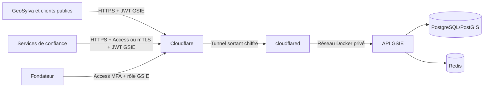

# Cloudflare Zero Trust — déploiement de la bordure GSIE

> Runbook d'exploitation de DEC-000047. Les valeurs réelles de domaine,
> compte, tunnel et secrets ne sont jamais commitées.

## 1. Architecture cible



Cloudflare réduit l'exposition réseau. Il ne remplace jamais
l'authentification, les rôles, la révocation ou la traçabilité GSIE.

## 2. Création dans Cloudflare

1. Ajouter le domaine Quintessences et activer DNSSEC.
2. Créer un tunnel géré à distance nommé `gsie-production`.
3. Créer le nom public de l'API et le faire pointer vers
   `http://api:8000` dans le réseau Compose.
4. Conserver le token affiché une seule fois dans le gestionnaire de secrets.
5. Écrire uniquement ce token dans
   `GSIE/API/secrets/cloudflare_tunnel_token` sur le serveur, permissions
   lecture propriétaire uniquement.
6. Définir `GSIE_EDGE_PROXY_MODE=cloudflare_tunnel` dans `.env`.

Le token permet d'exécuter le tunnel : sa possession doit être traitée comme
un secret de production. Il doit être révoqué et remplacé après toute fuite ou
rotation d'opérateur.

## 3. Démarrage

```bash
docker compose config --quiet
docker compose up -d api outbox-worker
docker compose --profile edge up -d cloudflared
docker compose ps
```

Le service utilise l'image officielle `cloudflared` verrouillée par version
et digest. Son endpoint de métriques reste interne au conteneur et son
healthcheck appelle `cloudflared tunnel ready`.

## 4. Règles Cloudflare

### API publique

- activer les règles WAF gérées adaptées aux API ;
- ne jamais mettre en cache `/api/*`, `/health`, `/ready` ni les réponses
  portant `Cache-Control: no-store` ;
- autoriser WebSocket pour les routes GSIE temps réel ;
- limiter plus fortement `/auth/register`, `/auth/login/*`, les demandes de
  code et les confirmations ;
- conserver les limites SlowAPI côté GSIE : la bordure et l'origine doivent
  toutes deux résister à l'abus ;
- ne pas protéger le nom public mobile par une page Cloudflare Access, qui
  casserait les applications natives.

### Plan de contrôle

Créer un nom distinct, par exemple `control.<domaine>`, puis exiger :

1. Cloudflare Access avec MFA ;
2. politique d'utilisateur et, si disponible, état de l'appareil ;
3. rôle `admin` ou `founder` signé par GSIE sur chaque commande ;
4. journal d'audit immuable côté GSIE.

Le geste local des huit pressions dans GeoSylva ne satisfait aucune de ces
conditions et n'accorde donc aucune commande.

### Machine à machine

Un backend de confiance utilise un service token Access par service, stocké
dans son gestionnaire de secrets, avec durée et rotation bornées. Pour un
périmètre plus strict, utiliser mTLS sur un nom dédié. Dans les deux cas, GSIE
exige aussi une identité de charge et les rôles métier appropriés : Cloudflare
prouve le droit d'atteindre l'API, pas le droit d'exécuter une action métier.

## 5. Contrôles après activation

```bash
curl --fail https://api.<domaine>/health
curl --fail https://api.<domaine>/ready
docker compose --profile edge ps
docker compose logs --tail=100 cloudflared
```

- une tentative sur l'adresse publique du serveur ne doit atteindre aucun
  port de l'API ;
- PostgreSQL, Redis, Mailpit et Uptime Kuma ne doivent pas avoir de règle de
  tunnel publique ;
- `CF-Connecting-IP` doit produire des quotas distincts pour deux clients ;
- les journaux ne doivent contenir ni token de tunnel, ni service token, ni
  jeton GSIE.

## 6. Rotation et incident

1. Créer ou obtenir le nouveau token de tunnel.
2. Remplacer atomiquement le fichier secret sur le serveur.
3. Recréer `cloudflared` et vérifier son état sain.
4. Révoquer l'ancien token dans Cloudflare.
5. Tracer l'incident ou la rotation dans le journal d'exploitation.

Les service tokens Access sont uniques par consommateur. Une compromission
ne doit jamais forcer la rotation de tous les services.

## 7. Rollback

```bash
docker compose --profile edge stop cloudflared
```

Le retour temporaire à un reverse proxy classique exige un certificat TLS,
un filtrage réseau autorisant seulement la bordure retenue et une décision
d'exploitation. Aucun port de base de données ou de cache ne peut être ouvert.

## 8. Prérequis extérieurs restant à renseigner

| Élément | État du dépôt | Action externe |
|---|---|---|
| Domaine et zone Cloudflare | Runbook prêt | Ajouter le domaine au compte Cloudflare |
| Tunnel | Service Docker prêt | Créer le tunnel et déposer son token secret |
| OAuth Google | Code prêt, valeur absente | Créer les client IDs et valider la marque |
| Courrier transactionnel | SMTP/TLS prêt | Choisir le relais et déposer ses secrets |
| Téléphone réel | APK prêt | Installer et exécuter la recette sur le S25 Ultra |

Ces valeurs ne peuvent pas être générées par le dépôt : elles relèvent des
comptes fournisseurs et du matériel du Fondateur.
