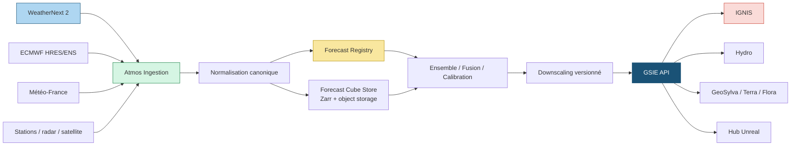

# Atmos — Architecture WeatherNext et fournisseurs météorologiques

| Champ | Valeur |
|---|---|
| **Statut** | Proposition d'architecture — Draft |
| **Périmètre** | Atmos, GSIE Server, IGNIS, Hydro, GeoSylva, Terra, EO |
| **Sources principales** | WeatherNext v0.3.0, Google WeatherNext Guide, ECMWF, WeatherBench2 |
| **Principe** | WeatherNext est un provider interchangeable, jamais la vérité canonique unique |

## 1. Décision d'architecture proposée

Atmos est une couche d'abstraction scientifique entre les fournisseurs de
prévisions et les moteurs Quintessences.

```text
WeatherNext 2 ───────┐
ECMWF HRES/ENS ──────┤
Météo-France ────────┤
Stations locales ────┤
Radar / satellite ───┘
          ↓
   Atmos Ingestion
          ↓
   Atmos Normalization
          ↓
   Forecast Registry + Provenance
          ↓
   Ensemble / Fusion / Calibration
          ↓
   Downscaling explicitement versionné
          ↓
   Atmos Forecast Cube
          ↓
   GSIE API / Events
          ↓
 IGNIS · Hydro · GeoSylva · Terra · Flora · Hub
```

## 2. Composants

### Diagramme de flux



### 2.1 AtmosProvider

Interface conceptuelle :

```python
class AtmosProvider(Protocol):
    provider_id: str
    model_id: str
    model_version: str

    async def list_runs(self, query: ForecastQuery) -> list[ForecastRun]: ...
    async def fetch(self, run: ForecastRun, query: ForecastQuery) -> ForecastCube: ...
```

Providers initiaux :

```text
WeatherNextProvider       flux GCS Zarr / BigQuery / Earth Engine
ECMWFProvider             HRES/ENS ou produit autorisé
MeteoFranceProvider       données opérationnelles selon contrat
ObservationProvider       stations et mesures terrain
RadarProvider             précipitations/radar selon droits
SatelliteProvider         observations EO atmosphériques
LocalSensorProvider       capteurs propriétaires/terrain
```

Le provider ne doit pas exposer les structures internes JAX/Haiku à l'API GSIE.
Il produit un contrat canonique `ForecastCube` avec une provenance complète.

### 2.2 Forecast Registry

Le registre conserve :

- provider et modèle ;
- version et commit ;
- run initialisation ;
- échéances et horizon ;
- variables et unités ;
- grille, CRS et résolution ;
- dataset source ;
- licence et droit de redistribution ;
- checksum du fichier ou de l'objet ;
- transformations appliquées ;
- niveau de preuve et statut de validation.

### 2.3 Forecast Cube Store

Recommandation :

```text
PostgreSQL/PostGIS  → métadonnées, index spatial, runs, provenance
Object storage       → Zarr chunké, artefacts et manifests
DuckDB/xarray        → exploration et agrégation bornée
```

Le cube complet ne doit pas être stocké dans PostgreSQL. PostgreSQL reste la
vérité canonique des métadonnées et des relations ; Zarr est une projection de
données multidimensionnelles reconstruisible.

## 3. Contrat `ForecastCube`

Forme logique :

```text
(time, ensemble, level, latitude, longitude, variable)
```

Les dimensions facultatives sont explicites :

```text
(time, member, level, y, x, variable)
(time, member, node, variable)
```

Métadonnées obligatoires :

```yaml
forecast_id:
provider_id:
model_id:
model_version:
run_initialization:
valid_time_start:
valid_time_end:
spatial_crs:
spatial_resolution:
temporal_resolution:
variables:
units:
ensemble_members:
input_dataset:
transformations:
uncertainty_representation:
license_ref:
checksum:
evidence_level:
```

Atmos ne doit pas appeler un champ `resolution` sans distinguer :

```text
native_grid_resolution
regridded_resolution
visualization_resolution
validated_predictive_scale
```

## 4. Flux d'ingestion

```text
Provider API / GCS / BigQuery / Earth Engine
                  ↓
        manifest de run immuable
                  ↓
          validation schéma/unité
                  ↓
        contrôle temporel et spatial
                  ↓
           checksum + provenance
                  ↓
              Zarr RAW
                  ↓
       normalisation canonique SILVER
                  ↓
     cube Atmos sélectionné et indexé
```

Une réponse HTTP réussie avec une variable absente est un échec de contrat,
pas une occasion de remplacer la variable par zéro ou `None` silencieusement.

## 5. Stockage Zarr

### Recommandation initiale

- Zarr v2 ou v3 selon compatibilité du provider ; ne pas convertir sans
  benchmark ;
- chunks d'abord par temps et tuile spatiale ;
- dimension ensemble conservée ;
- compression testée sur les variables et types réels ;
- manifest JSON avec checksum par objet ou groupe ;
- version de schéma Atmos séparée de la version du modèle.

### Chunking proposé pour le POC

```text
(time=1..4, member=1..8, level=1..13, latitude=32..64, longitude=32..64)
```

Ce choix est une hypothèse de benchmark, pas une constante. Il doit être
mesuré sur les requêtes réellement visées par IGNIS, Hydro et GeoSylva.

## 6. API GSIE

### Requête ponctuelle

```text
GET /api/v1/atmos/forecast
  ?location=...
  &variables=wind_u_10m,wind_v_10m,temperature_2m,precipitation_6h
  &valid_from=...
  &valid_to=...
  &ensemble=true
```

### Requête cube

```text
POST /api/v1/atmos/forecast-cube
```

Payload conceptuel :

```json
{
  "bbox": [xmin, ymin, xmax, ymax],
  "crs": "EPSG:4326",
  "valid_from": "2026-08-18T00:00:00Z",
  "valid_to": "2026-08-19T00:00:00Z",
  "variables": ["wind_u_10m", "wind_v_10m", "temperature_2m"],
  "ensemble": true,
  "max_members": 32,
  "output_format": "zarr_reference"
}
```

L'API retourne un manifeste signé ou un pointeur contrôlé, pas un cube non
borné en mémoire.

## 7. Fusion et calibration

Atmos doit différencier :

1. **sélection** d'un fournisseur ;
2. **fusion** de plusieurs fournisseurs ;
3. **correction de biais** ;
4. **assimilation** d'observations ;
5. **downscaling** ;
6. **visualisation**.

Chaque opération crée une nouvelle version de produit et cite son entrée.
Une correction de biais n'est pas présentée comme une nouvelle observation.

## 8. Downscaling

```text
WeatherNext global 0,25°
          ↓
regrillage conservatif contrôlé
          ↓
MNT/MNS + occupation du sol + rugosité
          ↓
observations stations/radar/satellite
          ↓
correction de biais
          ↓
modèle régional ou micro-échelle
          ↓
Atmos local avec domaine de validité explicite
```

Options à comparer :

- correction statistique quantile/analogues ;
- dynamical downscaling via WRF ou modèle régional autorisé ;
- ML downscaling ;
- neural operators ;
- WindNinja ou solveur physique pour le vent local ;
- modèle hybride physique + ML.

Aucune option ne doit être adoptée sans validation française par région,
saison, variable et extrême.

## 9. Consommateurs

### IGNIS

Consomme : vent, température, humidité, précipitation, stabilité et variables
dérivées avec membres d'ensemble. Atmos ne produit pas directement une
propagation de feu.

### Hydro

Consomme : précipitation probabiliste, température, évapotranspiration,
humidité et forcings temporels. Hydro conserve ses propres états et incertitudes.

### GeoSylva

Consomme uniquement les variables utiles au stress hydrique, à l'accessibilité,
à la phénologie, au risque sanitaire et aux conditions d'intervention. Il ne
faut pas transférer tout le cube atmosphérique au mobile.

### Terra

Consomme des variables météo comme forcings, jamais comme mesure directe du sol.

### Hub Unreal

Le Hub reçoit des produits GSIE versionnés et visualise l'incertitude ; il ne
recalcule pas Atmos.

## 10. Sécurité, coûts et observabilité

- secrets et clés fournisseurs uniquement côté serveur ;
- limites de taille et de bbox ;
- cache par `forecast_id` et requête canonique ;
- quotas par compte ;
- logs de latence, volume, provider, version et coût ;
- aucun contenu brut sensible dans les logs ;
- suppression d'un provider sans casser les moteurs consommateurs ;
- contrôle des licences avant mise à disposition d'un produit dérivé.

## 11. Choix court terme

1. **ADOPT** l'abstraction `AtmosProvider` et le registre de provenance ;
2. **ADOPT** WeatherNext 2 comme flux à évaluer ;
3. **NE PAS ADOPTER** l'auto-hébergement WN2 dans le VPS ;
4. comparer WeatherNext 2, ECMWF et Météo-France sur un sous-ensemble régional ;
5. stocker seulement un cube POC borné ;
6. ajouter IGNIS et Hydro après validation du contrat Atmos.
