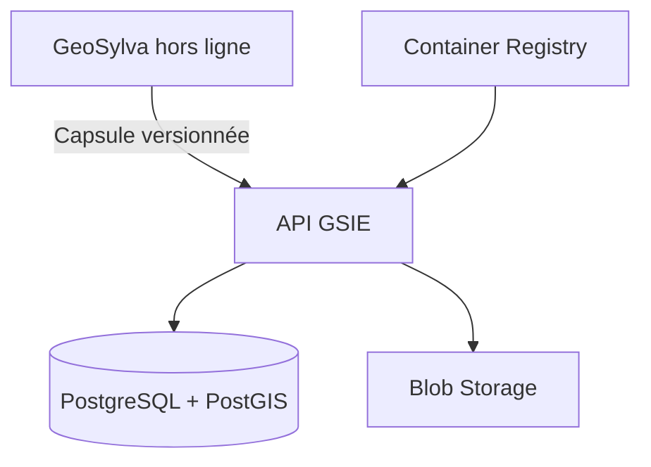

# Stratégie technique — POC Azure frugal

| Champ | Valeur |
|---|---|
| **Statut** | Proposition technique — non déployée |
| **Date** | 2026-07-22 |
| **Référence** | RFC-0014 |

## Résultat recherché

Mettre en ligne une seule verticale démontrable : un chantier créé hors ligne
dans GeoSylva est synchronisé de manière fiable vers GSIE, consultable par une
API et restaurable après incident. Cette verticale doit rester peu coûteuse et
ne pas rendre GeoSylva dépendant du réseau.

## Topologie minimale

| Composant | Développement | POC Azure | Condition d'ajout |
|---|---|---|---|
| API GSIE | Conteneur local | Container Apps Consumption | Tests locaux verts |
| PostgreSQL/PostGIS | Conteneur local | Flexible Server | Premier contrat de sync stable |
| Artefacts | Système de fichiers | Blob Storage | Cycle de vie défini |
| Secrets | Variables locales exclues de Git | Managed Identity / Key Vault | Premier secret distant |
| Observabilité | Logs structurés | Azure Monitor limité | Budget de logs fixé |

## Ce qui n'est pas dans le POC

- entraînement de LLM ou GPU permanent ;
- Kubernetes, service mesh ou multi-région ;
- Redis managé sans mesure de latence ;
- lac de données national ;
- ingestion exhaustive du LiDAR HD ;
- exposition publique de données terrain réelles ;
- haute disponibilité coûteuse avant pilotes réels.

## Backlog exécutable

### P0 — Avant Azure

- [ ] Valider RFC-0014 et fixer un plafond mensuel.
- [ ] Stabiliser les tests et le contrat de l'API GSIE.
- [ ] Définir le schéma de capsule GeoSylva → GSIE et sa version.
- [ ] Tester idempotence, doublons, reprise après coupure et conflits.
- [ ] Automatiser sauvegarde et restauration PostgreSQL en local.
- [ ] Préparer des données synthétiques représentatives.

### P1 — Infrastructure as code

- [ ] Créer un module Bicep ou OpenTofu pour le groupe de ressources.
- [ ] Déclarer Container Registry, Container Apps et leurs limites.
- [ ] Ajouter identités managées, étiquettes et dates d'expiration.
- [ ] Déclarer les alertes de coût et documenter qu'elles ne sont pas des
  coupe-circuits.
- [ ] Ajouter une commande de destruction du POC avec confirmation explicite.
- [ ] Vérifier `what-if/plan` dans la CI sans déployer automatiquement.

### P2 — Démonstration distante

- [ ] Déployer l'API avec `minReplicas=0` et un maximum explicite.
- [ ] Mesurer démarrage à froid, latence, erreurs et coût sur sept jours.
- [ ] Ajouter PostgreSQL/PostGIS seulement après le test API stateless.
- [ ] Tester une restauration complète dans un environnement vierge.
- [ ] Synchroniser un chantier synthétique depuis GeoSylva.
- [ ] Documenter l'incident réseau et la reprise sans doublon.

### P3 — Pilote professionnel

- [ ] Réaliser une revue sécurité et RGPD.
- [ ] Obtenir le consentement et un accord pilote écrit.
- [ ] Limiter le pilote à quelques utilisateurs et un territoire borné.
- [ ] Instrumenter les retours sans collecter plus de données que nécessaire.
- [ ] Décider : poursuivre, corriger ou supprimer l'environnement.

## Indicateurs de décision

| Indicateur | Seuil de validation initial |
|---|---|
| Synchronisation sans doublon | 100 % sur le jeu de test |
| Reprise après coupure | Aucun chantier perdu |
| Restauration | Procédure automatisée et vérifiée |
| Fonctionnement offline | Aucune fonction terrain critique bloquée |
| Coût | Inférieur au plafond fixé avant déploiement |
| Services managés | Chacun justifié par une mesure ou un risque |

Les valeurs de latence et de coût ne sont pas inventées dans ce document :
elles seront fixées après benchmark sur le matériel et la charge réels.

## Règle d'arrêt

Le POC est suspendu si le budget dépasse le plafond, si la sauvegarde n'est
pas restaurable, si la synchronisation produit des doublons ou si le travail
cloud retarde la bêta GeoSylva. L'environnement est alors exporté et supprimé
jusqu'à correction.
