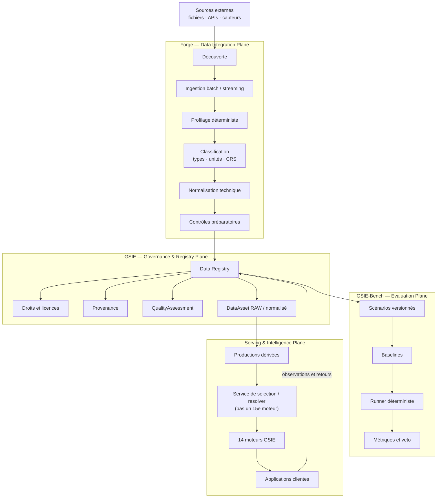

# GSIE — Durabilité évolutive et intégration des modèles IA v1.2.0

| Champ | Valeur |
|---|---|
| **Identifiant** | GSIE-ARCH-EVOLUTION-001 |
| **Statut** | Draft |
| **Version** | 1.2.0 |
| **Date** | 2026-08-12 |
| **Auteur** | Camille Perraudeau (Fondateur) |
| **Relecture** | Codex — intégrité architecture, données locales et état implémenté |
| **Phase** | Phase 4 — Implémentation |
| **Portée** | GSIE, API, Data Registry, 14 moteurs, modèles IA spécialisés |

## 1. Résumé

GSIE doit pouvoir évoluer pendant plusieurs décennies sans perdre la
traçabilité de ses données, de ses calculs, de ses modèles ni de ses décisions.
Ce document définit les règles de développement pour les évolutions difficiles
à inverser et prépare l'intégration de modèles IA spécialisés après la bêta
fonctionnelle.

Le principe directeur est : **versionner, comparer, valider, puis promouvoir —
ne jamais écraser silencieusement**.

## Table des matières

1. [Résumé](#1-résumé)
2. [Relation avec les documents existants](#2-relation-avec-les-documents-existants)
   - 2.1 [Convention de lecture et état de preuve](#21-convention-de-lecture-et-état-de-preuve)
3. [Objectif d'architecture](#3-objectif-darchitecture)
   - 3.1 [Boucle bidirectionnelle avec les applications](#31-boucle-bidirectionnelle-avec-les-applications)
   - 3.2 [Les quatre plans de la plateforme](#32-les-quatre-plans-de-la-plateforme)
   - 3.3 [Contrat Forge → GSIE](#33-contrat-forge--gsie)
   - 3.4 [Cycle de vie des données](#34-cycle-de-vie-des-données)
   - 3.5 [Cycle de vie des données terrain](#35-cycle-de-vie-des-données-terrain)
   - 3.6 [Bounded context Benchmark](#36-bounded-context-benchmark-dans-lapplication-dataset)
   - 3.7 [Porte des ressources locales](#37-porte-des-ressources-locales)
4. [Règles non négociables](#4-règles-non-négociables)
5. [Évolution du métamodèle et du schéma SQL](#5-évolution-du-métamodèle-et-du-schéma-sql)
6. [Versionnement scientifique et données dérivées](#6-versionnement-scientifique-et-données-dérivées)
7. [Fraîcheur, santé et licences](#7-fraîcheur-santé-et-licences)
   - 7.1 [Distinction des propriétés](#71-distinction-des-propriétés)
   - 7.2 [DatasetHealth](#72-datasethealth)
   - 7.3 [QualityAssessment](#73-qualityassessment)
   - 7.4 [DataRightsStatement](#74-datarightsstatement)
   - 7.5 [Gestion de la fraîcheur](#75-gestion-de-la-fraîcheur)
8. [Performance et capacité](#8-performance-et-capacité)
   - 8.1 [Mesure et qualification](#81-mesure-et-qualification)
   - 8.2 [Preuve actuelle](#82-preuve-actuelle)
   - 8.3 [Gestion de la charge](#83-gestion-de-la-charge)
   - 8.4 [Profilage et optimisation](#84-profilage-et-optimisation)
9. [Benchmark propriétaire GSIE](#9-benchmark-propriétaire-gsie)
10. [Qualité de développement](#10-qualité-de-développement)
    - 10.1 [Exigences par tranche](#101-exigences-par-tranche)
    - 10.2 [Protocole d'implémentation des agents](#102-protocole-dimplémentation-des-agents)
    - 10.3 [Tests et couverture](#103-tests-et-couverture)
    - 10.4 [Lint, typage et formatage](#104-lint-typage-et-formatage)
    - 10.5 [Observabilité et readiness](#105-observabilité-et-readiness-opérationnelle)
    - 10.6 [Sécurité et isolation](#106-sécurité-confidentialité-et-isolation)
    - 10.7 [Intégration continue](#107-intégration-continue)
11. [Porte d'entrée des modèles IA spécialisés](#11-porte-dentrée-des-modèles-ia-spécialisés)
    - 11.1 [Oui, après la bêta fonctionnelle](#111-oui-après-la-bêta-fonctionnelle)
    - 11.2 [Frontière d'intégration](#112-frontière-dintégration)
    - 11.3 [Registre des modèles](#113-registre-des-modèles---cible-non-implémentée)
    - 11.4 [Cycle de validation IA](#114-cycle-de-validation-ia)
    - 11.5 [IA et moteurs GSIE](#115-ia-et-moteurs-gsie)
    - 11.6 [Shadow mode, validation humaine et rollback](#116-shadow-mode-validation-humaine-et-rollback)
    - 11.7 [Contraintes matérielles et modèles locaux](#117-contraintes-matérielles-et-modèles-locaux)
    - 11.8 [APIs externes et confidentialité](#118-apis-externes-et-confidentialité)
12. [Checklist obligatoire avant une évolution difficile](#12-checklist-obligatoire-avant-une-évolution-difficile)
13. [Anti-patterns et raccourcis interdits](#13-anti-patterns-et-raccourcis-interdits)
14. [Définition de fini et critères d'acceptation](#14-définition-de-fini-et-critères-dacceptation)
15. [Sources et références](#15-sources-et-références)
16. [Historique des modifications](#16-historique-des-modifications)

## 2. Relation avec les documents existants

Ce document ne remplace pas les contrats spécialisés. Il les relie :

- `GSIE/ARCHITECTURE/ARCHITECTURE_PRINCIPLES.md` — principes généraux ;
- `GSIE/ARCHITECTURE/ENGINE_INTERFACE_CONTRACTS.md` — interfaces des moteurs ;
- `GSIE/ARCHITECTURE/GSIE_MASTER_ARCHITECTURE.md` — architecture fédératrice ;
- `GSIE/ARCHITECTURE/ECOSYSTEM_METAMODEL.md` — métamodèle de référence ;
- `GSIE/ARCHITECTURE/ENGINE_DATA_SOCLE.md` — contrats de données historiques
  des moteurs, supersédés par le métamodèle v6.2 ;
- `02_RFC/RFC-0012-migration-api-v6.2.md` — migration API et métamodèle ;
- `02_RFC/RFC-0038-data-registry-gsie.md` — Data Registry ;
- `03_DECISIONS/DEC-000060.md` — QualityAssessment et porte FETCH ;
- `03_DECISIONS/DEC-000061.md` — micro-extrait SoilGrids unique ;
- `03_DECISIONS/DEC-000062.md` — redéploiement et test grandeur nature.
- `03_DECISIONS/DEC-000064.md` — haute disponibilité locale et drainage ;
- `03_DECISIONS/DEC-000065.md` — preuve CI Linux/TLS ;
- `02_RFC/RFC-0039-gsie-bench-v0-1.md` et `03_DECISIONS/DEC-000067.md`
  — contrat et adoption de GSIE-Bench.

En cas de conflit, la Constitution, les directives, les RFC et les décisions
applicables priment sur ce guide.

### 2.1 Convention de lecture et état de preuve

Ce guide mélangeait auparavant exigences, état courant et architecture future.
Les termes suivants doivent désormais être lus explicitement :

| Marqueur | Signification | Peut être présenté comme disponible ? |
|---|---|---|
| **Implémenté** | présent dans le code ou l'infrastructure et vérifié | oui, dans le périmètre de sa preuve |
| **Partiel** | tranche minimale présente, contrat incomplet | seulement avec ses limites |
| **Cible** | architecture souhaitée non encore livrée | non |
| **Hypothèse** | choix à instruire ou comparer | non |
| **Exigence** | invariant à respecter lors de l'implémentation | pas avant preuve |

État vérifié au 2026-08-12 :

| Capacité | État | Preuve ou limite |
|---|---|---|
| Data Registry, QualityAssessment, FETCH borné et sink MinIO | **Implémenté** | RFC-0038, DEC-000060 à DEC-000062 ; FETCH canonique SoilGrids reste fermé |
| Haute disponibilité et CI Linux/TLS | **Implémenté local/CI** | DEC-000064 et DEC-000065 ; aucun SLO de production publié |
| GSIE-Bench runner et baselines non-IA | **Partiel** | RFC-0039/DEC-000067 ; Closed reste bloqué sans scénarios qualifiés |
| FieldIntake | **Partiel** | réception idempotente et quarantaine ; schéma terrain riche et promotion restent une cible |
| Forge → GSIE | **Cible** | contrat de lot à formaliser et implémenter dans Forge |
| Registre de modèles IA | **Cible** | aucun modèle ne doit être présenté comme enregistré ou promu |
| Chaîne complète des 14 moteurs | **Partiel** | contrats canoniques existants ; maturité variable par moteur |

Une section formulée au présent normatif (« doit ») décrit une exigence. Elle ne
constitue pas à elle seule une preuve que la capacité est déployée.

## 3. Objectif d'architecture

GSIE ne doit pas être un simple orchestrateur d'appels API. Il doit construire
un référentiel environnemental versionné et réutilisable :

```text
Fournisseurs externes
    → Data Registry
    → DataAsset RAW vérifié
    → données normalisées GSIE
    → croisements et productions versionnés
    → moteurs GSIE
    → applications clientes
```

Les moteurs et les applications ne doivent pas recalculer à chaque requête un
croisement déjà validé. Ils consomment des contrats GSIE stables et des
productions matérialisées avec leur provenance.

### 3.1 Boucle bidirectionnelle avec les applications

Les applications clientes sont à la fois des consommateurs et des producteurs
de signaux utiles à GSIE. Elles peuvent transmettre :

- observations de terrain et mesures capteurs ;
- corrections ou confirmations d'une identification ;
- annotations et validations humaines ;
- résultats d'une action ou d'une recommandation ;
- retours utilisateur sur la pertinence, l'erreur ou l'absence de données ;
- événements de synchronisation et qualité du contexte offline.

Elles ne modifient jamais directement une connaissance canonique. Toute donnée
entrante suit une voie contrôlée :

```text
Application / terrain
    ↓
Observation ou feedback signé et contextualisé
    ↓
Ingestion GSIE / quarantaine
    ↓
Validation de schéma, droits, provenance et qualité
    ↓
DatasetVersion ou Observation qualifiée
    ↓
Enrichissement des référentiels et productions dérivées
    ↓
Benchmark, réévaluation des moteurs et amélioration des modèles
```

Chaque retour doit conserver au minimum :

- l'identité de l'application et du compte ou capteur ;
- le territoire, la géométrie, la date et le contexte ;
- la version de l'application, du contrat et du moteur ;
- la donnée observée et son unité ;
- le niveau de confiance et les pièces justificatives ;
- le consentement, les droits et la politique de rétention ;
- le lien vers le diagnostic ou la recommandation concernés.

Une correction terrain ne remplace pas silencieusement une valeur antérieure :
elle crée une nouvelle observation, annotation ou révision. Les conflits sont
conservés et soumis à une politique de résolution ou à une validation humaine.

Les données terrain peuvent alimenter la base GSIE et les moteurs uniquement
après qualification. Elles peuvent ensuite servir à :

- améliorer les référentiels normalisés ;
- recalculer des productions dérivées ;
- construire des scénarios GSIE-Bench ;
- évaluer les biais et la dérive ;
- entraîner ou évaluer un modèle IA, si les droits et la qualité l'autorisent.

Un retour utilisateur n'est pas automatiquement une vérité scientifique. Il
constitue une observation ou un signal d'évaluation dont la valeur dépend de sa
provenance, de sa répétition, de sa cohérence et de sa validation.

### 3.2 Les quatre plans de la plateforme

La plateforme doit séparer quatre responsabilités. Cette séparation permet de
faire évoluer Forge, le Data Registry, le benchmark et les moteurs sans créer
une seconde autorité de données.

| Plan | Responsabilité | Autorité principale |
|---|---|---|
| **Data Integration Plane** | Découvrir, ingérer, profiler, transformer et classer les données | Forge |
| **Governance & Registry Plane** | Versionner, qualifier, tracer les droits et publier les contrats | GSIE Data Registry |
| **Evaluation Plane** | Comparer les moteurs, modèles et données sur des scénarios contrôlés | GSIE-Bench |
| **Serving & Intelligence Plane** | Sélectionner, corréler, raisonner, diagnostiquer et recommander | API et moteurs GSIE |

Forge ne doit pas devenir une seconde base de vérité. Il prépare des lots et
des propositions ; GSIE décide ce qui devient une donnée canonique.



### 3.3 Contrat Forge → GSIE

Forge doit fournir à GSIE un paquet d'intégration versionné, jamais une écriture
SQL directe. Le paquet contient au minimum :

- un manifeste de lot ;
- l'identité et la version de la source ;
- les fichiers ou références d'objets ;
- les checksums ;
- le profilage de schéma ;
- les unités, CRS et formats détectés ;
- les transformations appliquées ;
- les erreurs, lignes rejetées et valeurs inconnues ;
- les droits et restrictions de diffusion ;
- l'identifiant de run et le commit de Forge.

Le contrat de publication est :

```text
Forge produit une proposition
    ↓
GSIE vérifie le manifeste et les droits
    ↓
Data Registry crée ou refuse une version
    ↓
QualityAssessment qualifie la version
    ↓
Une politique décide de l'usage autorisé
```

Forge doit être idempotent par `source_id + source_version + batch_id`. Un rejeu
ne doit pas créer de doublon ni écraser un actif existant. Les erreurs partielles
doivent être rejouables à partir d'un checkpoint et les lots invalides doivent
être isolés dans une dead-letter queue ou un rapport de quarantaine.

### 3.4 Cycle de vie des données

Les zones de données sont logiques et ne doivent pas être confondues avec les
statuts métier de `DatasetVersion` :

```text
DATA_RAW
  → DATA_BRONZE : réception vérifiée mais peu interprétée
  → DATA_SILVER : format et schéma normalisés
  → DATA_GOLD : qualité scientifique et droits validés
  → DATA_DERIVED : croisements et productions versionnés
  → BENCHMARK_ASSET : scénarios et références contrôlés
```

- **DATA_RAW** conserve les octets originaux et leur checksum ;
- **DATA_BRONZE** conserve les transformations minimales et les erreurs de lecture ;
- **DATA_SILVER** applique les vocabulaires, unités et CRS GSIE ;
- **DATA_GOLD** correspond à une décision de qualité, pas à une simple conversion ;
- **DATA_DERIVED** conserve la recette et les dépendances de calcul ;
- **BENCHMARK_ASSET** possède ses propres droits, splits et contrôles d'accès.

Le préfixe `DATA_` évite de confondre une zone de traitement avec les niveaux
Gold/Silver/Bronze de GSIE-Bench ou avec le statut métier d'une
`DatasetVersion`. Une promotion vers `DATA_GOLD` exige un service de promotion
dédié ; `QualityAssessment` seul ne suffit pas.

Un fichier ou une observation ne passe pas de zone par convention de nommage :
la transition exige une preuve et une décision adaptées à son risque.

### 3.5 Cycle de vie des données terrain

Les observations et retours des applications clientes suivent un cycle de vie
propre avant d'alimenter le Data Registry ou les productions dérivées :

```text
Terrain / capteur / utilisateur
    ↓
Payload signé avec contexte (app, version, géométrie, date, preuve)
    ↓
Ingestion versionnée (FieldIntake)
    ↓
Quarantaine + validation de schéma
    ↓
Vérification des droits et consentements
    ↓
Validation de provenance
    ↓
QualityAssessment préliminaire
    ↓
Observation qualifiée ou rejet motivé
    ↓
Data Registry / GSIE-Bench / dérivé (sur décision explicite)
```

Chaque observation est versionnée, idempotente et signée. Le rejet d'une
observation reste traçable avec la raison, le schéma attendu et la possibilité
de requalification après correction. Aucune application ne peut modifier une
`DatasetVersion` ou une production dérivée sans passer par un service de
promotion tracé.

Le `FieldIntake` est la cible du point d'entrée unique pour les observations
terrain. Dans sa tranche actuelle, il assure une réception idempotente, associe
l'auteur authentifié, conserve le payload et place l'entrée au statut
`quarantined`. Les statuts SQL actuellement autorisés sont `quarantined`,
`accepted` et `rejected`.

La cible complète doit persister :

- l'identifiant unique d'observation (`observation_id`) ;
- l'identité de l'application, du compte et du dispositif ;
- la géométrie, le territoire, la date et le fuseau horaire ;
- le type d'observation et le schéma appliqué ;
- les valeurs brutes, unités et pièces justificatives ;
- le niveau de confiance, les incertitudes et les drapeaux de contradiction ;
- les liens vers le diagnostic, la recommandation ou le dataset concerné ;
- le statut de quarantaine ; toute extension, notamment `retracted`, exige une
  migration et une politique de rétractation explicites ;
- l'historique des révisions, append-only.

Une fiche terrain ne doit pas mélanger dans un champ libre une observation, un
calcul et une recommandation. Le contrat cible sépare au minimum valeur brute,
unité, méthode/version, plan d'échantillonnage, incertitude, dépendances de
calcul, interprétation et validation humaine. Les ressources locales candidates
et leurs limites sont documentées dans
`GSIE/DATASETS/CANDIDATES_RESSOURCES_EDOCUMENTS.md`.

### 3.6 Bounded context Benchmark dans l'application Dataset

GSIE-Bench n'est pas un système séparé qui duplique le Data Registry. C'est un
bounded context de l'application `Dataset`/Data qui référence les identifiants
canoniques (`DatasetVersion`, `DataAsset`) sans copier leurs contenus.

Les entités du bounded context Benchmark comprennent :

| Entité | Rôle | Référence Data Registry |
|---|---|---|
| **Suite** | Collection thématique de scénarios | aucune (métadonnées) |
| **Scenario** | Tâche d'évaluation versionnée | `DatasetVersion`, `DataAsset` |
| **Variation** | Paramétrage alternatif d'un scénario | `DatasetVersion` optionnelle |
| **Baseline** | Référence déterministe ou experte | `DatasetVersion` |
| **Candidate** | Moteur, baseline, modèle ou production à évaluer | version de moteur/commit ; futur Model Registry si modèle |
| **Run** | Exécution traçable | protocole, configuration, commit et artefacts immuables |
| **Metric** | Résultat par tâche/sous-groupe | `DataAsset` (résultats) |
| **Veto** | Résultat d'une politique de sécurité versionnée | références de preuves concernées |
| **Artifact** | Fichier de preuve (rapport, split, etc.) | `DataAsset` |
| **Annotation** | Vérité terrain ou référence experte | `DataAsset` |
| **Split** | Découpage train/eval/test avec checksum | `DataAsset` |
| **Qualification** | Niveau Gold/Silver/Bronze et état pending/qualified | qualification Benchmark distincte ; références vers droits et revues |

Les scénarios peuvent référencer des datasets en statut `quarantine` pour des
splits privés, mais aucun dataset `quarantine` ne peut servir dans un split
public ou dans une baseline Gold sans qualification juridique et scientifique.

Le bounded context doit respecter les règles suivantes :

- pas de duplication des fichiers source : utilisation des `DataAsset` par URI
canonique ;
- splits immuables une fois publiés ;
- métriques append-only et signées ;
- politiques de veto versionnées et validées ; chaque déclenchement est calculé,
  tracé et explicable sans exiger une nouvelle `DEC` ;
- ouverture/fermeture explicite des scénarios (Open/Closed) ;
- recherche de fuite entre splits avant tout run Closed.

`QualityAssessment` mesure la qualité d'une version de données. Il ne qualifie
pas à lui seul une annotation Gold : cette dernière exige en plus les droits de
dérivation, le protocole, les tolérances et les revues expertes prévus par
RFC-0039.

### 3.7 Porte des ressources locales

Un répertoire local, une archive de formation ou un document fourni par le
Fondateur n'est pas une source canonique. Son parcours autorisé est :

```text
Inventaire metadata-only
    -> empreinte et déduplication
    -> classification de sensibilité
    -> provenance et droits
    -> extraction en quarantaine
    -> revue scientifique champ par champ
    -> décision d'usage : RESEARCH / FieldIntake / Benchmark / Data Registry
```

Les règles suivantes sont obligatoires :

- ne jamais confondre possession d'un fichier et droit de copie ou d'annotation ;
- ne jamais envoyer un fichier sensible ou `citation_only` à un service cloud ;
- conserver le fichier source hors du dépôt tant qu'une copie n'est pas
  explicitement autorisée ;
- traiter une géométrie de propriété, un PSG, des coordonnées de placettes ou
  des contacts comme potentiellement restreints ;
- séparer une aide pédagogique d'une méthode scientifique validée ;
- conserver les contradictions comme données de test au lieu de les corriger
  silencieusement.

L'audit reproductible et les candidats actuels sont décrits dans
`GSIE/DATASETS/CANDIDATES_RESSOURCES_EDOCUMENTS.md`. Aucun de ces fichiers n'est
ingéré ou promu par le présent guide.

## 4. Règles non négociables

### 4.1 Pas de rupture silencieuse

Toute modification qui peut casser un appelant, un moteur, une migration, un
dataset dérivé ou une interprétation scientifique doit :

1. être identifiée comme breaking ou non-breaking ;
2. être couverte par une RFC, une décision ou une spécification applicable ;
3. définir une période de compatibilité ou un plan de migration ;
4. fournir un test de non-régression ;
5. documenter le rollback ou l'absence de rollback possible.

Une suppression, un renommage ou une réinterprétation ne se fait jamais comme
un simple refactor local.

### 4.2 Pas d'écrasement de preuve

Les éléments suivants sont append-only ou versionnés :

- `DataAsset` et son checksum ;
- `DatasetVersion` ;
- `DatasetHealth` ;
- `QualityAssessment` ;
- résultats dérivés ;
- évaluations de modèles ;
- décisions de promotion ;
- provenance et citations.

Une nouvelle interprétation crée une nouvelle version et conserve l'ancienne.

### 4.3 Contrats avant implémentation

Chaque moteur expose des entrées et sorties typées. Il ne connaît pas le
stockage interne ni le fournisseur externe. Un adapter transforme une source
externe vers un contrat GSIE ; il ne diffuse pas son format propriétaire dans
les moteurs.

## 5. Évolution du métamodèle et du schéma SQL

### 5.1 Classification obligatoire

Avant toute modification, classer le changement :

| Classe | Exemple | Traitement minimal |
|---|---|---|
| Additif | nouvelle colonne nullable, nouveau type isolé | migration + tests |
| Compatible | nouveau champ de réponse optionnel | contrat + test appelant |
| Requérant migration | renommage, nouvelle contrainte, changement de sens | RFC/DEC + migration planifiée |
| Rupture | suppression, changement d'unité, nouvelle sémantique | nouvelle version + période de transition |
| Irréversible | perte de données, suppression physique, fusion de sens | RFC dédiée + validation fondateur |

### 5.2 Pattern de migration recommandé

Pour une évolution importante, utiliser autant que possible :

```text
Expand
    → ajouter sans casser
Backfill
    → remplir et contrôler
Dual-read / dual-write si nécessaire
    → période de compatibilité limitée
Validate
    → comptages, contraintes, invariants, performances
Contract
    → supprimer uniquement après preuve et décision
```

Chaque migration doit préciser :

- version de départ et version cible ;
- prérequis ;
- invariants avant/après ;
- stratégie de données existantes ;
- durée et coût estimés ;
- rollback ou procédure de restauration ;
- test upgrade → downgrade sur base jetable ;
- test upgrade final ;
- impact sur les API, moteurs et applications.

Un downgrade ne doit jamais être exécuté sur une base contenant des données
réelles sans autorisation explicite. La preuve de downgrade se fait sur une
base jetable ou une restauration contrôlée.

### 5.3 Compatibilité API

Les évolutions d'API suivent ces règles :

- ajouter avant de supprimer ;
- conserver les champs existants pendant la période annoncée ;
- distinguer un champ absent d'un champ explicitement nul ;
- versionner les changements de sémantique ;
- tester les clients connus et les contrats OpenAPI ;
- journaliser les dépréciations sans exposer de secret.

Un moteur ne modifie pas directement le contrat d'un autre moteur.

## 6. Versionnement scientifique et données dérivées

### 6.1 Entrées reproductibles

Toute production scientifique doit référencer :

- les `DatasetVersion` d'entrée ;
- les `DataAsset` utilisés ;
- la politique `QualityAssessment` ;
- la version du code ou de l'algorithme ;
- les paramètres ;
- le territoire et la période ;
- la date de calcul ;
- l'identité de l'opérateur ou du job ;
- les incertitudes et limites connues.

### 6.2 Pas de calcul implicite permanent

Un croisement coûteux ou réutilisé doit pouvoir devenir une production
persistée :

```text
Données normalisées
    + version d'algorithme
    + paramètres
    + domaine spatial/temporel
        ↓
Production dérivée versionnée
        ↓
Index spatial/temporal ou table matérialisée
```

La matérialisation ne dispense pas de conserver la recette de recalcul.

### 6.3 Invalidation et recalcul

Une production dérivée doit déclarer ses dépendances. Si une dépendance
change, GSIE doit pouvoir :

1. marquer la production obsolète ;
2. empêcher son usage si sa fraîcheur est insuffisante ;
3. planifier un recalcul ;
4. produire une nouvelle version ;
5. comparer l'ancienne et la nouvelle ;
6. conserver la décision de promotion.

Aucune mise à jour d'une donnée source ne doit modifier silencieusement les
résultats historiques.

## 7. Fraîcheur, santé et licences

### 7.1 Distinction des propriétés

La disponibilité d'une source, sa qualité, sa fraîcheur et ses droits sont des
propriétés orthogonales. Les confondre conduit à utiliser une donnée « saine »
comme preuve de qualité, ou une donnée de qualité comme autorisation juridique.

```text
DatasetHealth
    ≠ QualityAssessment
    ≠ Evidence Level
    ≠ DataRightsStatement
```

| Propriété | Mesure | Responsable | Usage |
|---|---|---|---|
| **DatasetHealth** | disponibilité, latence, taux d'erreur, fraîcheur technique | ingestion / observabilité | décider si la source est joignable et à jour |
| **QualityAssessment** | complétude, exactitudes positionnelle/temporelle/thématique, cohérence logique | qualité technique versionnée | décider si une version satisfait un seuil d'usage |
| **Evidence Level** | méthode de collecte, répétabilité, incertitude | méthodologie / expert | pondérer la confiance dans une observation |
| **DataRightsStatement** | licence, copie, redistribution, attribution, consentement | juridique / fournisseur | autoriser ou interdire un usage |

### 7.2 DatasetHealth

`DatasetHealth` est un rapport append-only qui décrit l'état observable d'une
source ou d'une version à un instant donné. Il contient au minimum :

- date et identifiant du contrôle ;
- source testée (endpoint, fichier, base, capteur) ;
- statut (`healthy`, `degraded`, `unavailable`, `invalid`, `unknown`) ;
- statut HTTP et latence lorsqu'ils s'appliquent ;
- `last_modified` et version observée ;
- empreinte de schéma et état de vérification du checksum ;
- code d'erreur éventuel.

La mesure de débit, de taux d'erreur agrégé ou l'identifiant de job relève de
l'observabilité du scheduler et n'est pas aujourd'hui un champ du snapshot
`DatasetHealth` persistant.

Un `DatasetHealth` positif n'atteste pas de la qualité scientifique. Un health
dégradé ne ferme pas automatiquement un usage si une version matérialisée est
encore valide en termes de droits et de fraîcheur.

### 7.3 QualityAssessment

`QualityAssessment` est une campagne d'évaluation sur cinq dimensions
obligatoires. Elle est append-only : chaque nouvelle campagne est un nouvel
enregistrement. Elle ne produit pas de score global si toutes les dimensions ne
sont pas évaluées.

Les cinq dimensions sont :

1. **Complétude (`completeness`)** : valeurs, champs et couverture attendus.
2. **Exactitude positionnelle (`positional_accuracy`)** : géométries et
   localisations comparées à une référence adaptée.
3. **Exactitude temporelle (`temporal_accuracy`)** : dates, périodes,
   millésimes et validité temporelle.
4. **Exactitude thématique (`thematic_accuracy`)** : classes, attributs et
   valeurs métier comparés à une référence adaptée.
5. **Cohérence logique (`logical_consistency`)** : schéma, contraintes,
   relations, unités et topologie.

Cette liste reflète l'énumération implémentée par `registry-quality-1` et ne doit
pas être remplacée silencieusement par accessibilité, traçabilité ou robustesse.
Ces dernières restent des critères importants, mais sont portées par les
contrats, la provenance, les droits, les tests et les politiques d'usage.

Chaque dimension persistée produit aujourd'hui :

- la méthode de mesure ;
- le référentiel utilisé ;
- la valeur mesurée ;
- un score borné entre 0 et 1 ;
- le poids et la version de politique ;
- l'identifiant du run, la date et le caractère automatisé ;
- des détails structurés contenant les références aux preuves et, selon la
  méthode, les seuils ou constats.

Les décisions `pass/fail/partial/not_evaluated` ne sont pas une énumération SQL
du modèle courant ; une politique peut les dériver dans `details` ou dans son
rapport sans inventer un champ persistant.

### 7.4 DataRightsStatement

Avant toute ingestion ou redistribution :

- la source doit être connue dans le catalogue des sources (`SCI-001` ou
  équivalent) ;
- le régime de copie, d'attribution et de redistribution doit être autorisé ;
- les limites techniques doivent être bornées ;
- le checksum doit être calculé ;
- la provenance doit être persistée ;
- le statut de la version doit rester cohérent avec les preuves ;
- les consentements terrain et les droits personnels doivent être recueillis si
  la donnée contient des observations identifiables.

Une donnée expirée ou juridiquement invalide ne doit pas être utilisée comme
si elle était actuelle. Le système doit préférer une absence explicable à une
valeur inventée ou silencieusement périmée.

### 7.5 Gestion de la fraîcheur

La fraîcheur est une propriété temporelle : date de dernière mise à jour de la
source, date de collecte, date de péremption scientifique. Elle est séparée de
la disponibilité technique.

Une production dérivée doit déclarer la fraîcheur des sources utilisées. Si une
source dépasse son seuil de fraîcheur pour l'usage cible, la production est
marquée `stale` et ne peut plus être servie sans avertissement. Le recalcul est
proposé mais non forcé.

## 8. Performance et capacité

### 8.1 Mesure et qualification

Une mesure locale n'est pas une capacité de production. Toute cible de capacité
doit préciser :

- environnement et topologie (bare-metal, VM, conteneur, hôte, OS) ;
- version du code, du firmware et des dépendances ;
- nombre de workers, processus et threads ;
- taille et type des requêtes (petite, moyenne, grosse, géospatiale) ;
- concurrence et profil de montée en charge ;
- p50, p95 et p99 ;
- débit en requêtes/seconde ;
- CPU, mémoire, réseau et base de données ;
- taux d'erreur et taux de timeout ;
- saturation et comportement de reprise ;
- coût par requête si applicable.

### 8.2 Preuve actuelle

Le test Docker Desktop de la chaîne Data Registry a montré une réussite
fonctionnelle à 100 %, avec un plafond local proche de 19 requêtes/s. Cette
mesure doit être profilée avant toute capacité de production ; elle ne doit pas
être transformée en SLO par défaut.

Les tests grandeur nature sur Linux (DEC-000064, DEC-000065) ont montré un débit
supérieur, mais la capacité de production requiert :

- une qualification sur l'environnement cible ;
- plusieurs réplicas API ;
- une base PostgreSQL/PostGIS dédiée ;
- un cache Redis configuré ;
- un MinIO ou S3 distant stable.

### 8.3 Gestion de la charge

Les mécanismes à prévoir sont :

- rate limiting par clé API et par ressource ;
- circuit breaker sur les appels fournisseurs ;
- back-pressure sur les jobs d'ingestion ;
- files d'attente prioritaires pour les tâches longues ;
- pagination systématique sur les listes ;
- streaming pour les gros volumes ;
- autoscaling conditionné par les métriques d'observabilité.

### 8.4 Profilage et optimisation

Toute optimisation doit être guidée par des mesures. Le profilage doit
identifier :

- les requêtes lentes (>100 ms) ;
- les requêtes fréquentes ;
- les goulots d'étranglement réseau, disque, CPU ;
- les appels redondants aux fournisseurs ;
- les calculs répétés qui pourraient être matérialisés.

Une matérialisation n'est autorisée que si elle est versionnée, tracée et
possède un mécanisme d'invalidation.

## 9. Benchmark propriétaire GSIE

GSIE doit posséder son propre benchmark versionné. Il ne suffit pas de mesurer la
latence ou de comparer un modèle à une métrique générique : le benchmark doit
mesurer la qualité des tâches réellement réalisées par GSIE, sur ses domaines,
ses territoires et ses contraintes d'utilisation.

### 9.1 Rôle du benchmark

Le benchmark sert à :

- établir une baseline non-IA et une référence experte ;
- comparer les versions des moteurs et des modèles ;
- détecter les régressions scientifiques ;
- mesurer la généralisation par territoire, période et domaine ;
- vérifier la qualité des croisements de données ;
- mesurer latence, coût, mémoire et robustesse ;
- décider si une version peut passer en shadow, validation ou production.

Il ne doit pas être conçu pour produire un score marketing unique. Un résultat
incomplet ou non représentatif doit être signalé comme tel.

### 9.2 Composition du benchmark

Chaque scénario de référence doit être versionné et contenir :

- un identifiant stable ;
- un territoire et une période ;
- les `DatasetVersion` et `DataAsset` utilisés ;
- les entrées normalisées ;
- une vérité terrain, une référence documentaire ou une annotation experte ;
- la sortie attendue et les tolérances ;
- le niveau d'incertitude accepté ;
- les cas limites et les cas d'absence de données ;
- la licence et les droits de redistribution du scénario ;
- la version du protocole d'évaluation.

Le découpage doit empêcher les fuites entre entraînement et évaluation. Les
splits doivent être séparés autant que possible par territoire, période ou
entité, et jamais seulement par une ligne aléatoire lorsque cela crée une
corrélation artificielle.

### 9.3 Axes de mesure

| Axe | Exemples de mesures |
|---|---|
| Scientifique | exactitude, erreur, calibration, robustesse |
| Spatial | erreur de localisation, généralisation territoriale |
| Temporel | fraîcheur, dérive, stabilité inter-saisons |
| Thématique | précision par essence, sol, climat ou habitat |
| Système | latence p50/p95/p99, débit, mémoire, coût |
| Gouvernance | provenance complète, licence, version, explicabilité |
| Opérationnel | taux d'échec, reprise, idempotence, rollback |

Le benchmark doit publier les résultats par sous-groupe et non seulement une
moyenne globale. Une moyenne peut masquer une dégradation sur un territoire ou
une essence importante.

### 9.4 Baselines et comparaison externe

Chaque nouvelle capacité doit être comparée à :

1. une baseline déterministe ou heuristique ;
2. la version précédente de GSIE ;
3. lorsque c'est juridiquement et techniquement possible, une référence
   experte ou une méthode publique comparable, par exemple BioClimSol ou ARCHI
   du CNPF pour les tâches correspondantes ;
4. les observations terrain disponibles.

Cette comparaison évalue des tâches définies, pas des institutions entières.
Elle ne doit pas déduire qu'un modèle est supérieur parce qu'il est plus
complexe ou plus rapide.

### 9.5 Artefact et reproductibilité

Une exécution du benchmark produit un rapport contenant :

- commit du code ;
- version du protocole ;
- version des données et du modèle ;
- configuration matérielle et logicielle ;
- paramètres d'exécution ;
- métriques et intervalles d'incertitude ;
- erreurs, exclusions et données manquantes ;
- identifiant de trace ;
- décision de comparaison.

Le jeu de référence est immuable pour une version publiée. Une correction du
jeu, de la vérité terrain ou du protocole produit une nouvelle version et ne
réécrit pas les résultats antérieurs.

### 9.6 Garde de promotion

Aucune promotion d'un moteur, d'un modèle ou d'une production dérivée ne doit
être fondée sur une seule métrique. La porte minimale est :

```text
Benchmark reproductible
    ↓
Baseline dépassée ou amélioration justifiée
    ↓
Absence de régression critique
    ↓
Résultats acceptables par sous-groupe
    ↓
Provenance et licences vérifiées
    ↓
Shadow mode ou validation humaine
    ↓
Décision de promotion tracée
```

### 9.7 GSIE-Norm-Bench

Le benchmark des diagnostics ne suffit pas à mesurer la normalisation des
sources. GSIE doit posséder une suite complémentaire `GSIE-Norm-Bench` avant de
affiner ou de promouvoir un modèle de normalisation.

La suite compare au minimum :

```text
Règles déterministes
    vs GLiNER2 / extraction structurée
    vs embeddings seuls
    vs embeddings + reranker
    vs petit LLM JSON
```

Chaque cas de normalisation contient :

- colonnes, métadonnées ou documents d'entrée ;
- schéma canonique GSIE attendu ;
- unités et CRS attendus ;
- mapping exact ou ensemble de mappings acceptables ;
- transformation attendue ;
- champs qui doivent provoquer une abstention ;
- provenance et licence ;
- version du scénario et du vocabulaire.

Les métriques obligatoires sont :

- validité JSON et conformité au schéma ;
- exactitude du mapping de colonnes ;
- rappel Top-k des candidats ;
- exactitude des unités, dates et CRS ;
- complétude de provenance ;
- taux d'abstention correcte ;
- taux d'invention ou de transformation non autorisée ;
- robustesse aux valeurs manquantes, bruitées et contradictoires ;
- latence, mémoire, coût et reproductibilité.

Un résultat `je ne sais pas` correctement justifié est supérieur à un mapping
inventé. Les cas d'évaluation ne doivent pas utiliser de PDF `citation_only`, de
données client ou de source dont les droits de copie et d'annotation ne sont
pas qualifiés.

## 10. Qualité de développement

### 10.1 Exigences par tranche

Toute tranche significative doit fournir :

- tests unitaires des invariants métier ;
- tests d'intégration pour PostgreSQL, PostGIS, Redis, MinIO ou les APIs ;
- test de non-régression pour chaque garde de sécurité ;
- Ruff ;
- mypy strict ;
- `git diff --check` ;
- migration upgrade/downgrade sur base jetable si le schéma évolue ;
- preuve reproductible et horodatée ;
- documentation et décision synchronisées.

Une preuve d'agent ou un rapport manuel ne remplace pas la reproduction du
diff et des validations.

### 10.2 Protocole d'implémentation des agents

Toute tâche confiée à un agent suit le processus canonique
`23_QUALITY_MANAGEMENT/PROCESSES/AI_AGENT_ORCHESTRATION.md`. Le résumé ci-dessous
sert de rappel et ne crée pas une procédure concurrente :

```text
Intake de la demande
    ↓
Lecture des règles, contrats et sources de vérité
    ↓
Cartographie des dépendances et des effets de bord
    ↓
Plan de tranche limité
    ↓
Tests ou contrat de régression
    ↓
Implémentation minimale
    ↓
Validation locale
    ↓
Relecture du diff
    ↓
Synchronisation documentaire
    ↓
Commit traçable
```

L'agent DOIT :

1. lire les fichiers et règles concernés avant modification ;
2. rechercher les abstractions existantes avant d'en créer une nouvelle ;
3. identifier les changements de schéma, API, sécurité, licence et performance ;
4. ne pas modifier un document `Locked` ;
5. ne pas contourner un test, un seuil ou une garde pour obtenir du vert ;
6. préserver les fichiers personnels et les travaux parallèles non concernés ;
7. exécuter les validations adaptées à la tranche ;
8. signaler séparément les faits vérifiés, hypothèses et blocages ;
9. mettre à jour la documentation et la mémoire lorsque l'état change ;
10. ne pousser, fusionner ou déployer qu'après autorisation explicite.

Une tâche qui touche plusieurs sous-systèmes doit être découpée en tranches
verticales acceptables séparément. Une migration, une nouvelle dépendance, une
modification de contrat public ou une activation fournisseur exige une preuve
dédiée et ne doit pas être cachée dans un refactor.

### 10.3 Tests et couverture

La stratégie de tests s'appuie sur trois niveaux :

| Niveau | Objectif | Outils | Cible de couverture |
|---|---|---|---|
| **Unitaire** | invariants métier, edge cases, fautes | pytest | 80 % logique métier |
| **Intégration** | frontières DB, cache, stockage, APIs | pytest + Docker | contrats publics 100 % |
| **Mutation** | qualité des assertions | `tests/mutation/harnais.py` | 14/14 mutations détectées |
| **Benchmark** | régression scientifique | GSIE-Bench | pas de régression critique |

Chaque garde de sécurité doit être couverte par un test de non-régression. Les
tests doivent rester déterministes : pas de `sleep()`, pas d'appel réseau non
mocké, pas de dépendance à l'heure système sans contrôle.

### 10.4 Lint, typage et formatage

Les outils obligatoires pour l'API Python sont :

- `ruff check src/ tests/` ;
- `mypy src/gsie_api/` en mode strict ;
- `git diff --check` pour les espaces et fins de ligne.

Pour les autres langages, les outils équivalents doivent être documentés dans
le `README.md` du module.

### 10.5 Observabilité et readiness opérationnelle

GSIE doit exposer les signaux suivants :

- logs structurés avec `trace_id` et `request_id` ;
- métriques HTTP (nombre, latence p50/p95/p99, taux d'erreur) ;
- métriques métier (ingestion, quarantaine, qualité, promotions) ;
- health checks internes pour PostgreSQL, Redis et MinIO ; santé des
  fournisseurs externes mesurée séparément par `DatasetHealth` ;
- alertes sur les seuils d'erreur, de latence et de saturation ;
- traces distribuées pour les appels multi-moteurs et multi-sources ;
- dashboards de suivi des lots Forge, des runs GSIE-Bench et des modèles.

La readiness opérationnelle exige :

- procédures de rollout et rollback documentées ;
- tests de fumée post-déploiement ;
- capacité à isoler un moteur ou un fournisseur sans arrêter l'API ;
- plans de reprise après incident (RPO/RTO) par sous-système.

Un fournisseur externe indisponible ne doit pas rendre l'API non prête si une
réponse dégradée, un cache ou un refus explicite reste possible. `readiness`
porte sur la capacité de l'instance à servir son contrat ; `DatasetHealth`
porte sur l'état du fournisseur.

### 10.6 Sécurité, confidentialité et isolation

Les règles minimales sont :

- authentification JWT RS256 à durée bornée ; les valeurs `15 min` pour l'accès
  et `7 jours` pour le refresh sont les valeurs de configuration actuelles, pas
  des constantes d'architecture ;
- autorisations par rôle, par ressource et par territoire ;
- RLS côté base pour les tables dont l'isolation multi-tenant est définie et
  testée ; une mention RLS dans ce guide ne prouve pas la couverture d'une table ;
- chiffrement en transit (TLS) obligatoire ; chiffrement au repos à configurer,
  vérifier et documenter séparément pour PostgreSQL, MinIO, sauvegardes et
  volumes hôtes ;
- secrets dans les variables d'environnement, jamais dans le code ;
- sanitarisation des entrées aux frontières ;
- requêtes paramétrées ;
- hash canonique des comptes avec Argon2id. Le endpoint de connexion de
  développement utilisant encore bcrypt est un chemin legacy isolé, pas la
  référence d'identité de production.

Les données suivantes ne doivent pas quitter l'infrastructure GSIE sans
qualification juridique :

- données client identifiables ;
- observations terrain avec consentement restreint ;
- PDF `citation_only` ;
- sources dont la licence interdit la copie ou l'annotation ;
- modèles non validés ou expérimentaux.

### 10.7 Intégration continue

Chaque PR doit passer :

1. lint et formatage ;
2. typage strict ;
3. tests unitaires et d'intégration ;
4. tests de couverture (seuils du module) ;
5. harnais de mutation (score attendu) ;
6. vérification de gouvernance (`git diff --check`, état des DEC/RFC) ;
7. build Docker et smoke tests si le déploiement est concerné.

Aucun merge ne doit être effectué sans relecture et validation des preuves.

## 11. Porte d'entrée des modèles IA spécialisés

### 11.1 Oui, après la bêta fonctionnelle

Les modèles IA spécialisés peuvent commencer **après une bêta GSIE
fonctionnelle**, à condition que les contrats Data Registry et moteurs soient
stables. Il n'est pas nécessaire d'attendre que toutes les sources externes
soient ouvertes : un modèle peut d'abord travailler sur des datasets internes,
versionnés et qualifiés.

La bêta doit au minimum garantir :

- API et authentification stables ;
- Data Registry opérationnel ;
- provenance et versions persistées ;
- QualityAssessment exploitable ;
- contrats d'interface des moteurs stabilisés ;
- jeu d'évaluation reproductible ;
- absence de promotion automatique non contrôlée ;
- observabilité et rollback disponibles.

### 11.2 Frontière d'intégration

Un modèle IA spécialisé ne doit jamais :

- appeler directement GBIF, IGN, SoilGrids ou Météo-France ;
- choisir seul une source non qualifiée ;
- modifier la base canonique ;
- promouvoir une version ;
- présenter une hypothèse comme une preuve ;
- masquer son incertitude ou sa version.

Il reçoit des données GSIE et retourne une sortie typée :

```text
ModelInput
    → modèle versionné
    → ModelOutput
    + model_id
    + model_version
    + dataset_versions
    + feature_schema
    + confidence
    + uncertainty
    + trace_id
    + evidence_refs
```

### 11.3 Registre des modèles - cible non implémentée

Avant intégration, GSIE doit disposer d'un registre de modèles contenant :

- identifiant et version du modèle ;
- tâche et domaine de validité ;
- datasets d'entraînement et d'évaluation ;
- version du schéma de features ;
- code, artefact ou image signée ;
- hyperparamètres pertinents ;
- métriques par sous-groupe et territoire ;
- limites et biais connus ;
- coût et latence ;
- licence des données et de l'artefact ;
- statut du modèle : expérimental, shadow, validé, production, retiré.

Ce registre est une cible distincte du Data Registry. Un candidat GSIE-Bench
peut aujourd'hui être identifié par son `candidate_id`, sa version et son commit,
mais cela ne constitue pas encore un enregistrement dans un Model Registry.

### 11.4 Cycle de validation IA

```text
Recherche hors production
    ↓
Évaluation reproductible sur jeu figé
    ↓
Comparaison avec baseline et expertise
    ↓
Shadow mode sans effet métier
    ↓
Assistant explicable et contournable
    ↓
Validation humaine
    ↓
Production sous surveillance
```

La première intégration doit rester un service d'aide à la décision. La
validation humaine demeure obligatoire pour les recommandations ayant un effet
opérationnel ou environnemental.

### 11.5 IA et moteurs GSIE

Le modèle IA est un composant remplaçable derrière un contrat moteur. Il peut
être :

- un estimateur dans le `Pedology Engine` ;
- un classifieur dans le `Botanical Engine` ;
- un prédicteur dans le `Climate Engine` ;
- un composant d'aide du `Diagnostic Engine` ;
- un module de classement du `Recommendation Engine`.

Il ne devient pas le propriétaire de la vérité. Les preuves, les règles, les
contraintes et la décision utilisateur restent dans GSIE.

### 11.6 Shadow mode, validation humaine et rollback

Avant toute utilisation en production, un modèle passe par les états suivants :

| Statut | Caractéristiques | Conditions de transition |
|---|---|---|
| `experimental` | recherche, jeu non figé, preuves non requises | — |
| `shadow` | exécuté en parallèle du système existant, sorties enregistrées mais non utilisées | jeu d'évaluation figé, baseline battue, pas de régression critique |
| `validated` | résultats examinés par un expert, contrat approuvé | preuves complètes, droits qualifiés |
| `production` | utilisé par un moteur ou une API | validation humaine et décision `DEC` |
| `retired` | plus utilisé, conservé pour la reproductibilité | décision `DEC` ou modèle obsolète |

Le rollback d'un modèle en production doit être possible sans re-déploiement de
l'API (feature flag, versionnage de contrat, fallback sur la baseline). Les
sorties d'un modèle retiré restent accessibles pour la reproductibilité.

### 11.7 Contraintes matérielles et modèles locaux

Le matériel cible actuel (RTX 3050 Laptop, environ 4 Go VRAM, 32 Go RAM) impose
des choix stricts :

- privilégier les traitements déterministes et les règles métier ;
- utiliser des modèles locaux petits pour l'extraction, l'embedding et le
  reranking (par exemple GLiNER2, Qwen3-Embedding-0.6B, Qwen3-Reranker-0.6B) ;
- réserver les LLM aux cas ambigus, sous validation humaine ;
- ne pas affiner un modèle avant `GSIE-Norm-Bench` ;
- ne pas traiter de PDF `citation_only`, de données client ou de sources
  juridiquement non qualifiées sur les endpoints cloud tiers.

Toute mesure de latence, mémoire ou coût doit être reproduite sur le matériel
cible, pas seulement sur un GPU serveur.

### 11.8 APIs externes et confidentialité

Les modèles et les agents IA ne doivent pas appeler des APIs externes (NVIDIA
NIM, OpenAI, Google, etc.) avec des données confidentielles, clientes ou dont la
licence n'autorise pas la copie. Les endpoints gratuits ou de développement sont
réservés aux prototypes et aux jeux d'évaluation publics. La production nécessite
un contrat, une vérification des quotas et une qualification juridique.

## 12. Checklist obligatoire avant une évolution difficile

```text
[ ] Le changement est classé additif, compatible, migratoire ou breaking
[ ] Le contrat existant et ses appelants ont été identifiés
[ ] Une RFC/DEC est créée si la sémantique ou l'architecture change
[ ] Les données historiques et leur provenance sont préservées
[ ] La migration et le rollback sont définis
[ ] Les productions dérivées dépendantes sont identifiées
[ ] La stratégie d'invalidation/recalcul est définie
[ ] Les licences et droits sont vérifiés
[ ] Les tests unitaires et d'intégration sont ajoutés
[ ] Les métriques de performance sont mesurées dans le bon environnement
[ ] Ruff, mypy et la suite de tests passent
[ ] La documentation, la mémoire, la roadmap et le changelog sont synchronisés
[ ] Le benchmark GSIE versionné et ses baselines sont exécutés
[ ] Pour l'IA : jeu d'évaluation, baseline, incertitude et rollback existent
```

## 13. Anti-patterns et raccourcis interdits

### 13.1 Anti-patterns de données

| Anti-pattern | Raccourci | Conséquence | Correction |
|---|---|---|---|
| **Shadow Data Registry** | Forge garde une copie maîtresse des datasets | deux vérités, conflits de versions | Forge publie des propositions, GSIE reste autorité |
| **Promotion silencieuse** | un job marque une version `DATA_GOLD` sans décision | perte de confiance, moteurs sur données non qualifiées | promotion explicite via service tracé |
| **Écrasement de preuve** | mise à jour en place d'un `DataAsset` | impossibilité d'auditer | append-only, nouvelle version |
| **Qualité par inférence** | `quality_score` dans `DatasetVersion.stats` | scores non sourcés | `QualityAssessment` explicite, dimensions séparées |
| **Source non qualifiée** | appel direct à un fournisseur sans `FETCH` registry | dépassement de quota, données non traçables | qualification via `DEC`, registry fermé par défaut |
| **Fuite train/eval** | split aléatoire sans contrôle spatial/temporel | surapprentissage masqué | splits par territoire/période/entité, checksums |
| **Modèle sans contrat** | sortie brute d'un LLM injectée dans un moteur | inventions, biais non contrôlés | `ModelInput`/`ModelOutput` typés, trace, incertitude |
| **Données terrain canoniques** | application écrit directement dans le référentiel | corruption, conflits | quarantaine, validation, promotion |
| **Calcul à la volée** | recalcul d'un croisement coûteux à chaque requête | latence, coût, non-reproductibilité | production dérivée versionnée et matérialisée |
| **Oubli de rollback** | migration sans downgrade | blocage en cas d'erreur | migration upgrade/downgrade testée |

### 13.2 Raccourcis interdits

Les actions suivantes sont interdites sans RFC ou décision explicite :

- supprimer ou modifier une ligne `DataAsset`, `DatasetVersion`,
  `QualityAssessment`, `DatasetHealth` ou provenance ;
- promouvoir une observation terrain ou un dataset à `DATA_GOLD` sans
  `QualityAssessment` complet, droits qualifiés et décision de promotion ;
- utiliser une donnée `quarantine` dans un split public ou une baseline Gold ;
- déployer un modèle en `production` sans passage par `shadow` et validation
  humaine ;
- affiner un modèle sur des données non qualifiées par `GSIE-Norm-Bench` ;
- envoyer des données clientes ou `citation_only` à un endpoint LLM externe ;
- activer un fournisseur externe sans qualification `FETCH` ;
- fusionner une PR sans relecture, preuves et synchronisation documentaire.

### 13.3 Signaux d'alerte à signaler

Un agent IA ou un développeur doit signaler immédiatement :

- une contradiction entre la Constitution, une RFC, une décision et le code ;
- une absence de test pour une garde de sécurité ;
- une dépendance non épinglée avec CVE ;
- une fuite potentielle entre splits d'évaluation ;
- une promotion automatique non justifiée ;
- un appel externe non tracé ;
- une donnée expirée ou sans droits utilisée silencieusement.

## 14. Définition de fini et critères d'acceptation

### 14.1 Définition de fini (DoD) par type de tranche

| Type de tranche | Définition de fini |
|---|---|
| **Data Registry** | modèle, migration, API, tests, provenance, checksum, documentation |
| **Forge** | contrat de lot, idempotence, checkpoint, tests, event de provenance |
| **Moteur** | contrat d'interface, implémentation, tests, intégration, métriques |
| **Benchmark** | scénario, baseline, run reproductible, métriques, veto, rapport |
| **Intégration IA** | modèle enregistré, `GSIE-Norm-Bench`, shadow, validation humaine |
| **Application** | route, schéma, tests, isolation d'accès adaptée, consentement, synchronisation offline |

### 14.2 Critères d'acceptation généraux

Une tranche est considérée comme terminée quand :

- les objectifs du ticket/RFC/DEC sont atteints ;
- les tests passent localement et en CI ;
- la couverture atteint le seuil du module ;
- les migrations upgrade/downgrade sont testées ;
- la documentation et la mémoire sont synchronisées ;
- le `git diff` est relu et ne contient pas de fichiers non concernés ;
- les règles de gouvernance sont respectées ;
- les preuves sont horodatées et reproductibles.

### 14.3 Validation de ce guide

Ce guide est validé quand :

- toutes les sections requises sont présentes et cohérentes ;
- les références à la Constitution, RFC, DEC et autres documents sont exactes ;
- les numérotations et la table des matières sont synchronisées ;
- les anti-patterns et la définition de fini sont utilisables par Codex ;
- le document est relu sans contradiction interne ;
- le statut reste `Draft` tant que le fondateur ne l'a pas validé.

## 15. Sources et références

- `00_CONSTITUTION/` — articles de primauté, science, modularité,
  explicabilité et historique ;
- `GSIE/ARCHITECTURE/ARCHITECTURE_PRINCIPLES.md` ;
- `GSIE/ARCHITECTURE/ENGINE_INTERFACE_CONTRACTS.md` ;
- `GSIE/ARCHITECTURE/GSIE_MASTER_ARCHITECTURE.md` ;
- `GSIE/ARCHITECTURE/ECOSYSTEM_METAMODEL.md` ;
- `02_RFC/RFC-0012-migration-api-v6.2.md` ;
- `02_RFC/RFC-0038-data-registry-gsie.md` ;
- `02_RFC/RFC-0039-gsie-bench-v0-1.md` ;
- `03_DECISIONS/DEC-000060.md` ;
- `03_DECISIONS/DEC-000061.md` ;
- `03_DECISIONS/DEC-000062.md` ;
- `03_DECISIONS/DEC-000067.md` ;
- `GSIE/RESEARCH/VEILLE_2026-08-11_BENCHMARKS_GSIE.md` ;
- `GSIE/RESEARCH/VEILLE_LLM_ET_RD_GSIE_2026-08-12.md` ;
- `GSIE/API/docs/data/GSIE_DATA_QUALITY_FETCH_PHASE_2026-08-10.md` ;
- `GSIE/API/docs/data/GSIE_DEPLOYMENT_FULL_SCALE_TEST_2026-08-10.md` ;
- `23_QUALITY_MANAGEMENT/PROCESSES/AI_AGENT_ORCHESTRATION.md` ;
- `GSIE/DATASETS/CANDIDATES_RESSOURCES_EDOCUMENTS.md` ;
- `GSIE/API/AGENTS.md` — commandes de validation de l'API.

## 16. Historique des modifications

| Version | Date | Modification |
|---|---|---|
| 1.2.0 | 2026-08-12 | Relecture d'intégrité : séparation existant/cible, états réels FieldIntake, dimensions QualityAssessment et DatasetHealth alignées sur le code, zones `DATA_*`, frontières Benchmark/Model Registry, readiness fournisseur, sécurité nuancée et porte des ressources locales. |
| 1.1.0 | 2026-08-12 | Approfondissement pour Codex : plans Enterprise, contrat Forge → GSIE, cycle RAW/BRONZE/SILVER/GOLD/DERIVED/BENCHMARK, boucle applications/terrain, bounded context Benchmark, GSIE-Norm-Bench, DatasetHealth/QualityAssessment/DataRightsStatement, performance/capacité, protocole Codex, observabilité, sécurité, intégration continue, anti-patterns, définition de fini et table des matières. |
| 1.0.0 | 2026-08-10 | Création du guide de durabilité évolutive et d'intégration IA. |
