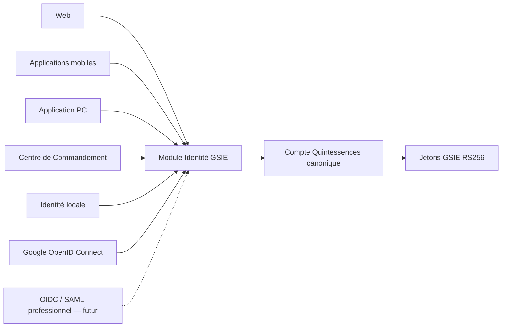
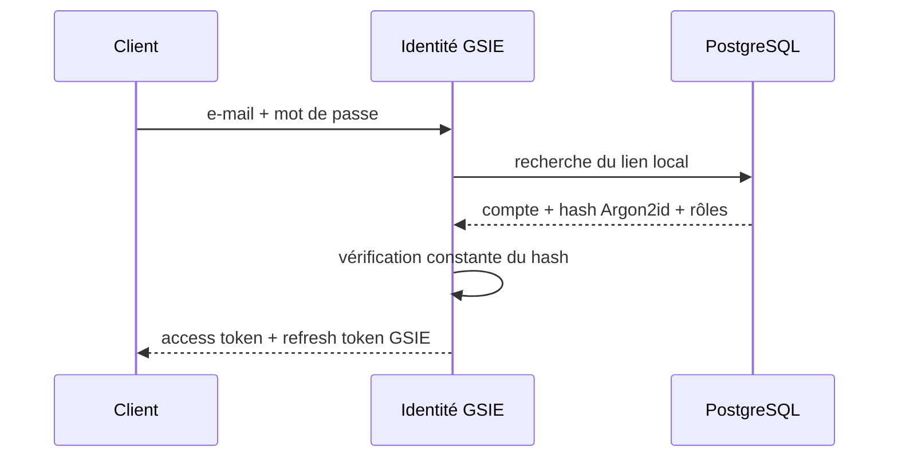
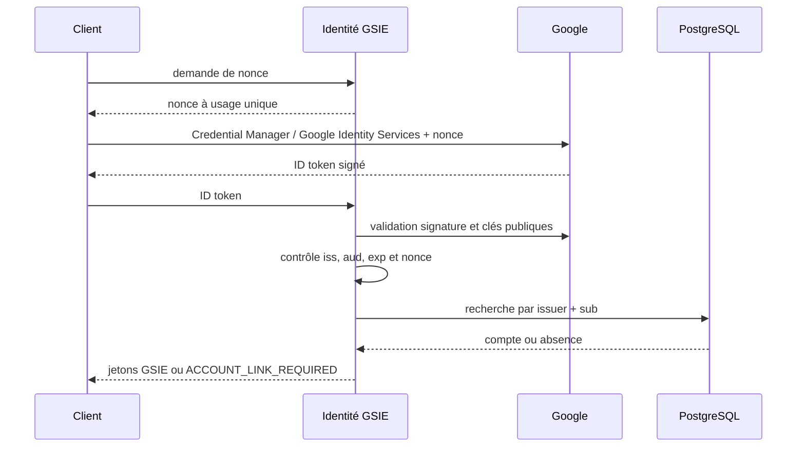

# IDENTITÉ QUINTESSENCES — Architecture 1.0.0

| Champ | Valeur |
|---|---|
| **Identifiant** | GSIE-ARCH-IDENTITE-001 |
| **Statut** | Validated |
| **Version** | 1.0.0 |
| **Date** | 2026-08-03 |
| **Auteur** | Direction technique (assistée par Codex) |
| **Décision** | DEC-000044 |
| **RFC** | RFC-0032 |

## 1. Résumé

Le module d’identité fournit un compte Quintessences canonique auquel
sont rattachés des moyens de connexion interchangeables. Les clients ne
connaissent ni le stockage des mots de passe ni les détails des
fournisseurs externes ; ils reçoivent uniquement des jetons GSIE.

## 2. Composants

Le module d’identité reste intégré à l’API pendant la première tranche,
mais ses contrats et son dépôt sont isolés afin de permettre une
extraction future en service dédié ou un remplacement par un IAM externe.

## 3. Modèle de données

| Entité | Responsabilité |
|---|---|
| `user_account` | Identifiant canonique, état du compte et nom d’affichage |
| `identity_provider_link` | Couple fournisseur/émetteur/sujet rattaché au compte |
| `local_credential` | Hash Argon2id du moyen de connexion local |
| `account_role` | Rôle accordé au compte dans un périmètre applicatif |

Les quatre tables vivent dans `gsie_rgpd_identites`. Le rôle applicatif
ne reçoit que `SELECT`, `INSERT` et `UPDATE` sur ces tables et aucun droit
sur `data_subject`. `DELETE` reste absent du chemin applicatif.

## 4. Invariants

1. l’UUID de `user_account` est le claim `sub` des jetons GSIE ;
2. `(provider, issuer, subject)` est unique ;
3. un mot de passe n’existe que pour un lien `local` ;
4. un compte actif conserve au moins un moyen de connexion actif ;
5. l’e-mail normalisé sert à la connexion locale et à détecter un conflit,
   jamais à identifier un compte Google ;
6. tout rattachement à un compte existant exige une session GSIE valide ;
7. les rôles ne proviennent jamais d’un claim Google non administré ;
8. le client n’appelle les moteurs qu’avec un jeton GSIE.

## 5. Flux local

La réponse à un compte inconnu et à un mot de passe erroné est identique.

## 6. Flux Google

Le nonce expire après cinq minutes et est consommé atomiquement. Le
fournisseur Google est annoncé comme actif uniquement lorsqu’au moins un
client OAuth autorisé est configuré côté serveur.

## 7. Extension professionnelle

La fédération professionnelle réutilisera `identity_provider_link` et
ajoutera les entités `organization`, `organization_identity_provider` et
`organization_membership`. Les domaines d’e-mail ne suffiront jamais à
accorder un rôle ; l’émetteur, le tenant et le mapping de groupes devront
être explicitement configurés.

## 8. Observabilité et confidentialité

Les événements journalisés utilisent l’UUID du compte et un code de
résultat. Sont exclus des logs : adresse e-mail, mot de passe, hash,
jeton Google, jetons GSIE et nonce. Les tentatives échouées sont comptées
pour l’alerte sécurité sans permettre l’énumération des comptes.

## 9. Limites de la première tranche

- validation d’adresse locale par e-mail encore à raccorder à un service
  transactionnel ;
- récupération de mot de passe et MFA différés ;
- fédération OIDC/SAML et organisations différées ;
- interface cliente et gestion des moyens de connexion à implémenter dans
  GeoSylva après stabilisation du contrat serveur.

## 10. Sources et références

- `RFC-0032` — Identité Quintessences multi-fournisseurs
- `DEC-000044` — Décision d’adoption
- `RFC-0021` — Fiabilité d’entreprise
- `RFC-0029` — Organisation physique des données
- [Android Credential Manager — Sign in with Google](https://developer.android.com/identity/sign-in/credential-manager-siwg-implementation)
- [Google OpenID Connect](https://developers.google.com/identity/openid-connect/reference)

## 11. Historique des modifications

| Date | Version | Modification |
|---|---|---|
| 2026-08-03 | 1.0.0 | Architecture initiale validée par DEC-000044 |
