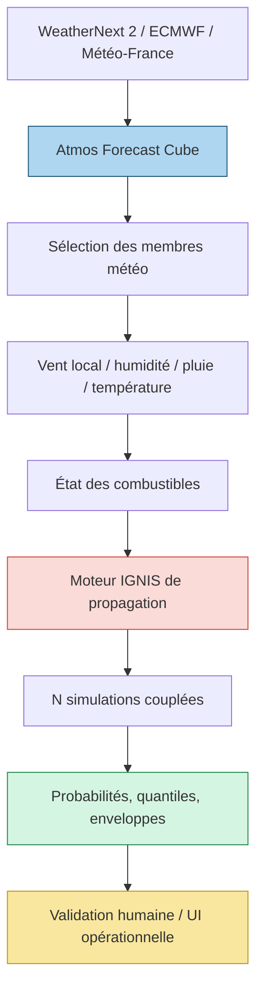

# IGNIS — Intégration probabiliste de la météo

| Champ | Valeur |
|---|---|
| **Statut** | Proposition d'architecture — Draft |
| **Dépendances** | Atmos, WeatherNext/ECMWF/Météo-France, moteur IGNIS, fuels/topographie |
| **Principe** | Propager l'incertitude météo dans le feu sans présenter une probabilité comme une certitude |

## 1. Objectif

Passer de :

```text
une prévision météo → une propagation de feu
```

à :

```text
un ensemble météo → plusieurs scénarios de propagation
→ surfaces probabilistes et incertitude explicable
```

Cette architecture ne remplace ni les vigilances officielles, ni les observations
des autorités, ni la validation humaine opérationnelle.

## 2. Chaîne proposée



```text
WeatherNext 2 / ECMWF / Météo-France
              ↓
       Atmos Forecast Cube
              ↓
     sélection de membres météo
              ↓
   vent local / humidité / pluie / température
              ↓
      état des combustibles
              ↓
     moteur IGNIS de propagation
              ↓
       N simulations couplées
              ↓
    agrégation spatiale et temporelle
              ↓
  P(burn), P(arrival < t), quantiles, extrêmes
              ↓
       validation et UI humaine
```

## 3. Échantillonnage

Pour un run météo comportant `M` membres et plusieurs providers :

```text
membre météo m
+ scénario combustible c
+ ignition i
+ paramètres de propagation p
→ simulation s
```

Le produit probabiliste doit conserver les axes de variation :

```text
(member_meteo, scenario_combustible, ignition, model_version)
```

Il ne faut pas mélanger dans une seule variance :

- incertitude météo ;
- incertitude combustible ;
- incertitude du modèle de feu ;
- incertitude de l'ignition ;
- erreur de mesure.

## 4. Sorties minimales

Pour chaque cellule ou zone :

```text
P(burn_before_t)
P(arrival_before_30min)
P(arrival_before_1h)
P(arrival_before_2h)
expected_arrival_time
arrival_time_quantiles
fireline_intensity_quantiles
wind_sensitivity
members_available
model_version
```

La sortie doit également fournir :

- envelope min/max ;
- médiane ;
- quantiles 5/50/95 ;
- nombre de membres valides ;
- membres exclus et raisons ;
- checksum du cube météo ;
- version de la topographie et des combustibles ;
- date du calcul ;
- statut de validation humaine.

## 5. Moteurs candidats

| Candidat | Rôle | Décision initiale |
|---|---|---|
| ForeFire | propagation modulaire CPU/MPI, Rothermel/Balbi | benchmark territorial français ; licence GPL-3 à traiter |
| ELMFIRE | level-set et propagation mature | benchmark comparatif ; EPL-2.0 à vérifier dans le cas d'usage |
| WindNinja | champ de vent local topographie | benchmark vent local ; ne pas confondre avec prévision météo |
| PyTorchFire | surrogate/CA GPU différentiable | benchmark R&D, pas vérité opérationnelle |
| Cell2Fire | modèle cellulaire rapide | baseline probabiliste et comparaison |
| WRF-Fire | couplage météo-feu | recherche/HPC, pas MVP |
| WildFireGS | scène 3D + feu physique | WATCH : recherche récente, code/licence à établir |

Les licences et performances mentionnées dans les registres R&D doivent être
revalidées dans les dépôts et publications avant toute intégration.

## 6. Vent local

Le vent global à 0,25° est une condition synoptique, pas un champ de vent
forestier.

```text
WN2 U/V 10m ou 100m
        ↓
regrillage et contrôle unités
        ↓
MNT/MNS, pente, exposition
        ↓
rugosité, occupation du sol, canopée
        ↓
WindNinja / CFD / surrogate validé
        ↓
champ local U/V + incertitude
        ↓
IGNIS
```

La résolution locale doit être mesurée sur un territoire pilote. Une grille fine
ne constitue pas une preuve de précision fine.

## 7. Algorithmes d'agrégation

### Monte Carlo stratifié

À utiliser pour le premier POC : simple, explicable et compatible avec les
moteurs existants.

### Importance sampling

À étudier lorsque les événements rares sont sous-représentés dans l'ensemble
météo. Toute pondération doit être conservée dans la provenance.

### Surrogate GPU

À utiliser seulement pour accélérer une propagation déjà validée contre un
moteur de référence. Un surrogate ne remplace pas la simulation source sans
benchmark d'erreur par territoire et régime de feu.

## 8. POC proposé

```text
Zone forestière française bornée
+ ignition synthétique contrôlée
+ 8 à 16 membres WeatherNext ou flux de référence
+ 1 moteur rapide de propagation
+ 1 baseline déterministe
```

Mesures :

- temps par membre ;
- temps total et parallélisation ;
- mémoire ;
- volume raster ;
- stabilité des probabilités avec 4/8/16 membres ;
- calibration sur cas historiques ;
- sensibilité aux champs de vent ;
- erreurs de frontière et de temps d'arrivée.

Le POC ne produit aucune alerte opérationnelle.

## 9. Architecture d'exécution

```text
AtmosCubeRef
      ↓
ScenarioPlanner
      ↓
BoundedSimulationQueue
      ↓
CPU/MPI worker ou GPU surrogate
      ↓
SimulationManifest
      ↓
ProbabilityAggregator
      ↓
PostGIS raster/vector + Zarr produit
      ↓
API IGNIS / Hub
```

Les simulations longues sont asynchrones. L'API répond par un `run_id`, un
statut et un lien vers un manifeste ; elle ne bloque pas une requête HTTP sur
un ensemble massif.

## 10. Garde-fous

- aucune température, humidité ou vitesse de vent inventée ;
- aucune conversion silencieuse de 10 m vers 100 m ;
- aucune extrapolation hors domaine sans drapeau ;
- aucune probabilité affichée sans nombre de membres ;
- aucun produit opérationnel sans validation ;
- comparaison systématique à une baseline physique/déterministe ;
- conservation des simulations et des paramètres ;
- séparation scénario / état réel conformément au Hub.

## 11. Sources

- WeatherNext repository : https://github.com/google-deepmind/weathernext
- WeatherNext model guide : https://developers.google.com/weathernext/guides/models
- WeatherNext data access : https://developers.google.com/weathernext/guides/access-forecast
- FGN paper : https://arxiv.org/abs/2506.10772
- ForeFire : https://github.com/forefireAPI/forefire/
- ELMFIRE : https://github.com/lautenberger/elmfire/
- WindNinja : https://github.com/firelab/windninja
- PyTorchFire : https://github.com/xiazeyu/PyTorchFire
- WRF-Fire : https://github.com/openwfm/WRF-SFIRE
- WildFireGS : https://arxiv.org/abs/2608.11100
