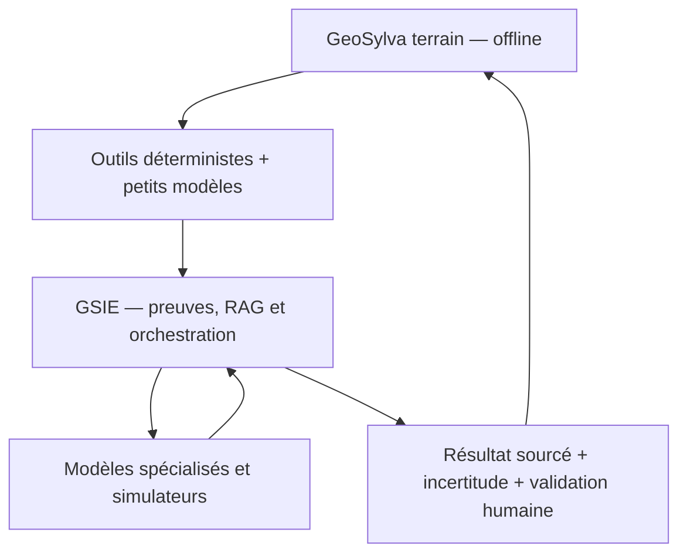
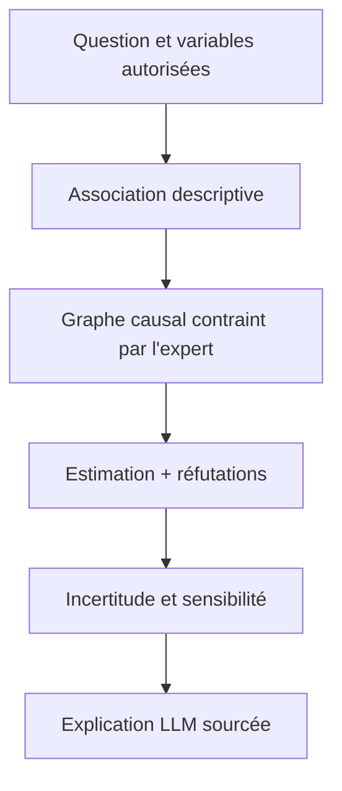

# Étude approfondie — modèles et algorithmes ouverts pour Quintessences

**Date de vérification : 18 juillet 2026**
**Périmètre :** GeoSylva, GSIE, Ignis et futures briques eau, climat, sols, carbone, biodiversité, agriculture et atmosphère.
**Finalité :** identifier ce qui peut devenir une brique professionnelle de Quintessences, ce qui mérite seulement un banc d'essai et ce qui doit être écarté pour des raisons scientifiques, techniques ou juridiques.

**Origine :** étude externe fournie par le Fondateur, versée telle quelle dans `GSIE/RESEARCH/` pour référence. N'a pas encore été auditée par un agent GSIE (constitution-audit) ni transformée en RFC/décision — voir §17 de ce document pour la RFC proposée par l'étude elle-même (« Environmental Model Fabric »), non encore rédigée dans `02_RFC/`.

---

## 0. Verdict exécutif

### 0.1 La réponse courte

Il existe bien des LLM spécialisés en climat, géosciences et océanographie, ainsi que de nombreux modèles de fondation pour l'observation de la Terre. Il existe aussi d'excellents algorithmes ouverts pour la dendrométrie LiDAR, l'hydrologie, les feux de végétation, la biodiversité, le carbone des sols et la causalité.

En revanche, **il n'existe pas aujourd'hui un unique “LLM de l'environnement” suffisamment complet, francophone, juridiquement simple, explicable et validé pour devenir le cerveau scientifique de Quintessences**.

La bonne stratégie n'est donc pas de choisir un modèle magique, mais de construire un système composé de cinq couches :

1. un LLM général multilingue ouvert pour dialoguer, chercher et appeler des outils ;
2. un RAG local alimenté par les référentiels scientifiques et réglementaires autorisés ;
3. des modèles spécialisés par modalité : satellite, LiDAR, audio, pièges photographiques, séries temporelles ;
4. des moteurs déterministes et physiques pour les calculs qui engagent la décision ;
5. un registre de modèles qui conserve licence, version, domaine de validité, données, métriques, incertitude et statut d'approbation.

### 0.2 Recommandation centrale

Le LLM doit être **l'orchestrateur et l'explicateur**, jamais la source numérique de vérité. Une phrase comme « calcule le volume, compare deux martelages et explique le compromis biodiversité/revenu » doit devenir une suite d'appels à des outils typés, versionnés et testés. Le modèle ne doit ni inventer une formule, ni modifier une mesure, ni présenter une corrélation comme une cause.

### 0.3 Sélection prioritaire

| Besoin | Premier choix à évaluer | Alternative | Décision proposée |
|---|---|---|---|
| LLM multilingue de GSIE | [Apertus](https://www.apertus-ai.org/) 8B Instruct | [Ministral 3](https://mistral.ai/news/mistral-3/) 8B, [Qwen3](https://github.com/QwenLM/Qwen3) 8B | Benchmark français avant choix ; aucun fine-tuning factuel initial |
| RAG environnemental | Corpus Quintessences + sources françaises/européennes autorisées | ClimateGPT comme comparateur | Construire en interne avec citations obligatoires |
| Observation de la Terre | [Prithvi-EO-2.0](https://github.com/NASA-IMPACT/Prithvi-EO-2.0) et [AnySat](https://github.com/gastruc/AnySat) | [TerraMind](https://github.com/IBM/terramind), [Presto](https://github.com/nasaharvest/presto) | Limiter le premier benchmark à deux modèles |
| Dendrométrie LiDAR | [3DFin](https://github.com/3DFin/3DFin) + [lidR](https://github.com/r-lidar/lidR) | [TreeLearn](https://github.com/ecker-lab/TreeLearn), [ForAINet](https://github.com/prs-eth/ForAINet) | Intégration prioritaire PC/QGIS ; validation locale obligatoire |
| Hydrologie française | [airGR](https://hydrogr.github.io/airGR/) | [NeuralHydrology](https://github.com/neuralhydrology/neuralhydrology), [SWAT+](https://github.com/swat-model/swatplus) | airGR comme premier moteur de bassin versant |
| Propagation des feux | [ForeFire](https://github.com/forefireAPI/forefire) | [Pyretechnics](https://github.com/pyregence/pyretechnics), [ELMFIRE](https://github.com/lautenberger/elmfire) | Banc Ignis simulé ; aucune décision opérationnelle autonome |
| Biodiversité visuelle | [BioCLIP 2](https://github.com/Imageomics/bioclip-2) | [SpeciesNet](https://github.com/google/cameratrapai), Deepfaune via PyTorch-Wildlife | Pré-identification probabiliste + confirmation humaine |
| Bioacoustique offline | [BirdNET](https://github.com/birdnet-team/birdnet) | [Perch](https://github.com/google-research/perch) | Excellent candidat de pack local |
| Corrélation et causalité | [DoWhy](https://github.com/py-why/dowhy) + [Tigramite](https://github.com/jakobrunge/tigramite) | [EconML](https://github.com/py-why/EconML) | Socle du Correlation Engine, sous contraintes métier |
| Incertitude | [PyMC](https://github.com/pymc-devs/pymc) + [MAPIE](https://github.com/scikit-learn-contrib/MAPIE) | bootstrap métier | Toute prédiction doit exposer intervalle et validité |

---

## 1. Ce que signifie réellement « open source » pour un modèle

Un projet d'IA peut présenter un dépôt public tout en restant impropre à un produit professionnel. La vérification doit porter séparément sur :

- **le code** : moteur d'entraînement et d'inférence ;
- **les poids** : artefact effectivement exécuté ;
- **les données** : corpus ou jeux d'images utilisés ;
- **les dépendances** : modèle de base, bibliothèque, checkpoint ou dataset dérivé ;
- **l'usage** : commercial, recherche seulement, redistribution, service hébergé, modification ;
- **les brevets et marques**, lorsque la licence le prévoit.

### 1.1 Code couleur proposé

| Classe | Signification | Exemples de licences | Traitement dans Quintessences |
|---|---|---|---|
| Vert | Permissif ou domaine public, usage commercial généralement possible | MIT, Apache-2.0, BSD, domaine public | Intégration possible après revue des poids et données |
| Orange | Copyleft ou obligations structurantes | GPL, AGPL, LGPL, EUPL, CC BY-SA | Revue juridique et isolation architecturale si nécessaire |
| Rouge | Non-commercial, recherche seulement, licence personnalisée restrictive ou floue | CC BY-NC-SA, research-only, custom | Pas de dépendance de production sans autorisation écrite |

**Règle :** la licence la plus restrictive de la chaîne réelle d'exécution doit être enregistrée. La licence du dépôt ne suffit jamais.

### 1.2 Critères d'évaluation utilisés

Chaque candidat est jugé selon dix dimensions : pertinence métier, qualité scientifique, validation indépendante, domaine géographique, maturité logicielle, coût matériel, aptitude hors ligne, explicabilité, licence et maintenabilité.

Les statuts recommandés sont :

- **INTÉGRER** : valeur immédiate et risque maîtrisable ;
- **BENCHMARKER** : prometteur, mais à comparer sur des données françaises ;
- **SURVEILLER** : intéressant à moyen terme ou trop lourd aujourd'hui ;
- **ÉCARTER** : licence, maturité ou inadéquation incompatible avec la production actuelle.

---

## 2. Architecture cible : une fédération de modèles, pas un super-LLM



### 2.1 Répartition par niveau de calcul

| Niveau | Exécution | Briques adaptées | Briques à ne pas y placer |
|---|---|---|---|
| GeoSylva mobile | CPU/NPU, mode avion, énergie limitée | formules dendrométriques, règles, recherche locale, BirdNET Lite, petits classifieurs ONNX/TFLite, éventuellement un très petit LLM quantifié optionnel | Prithvi, TerraMind, ForeFire lourd, WRF, TELEMAC, LLM 30B |
| GeoSylva Desktop / QGIS | CPU/GPU local, lots de données | 3DFin, lidR, DeepForest, Detectree2, Presto, LLM 8B quantifié, segmentation et contrôle qualité | grands modèles météo ou simulations territoriales massives |
| GSIE serveur | GPU mutualisé, base canonique | RAG, LLM d'orchestration, causalité, Prithvi/AnySat/TerraMind, hydrologie, modèles biodiversité | calculs non traçables ou modèles sans registre |
| GSIE HPC asynchrone | cluster ou cloud explicite | Aurora, NeuralGCM, Prithvi-WxC, WRF, TELEMAC, grandes simulations forestières | interaction terrain bloquante |

### 2.2 Principe de sécurité scientifique

Une réponse professionnelle doit conserver au minimum :

```json
{
  "tool_id": "dendrometry.volume.compute",
  "model_id": "cubage.fr.chene.zone-x",
  "model_version": "2.1.0",
  "input_observation_ids": ["obs-..."],
  "parameters": {"dbh_cm": 42.3, "height_m": 24.1},
  "result": {"volume_m3": 1.87},
  "uncertainty": {"type": "interval_95", "lower": 1.62, "upper": 2.13},
  "validity": {"status": "within_domain", "warnings": []},
  "evidence_ids": ["source-..."],
  "artifact_sha256": "...",
  "human_validation": "pending"
}
```

Le LLM peut transformer cet objet en explication. Il ne peut pas en changer les nombres.

---

## 3. LLM spécialisés environnement, climat et géosciences

### 3.1 Inventaire vérifié

| Projet | Spécialité et apport | Ouverture / limites | Aptitude Quintessences | Statut |
|---|---|---|---|---|
| [ClimateGPT](https://arxiv.org/abs/2401.09646) / [poids 7B](https://huggingface.co/eci-io/climategpt-7b) | Famille 7B/13B/70B adaptée à un corpus climatique et pensée avec RAG | Licence communautaire personnalisée, base Llama 2, anglais, contexte et génération vieillissants ; le modèle avertit lui-même du risque d'inexactitude | Bon comparateur pour questions climatiques, mauvais socle unique de production | BENCHMARKER, pas adopter par défaut |
| [K2 / GeoLLaMA](https://github.com/davendw49/k2) | LLM 7B géosciences ; corpus GeoSignal et benchmark GeoBench publiés | Code Apache-2.0, mais héritage Llama et poids différentiels à examiner ; modèle ancien et surtout anglophone | Corpus et benchmark intéressants ; base conversationnelle moins attractive qu'un modèle général moderne | RÉUTILISER données/évaluation, pas nécessairement le modèle |
| [GeoGalactica](https://github.com/geobrain-ai/geogalactica) | Modèle géoscientifique 30B, corpus important et jeu d'instructions | Aperçu de recherche non commercial ; mémoire GPU élevée | Incompatible avec une dépendance commerciale sans accord spécifique | ÉCARTER de la production |
| [OceanGPT](https://github.com/OceanGPT/OceanGPT) | Connaissances océaniques, versions texte et travaux sonar/multimodaux | Principalement chinois/anglais ; domaine marin ; besoin GPU variable selon version | Intéressant seulement si Quintessences couvre littoral et milieu marin | SURVEILLER |
| [ClimateBERT](https://github.com/climatebert/language-model) | Encodeur spécialisé pour classer et extraire de l'information climatique | Ce n'est pas un assistant génératif ; Apache-2.0 pour le projet | Très utile pour l'indexation documentaire, la détection de thèmes et les pipelines de preuves | BENCHMARKER |
| [ClimateGPT MBZUAI](https://github.com/mbzuai-oryx/ClimateGPT) | Assistant climat anglais/arabe basé sur Vicuna | CC BY-NC-SA ; non commercial | Licence incompatible avec le cœur professionnel | ÉCARTER |
| [JiuZhou](https://github.com/THU-ESIS/JiuZhou) | Travaux récents de LLM géoscientifique | Langue, artefacts, licences et maturité à vérifier version par version | Candidat de veille, pas de dépendance | SURVEILLER |

### 3.2 Pourquoi un modèle général moderne est préférable

Un LLM spécialisé mémorise une photographie de son corpus. Il ne connaît pas automatiquement les dernières données IGN, les référentiels ONF, les arrêtés, les nouveaux modèles climatiques ou les paramètres validés par région. Une spécialisation par pré-entraînement ne garantit ni l'exactitude, ni la connaissance du français métier, ni la capacité à appeler les outils de GSIE.

Pour Quintessences, le socle doit d'abord exceller dans :

- le français technique ;
- la production JSON conforme à un schéma ;
- l'appel d'outils ;
- la citation exacte des passages RAG ;
- le refus lorsqu'une donnée ou un domaine de validité manque ;
- l'exécution locale ou souveraine ;
- une licence compatible avec un produit commercial.

### 3.3 Bases générales à comparer

| Modèle | Atouts | Risques / essais nécessaires | Place envisagée |
|---|---|---|---|
| [Apertus](https://www.apertus-ai.org/) 8B | Modèle suisse très ouvert et transparent, multilingue, artefacts et démarche reproductible, orientation européenne | Qualité réelle en français forestier et tool-calling à mesurer | Premier candidat GSIE souverain et auditable |
| [Ministral 3](https://mistral.ai/news/mistral-3/) 3B/8B | Apache-2.0 annoncé, multilingue, déclinaisons compactes, bon positionnement edge | Vérifier chaque checkpoint, quantification, mémoire et conformité JSON | Premier candidat local/desktop ; 3B éventuellement mobile haut de gamme |
| [Qwen3](https://github.com/QwenLM/Qwen3) 8B | Large couverture linguistique, écosystème mûr, tool-calling, Apache-2.0 sur de nombreux checkpoints | Empreinte, comportement en français, dépendances et licence exacte du checkpoint | Challenger technique |

### 3.4 Plan de benchmark LLM

Construire 300 à 500 cas français répartis ainsi :

- 25 % appels d'outils dendrométriques ;
- 15 % protocole d'inventaire et contrôle qualité ;
- 15 % lecture de preuves avec citations ;
- 10 % arbitrage martelage/biodiversité sans décision autonome ;
- 10 % eau, sols et station ;
- 10 % cartographie et données externes ;
- 10 % refus hors domaine ou donnée manquante ;
- 5 % résistance aux injections contenues dans des documents.

Mesures obligatoires : exactitude du choix d'outil, validité JSON, exactitude des arguments et unités, fidélité des citations, taux d'hallucination, qualité des refus, latence, RAM/VRAM, énergie et coût par mission.

**Décision recommandée :** ne pas entraîner immédiatement un nouveau « ForestGPT ». Commencer par RAG + outils + évaluation. Un fine-tuning LoRA ne viendra qu'ensuite, sur le format d'interaction et les appels d'outils, jamais pour figer des vérités scientifiques changeantes.

---

## 4. Modèles de fondation pour l'observation de la Terre

Ces modèles sont souvent plus précieux pour Quintessences qu'un LLM spécialisé : ils apprennent des représentations de séries Sentinel, radar, aérien et autres capteurs, puis sont adaptés à une tâche locale.

| Projet | Modalités / tâches | Licence et maturité | Usage proposé | Statut |
|---|---|---|---|---|
| [Prithvi-EO-2.0](https://github.com/NASA-IMPACT/Prithvi-EO-2.0) | Séries HLS, modèles 300M/600M, embeddings temporels et géographiques ; exemples inondation, brûlis, couverture, cultures, biomasse | Projet NASA/IBM, code MIT ; vérifier chaque poids et dataset aval | Biomasse, changement, cicatrices de feu, humidité/couverture après fine-tuning français | INTÉGRER au banc d'essai P0 |
| [TerraMind](https://github.com/IBM/terramind) | Modèle génératif any-to-any, multi-modalités, plusieurs tailles ; intégration TerraTorch | Projet IBM/ESA, code ouvert ; empreinte plus lourde, vérification de chaque checkpoint | Fusion S1/S2/DEM, segmentation et adaptation multi-tâches | BENCHMARKER après le premier vertical slice |
| [AnySat](https://github.com/gastruc/AnySat) | 11 capteurs et résolutions ; couverture, cultures, changements, essences, inondations | MIT ; projet CVPR 2025, poids faciles à charger | Très bon candidat européen pour essences, parcelles et changements | INTÉGRER au benchmark P0 |
| [Clay](https://github.com/Clay-foundation/model) | Encodeur multi-capteurs flexible, Sentinel-1/2 et DEM | Apache-2.0 indiqué par le projet ; écosystème actif | Embeddings géospatiaux génériques, recherche par similarité, fine-tuning | BENCHMARKER |
| [DOFA](https://github.com/zhu-xlab/DOFA) | Modèle agnostique au nombre de canaux et aux longueurs d'onde | MIT ; approche intéressante pour capteurs hétérogènes | Réduire le coût d'intégration de nouvelles bandes/capteurs | SURVEILLER / benchmark ciblé |
| [CROMA](https://github.com/antofuller/CROMA) | Pré-entraînement radar-optique Sentinel-1/2 | MIT ; modèle ciblé et documenté | Milieux nuageux, humidité et complément radar/optique | BENCHMARKER |
| [Presto](https://github.com/nasaharvest/presto) | Transformer léger de séries temporelles, données manquantes, 1 à 24 dates | MIT ; beaucoup plus léger que les grands modèles EO | Classification saisonnière sur desktop ou serveur modeste | INTÉGRER au benchmark de sobriété |
| [SatlasPretrain](https://github.com/allenai/satlaspretrain_models) | Représentations et têtes aval sur imagerie satellite/aérienne | Code Apache-2.0, poids sous licence ODC-BY annoncée ; vérifier datasets | Baseline multi-tâches | SURVEILLER |
| [SAMGeo](https://github.com/opengeos/segment-geospatial) | Segmentation interactive géospatiale autour de familles SAM | Paquet MIT, mais licence du modèle sous-jacent variable | Outil d'annotation accélérée et détourage assisté, pas vérité sémantique | INTÉGRER comme outil humain |

### 4.1 Outillage recommandé

- [TorchGeo](https://github.com/torchgeo/torchgeo) pour les datasets, échantillonneurs géographiques, transforms et pipelines PyTorch ;
- [TerraTorch](https://github.com/torchgeo/terratorch) pour fine-tuner et comparer des modèles géospatiaux ;
- STAC/COG/Zarr/GeoParquet côté données afin de ne pas enfermer GSIE dans un fournisseur ;
- des jeux de test français totalement séparés spatialement et temporellement des données d'adaptation.

### 4.2 Choix concret

Ne pas intégrer huit modèles à la fois. Le premier benchmark devrait comparer :

1. **AnySat**, pour sa polyvalence et sa pertinence européenne ;
2. **Prithvi-EO-2.0**, pour sa maturité et ses exemples aval ;
3. éventuellement **Presto** comme baseline légère.

Les tâches initiales doivent être directement utiles à GeoSylva : détection de changement de couvert, pré-segmentation de parcelles/peuplements, estimation de variables corrélées à la biomasse et repérage d'anomalies. Toute valeur dendrométrique issue du satellite doit être présentée comme une estimation calibrée, jamais comme une mesure de terrain.

---

## 5. Forêt, dendrométrie, allométrie et LiDAR

### 5.1 Outils de mesure 3D

| Projet | Fonction | Forces | Limites | Décision |
|---|---|---|---|---|
| [3DFin](https://github.com/3DFin/3DFin) | Segmentation d'arbres et métriques depuis TLS/MLS : position, diamètre, hauteur | GPL-3.0, actif, interfaces autonome/CloudCompare/QGIS/Python, très proche des besoins GeoSylva | Qualité dépendante de l'acquisition, sous-bois et occlusions ; benchmark matériel nécessaire | INTÉGRER en premier sur PC/QGIS |
| [lidR](https://github.com/r-lidar/lidR) | Traitement LAS/LAZ, modèles de canopée, segmentation et catalogues massifs | GPL-3.0, très mature, grande littérature et traitement par tuiles | R et chaîne desktop/serveur ; paramètres influencent fortement le résultat | INTÉGRER comme moteur de référence LiDAR |
| [TreeLearn](https://github.com/ecker-lab/TreeLearn) | Segmentation individuelle depuis LiDAR terrestre/mobile | MIT, poids et données publiés, 6 665 arbres d'entraînement et benchmark manuel | CUDA/spconv, domaine d'apprentissage différent, démonstrateur Colab signalé non fonctionnel | BENCHMARKER sur forêts françaises |
| [ForAINet](https://github.com/prs-eth/ForAINet) | Segmentation panoptique et métriques depuis LiDAR aérien dense | BSD-3-Clause ; résultats académiques solides | Dépôt moins industrialisé ; DBH plus difficile depuis l'aérien | SURVEILLER / pilote recherche |
| [TreeQSM](https://github.com/InverseTampere/TreeQSM) | Reconstruction en cylindres du squelette ligneux et volume TLS | GPL ; méthode scientifique connue | MATLAB, arbres isolés, sensibilité aux feuilles et au bruit, maintenance plus lente | Outil de comparaison/recherche |
| [TLS2trees](https://github.com/tls-tools-ucl/TLS2trees) | Segmentation individuelle de nuages TLS | GPL-3.0 | Paramétrage et robustesse à évaluer | Baseline de benchmark |
| [DeepForest](https://github.com/weecology/DeepForest) | Détection de houppiers sur RGB aérien | MIT, actif, modèles pré-entraînés | Le projet avertit qu'un modèle générique ne sera pas parfait sur tout capteur/forêt | BENCHMARKER avec fine-tuning local |
| [Detectree2](https://github.com/PatBall1/detectree2) | Polygones de couronnes par Mask R-CNN | MIT, RGB/multispectral | Modèles surtout orientés forêts denses/tropicales | SURVEILLER pour annotations de couronnes |

### 5.2 Allométrie, volume, biomasse et dynamique forestière

| Projet / source | Apport | Place correcte dans Quintessences |
|---|---|---|
| [allodb](https://github.com/ropensci/allodb) | Base structurée de centaines d'équations de biomasse et sélection pondérée par taxonomie, climat et site | Référentiel comparatif et source de modèles ; ne remplace pas les tarifs français ni leur domaine de validité |
| [allometric](https://github.com/allometric/allometric) | Grande collection structurée de modèles allométriques issus de nombreuses publications | Import contrôlé dans le registre avec source, unités et domaine ; revue des droits sur chaque équation |
| [medfate](https://github.com/emf-creaf/medfate) | Fonctionnement forestier méditerranéen, bilan hydrique, dynamique et scénarios | Très pertinent pour sécheresse/résilience, après calibration régionale |
| [iLand](https://github.com/edfm-tum/iland-model) | Modèle individuel et paysager : croissance, mortalité, régénération, perturbations, carbone, gestion | Scénarios longs et recherche ; serveur/HPC, jamais réponse instantanée non contextualisée |
| [LANDIS-II](https://www.landis-ii.org/developers) | Succession, feux, récolte, carbone et changements à l'échelle du paysage | Scénarios territoriaux après preuve du vertical slice forestier |
| [Capsis](https://capsis.cirad.fr/capsis/models) | Plateforme française de modèles de croissance et sylviculture | Examiner modèle par modèle : paramètres, licence, essences, zone et collaboration avec les auteurs |

### 5.3 Règle scientifique non négociable

La méthodologie de l'[Inventaire forestier national de l'IGN](https://inventaire-forestier.ign.fr/IMG/pdf/methodologie-2021.pdf) rappelle qu'un tarif possède un **domaine de validité défini par son échantillon de calibration** : essence, géographie, type de peuplement et définition du volume. Les définitions IGN et ONF peuvent également différer.

Quintessences doit donc refuser l'idée d'une formule universelle. Chaque résultat de cubage ou biomasse doit pointer vers : méthode, définition du volume, essence, région, plage de diamètres/hauteurs, peuplement, source, version, erreur de calibration et avertissement hors domaine.

### 5.4 Chaîne recommandée GeoSylva

1. mesure terrain brute et instrument ;
2. contrôle de cohérence local ;
3. calcul déterministe versionné ;
4. estimation LiDAR/satellite séparée, avec confiance ;
5. comparaison des sources sans écrasement ;
6. validation ou correction par le professionnel ;
7. réintégration des corrections dans un corpus de benchmark, pas directement dans les poids de production.

---

## 6. Eau, hydrologie et hydraulique

| Projet | Type | Forces | Limites / précautions | Décision |
|---|---|---|---|---|
| [airGR](https://hydrogr.github.io/airGR/) | Modèles pluie-débit GR4H à GR1A, neige CemaNeige, calibration et évaluation | Développé dans l'écosystème INRAE, très pertinent pour la France, reproductible | R/GPL-2 ; calibration par bassin indispensable | INTÉGRER en premier |
| [NeuralHydrology](https://github.com/neuralhydrology/neuralhydrology) | Cadre ML pour pluie-débit et séries hydrologiques | BSD-3-Clause, modulaire, actif | Ce n'est pas un modèle universel prêt à l'emploi ; données et entraînement par cas | BENCHMARKER contre airGR |
| [SWAT+](https://github.com/swat-model/swatplus) | Modèle physique/semi-distribué de bassin, eau, qualité, érosion, usage des terres | Large communauté, LGPL-2.1, scénarios de gestion | Paramétrage lourd, incertitude structurale, besoin d'expertise | INTÉGRER en P1/P2 |
| [TELEMAC-MASCARET](https://www.opentelemac.org/) | Hydraulique 1D/2D/3D, surface libre, sédiments et vagues | Projet EDF, GPL, solide pour études hydrauliques | Maillage, calcul et expertise importants | Serveur/HPC, P2 |
| [MODFLOW 6](https://github.com/MODFLOW-ORG/modflow6) | Écoulement et transport souterrains | Référence USGS, code gouvernemental ouvert, actif | Modèle conceptuel et paramètres hydrogéologiques nécessaires | P2 eaux souterraines |
| [LISFLOOD](https://github.com/ec-jrc/lisflood-code) | Hydrologie distribuée et crues européennes | JRC, EUPL-1.2, contexte européen | Résolution et usage local à valider | BENCHMARKER territorial |
| [HydroMT](https://github.com/Deltares/hydromt) + [Wflow](https://github.com/Deltares/Wflow.jl) | Construction reproductible et simulation hydrologique distribuée | Bon outillage d'ingénierie Deltares | Courbe d'apprentissage et dépendances de données | P1/P2 |
| [ParFlow](https://parflow.org/) | Surface/sous-sol intégré, neige et évapotranspiration | Physique détaillée, HPC | Très lourd pour un premier produit | SURVEILLER |
| [EPA SWMM](https://github.com/USEPA/Stormwater-Management-Model) | Réseaux et ruissellement urbains | Domaine public, référence pour eaux pluviales urbaines | Hors cœur forestier initial | Module urbain futur |
| [WNTR](https://github.com/USEPA/WNTR) | Résilience des réseaux d'eau autour d'EPANET | Ouvert, scénarios de panne/qualité | Hors priorité actuelle | SURVEILLER |

### 6.1 Stratégie eau recommandée

- commencer par airGR sur un ou deux bassins bien documentés ;
- comparer un modèle neuronal via NeuralHydrology au modèle conceptuel, sans supposer sa supériorité ;
- enregistrer les périodes de calibration/validation, les stations, données météo, lacunes, transformations et incertitudes ;
- utiliser SWAT+ pour les scénarios d'usage des sols, érosion et qualité seulement lorsque les données nécessaires existent ;
- réserver TELEMAC/MODFLOW aux études demandant réellement cette finesse.

Un modèle hydrologique appris sur de grands bassins américains ou mondiaux ne devient pas automatiquement valide sur un petit bassin forestier français karstique, méditerranéen ou fortement anthropisé.

---

## 7. Feux de végétation et Ignis

| Projet | Apport | Licence / maturité | Usage Quintessences | Statut |
|---|---|---|---|---|
| [ForeFire](https://github.com/forefireAPI/forefire) | Propagation, modèles de vitesse, entrées/sorties géospatiales, couplages atmosphériques | GPL-3.0 ; CNRS/Université de Corse ; publication [JOSS](https://joss.theoj.org/papers/10.21105/joss.08680) | Meilleur candidat pour un Ignis français/méditerranéen expérimental | INTÉGRER au banc simulé |
| [Pyretechnics](https://github.com/pyregence/pyretechnics) | Bibliothèque transparente de comportement du feu : surface, cime, spotting, combustibles et humidité | EPL-2.0 ; approche modulaire | Outil explicable pour calculs et comparaison de formules | INTÉGRER au benchmark |
| [ELMFIRE](https://github.com/lautenberger/elmfire) | Propagation, probabilités de brûlage et sévérité | EPL-2.0 ; code Fortran/Python | Alternative et banc de comparaison | BENCHMARKER |
| [WRF-Fire](https://github.com/wrf-model/wrf) | Couplage météo-feu haute fidélité | Code WRF ouvert/domaine public selon composants ; très lourd | Recherche/HPC, pas MVP Ignis | SURVEILLER |
| [Cell2Fire](https://github.com/cell2fire/Cell2Fire) | Simulation cellulaire avec système canadien FBP | GPL-3.0 mais mentions d'usage recherche et combustibles canadiens à examiner | Mauvaise base par défaut pour la France | ÉCARTER du cœur |
| [xclim](https://github.com/Ouranosinc/xclim) | Indices climatiques, dont briques liées au Canadian Fire Weather Index | Bibliothèque opérationnelle ouverte | Variables de danger et séries climatiques, avec calibration française | INTÉGRER comme fournisseur d'indicateurs |

### 7.1 Modèles ML de propagation

Des jeux de données comme [Next Day Wildfire Spread](https://research.google/pubs/next-day-wildfire-spread-a-machine-learning-dataset-to-predict-wildfire-spreading-from-remote-sensing-data/), [WildFireSpreadTS](https://zenodo.org/records/8006177) et [Mesogeos](https://arxiv.org/abs/2306.05144) permettent d'entraîner des modèles de recherche. Ils ne constituent pas une validation opérationnelle française. Les définitions de combustible, la résolution, les biais d'observation, les politiques d'extinction et le climat diffèrent.

### 7.2 Ligne rouge pour Ignis

Tant que les validations terrain, la responsabilité, les seuils de sécurité, la disponibilité opérationnelle et la gouvernance humaine ne sont pas établis, Ignis doit être présenté comme :

- simulateur de scénarios ;
- outil de préparation et de retour d'expérience ;
- visualisateur de données et d'incertitude ;
- jamais système autonome de commandement ou prédicteur garanti.

---

## 8. Climat, météo et atmosphère

| Projet | Nature | Licence / contrainte | Usage recommandé | Statut |
|---|---|---|---|---|
| [Aurora](https://github.com/microsoft/aurora) | Modèle de fondation du système Terre : météo, pollution, vagues et adaptation | Code/poids MIT annoncés ; le projet avertit de ne pas l'utiliser seul pour des décisions opérationnelles | Scénarios expérimentaux, ensemble et adaptation serveur | BENCHMARKER en P2 |
| [NeuralGCM](https://github.com/neuralgcm/neuralgcm) | Modèle hybride dynamique + ML | Code Apache-2.0 ; checkpoints sous conditions CC BY-SA documentées | Recherche climatique, ensembles et expérimentation | BENCHMARKER en P2 |
| [GraphCast / GenCast via WeatherNext](https://github.com/google-deepmind/weathernext) | Prévision globale apprise | Code Apache-2.0, mais certains poids sont CC BY-NC-SA | Licence des poids incompatible avec un cœur commercial sans accord | ÉCARTER des dépendances commerciales |
| [Prithvi-WxC](https://github.com/NASA-IMPACT/Prithvi-WxC) | Modèle de fondation météo/climat 2.3B sur MERRA-2 | MIT annoncé ; calcul et données lourds | Recherche/HPC, pas terrain | SURVEILLER |
| [ClimaX](https://github.com/microsoft/ClimaX) | Modèle de fondation météo/climat multivariable | MIT ; plus ancien mais utile comme baseline | Recherche et comparaison | SURVEILLER |
| [FourCastNet](https://github.com/NVlabs/FourCastNet) | Prévision globale neurale | BSD-3-Clause ; chaîne d'entraînement lourde | Baseline scientifique | SURVEILLER |
| [WRF](https://github.com/wrf-model/wrf) | Modélisation atmosphérique physique régionale | Code public, communauté très mature, HPC | Études régionales avancées, couplage avec feux | P2/HPC |
| [CMAQ](https://github.com/USEPA/CMAQ) | Qualité de l'air et chimie atmosphérique | Projet EPA ouvert, lourd | Module atmosphère futur | SURVEILLER |

### 8.1 Donnée opérationnelle avant modèle expérimental

Pour une application professionnelle française, les sources opérationnelles officielles Météo-France, ECMWF et Copernicus doivent rester prioritaires. Les modèles appris peuvent servir d'ensemble, de downscaling ou d'expérimentation, mais jamais remplacer silencieusement une source opérationnelle sans validation et avertissement.

---

## 9. Biodiversité, flore, faune et bioacoustique

| Projet | Modalité et portée | Forces | Limites | Décision |
|---|---|---|---|---|
| [BioCLIP 2](https://github.com/Imageomics/bioclip-2) | Embeddings image-texte taxonomiques à grande échelle | MIT, TreeOfLife-200M, bon zero/few-shot, famille active | Probabilités non équivalentes à une identification certaine ; biais photographiques et géographiques | INTÉGRER comme shortlist/embedding |
| [SpeciesNet](https://github.com/google/cameratrapai) | Classification de pièges photographiques, plus de 2 000 labels, prior géographique | Apache-2.0, entraîné sur des dizaines de millions d'images | Taxonomie et couverture régionale inégales ; seuils locaux | INTÉGRER au benchmark caméra |
| [PyTorch-Wildlife](https://github.com/microsoft/Pytorch-Wildlife) | Plateforme de détecteurs, classifieurs et modèles audio | MIT pour la plateforme ; modèles variés, dont options européennes | **Licence différente pour chaque checkpoint** ; certaines variantes MegaDetector sont AGPL | INTÉGRER la plateforme avec liste blanche de modèles |
| [BirdNET](https://github.com/birdnet-team/birdnet) | Reconnaissance bioacoustique de milliers d'espèces, TFLite/LiteRT et offline | MIT, compact, noms multilingues, très adapté au terrain | Bruit, saison, zone et chevauchement d'espèces ; seuils à calibrer | INTÉGRER comme pack offline |
| [Perch](https://github.com/google-research/perch) | Embeddings et classification audio multi-taxa | Apache-2.0, large couverture oiseaux/amphibiens/insectes/mammifères | Logits non calibrés et espèces rares difficiles selon la model card | BENCHMARKER |
| [biomod2](https://biomodhub.github.io/biomod2/) | Ensembles de modèles de distribution d'espèces | Mature, comparaison de nombreuses méthodes | Fortement dépendant des données d'absence/pseudo-absence et biais d'échantillonnage | INTÉGRER côté analyse, avec expertise |
| [elapid](https://github.com/earth-chris/elapid) / [maxnet](https://github.com/mrmaxent/maxnet) | Modèles de niche de type Maxent en Python/R | Implémentations ouvertes | Corrélation environnement-présence, pas preuve causale ni abondance | BENCHMARKER |

### 9.1 UX professionnelle recommandée

Une observation automatique doit afficher : espèces candidates, score calibré, zone et saison utilisées, qualité du média, portion détectée, modèle/version, limites et bouton de confirmation/correction. Une espèce rare, protégée ou à fort enjeu doit exiger une validation renforcée et conserver le média source.

Le modèle ne doit jamais supprimer une observation incertaine ni fusionner automatiquement deux taxons proches.

---

## 10. Sols, carbone et agriculture

| Projet | Apport | Limites | Décision |
|---|---|---|---|
| [SoilGrids](https://isric.org/explore/soilgrids) | Cartes mondiales de propriétés des sols produites par ML, avec incertitudes | Résolution et biais globaux ; ISRIC recommande de comparer aux cartes nationales/locales | Utiliser comme **a priori** et covariable, jamais comme vérité de parcelle |
| [RothC_R](https://github.com/Rothamsted-Models/RothC_R) | Modèle du carbone organique des sols non hydromorphes, pas mensuel, climat/texture/couvert | Hypothèses et paramètres ; besoins de mesures initiales | INTÉGRER pour scénarios calibrés |
| [SoilR](https://www.bgc-jena.mpg.de/TEE/software/soilr/) | Cadre R ouvert pour les modèles de décomposition de matière organique | Bibliothèque scientifique, pas résultat prêt à l'emploi | Outil de recherche et validation |
| [DayCent](https://www.nrel.colostate.edu/projects/daycent/) | Cycle carbone/azote/eau et gaz traces | Accès et licence de la version exacte à confirmer avant intégration | SURVEILLER, revue juridique requise |
| [PCSE / WOFOST](https://github.com/ajwdewit/pcse) | Simulation de croissance des cultures et rendement | Paramètres culturaux/régionaux indispensables ; vérifier version et artefacts | Module agriculture futur |
| [AquaCrop-OSPy](https://github.com/aquacropos/aquacrop) | Modèle Python de productivité de l'eau et cultures | Le projet précise qu'il ne s'agit pas de l'implémentation FAO officielle et que certaines fonctions manquent | Recherche/pilote, pas moteur officiel |
| [APSIM](https://github.com/apsiminitiative/apsimx) | Simulation agricole très riche | Licence communautaire restrictive pour certains usages commerciaux | ÉCARTER du cœur sans accord |
| [OpenFLUID](https://github.com/OpenFLUID/openfluid) | Flux dans les paysages, plateforme française de modélisation | Intégration et modèles à étudier au cas par cas | SURVEILLER pour continuum eau/sol/paysage |

### 10.1 Calcul carbone

Le carbone ne doit pas être produit par une seule équation opaque. Il faut séparer : biomasse aérienne, souterraine, bois mort, litière, sol, produits bois, substitutions et émissions. Chaque stock ou flux doit garder méthode, date, périmètre, incertitude et hypothèses de scénario. Les règles d'un standard de certification ne doivent pas être confondues avec un modèle biophysique.

---

## 11. Le moteur de corrélation : algorithmes recommandés

Le moteur de corrélation est probablement l'endroit où un LLM non encadré serait le plus dangereux. Il peut produire des histoires plausibles à partir de coïncidences, inverser la causalité ou ignorer un facteur de confusion.

### 11.1 Briques ouvertes

| Projet | Fonction | Place dans GSIE |
|---|---|---|
| [DoWhy](https://github.com/py-why/dowhy) | Graphe causal, identification, estimation, réfutation, modèles causaux génératifs et contrefactuels | Colonne vertébrale pour formaliser et tester une question causale |
| [Tigramite](https://github.com/jakobrunge/tigramite) | Découverte causale sur séries temporelles, relations retardées et contemporaines | Climat, hydrologie, croissance, sécheresse, incendie ; génération d'hypothèses |
| [EconML](https://github.com/py-why/EconML) | Effets de traitement hétérogènes et estimation contrefactuelle | Scénarios de gestion, avec hypothèses et données suffisantes |
| [PyMC](https://github.com/pymc-devs/pymc) | Modèles bayésiens et propagation d'incertitude | Modèles hiérarchiques parcelle/région, priors experts et intervalles crédibles |
| [MAPIE](https://github.com/scikit-learn-contrib/MAPIE) | Prédiction conforme : intervalles, ensembles et contrôle du risque | Calibration des prédictions de régression/classification sous conditions d'échangeabilité |
| [MLflow](https://mlflow.org/) | Expériences, artefacts, évaluations et registre de modèles | Traçabilité technique ; à relier au registre métier GSIE |

[CausalNex](https://github.com/mckinsey/causalnex) a atteint sa fin de vie en juin 2026 : ne pas construire une nouvelle dépendance dessus.

### 11.2 Pipeline professionnel



1. **Association descriptive** : Spearman/Pearson selon hypothèses, information mutuelle, corrélation croisée, modèles non linéaires ; résultat explicitement nommé « association ».
2. **Contrôle statistique** : taille d'échantillon, données manquantes, autocorrélation spatiale/temporelle, multiplicité des tests et correction du taux de fausses découvertes.
3. **Graphe causal** : variables et arêtes possibles contraintes par l'ontologie GSIE et un professionnel ; les directions ne sont pas décidées librement par le LLM.
4. **Découverte temporelle** : Tigramite propose des relations retardées à tester, pas des vérités.
5. **Estimation** : DoWhy/EconML estiment l'effet sous hypothèses déclarées.
6. **Réfutation** : placebo, sous-échantillonnage, causes communes simulées, sensibilité aux confondeurs non mesurés.
7. **Incertitude** : PyMC, bootstrap ou MAPIE selon le problème.
8. **Restitution** : le LLM explique question, fenêtre de données, population, hypothèses, effet, intervalle, tests de robustesse et limites.

### 11.3 Vocabulaire imposé dans l'interface

- « association observée » ;
- « hypothèse causale » ;
- « effet estimé sous les hypothèses suivantes » ;
- « aucune conclusion possible avec ces données ».

Le mot « cause » ne doit être affiché que si un protocole causal enregistré a abouti et a passé les tests de réfutation définis.

---

## 12. Registre des modèles Quintessences

Le registre doit être un objet métier de GSIE, distinct d'une simple liste de fichiers MLflow.

### 12.1 Champs minimaux

| Groupe | Champs |
|---|---|
| Identité | `model_id`, nom, version sémantique, domaine, tâche, propriétaire, mainteneur |
| Nature | déterministe, statistique, physique, ML, modèle de fondation, LLM, ensemble |
| Juridique | licence code, poids, données, usage commercial, redistribution, attribution, validation juridique |
| Entrées | schéma, unités, CRS, capteurs, résolution, valeurs manquantes admises, contrôles qualité |
| Sorties | schéma, unités, sémantique, scores, incertitude et seuils |
| Validité | géographie, climat, essences/taxons, sols, combustibles, âge, diamètre, saison, résolution |
| Origine | dépôt, commit, papier, données d'entraînement, données de calibration, fournisseurs |
| Validation | jeux de test, séparation spatiale/temporelle, métriques, biais, calibration, OOD |
| Calcul | CPU/GPU/NPU, RAM/VRAM, durée, énergie, tiers offline |
| Artefact | URI, format, taille, SHA-256, signature, SBOM, dépendances |
| Gouvernance | expérimental, qualifié, approuvé, déprécié ; valideur, date, motif, remplaçant |

### 12.2 Statuts

- **Experimental** : visible uniquement dans les laboratoires/bacs à sable ;
- **Qualified** : benchmark reproductible réussi ;
- **Approved** : accepté pour une tâche et un domaine précis ;
- **Restricted** : accès ou usage limité ;
- **Deprecated** : encore reproductible, mais plus proposé ;
- **Revoked** : vulnérabilité, erreur scientifique ou problème juridique ;
- **Superseded** : remplacé, avec chemin de migration.

### 12.3 Portes automatiques

Une version ne passe pas en production si :

- une licence manque ;
- le hash ou la signature ne correspond pas ;
- le benchmark local est absent ;
- aucune procédure OOD n'existe ;
- les unités ou le CRS ne sont pas typés ;
- le modèle ne sait pas signaler les données invalides ;
- une régression dépasse le seuil métier ;
- le résultat ne peut pas être relié à ses entrées.

---

## 13. Packs téléchargeables et offline-first

Le système imaginé pour GeoSylva est très compatible avec des modèles ouverts, à condition de les distribuer comme des **packs de mission signés**, et non comme des fichiers téléchargés librement par l'interface.

### 13.1 Contenu d'un pack

```yaml
pack_id: geosylva-fr-nouvelle-aquitaine-forest-v1
version: 1.0.0
region: FR-NAQ
valid_from: 2026-07-18
expires_at: 2027-07-18
artifacts:
  - id: dendrometry-registry-fr
    sha256: "..."
    size_bytes: 1234567
    license_id: internal-curated
  - id: birdnet-lite-eu
    sha256: "..."
    size_bytes: 98765432
    license_id: MIT
data:
  - stac_collection: mission-basemap
  - knowledge_index: forest-protocols-fr
compatibility:
  min_app_version: 2.0.0
rollback_to: 0.9.2
signature: "..."
```

### 13.2 Règles de fonctionnement

- téléchargement reprenable et différentiel ;
- manifeste signé, SHA-256 et contrôle d'espace avant installation ;
- installation atomique dans un emplacement versionné ;
- dernière version valide conservée pour rollback ;
- licence et attribution consultables hors ligne ;
- données personnelles exclues des packs publics ;
- expiration informative ou bloquante selon criticité ;
- résultat marqué avec la version exacte du pack ;
- synchronisation différée par outbox idempotente ;
- aucune obligation de réseau pour les calculs essentiels de terrain.

### 13.3 Ce qui doit rester local

- saisie et modification des observations ;
- contrôles qualité ;
- formules dendrométriques approuvées ;
- cartes et référentiels de mission ;
- historique et provenance ;
- export de secours ;
- aide documentaire locale ;
- petits modèles explicitement installés.

Le LLM local est un confort, pas une condition de fonctionnement de GeoSylva.

---

## 14. Protocole de validation professionnel

### 14.1 Séparation des données

Les jeux train/validation/test doivent être séparés :

- géographiquement, pour éviter qu'une parcelle voisine se retrouve des deux côtés ;
- temporellement, pour mesurer les changements de capteur, climat et pratiques ;
- par matériel lorsque c'est pertinent ;
- par essence, structure, région et classe de difficulté ;
- avec un jeu « hors domaine » volontaire.

### 14.2 Métriques par famille

| Famille | Métriques minimales |
|---|---|
| Dendrométrie numérique | biais, MAE/RMSE, erreur relative, couverture des intervalles, Bland–Altman, par essence/diamètre/matériel |
| Segmentation | IoU, F1 instance, précision/rappel, erreurs de fusion/scission, métriques par densité et sous-bois |
| Classification biodiversité | macro-F1, top-k, calibration, précision à seuil, performance espèces rares et inconnues |
| Hydrologie | NSE/KGE avec prudence, biais volume, pics, étiages, timing, couverture probabiliste |
| Feux/inondations | précision spatiale, distance au front, timing, faux négatifs critiques, calibration événementielle |
| LLM | tool-call exact, JSON valide, fidélité citation, hallucination, refus, injection, latence et coût |
| Causalité | récupération sur données simulées, stabilité, réfutations, sensibilité aux confondeurs, couverture |

### 14.3 Validation humaine

Chaque benchmark doit être cosigné au minimum par :

- un responsable technique ;
- un professionnel du domaine ;
- pour une fonction critique, un expert scientifique indépendant ou organisme partenaire.

Le statut « validé » ne doit jamais signifier « le test unitaire passe ». Il doit signifier « la performance, le domaine, les limites et la procédure d'usage ont été acceptés pour une tâche précise ».

---

## 15. Feuille de route proposée

### Phase A — 0 à 6 semaines : socle commun

1. implémenter le schéma `ModelRegistry`, `ModelArtifact`, `ValidationRun`, `LicenseRecord` et `ApplicabilityDomain` dans GSIE ;
2. créer le banc de benchmark reproductible et des cartes de modèles ;
3. mettre une porte CI qui refuse tout artefact sans licence, hash, origine et jeu de test ;
4. constituer 300–500 cas LLM français et comparer Apertus 8B, Ministral 3 8B/3B et Qwen3 8B ;
5. développer l'interface d'outil typée et le format de résultat immuable ;
6. définir les packs signés offline et leur rollback.

**Livrable :** aucun nouveau modèle métier en production, mais une infrastructure empêchant les intégrations sauvages.

### Phase B — 1 à 3 mois : tranche forestière

1. intégrer 3DFin et lidR sur PC/QGIS ;
2. importer un premier registre de méthodes dendrométriques françaises validées ;
3. comparer TreeLearn comme candidat expérimental ;
4. comparer AnySat et Prithvi sur une seule tâche utile ;
5. relier les résultats à GeoSylva sans écraser les mesures terrain ;
6. exposer source, domaine et incertitude dans l'interface ;
7. lancer le moteur de corrélation limité avec DoWhy, Tigramite et PyMC/MAPIE.

**Livrable :** observation réelle → calcul local → synchronisation → enrichissement → explication sourcée → validation professionnelle.

### Phase C — 3 à 6 mois : pilotes de domaine

1. eau : airGR sur un ou deux bassins, avec NeuralHydrology en challenger ;
2. feu : ForeFire + Pyretechnics dans un simulateur Ignis non opérationnel ;
3. biodiversité : BioCLIP + SpeciesNet/Deepfaune et BirdNET ;
4. sols/carbone : SoilGrids comme prior + RothC sur un protocole calibré ;
5. publier un rapport de performance et les limites de chaque pilote.

### Phase D — 6 à 12 mois : extension contrôlée

Selon les preuves obtenues : SWAT+, TELEMAC, MODFLOW/LISFLOOD, medfate, iLand/LANDIS-II, TerraMind et modèles météo/climat. Aucun nouveau domaine ne doit être ouvert si le vertical slice forestier n'est pas stable et utilisé.

---

## 16. Matrice finale « adopter / tester / éviter »

### À intégrer en priorité

- registre des modèles, outil typé, RAG sourcé et packs signés ;
- 3DFin et lidR ;
- airGR ;
- ForeFire et Pyretechnics, uniquement en simulation ;
- DoWhy, Tigramite, PyMC et MAPIE ;
- BioCLIP, SpeciesNet/Deepfaune et BirdNET avec confirmation humaine ;
- AnySat et Prithvi dans un benchmark strict, pas directement en production.

### À benchmarker avant décision

- Apertus, Ministral 3 et Qwen3 ;
- ClimateGPT comme comparateur seulement ;
- TreeLearn, DeepForest, CROMA, Presto et TerraMind ;
- NeuralHydrology, SWAT+, LISFLOOD et Wflow ;
- Perch, biomod2 et modèles de niche ;
- medfate et RothC selon les scénarios.

### À surveiller

- Aurora, NeuralGCM, Prithvi-WxC et WRF ;
- ForAINet, TreeQSM, LANDIS-II, iLand et Capsis modèle par modèle ;
- OceanGPT pour un futur volet littoral ;
- TELEMAC/MODFLOW pour des projets qui justifient leur coût.

### À ne pas prendre comme dépendance centrale

- GeoGalactica et modèles CC BY-NC/research-only ;
- GraphCast/GenCast lorsque les poids choisis sont non commerciaux ;
- ClimateGPT MBZUAI sous CC BY-NC-SA ;
- APSIM sans accord adapté ;
- CausalNex, désormais en fin de vie ;
- toute formule dendrométrique sans domaine de validité ;
- tout modèle téléchargé sans licence exacte, hash, model card et benchmark local.

---

## 17. Décision d'architecture proposée

Quintessences devrait formaliser une RFC intitulée :

> **RFC — Environmental Model Fabric : registre, outils, preuves, validation et distribution offline des modèles scientifiques.**

Cette RFC doit imposer :

1. le LLM comme orchestrateur non autoritaire ;
2. les calculs métier par outils versionnés ;
3. la distinction observation / estimation / simulation / recommandation ;
4. la distinction association / hypothèse causale / effet estimé ;
5. la triple licence code-poids-données ;
6. le domaine de validité explicite ;
7. l'incertitude et le refus hors domaine ;
8. la validation humaine finale ;
9. les packs signés et rollback offline ;
10. une progression par vertical slices mesurables.

### Conclusion

L'écosystème ouvert est déjà assez riche pour faire de Quintessences une plateforme d'intelligence environnementale très avancée. Son avantage compétitif ne viendra pourtant pas du nombre de modèles embarqués. Il viendra de sa capacité à **les faire travailler ensemble sans mélanger leurs niveaux de preuve**, à savoir précisément quand ils sont valides, à fonctionner hors ligne et à restituer au professionnel un résultat contrôlable.

Le meilleur premier investissement n'est donc pas l'entraînement d'un nouveau grand LLM. C'est le couple :

> **registre scientifique + orchestrateur d'outils**, appliqué à une tranche forestière réelle et validée.

Une fois ce socle éprouvé, Quintessences pourra intégrer les meilleurs modèles ouverts de chaque domaine sans devenir une collection fragile de démonstrateurs.
