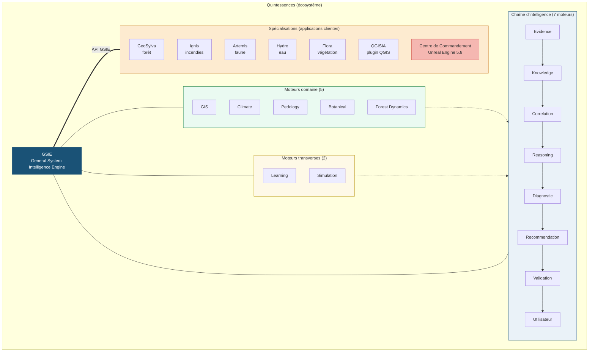
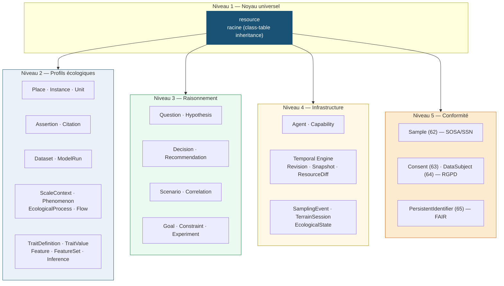
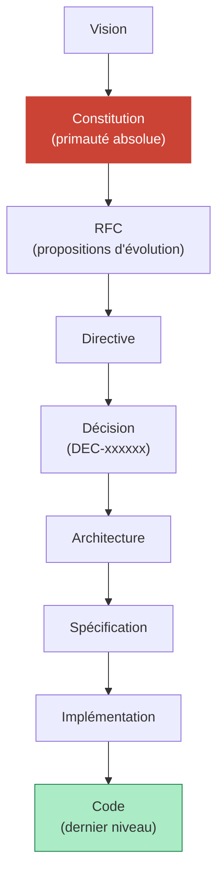

<div align="center">

# Quintessences

### Écosystème d'intelligence environnementale

**Un moteur. Des spécialisations. Zéro décision opaque.**

GSIE (General System Intelligence Engine) est un moteur d'aide à la
décision modulaire, traçable et explicable — conçu pour la forêt, le feu,
le climat et les territoires.

[](ROADMAP.md)
[](LICENSE)
[](00_CONSTITUTION/)
[](GSIE/ENGINES/)
[](GSIE/ARCHITECTURE/ECOSYSTEM_METAMODEL.md)
[](03_DECISIONS/)
[](https://github.com/NeooeN45/Quintessences/actions/workflows/ci.yml)

</div>

---

## Pourquoi Quintessences existe

La gestion environnementale repose sur des **décisions qui engagent des
décennies** : choix d'essences, interventions sylvicoles, lutte contre
les incendies, adaptation climatique. Ces décisions sont prises par des
professionnels de terrain avec des outils **inadaptés** :

- **Données fragmentées** — sol, climat, flore, satellite éparpillés
  dans des silos incompatibles.
- **Outils d'IA opaques** — boîtes noires qui produisent des
  recommandations sans explication, sans source, sans traçabilité.
- **Pas de hors-ligne** — les outils existants supposent une
  connexion permanente, impossible en forêt ou en zone isolée.
- **Pas de gouvernance** — aucun cadre ne garantit que l'IA reste un
  outil d'aide et non une autorité qui décide à la place de l'humain.

**Quintessences résout ces quatre problèmes** avec une approche
radicalement différente : un moteur d'intelligence **fondé sur une
Constitution**, où chaque recommandation est sourcée, explicable et
contournable.

---

## Ce qui différencie Quintessences

| Critère | Concurrents (SilvIA, ForestNet, EcoAudit-AI…) | Quintessences |
|---|---|---|
| **Gouvernance** | Aucun cadre formel | Constitution de 11 articles + 3 sectorielles |
| **Traçabilité** | Décisions non tracées | Chaque décision a un identifiant (DEC-xxx) et un historique |
| **Explicabilité** | Boîte noire | Chaque recommandation cite ses sources et son raisonnement |
| **Hors-ligne** | Supposent une connexion | Conçu pour le terrain isolé (offline-first) |
| **Périmètre** | Un domaine (forêt OU feu OU carbone) | Multi-spécialisations (forêt + feu + futur climat/eau) |
| **Architecture** | Monolithique | 14 moteurs indépendants, responsabilité unique |
| **Méthodologie** | Ad hoc | Hiérarchie documentaire formelle (Vision → Code) |
| **Rôle de l'IA** | Décide ou suggère | **Assiste, ne décide jamais** (GSIE-CON-001) |

---

## Architecture

### Vue d'ensemble — écosystème Quintessences



### Chaîne d'intelligence — flux de preuve à décision

```mermaid
flowchart LR
    SOURCES["Sources scientifiques<br/>datasets, terrain, littérature"]
    E["Evidence Engine<br/>qualification A–F"]
    K["Knowledge Engine<br/>connaissances qualifiées"]
    C["Correlation Engine<br/>corrélations multiparamètres"]
    R["Reasoning Engine<br/>raisonnement"]
    D["Diagnostic Engine<br/>diagnostics"]
    REC["Recommendation Engine<br/>recommandations contournables"]
    V["Validation Engine<br/>validation sorties"]
    USER["Forestier<br/>décideur final (CON-001)"]

    SOURCES --> E
    E -->|"preuve qualifiée"| K
    K --> C
    C --> R
    R --> D
    D --> REC
    REC --> V
    V --> USER
    USER -.->|"feedback terrain"| LEARN["Learning Engine"]
    LEARN -.-> K

    style E fill:#abebc6,stroke:#1e8449
    style K fill:#aed6f1,stroke:#1a5276
    style USER fill:#f9e79f,stroke:#b7950b,stroke-width:2px
    style LEARN fill:#fadbd8,stroke:#cb4335
```



### Métamodèle de l'Encyclopédie — 73 types noyau



---

## Spécialisations

### GeoSylva — application forestière

La première spécialisation de Quintessences. Diagnostics stationnels,
analyse des sols, interprétation de la flore, recommandations de gestion
adaptées au terrain.

| Interface | Rôle |
|---|---|
| GeoSylva Mobile | Client Android terrain (offline) |
| GeoSylva Desktop | Poste fixe d'analyse |
| GeoSylva Web | Interface en ligne |
| API GSIE | Intégration dans des workflows tiers |
| SDK | Bibliothèques clientes (Kotlin, Python, TypeScript) |
| Plugins SIG | Intégrations QGIS, ArcGIS |

### Ignis — spécialisation incendie

Système d'aide à la décision pour la surveillance et l'analyse des feux
de forêt. Jumeau numérique de propagation (ForeFire), assimilation de
données temps réel par drone, détection par vision embarquée. Positionné
comme **application cliente** de GSIE (RFC-0004, ADOPTÉ).

**Garde-fous non négociables** : outil d'aide à la décision du COS/CODIS,
jamais un système de commandement. Aucune alerte directe à la population
(prérogative régale FR-Alert). La sortie « cause probable » reste une
hypothèse exploratoire, jamais une conclusion.

### Artemis — suivi faune

Plateforme de suivi de la faune premium orientée terrain. Application
Android native, API NestJS et backoffice Next.js. Gestion des
observations, zones, espèces and synchronisation hors-ligne.

- **Statut** : Planifiée (Phase 4) — stub dans `apps/Artemis/`
- **Lien GSIE** : moteurs GIS, Knowledge, Correlation, Learning (analyse
  des populations, prédiction de présence, gestion durable).

### Hydro — gestion de l'eau

Application de gestion et de visualisation de l'eau. Cartographie du
réseau hydrographique, des zones humides et analyse des régimes
hydriques. Consomme les moteurs GIS, Climate, Knowledge et Correlation.

- **Lien GSIE** : moteurs GIS, Climate, Knowledge, Correlation (réseau
  hydrographique, régimes hydriques, corrélations hydro-climatiques).
- **Socle spécifique** : BD Carthage (IGN), BD TOPAGE, Sandre.

### Flora — végétation

Application de cartographie et d'analyse de la végétation. Flore,
taxonomie, cartographie végétale et phénologie. Consomme les moteurs
Botanical, Knowledge, GIS et Climate.

- **Lien GSIE** : moteurs Botanical, Knowledge, GIS, Climate (flore,
  taxonomie, cartographie végétale, phénologie).
- **Socle spécifique** : GBIF, Tela Botanica, BDNFF, INPN.

### QGISIA — agent IA QGIS (« GeoSylva AI »)

Agent IA intelligent pour QGIS. Route les demandes en langage naturel
vers le meilleur modèle, appelle les outils QGIS, interroge le web et
l'imagerie satellite, génère et exécute du PyQGIS. Interface desktop
du moteur GSIE pour les professionnels SIG.

- **Repo** : [github.com/NeooeN45/QGISIAPRO](https://github.com/NeooeN45/QGISIAPRO)
- **Lien GSIE** : moteurs GIS, Climate, Pedology, Botanical, Reasoning
  (analyses environnementales expertes dans QGIS).

### Centre de Commandement GSIE — Unreal Engine 5.8

Poste de pilotage immersif où **toutes les données de l'écosystème
convergent**. Construit sur Unreal Engine 5.8 + Cesium for Unreal, le
Centre de Commandement offre une visualisation 3D temps réel du
territoire : forêt (GeoSylva), incendies (Ignis), faune (Artemis), eau
(Hydro) et végétation (Flora). Les données affluent via l'API GSIE
(WebSocket/JSON) et sont rendues dans une scène géoréférencée unique.

- **Lien GSIE** : consomme les sorties validées de tous les moteurs via
  l'API GSIE (livrable 207).
- **Stack** : Unreal Engine 5.8, Cesium for Unreal (3D Tiles), Niagara
  (effets), WebSockets natifs (temps réel).
- **Document de référence** : `GSIE/ARCHITECTURE/COMMAND_CENTER_UNREAL.md`

### Futures spécialisations

L'architecture modulaire de GSIE permet d'étendre Quintessences à
d'autres domaines. Chaque nouvelle spécialisation fait l'objet d'un RFC
dédié.

---

## Les 14 moteurs GSIE

Chaque moteur a une **responsabilité unique**. Aucun moteur ne connaît
les détails internes d'un autre. Cette modularité garantit la
maintenabilité, la testabilité et l'extensibilité.

### Chaîne d'intelligence (7 moteurs)

| Moteur | Rôle |
|---|---|
| Evidence Engine | Évalue la preuve scientifique en amont |
| Knowledge Engine | Centralise les connaissances qualifiées |
| Correlation Engine | Détecte les corrélations multiparamètres |
| Reasoning Engine | Raisonne sur les connaissances et corrélations |
| Diagnostic Engine | Produit les diagnostics (stationnels, sylvicoles, risque) |
| Recommendation Engine | Génère des recommandations **contournables** |
| Validation Engine | Valide les sorties avant présentation à l'utilisateur |

### Moteurs domaine (5 moteurs)

| Moteur | Rôle |
|---|---|
| GIS Engine | Données géospatiales (MNT, parcels, infra) |
| Climate Engine | Données climatiques et bioclimatiques |
| Pedology Engine | Données pédologiques (sols, texture, drainage) |
| Botanical Engine | Flore, taxonomie, autécologie |
| Forest Dynamics Engine | Dynamique des peuplements, croissance, mortalité |

### Moteurs transverses (2 moteurs)

| Moteur | Rôle |
|---|---|
| Learning Engine | Apprentissage encadré (retours terrain, feedback) |
| Simulation Engine | Simulation de scénarios (interventions, évolutions) |

> **Implémentation Phase 4** : Evidence Engine (cœur Rust + bindings
> PyO3) et Knowledge Engine (Python) sont implémentés et testés
> (166 tests, couverture 100%). Le pipeline intégré
> Evidence → Knowledge est opérationnel (Semaines 1-4, Vague 1).

---

## Métamodèle de l'Encyclopédie de l'Écosystème

Le métamodèle v6.2 (livrable 213, RFC-0011, DEC-000022) définit un
**noyau universel de 73 types** organisés en 5 niveaux, avec
PostgreSQL 16 + PostGIS + Apache AGE comme vérité canonique. Il
remplace la structure `KnowledgeObject` à 6 types (livrable 302) et
unifie données, connaissances, modèles, simulations, décisions et
observations de terrain.

| Niveau | Types | Exemples |
|---|---|---|
| **Noyau universel** | `resource` (racine, class-table inheritance) | Type 1 |
| **Profils écologiques** | 42 types v6.1 + 18 v6.2 | Place, Instance, Assertion, Dataset, ScaleContext, Phenomenon, EcologicalProcess, Flow, TraitDefinition, Feature, Inference |
| **Raisonnement** | Question, Hypothesis, Decision, Recommendation, Scenario, Correlation, Goal, Constraint, Experiment | Types 53-71 |
| **Infrastructure** | Agent, Capability, Temporal Engine (Revision + Snapshot + ResourceDiff), SamplingEvent, TerrainSession, EcologicalState | Types 40-73 |
| **Conformité** | Sample (SOSA/SSN), Consent + DataSubject (RGPD), PersistentIdentifier (FAIR) | Types 62-65 |

**Architecture** : 6 ADR (racine `resource`, Temporal & Provenance
Engine, benchmark Apache AGE, migration schéma, Outbox/Inbox, object
storage). PostgreSQL 16 + PostGIS + Apache AGE (graphe Cypher) comme
vérité canonique. Neo4j, Elasticsearch, Jena et GraphQL différés
(projections régénérables).

Voir `GSIE/ARCHITECTURE/ECOSYSTEM_METAMODEL.md` pour le document
complet.

---

## Avancement Phase 4

### Vague 1 — Fondations (semaines 1-4, livrées)

| Semaine | Livrable | Statut |
|---|---|---|
| S1 | Structure FastAPI + Docker Compose, auth JWT, health/readiness, rate limiting, observabilité | Livrée |
| S2 | Evidence Engine — cœur Rust + bindings PyO3, matrice A-F, détection de conflits, versionnement | Livrée |
| S3 | Knowledge Engine — ingestion, requêtes typées, versionnement CON-010, révision avec archivage | Livrée |
| S4 | Pipeline intégré Evidence → Knowledge (tranche verticale prioritaire) | Livrée |

**Tests** : 166 tests au total (122 Python + 41 Rust + 3 API E2E),
couverture 100% sur la logique métier.

### Vagues 2-6 — Plan révisé 24 semaines (DEC-000019)

Correlation Engine, Reasoning Engine, Diagnostic Engine,
Recommendation Engine, Validation Engine, moteurs domaine (GIS,
Climate, Pedology, Botanical, Forest Dynamics), moteurs transverses
(Learning, Simulation), Centre de Commandement UE 5.8, applications
clientes (GeoSylva, Ignis).

Voir `ROADMAP.md` pour le détail complet.

---

## Gouvernance

Quintessences est gouverné par une **Constitution** — un ensemble de
principes intangibles qui s'imposent à tout le projet, y compris au
Fondateur. Aucun autre projet d'IA environnementale n'a ce niveau de
garde-fou formel.

### Les 11 articles constitutionnels

| Article | Principe |
|---|---|
| CON-000 | La Constitution prime sur tout (Locked) |
| CON-001 | Le forestier reste le décideur — l'IA assiste, ne décide jamais |
| CON-002 | La science avant tout |
| CON-003 | La Connaissance avant le Code |
| CON-004 | Toute décision doit être explicable |
| CON-005 | Toute connaissance doit être traçable |
| CON-006 | La Documentation fait partie du Produit |
| CON-007 | La Modularité est obligatoire |
| CON-008 | Le Projet appartient à sa Vision |
| CON-009 | GSIE est un patrimoine scientifique vivant |
| CON-010 | Toute connaissance doit pouvoir évoluer sans perdre son historique |

### Hiérarchie documentaire

Le code est toujours le **dernier niveau**. Aucun niveau ne contredit
un niveau supérieur.



### Traçabilité

Chaque décision structurante reçoit un identifiant (`DEC-xxxxxx`) et est
archivée dans `03_DECISIONS/`. Les propositions d'évolution passent par
des RFC (`02_RFC/`). **Aucune décision n'est perdue.**

| Decision | Sujet |
|---|---|
| DEC-000001 | GSIE est une fondation scientifique |
| DEC-000002 | Phase 1 : aucun développement métier |
| DEC-000003 | Adoption RFC-0004 : branche fonctionnelle Ignis |
| DEC-000004 | Entrée en Phase 2 : Architecture |
| DEC-000005 | Archivage du code du banc Ignis (Jalon 0) |
| DEC-000006 | Restructuration identité : Quintessences > GSIE > GeoSylva |
| DEC-000007 | Extension de l'écosystème : Artemis et QGISIA |
| DEC-000008 | Directive fondatrice Ignis (GCS / Ground Control System) |
| DEC-000009 | Vision du Moteur Cognitif Ignis (GSIE-DIR-0006) |
| DEC-000010 | Adoption Unreal Engine 5.8 + Cesium comme moteur 3D |
| DEC-000011 | Entrée en Phase 3 : Connaissance |
| DEC-000012 | L'Encyclopédie de l'Écosystème (base de connaissances écologiques) |
| DEC-000013 | Restructuration de l'écosystème Quintessences |
| DEC-000014 | Réorganisation de l'arborescence du dépôt |
| DEC-000015 | Unification du système d'articles constitutionnels (RFC-0002) |
| DEC-000016 | Extension Phase 3 à 10 livrables (amendement GSIE-DIR-0007) |
| DEC-000017 | Validation Phase 3 + clôture + ouverture Phase 4 (GSIE-DIR-0011) |
| DEC-000018 | Stratégie IA IGN : adoption geocontext MCP + datasets IA |
| DEC-000019 | Validation architecture Phase 4 + plan révisé 24 semaines |
| DEC-000020 | Knowledge Engine Semaine 3 — implémentation Python (ingest, query, revise, CON-010) |
| DEC-000021 | Semaine 4 — pipeline intégré Evidence → Knowledge (tranche verticale) |
| DEC-000022 | Métamodèle v6.2 — 73 types noyau + RFC-0011 + 6 ADR (Proposé) |

---

## Philosophie

1. La connaissance avant le code.
2. La science avant l'opinion.
3. Le terrain avant la théorie.
4. L'architecture avant les fonctionnalités.
5. La documentation avant l'implémentation.
6. La qualité avant la vitesse.
7. La cohérence avant l'optimisation.
8. La transparence avant la complexité.
9. L'explicabilité avant la performance.
10. La modularité avant le confort de développement.

---

## Roadmap

| Phase | Statut | Description |
|---|---|---|
| **Phase 1 — Foundation** | Clôturée | Constitution, 14 moteurs documentés, gouvernance, mémoire |
| **Phase 2 — Architecture** | Clôturée | Contrats d'interface, schémas de données, RFC d'architecture |
| **Phase 3 — Connaissance** | Clôturée | Méthodes, ontologie, datasets, framework de preuve, base de connaissances |
| **Phase 4 — Implémentation** | **Active 🚀** | Code métier des moteurs, API GSIE, Hub Unreal, applications clientes |
| Phase 5 — Applications | À venir | Déploiement GeoSylva, Ignis et interfaces terrain |

Voir `ROADMAP.md` pour le détail des livrables.

---

## Organisation du dépôt

```
Quintessences/
├── 00_CONSTITUTION/        Principes intangibles et garde-fous
├── 01_DIRECTIVES/          Directives fondatrices (ACTIVE / ARCHIVED)
├── 02_RFC/                 Request for Comments
├── 03_DECISIONS/           Décisions tracées et validées
├── GSIE/ARCHITECTURE/        Architecture logicielle et scientifique
├── 05_SPECIFICATIONS/      Exigences fonctionnelles et non fonctionnelles
├── GSIE/RESEARCH/            Travaux scientifiques et bibliographie
├── GSIE/KNOWLEDGE/           Base de connaissances structurée
├── GSIE/DATASETS/            Jeux de données référencés et sourcés
├── GSIE/ENGINES/             14 moteurs GSIE (documentés, Evidence Engine implémenté en Phase 4)
├── GSIE/ALGORITHMS/          Procédures computationnelles formelles
├── GSIE/MODELS/              Modèles scientifiques et d'apprentissage
├── GSIE/APPLICATIONS/        Interfaces utilisateurs (GeoSylva, Ignis, …)
├── GSIE/API/                 Contrats d'interface exposés
├── GSIE/SDK/                 Bibliothèques clientes
├── GSIE/TESTS/               Tests unitaires, intégration et non-régression
├── GSIE/TOOLS/               Utilitaires et chaînes de construction
├── GSIE/DOCUMENTATION/       Documentation officielle et guides contributeurs
├── 18_FINANCING/           Modèle économique et traçabilité financière
├── 19_LEGAL/               Licences, conformité, propriété intellectuelle
├── 20_PARTNERSHIPS/        Partenariats scientifiques et institutionnels
├── 21_EXPERIMENTS/         Prototypes et recherches exploratoires
├── 22_PROJECT_MEMORY/      Mémoire du projet (décisions, visions, idées)
└── 23_QUALITY_MANAGEMENT/  Qualité : manuel, politique, KPI, audits, revues
```

Chaque dossier possède un `README.md` expliquant son objectif, ses
responsabilités, ce qui peut y être ajouté, ce qui est interdit.

---

## Contribuer

Quintessences est un projet à gouvernance constitutionnelle. Toute
contribution respecte la hiérarchie documentaire et la Constitution.

1. **Lire la Constitution** (`00_CONSTITUTION/`) avant toute proposition.
2. **Ouvrir un RFC** (`02_RFC/`) pour toute évolution structurante.
3. **Sourcer** toute affirmation scientifique (`GSIE/RESEARCH/`,
   `GSIE/DATASETS/`).
4. **Tracer** toute décision (`03_DECISIONS/`).
5. **Rédiger en français** — documentation, commentaires, commits.

Voir `GSIE/DOCUMENTATION/CONTRIBUTING_GUIDE.md` pour le guide complet.

---

## Licence

**Licence propriétaire — All Rights Reserved.**

Copyright (c) 2026 Camille Perraudeau — Quintessences / GSIE.

Le code source est public pour transparence et évaluation. Toute
utilisation commerciale nécessite une licence séparée.

Voir `LICENSE` pour le texte complet.

---

<div align="center">

*Quintessences — la connaissance est le véritable produit.*
*Le code n'est qu'un moyen.*

</div>

---

## Contact

Pour toute question, réclamation ou collaboration :

**5jvw9s5zj@mozmail.com**

