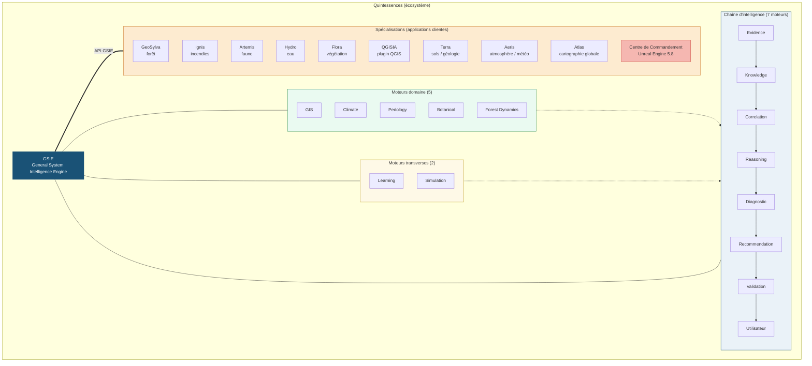
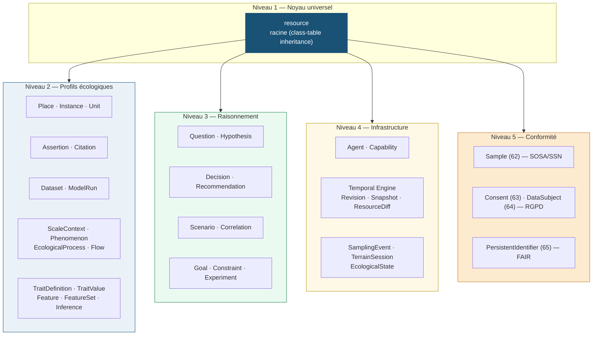
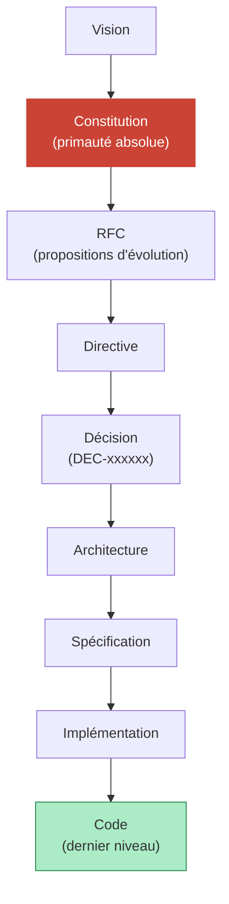

<div align="center">

# Quintessences

### Écosystème d'intelligence environnementale

**Un moteur. Des spécialisations. Zéro décision opaque.**

GSIE (General System Intelligence Engine) est une plateforme de jumeau
numérique environnemental fédéré — un moteur d'aide à la décision
modulaire, traçable et explicable, conçu pour la forêt, le feu, l'eau,
la végétation, la faune, le climat et les territoires.

[](ROADMAP.md)
[](LICENSE)
[](00_CONSTITUTION/)
[](GSIE/ENGINES/)
[](GSIE/ARCHITECTURE/ECOSYSTEM_METAMODEL.md)
[](03_DECISIONS/)
[](https://github.com/NeooeN45/Quintessences/actions/workflows/ci.yml)

</div>

---

[Qu'est-ce que](#quest-ce-que-quintessences) · [Pourquoi](#pourquoi-quintessences-existe) · [Différences](#ce-qui-différencie-quintessences) · [Moteurs](#les-14-moteurs-gsie) · [Spécialisations](#spécialisations) · [Architecture](#architecture) · [Avancement](#avancement-phase-4) · [Gouvernance](#gouvernance) · [Roadmap](#roadmap) · [Contribuer](#contribuer) · [Licence](#licence)

---

## Qu'est-ce que Quintessences ?

**Quintessences** est un écosystème d'applications environnementales
fondé sur le moteur **GSIE** (General System Intelligence Engine) — un
moteur central de données, IA, simulations et interopérabilité.

**GSIE est le jumeau numérique environnemental fédéré.** GeoSylva,
Ignis, Hydro, Flora et Artemis sont des projections métier spécialisées
de ce jumeau. Les Hubs Unreal sont les environnements immersifs
permettant d'explorer, simuler et, sous contrôle humain, interagir avec
les domaines concernés. Voir RFC-0037 et
`GSIE/ARCHITECTURE/GSIE_ENVIRONMENTAL_DIGITAL_TWIN_PLATFORM.md`.

**Phase actuelle : Phase 4 — Implémentation** (ouverte par
`DEC-000017` / `GSIE-DIR-0011`). Le code métier est désormais autorisé.
Priorités : 14 moteurs GSIE, API GSIE (FastAPI), Centre de Commandement
Unreal Engine 5.8, applications clientes.

---

## Pourquoi Quintessences existe

La gestion environnementale repose sur des **décisions qui engagent des
décennies** : choix d'essences, interventions sylvicoles, lutte contre
les incendies, adaptation climatique. Ces décisions sont prises par des
professionnels de terrain avec des outils **inadaptés** :

- **Données fragmentées** — sol, climat, flore, satellite éparpillés
  dans des silos incompatibles.
- **Outils d'IA opaques** — boîtes noires qui produisent des
  recommandations sans explication, sans source, sans traçabilité.
- **Pas de hors-ligne** — les outils existants supposent une
  connexion permanente, impossible en forêt ou en zone isolée.
- **Pas de gouvernance** — aucun cadre ne garantit que l'IA reste un
  outil d'aide et non une autorité qui décide à la place de l'humain.

**Quintessences résout ces quatre problèmes** avec une approche
radicalement différente : un moteur d'intelligence **fondé sur une
Constitution**, où chaque recommandation est sourcée, explicable et
contournable.

---

## Ce qui différencie Quintessences

| Critère | Concurrents (SilvIA, ForestNet, EcoAudit-AI…) | Quintessences |
|---|---|---|
| **Gouvernance** | Aucun cadre formel | Constitution de 11 articles + 3 sectorielles |
| **Traçabilité** | Décisions non tracées | Chaque décision a un identifiant (DEC-xxx) et un historique |
| **Explicabilité** | Boîte noire | Chaque recommandation cite ses sources et son raisonnement |
| **Hors-ligne** | Supposent une connexion | Conçu pour le terrain isolé (offline-first) |
| **Périmètre** | Un domaine (forêt OU feu OU carbone) | Multi-spécialisations (forêt + feu + futur climat/eau) |
| **Architecture** | Monolithique | 14 moteurs indépendants, responsabilité unique |
| **Méthodologie** | Ad hoc | Hiérarchie documentaire formelle (Vision → Code) |
| **Rôle de l'IA** | Décide ou suggère | **Assiste, ne décide jamais** (GSIE-CON-001) |

---

## Les 14 moteurs GSIE

Chaque moteur a une **responsabilité unique**. Aucun moteur ne connaît
les détails internes d'un autre. Cette modularité garantit la
maintenabilité, la testabilité et l'extensibilité.

### Chaîne d'intelligence (7 moteurs)

| Moteur | Rôle |
|---|---|
| Evidence Engine | Évalue la preuve scientifique en amont |
| Knowledge Engine | Centralise les connaissances qualifiées |
| Correlation Engine | Détecte les corrélations multiparamètres |
| Reasoning Engine | Raisonne sur les connaissances et corrélations |
| Diagnostic Engine | Produit les diagnostics (stationnels, sylvicoles, risque) |
| Recommendation Engine | Génère des recommandations **contournables** |
| Validation Engine | Valide les sorties avant présentation à l'utilisateur |

### Moteurs domaine (5 moteurs)

| Moteur | Rôle |
|---|---|
| GIS Engine | Données géospatiales (MNT, parcels, infra) |
| Climate Engine | Données climatiques et bioclimatiques |
| Pedology Engine | Données pédologiques (sols, texture, drainage) |
| Botanical Engine | Flore, taxonomie, autécologie |
| Forest Dynamics Engine | Dynamique des peuplements, croissance, mortalité |

### Moteurs transverses (2 moteurs)

| Moteur | Rôle |
|---|---|
| Learning Engine | Apprentissage encadré (retours terrain, feedback) |
| Simulation Engine | Simulation de scénarios (interventions, évolutions) |

> **Implémentation Phase 4** : les 14 moteurs ont leur module, leur
> routeur HTTP et leurs tests. L'Evidence Engine garde un cœur Rust
> (bindings PyO3) ; les autres sont en Python. L'Orchestration Engine
> exécute la chaîne Reasoning → Diagnostic → Recommendation →
> Validation de bout en bout. Voir [PROJECT_MEMORY.md](PROJECT_MEMORY.md)
> pour l'état courant, moteur par moteur.

---

## Spécialisations

| Spécialisation | Domaine | Statut | Repo |
|---|---|---|---|
| **GeoSylva** | Forêt | Active | [NeooeN45/GeoSylva](https://github.com/NeooeN45/GeoSylva) |
| **Ignis** | Incendies | Phase 4 | Dans le repo parent |
| **Artemis** | Faune | Planifiée (Phase 4) | Stub dans `apps/Artemis/` |
| **Hydro** | Eau | Planifiée (Phase 4) | Stub dans `apps/Hydro/` |
| **Flora** | Végétation | Planifiée (Phase 4) | Stub dans `apps/Flora/` |
| **QGISIA** | Plugin QGIS | Actif | [NeooeN45/QGISIAPRO](https://github.com/NeooeN45/QGISIAPRO) |
| **Terra** | Sols / géologie | Planifiée (Phase 4) | Stub dans `apps/Terra/` |
| **Aeris** | Atmosphère / météo | Planifiée (Phase 4) | Stub dans `apps/Aeris/` |
| **Atlas** | Cartographie globale | Planifiée (Phase 4) | Stub dans `apps/Atlas/` |

### GeoSylva — application forestière

La première spécialisation de Quintessences. Diagnostics stationnels,
analyse des sols, interprétation de la flore, recommandations de gestion
adaptées au terrain.

| Interface | Rôle |
|---|---|
| GeoSylva Mobile | Client Android terrain (offline) |
| GeoSylva Desktop | Poste fixe d'analyse |
| GeoSylva Web | Interface en ligne |
| API GSIE | Intégration dans des workflows tiers |
| SDK | Bibliothèques clientes (Kotlin, Python, TypeScript) |
| Plugins SIG | Intégrations QGIS, ArcGIS |

#### Intégration GeoSylva ↔ GSIE — état documentaire au 2026-08-17

Le contrat client est en cours de clarification avant implémentation. RFC-0041
(Draft) et DEC-000073 (Proposé) définissent une façade future
`POST /api/v1/orchestration/analyse-geosylva` : GeoSylva enverra une intention,
un `station_id` GSIE et des niveaux de preuve déclarés ; il ne fabriquera ni
règles, ni qualifications, ni état global.

Le lien `parcelleId` local → `gsie_resource_id` GSIE sera explicite,
idempotent, contrôlé par compte et révocable. La préparation serveur devra
sélectionner les règles et qualifications sourcées ou refuser avec une cause
nommée. Tant que RFC-0041/DEC-000073 ne sont pas validées, la façade, la
migration Room et le nouveau lien stationnel ne sont pas présentés comme
livrés. La synchronisation actuelle reste limitée aux parcelles selon
DEC-000048.

Voir [RFC-0041](02_RFC/RFC-0041-contrat-facade-geosylva-identite-stationnelle.md),
[DEC-000073](03_DECISIONS/DEC-000073.md),
[DEC-000072](03_DECISIONS/DEC-000072.md) et
[le graphe d'intégration](graphes-quintessences/README.md).

### Ignis — spécialisation incendie

Système d'aide à la décision pour la surveillance et l'analyse des feux
de forêt. Jumeau numérique de propagation (ForeFire), assimilation de
données temps réel par drone, détection par vision embarquée. Positionné
comme **application cliente** de GSIE (RFC-0004, ADOPTÉ).

| Interface | Rôle |
|---|---|
| Ignis Mobile | Application terrain pour le suivi de sinistre, la remontée d'observations et la consultation des simulations en mode offline |
| Ignis Commandement | Poste fixe / Centre de Commandement GSIE (Unreal Engine 5.8) |
| API GSIE | Intégration dans des workflows tiers (SDIS, DDT, etc.) |

**Garde-fous non négociables** : outil d'aide à la décision du COS/CODIS,
jamais un système de commandement. Aucune alerte directe à la population
(prérogative régale FR-Alert). La sortie « cause probable » reste une
hypothèse exploratoire, jamais une conclusion.

### QGISIA — agent IA QGIS (« GeoSylva AI »)

Agent IA intelligent pour QGIS. Route les demandes en langage naturel
vers le meilleur modèle, appelle les outils QGIS, interroge le web et
l'imagerie satellite, génère et exécute du PyQGIS. Interface desktop
du moteur GSIE pour les professionnels SIG.

- **Repo** : [github.com/NeooeN45/QGISIAPRO](https://github.com/NeooeN45/QGISIAPRO)
- **Lien GSIE** : moteurs GIS, Climate, Pedology, Botanical, Reasoning
  (analyses environnementales expertes dans QGIS).

### Centre de Commandement GSIE — Unreal Engine 5.8

Ensemble de Hubs immersifs où **toutes les projections métier de GSIE
peuvent explorer et simuler le même territoire**. Construits sur Unreal
Engine 5.8 + Cesium for Unreal, ils proposent des modes Ignis, GeoSylva,
Hydro, Flora et Artemis. Les données affluent via les contrats GSIE
versionnés ; les scénarios sont séparés de l'état réel et les actions
critiques restent soumises à validation humaine.

- **Lien GSIE** : consomme les sorties validées de tous les moteurs via
  l'API GSIE (livrable 207).
- **Stack** : Unreal Engine 5.8, Cesium for Unreal (3D Tiles), Niagara
  (effets), WebSockets natifs (temps réel).
- **Document de référence** : `GSIE/ARCHITECTURE/COMMAND_CENTER_UNREAL.md`

### Spécialisations planifiées

- **Artemis** (faune) — Application Android native, API NestJS, backoffice Next.js. Moteurs GIS, Knowledge, Correlation, Learning.
- **Hydro** (eau) — Cartographie du réseau hydrographique, zones humides, régimes hydriques. Moteurs GIS, Climate, Knowledge, Correlation. Socle : BD Carthage, BD TOPAGE, Sandre.
- **Flora** (végétation) — Flore, taxonomie, cartographie végétale, phénologie. Moteurs Botanical, Knowledge, GIS, Climate. Socle : GBIF, Tela Botanica, BDNFF, INPN.
- **Terra** (sols) — Caractérisation et classification des sols. Moteurs Pedology, Knowledge, Climate, Correlation. Socle : SoilGrids (ISRIC), RMQS (INRAE), Référentiel Pédologique Français.
- **Aeris** (atmosphère) — Suivi météorologique et climatique. Moteurs Climate, Knowledge, Correlation, Diagnostic. Socle : Météo-France, Copernicus C3S.
- **Atlas** (cartographie) — Cartographie interactive multi-couches et analyse spatiale. Moteurs GIS, Knowledge, Correlation. Socle : IGN, Cadastre, OpenStreetMap.

L'architecture modulaire de GSIE permet d'étendre Quintessences à
d'autres domaines. Chaque nouvelle spécialisation fait l'objet d'un RFC
dédié.

---

## Architecture

### Vue d'ensemble — écosystème Quintessences


```mermaid
graph TB
    subgraph ECO["Quintessences (écosystème)"]
        GSIE["GSIE<br/>General System Intelligence Engine"]

        subgraph CHAIN["Chaîne d'intelligence (7 moteurs)"]
            E["Evidence"] --> K["Knowledge"]
            K --> C["Correlation"]
            C --> R["Reasoning"]
            R --> D["Diagnostic"]
            D --> REC["Recommendation"]
            REC --> V["Validation"]
            V --> U["Utilisateur"]
        end

        subgraph DOMAIN["Moteurs domaine (5)"]
            GIS["GIS"]
            CLIM["Climate"]
            PED["Pedology"]
            BOT["Botanical"]
            FD["Forest Dynamics"]
        end

        subgraph TRANS["Moteurs transverses (2)"]
            LEARN["Learning"]
            SIM["Simulation"]
        end

        DOMAIN -.-> CHAIN
        TRANS -.-> CHAIN

        subgraph APPS["Spécialisations (applications clientes)"]
            GS_APP["GeoSylva<br/>forêt"]
            IGNIS["Ignis<br/>incendies"]
            ARTEMIS["Artemis<br/>faune"]
            HYDRO["Hydro<br/>eau"]
            FLORA["Flora<br/>végétation"]
            QGISIA["QGISIA<br/>plugin QGIS"]
            TERRA["Terra<br/>sols / géologie"]
            AERIS["Aeris<br/>atmosphère / météo"]
            ATLAS["Atlas<br/>cartographie globale"]
            HUB["Centre de Commandement<br/>Unreal Engine 5.8"]
        end

        GSIE --- CHAIN
        GSIE --- DOMAIN
        GSIE --- TRANS
        GSIE ===|API GSIE| APPS
    end

    style GSIE fill:#1a5276,color:#fff,stroke:none
    style CHAIN fill:#eaf2f8,stroke:#1a5276
    style DOMAIN fill:#eafaf1,stroke:#1e8449
    style TRANS fill:#fef9e7,stroke:#b7950b
    style APPS fill:#fdebd0,stroke:#ca6f1e
    style HUB fill:#f5b7b1,stroke:#cb4335
```

### Chaîne d'intelligence — flux de preuve à décision


```mermaid
flowchart LR
    SOURCES["Sources scientifiques<br/>datasets, terrain, littérature"]
    E["Evidence Engine<br/>qualification A–F"]
    K["Knowledge Engine<br/>connaissances qualifiées"]
    C["Correlation Engine<br/>corrélations multiparamètres"]
    R["Reasoning Engine<br/>raisonnement"]
    D["Diagnostic Engine<br/>diagnostics"]
    REC["Recommendation Engine<br/>recommandations contournables"]
    V["Validation Engine<br/>validation sorties"]
    USER["Forestier<br/>décideur final (CON-001)"]

    SOURCES --> E
    E -->|"preuve qualifiée"| K
    K --> C
    C --> R
    R --> D
    D --> REC
    REC --> V
    V --> USER
    USER -.->|"feedback terrain"| LEARN["Learning Engine"]
    LEARN -.-> K

    style E fill:#abebc6,stroke:#1e8449
    style K fill:#aed6f1,stroke:#1a5276
    style USER fill:#f9e79f,stroke:#b7950b,stroke-width:2px
    style LEARN fill:#fadbd8,stroke:#cb4335
```

### Métamodèle de l'Encyclopédie — 73 types noyau

Le métamodèle v6.2 (livrable 213, RFC-0011, DEC-000022) définit un
**noyau universel de 73 types** organisés en 5 niveaux, avec
PostgreSQL 16 + PostGIS + Apache AGE comme vérité canonique. Il
remplace la structure `KnowledgeObject` à 6 types (livrable 302) et
unifie données, connaissances, modèles, simulations, décisions et
observations de terrain.


```mermaid
graph TB
    subgraph N1["Niveau 1 — Noyau universel"]
        R["resource<br/>racine (class-table inheritance)"]
    end

    subgraph N2["Niveau 2 — Profils écologiques"]
        P1["Place · Instance · Unit"]
        P2["Assertion · Citation"]
        P3["Dataset · ModelRun"]
        P4["ScaleContext · Phenomenon<br/>EcologicalProcess · Flow"]
        P5["TraitDefinition · TraitValue<br/>Feature · FeatureSet · Inference"]
    end

    subgraph N3["Niveau 3 — Raisonnement"]
        Q1["Question · Hypothesis"]
        Q2["Decision · Recommendation"]
        Q3["Scenario · Correlation"]
        Q4["Goal · Constraint · Experiment"]
    end

    subgraph N4["Niveau 4 — Infrastructure"]
        I1["Agent · Capability"]
        I2["Temporal Engine<br/>Revision · Snapshot · ResourceDiff"]
        I3["SamplingEvent · TerrainSession<br/>EcologicalState"]
    end

    subgraph N5["Niveau 5 — Conformité"]
        F1["Sample (62) — SOSA/SSN"]
        F2["Consent (63) · DataSubject (64) — RGPD"]
        F3["PersistentIdentifier (65) — FAIR"]
    end

    R --> N2
    R --> N3
    R --> N4
    R --> N5

    style R fill:#1a5276,color:#fff,stroke:none
    style N2 fill:#eaf2f8,stroke:#1a5276
    style N3 fill:#eafaf1,stroke:#1e8449
    style N4 fill:#fef9e7,stroke:#b7950b
    style N5 fill:#fdebd0,stroke:#ca6f1e
```

| Niveau | Types | Exemples |
|---|---|---|
| **Noyau universel** | `resource` (racine, class-table inheritance) | Type 1 |
| **Profils écologiques** | 42 types v6.1 + 18 v6.2 | Place, Instance, Assertion, Dataset, ScaleContext, Phenomenon, EcologicalProcess, Flow, TraitDefinition, Feature, Inference |
| **Raisonnement** | Question, Hypothesis, Decision, Recommendation, Scenario, Correlation, Goal, Constraint, Experiment | Types 53-71 |
| **Infrastructure** | Agent, Capability, Temporal Engine (Revision + Snapshot + ResourceDiff), SamplingEvent, TerrainSession, EcologicalState | Types 40-73 |
| **Conformité** | Sample (SOSA/SSN), Consent + DataSubject (RGPD), PersistentIdentifier (FAIR) | Types 62-65 |

**Architecture** : 6 ADR (racine `resource`, Temporal & Provenance
Engine, benchmark Apache AGE, migration schéma, Outbox/Inbox, object
storage). PostgreSQL 16 + PostGIS + Apache AGE (graphe Cypher) comme
vérité canonique. Neo4j, Elasticsearch, Jena et GraphQL différés
(projections régénérables).

Voir `GSIE/ARCHITECTURE/ECOSYSTEM_METAMODEL.md` pour le document
complet.

---

## Avancement Phase 4

### Livré

| Domaine | État |
|---|---|
| **Les 14 moteurs** | Implémentés, chacun avec son module, son routeur HTTP et ses tests. La chaîne complète Reasoning → Diagnostic → Recommendation → Validation s'exécute de bout en bout via l'Orchestration Engine. |
| **API GSIE** | FastAPI — compte Quintessences partagé, inscription/connexion locale Argon2id, Google OIDC configurable, JWT RS256 avec refresh rotatif et révocation, RBAC fermé par défaut, limitation de débit, RFC 7807, WebSocket temps réel, observabilité OpenTelemetry + Prometheus. |
| **Base de données** | PostgreSQL 16 + PostGIS + pgvector + Apache AGE. 29 migrations Alembic, 124 tables SQLAlchemy. Schéma documenté dans [SCHEMA_DB.md](GSIE/DOCUMENTATION/SCHEMA_DB.md). |
| **Isolement RGPD** | Les données personnelles vivent dans deux schémas séparés (`gsie_rgpd`, `gsie_rgpd_identites`). Le rôle applicatif n'accède qu'aux quatre tables techniques nécessaires à l'authentification, jamais à `data_subject` ni aux consentements ; aucun droit `DELETE`. RLS active et forcée sur les tables sensibles. |
| **Comptes de connexion** | L'API s'exécute sous un compte `NOSUPERUSER NOBYPASSRLS` sans `DELETE` (CON-010 rendu structurel). Les privilèges réels sont interrogés au démarrage, pas déduits du nom du compte. |
| **Ingestion** | Pipeline unitaire et en lot (1 000 items), garde anti-invention RFC-0014 — une donnée d'origine IA est forcée au niveau de preuve D et mise en quarantaine. |
| **SDK Python** | Client asynchrone `httpx`, JWT RS256 avec rafraîchissement automatique, wrappers des moteurs. |
| **Tableau de contrôle** | Astro 5 + React 19 en îlots + Tailwind 4. |
| **Visualisation** | Metabase, Superset et Dekart branchés sur un compte en lecture seule, sans aucun accès aux schémas RGPD — la barrière est en base, pas dans l'outil. |

**Tests** : 1 915 tests unitaires passent, 63 sont ignorés et la couverture
atteint 100 % (9 338/9 338 instructions). L'intégration s'exécute sur base
réelle via testcontainers ; le harnais de mutation tue 100 % des mutants de
son périmètre.

### En cours

Sauvegardes de la base (pgBackRest + archivage WAL), clarification du contrat
GeoSylva–GSIE (RFC-0041/DEC-000073), puis SDK Kotlin et intégration via la
façade validée, QGISIA via le SDK et Centre de Commandement Unreal Engine 5.8.

Voir [ROADMAP.md](ROADMAP.md) pour le détail et
[PROJECT_MEMORY.md](PROJECT_MEMORY.md) pour l'état courant — cette
section en est un résumé, jamais la source de vérité.

---

## Gouvernance

Quintessences est gouverné par une **Constitution** — un ensemble de
principes intangibles qui s'imposent à tout le projet, y compris au
Fondateur. Aucun autre projet d'IA environnementale n'a ce niveau de
garde-fou formel.

### Les 11 articles constitutionnels

| Article | Principe |
|---|---|
| CON-000 | La Constitution prime sur tout (Locked) |
| CON-001 | Le forestier reste le décideur — l'IA assiste, ne décide jamais |
| CON-002 | La science avant tout |
| CON-003 | La Connaissance avant le Code |
| CON-004 | Toute décision doit être explicable |
| CON-005 | Toute connaissance doit être traçable |
| CON-006 | La Documentation fait partie du Produit |
| CON-007 | La Modularité est obligatoire |
| CON-008 | Le Projet appartient à sa Vision |
| CON-009 | GSIE est un patrimoine scientifique vivant |
| CON-010 | Toute connaissance doit pouvoir évoluer sans perdre son historique |

### Hiérarchie documentaire

Le code est toujours le **dernier niveau**. Aucun niveau ne contredit
un niveau supérieur.


```mermaid
flowchart TD
    V["Vision"] --> C["Constitution<br/>(primauté absolue)"]
    C --> RFC["RFC<br/>(propositions d'évolution)"]
    RFC --> DIR["Directive"]
    DIR --> DEC["Décision<br/>(DEC-xxxxxx)"]
    DEC --> ARCH["Architecture"]
    ARCH --> SPEC["Spécification"]
    SPEC --> IMPL["Implémentation"]
    IMPL --> CODE["Code<br/>(dernier niveau)"]

    style C fill:#cb4335,color:#fff,stroke:none
    style CODE fill:#abebc6,stroke:#1e8449
```

### Traçabilité

Chaque décision structurante reçoit un identifiant (`DEC-xxxxxx`) et est
archivée dans `03_DECISIONS/`. Les propositions d'évolution passent par
des RFC (`02_RFC/`). **Aucune décision n'est perdue.**

| Decision | Sujet |
|---|---|
| DEC-000001 | GSIE est une fondation scientifique |
| DEC-000002 | Phase 1 : aucun développement métier |
| DEC-000003 | Adoption RFC-0004 : branche fonctionnelle Ignis |
| DEC-000004 | Entrée en Phase 2 : Architecture |
| DEC-000005 | Archivage du code du banc Ignis (Jalon 0) |
| DEC-000006 | Restructuration identité : Quintessences > GSIE > GeoSylva |
| DEC-000007 | Extension de l'écosystème : Artemis et QGISIA |
| DEC-000008 | Directive fondatrice Ignis (GCS / Ground Control System) |
| DEC-000009 | Vision du Moteur Cognitif Ignis (GSIE-DIR-0006) |
| DEC-000010 | Adoption Unreal Engine 5.8 + Cesium comme moteur 3D |
| DEC-000011 | Entrée en Phase 3 : Connaissance |
| DEC-000012 | L'Encyclopédie de l'Écosystème (base de connaissances écologiques) |
| DEC-000013 | Restructuration de l'écosystème Quintessences |
| DEC-000014 | Réorganisation de l'arborescence du dépôt |
| DEC-000015 | Unification du système d'articles constitutionnels (RFC-0002) |
| DEC-000016 | Extension Phase 3 à 10 livrables (amendement GSIE-DIR-0007) |
| DEC-000017 | Validation Phase 3 + clôture + ouverture Phase 4 (GSIE-DIR-0011) |
| DEC-000018 | Stratégie IA IGN : adoption geocontext MCP + datasets IA |
| DEC-000019 | Validation architecture Phase 4 + plan révisé 24 semaines |
| DEC-000020 | Knowledge Engine Semaine 3 — implémentation Python (ingest, query, revise, CON-010) |
| DEC-000021 | Semaine 4 — pipeline intégré Evidence → Knowledge (tranche verticale) |
| DEC-000022 | Métamodèle v6.2 — 73 types noyau + RFC-0011 + 6 ADR (Proposé) |

---

## Philosophie

1. La connaissance avant le code.
2. La science avant l'opinion.
3. Le terrain avant la théorie.
4. L'architecture avant les fonctionnalités.
5. La documentation avant l'implémentation.
6. La qualité avant la vitesse.
7. La cohérence avant l'optimisation.
8. La transparence avant la complexité.
9. L'explicabilité avant la performance.
10. La modularité avant le confort de développement.

---

## Roadmap

| Phase | Statut | Description |
|---|---|---|
| **Phase 1 — Foundation** | Clôturée | Constitution, 14 moteurs documentés, gouvernance, mémoire |
| **Phase 2 — Architecture** | Sortie — validation pendante | Contrats d'interface, schémas de données, RFC d'architecture ; 12 Draft à remettre à niveau |
| **Phase 3 — Connaissance** | Clôturée | Méthodes, ontologie, datasets, framework de preuve, base de connaissances |
| **Phase 4 — Implémentation** | **Active** | Code métier des moteurs, API GSIE, Hub Unreal, applications clientes |
| Phase 5 — Applications | À venir | Déploiement GeoSylva, Ignis et interfaces terrain |

Voir `ROADMAP.md` pour le détail des livrables.

---

## Organisation du dépôt

```
Quintessences/
├── 00_CONSTITUTION/        Principes intangibles et garde-fous
├── 01_DIRECTIVES/          Directives fondatrices (ACTIVE / ARCHIVED)
├── 02_RFC/                 Request for Comments
├── 03_DECISIONS/           Décisions tracées et validées
├── GSIE/ARCHITECTURE/        Architecture logicielle et scientifique
├── 05_SPECIFICATIONS/      Exigences fonctionnelles et non fonctionnelles
├── GSIE/RESEARCH/            Travaux scientifiques et bibliographie
├── GSIE/KNOWLEDGE/           Base de connaissances structurée
├── GSIE/DATASETS/            Jeux de données référencés et sourcés
├── GSIE/ENGINES/             14 moteurs GSIE — documentation de référence
├── GSIE/ALGORITHMS/          Procédures computationnelles formelles
├── GSIE/MODELS/              Modèles scientifiques et d'apprentissage
├── GSIE/APPLICATIONS/        Interfaces utilisateurs (GeoSylva, Ignis, …)
├── GSIE/API/                 API FastAPI — code des 14 moteurs, migrations, tests
├── GSIE/SDK/                 Bibliothèques clientes (Python ; Kotlin à venir)
├── GSIE/ADMIN_WEB/           Tableau de contrôle d'administration
├── GSIE/TESTS/               Tests unitaires, intégration et non-régression
├── GSIE/TOOLS/               Utilitaires et chaînes de construction
├── GSIE/DOCUMENTATION/       Documentation officielle et guides contributeurs
├── 18_FINANCING/           Modèle économique et traçabilité financière
├── 19_LEGAL/               Licences, conformité, propriété intellectuelle
├── 20_PARTNERSHIPS/        Partenariats scientifiques et institutionnels
├── 21_EXPERIMENTS/         Prototypes et recherches exploratoires
├── 22_PROJECT_MEMORY/      Mémoire du projet (décisions, visions, idées)
└── 23_QUALITY_MANAGEMENT/  Qualité : manuel, politique, KPI, audits, revues
```

Chaque dossier possède un `README.md` expliquant son objectif, ses
responsabilités, ce qui peut y être ajouté, ce qui est interdit.

---

## Contribuer

Quintessences est un projet à gouvernance constitutionnelle. Toute
contribution respecte la hiérarchie documentaire et la Constitution.

1. **Lire la Constitution** (`00_CONSTITUTION/`) avant toute proposition.
2. **Ouvrir un RFC** (`02_RFC/`) pour toute évolution structurante.
3. **Sourcer** toute affirmation scientifique (`GSIE/RESEARCH/`,
   `GSIE/DATASETS/`).
4. **Tracer** toute décision (`03_DECISIONS/`).
5. **Rédiger en français** — documentation, commentaires, commits.

Voir `GSIE/DOCUMENTATION/CONTRIBUTING_GUIDE.md` pour le guide complet.

---

## Licence

**Licence propriétaire — All Rights Reserved.**

Copyright (c) 2026 Camille Perraudeau — Quintessences / GSIE.

Le code source est public pour transparence et évaluation. Toute
utilisation commerciale nécessite une licence séparée.

Voir `LICENSE` pour le texte complet.

---

<div align="center">

*Quintessences — la connaissance est le véritable produit.*
*Le code n'est qu'un moyen.*

</div>

---

## Contact

Pour toute question, réclamation ou collaboration :

**5jvw9s5zj@mozmail.com**
